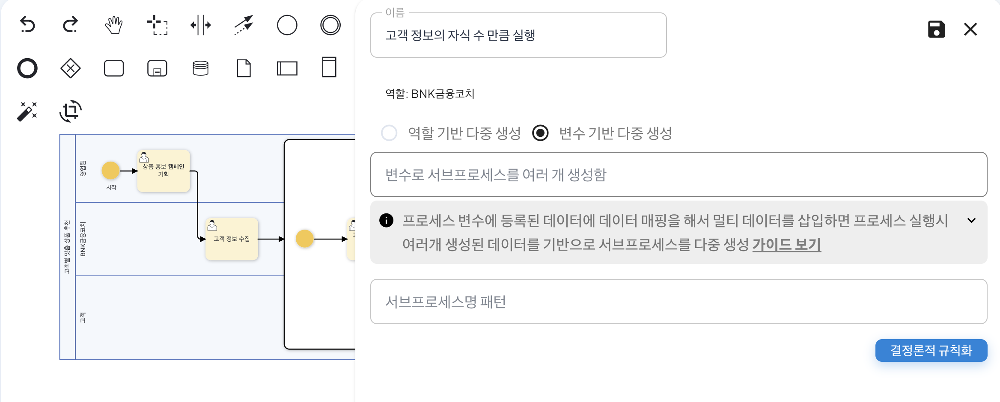

# 결정론적 규칙화 (Deterministic Regularization)

결정론적 규칙화는 프로세스의 분기처리 및 서브프로세스 실행에 있어 AI를 통해 자동으로 처리되었던 과정을 고정된 규칙으로 전환하여 실행할 수 있도록 하는 기능입니다.

AI의 특성상 동일한 입력에 대해서도 매번 다른 결과를 생성할 수 있는 비결정적(Non-deterministic) 특성이 있습니다. 결정론적 규칙화는 고정된 규칙으로 변환을 통하여 동일한 처리를 보장하는 역할을 하며 서브프로세스의 반복 실행, 조건부 분기 등 정확도를 필요로하는 업무에 적합하게 이용할 수 있습니다.

## 결정론적 규칙 설정하기
고객별 맞춤 상품 추천 프로세스를 통해 결정론적 규칙을 설정하는 방법은 다음과 같습니다.<bt>

먼저, 아래과 같이 고객별 맞춤 상품 추천 프로세스를 준비합니다. 
 

우측 메뉴의 '프로세스 편집'을 클릭하여 편집 상태를 활성화 한 후, 서브 프로세스 영역을 더블 클릭하여 패널을 활성화합니다. 
 

이후, '결정론적 규칙화' 버튼을 클릭합니다. 클릭하면 아래와 같은 화면이 생성되며 서브 프로세스의 이름인 '고객 정보의 자식 수 만큼 실행'을 코드로 변환한 결과가 나타나는 것을 확인할 수 있습니다. 이를 통해 이전 프로세스인 고객 정보 수집 단계에서 수집된 고객의 수 만큼 서브프로세스가 실행되도록 처리됩니다.
 

결정론적 규칙이 설정된 후, 저장하여 패널을 닫고 프로세스를 저장합니다. 이후, 프로세스를 실행 및 빠른 예시 생성을 통해 고객 정보 수집 프로세스 단계를 완료하면 아래와 같이 기존에 입력한 3명의 고객에 따른 고객 맞춤형 상품 정보 메일 생성 프로세스가 생성된 것을 확인할 수 있습니다. 
 
<고객 정보 수집 프로세스 예시>  

 
<수집된 고객 정보 수에 따른 서브프로세스 실행>  

이를 통해 프로세스의 정확성을 보장할 수 있습니다. AI의 비결정적 특성으로 인해 발생할 수 있는 불일치를 제거하고, 고정된 규칙을 통해 동일한 조건에서는 항상 동일한 결과를 제공하여 업무의 신뢰성과 예측 가능성이 크게 향상됩니다.

또한, AI를 통해 매번 분석하고 판단하는데 소요되는 시간 비용을 단축시켜 프로세스 실행 속도가 개선됩니다. 반복적으로 수행되는 업무일수록 시간 절감 효과는 더욱 커지며, 이는 전체 업무 효율성 향상으로 이어져 운영 비용을 절감할 수 있습니다.
