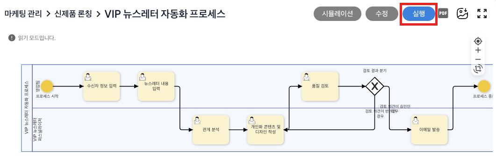

# 피드백 시스템

## 피드백 시스템을 활용한 프로세스 개선

피드백 시스템은 기존의 특정 단계에 대한 체크리스트 및 분기 처리 예시에 대한 개선이 필요할 경우 수동으로 편집을 진행하던 방식을 해결하기 위해 프로세스 실행 도중 피드백을 진행하여 프로세스를 개선하는 시스템입니다. 

프로세스 실행 중 현재 단계의 결과가 체크포인트를 만족하지 않은채 다음 단계로 진행되거나 혹은 개선이 필요하다고 판단될 경우 사용자가 직접 피드백을 주거나 LLM을 통해 제시된 피드백 항목을 선택하여 체크포인트 및 분기 처리 예시에 대한 내용을 개선안을 작성합니다. 

개선된 내용을 반영하면 현재 프로세스에 대한 재실행 및 이후 프로세스 실행에도 적용가능하도록 자동으로 편집이 진행되어 프로세스를 개선합니다.

### 피드백 시스템 사용하기
피드백 시스템을 통해 VIP 뉴스레터 발송 프로세스의 품질 검토를 개선하는 방법은 다음과 같습니다.

프로세스 정의 체계도로 이동하여 VIP 뉴스레터 발송 프로세스를 실행합니다. 
 

이후, 품질 검토 단계까지 프로세스를 실행합니다. 이때, 빠른 예시 생성을 통해 폼을 입력하여 실행하거나 수동으로 입력하여 프로세스를 실행할 수 있습니다. 
 

품질 검토 단계를 완료한 후, '액티비티'로 이동하여 아래를 보면 프로세스 실행의 정상여부를 확인할 수 있으며, 싫어요를 클릭할 경우 아래화면을 확인할 수 있습니다. 
여기서 해당 단계의 체크리스트에 대한 개선이 가능하며 LLM을 통한 개선필요한 사항 혹은 직접 입력 후, '제출'을 클릭하면 피드백을 진행할 수 있습니다.

 
 
제출이 진행되면 피드백 기반 체크포인트 및 분기처리에 대한 조건 예시 등의 변경이 이루어집니다. 
이후, 피드백 변경사항 확인을 진행하면, 아래와 같이 피드백을 반영한 결과를 확인할 수 있습니다.

 

이후, 반영을 누르면 반영여부에서 선택한 사항들에 대한 반영이 진행되며 아래와 같이 검토 결과 분기의 플로우를 클릭하면 조건 예시에 따라 분기 처리에 대한 조건 예시가 변경된 것을 확인할 수 있습니다.

 

이를 통해 프로세스가 실행되는 도중에도 지속적인 프로세스 개선 방식이 가능하여 업무 품질이 향상되며, 반복적인 피드백 없이도 일관성 있게 프로세스가 처리되어 운영 효율성과 업무 자동화 수준 향상을 보장할 수 있습니다.