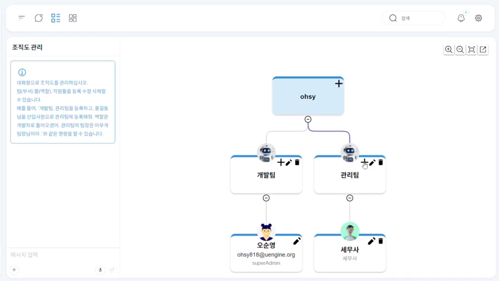
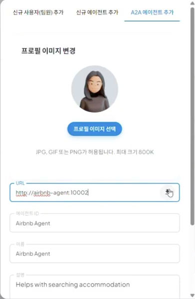
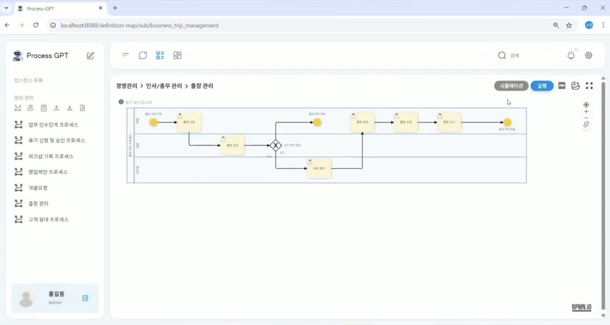
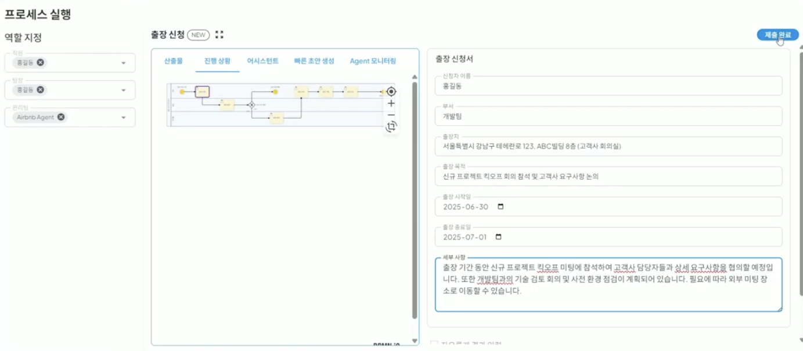
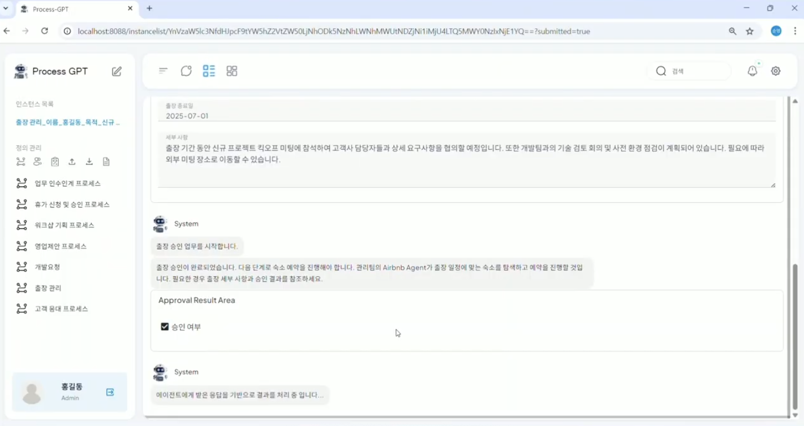
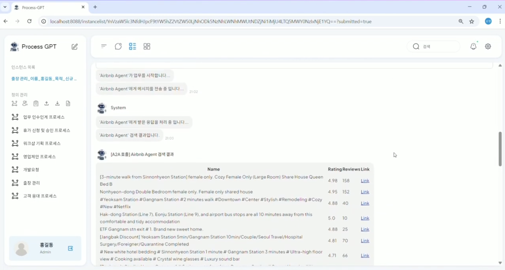
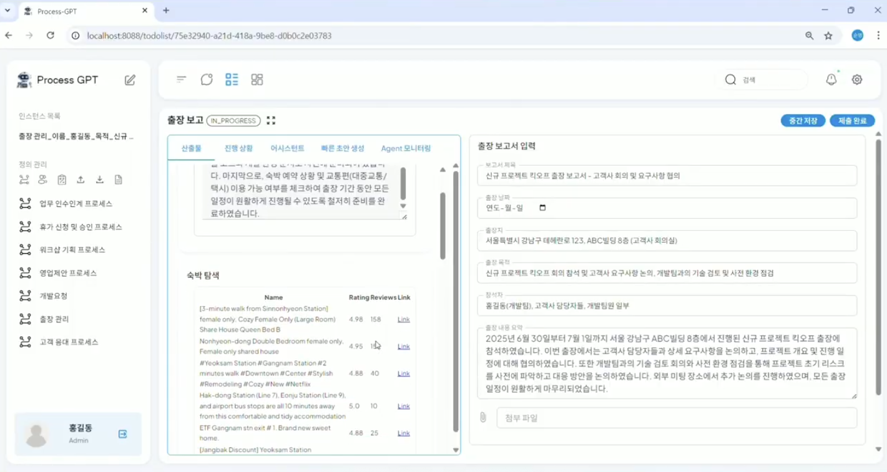

# A2A

## Agent-to-Agent Automation System

**A2A System** is a fully automated system where AI agents communicate with each other like a team and automatically complete tasks without requiring humans to manually instruct "please proceed to the next step" every time.

It automatically discovers and interprets the Discovery and Open API Spec of internal/external systems, creating a mechanism to automatically connect to the process data context. It also automatically determines the best way to connect to each system and supports a feature to create a mechanism to automatically connect to the process data context.  
Furthermore, it automatically completes the work items and progresses the process instances without user intervention, and automatically retries up to the point of failure, allowing processes that previously required manual task instructions to be completely automated, maximizing operational efficiency.

## Using the A2A System

The method for automatically completing the tasks needed for the travel request process using the Airbnb agent is as follows. 

Click the 'Organization Chart Management' menu located at the bottom of the definition management to enter the organization chart and configure the organization chart as shown in the screen below. 

To add the Airbnb agent as a member of the management team, click the '+' button to move to the 'A2A Agent Add' tab, select the profile image, add the following Airbnb agent server to the URL, and click the 'Download' button to add the Airbnb agent as shown in the screen below. 

After that, click the 'Process Definition Chart' > 'Process to Execute' to click the 'Execute' button.  

In the executed screen, specify the Airbnb Agent created in the management team as Role to automatically generate the content for the travel request task as shown in the screen below. 

After adding and modifying the created result according to the situation, click the 'Submit Complete' to automatically execute the agent as shown in the screen below for the subsequent process.  

After that, list up the suitable hotel reservation candidates according to the location of the travel request based on the characteristics of the Airbnb agent.  

By using the A2A system, the last task of the travel report can be automatically created and executed without the user having to input the content for each task, increasing convenience and operational efficiency.  
