# Process-GPT Consulting AI and Management

## Process-GPT Consulting AI

1. **Process-GPT Consulting AI Screen**
   - Process-GPT Consulting AI is available by clicking the ***Start Process Consulting*** button on the Process Definition Map.
   - **[Image-11]**: Start Process Consulting Button
   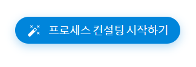

   - Access the Process-GPT Consulting AI chat screen.
   - **[Image-12]**: Process-GPT Consulting AI Chat Screen
   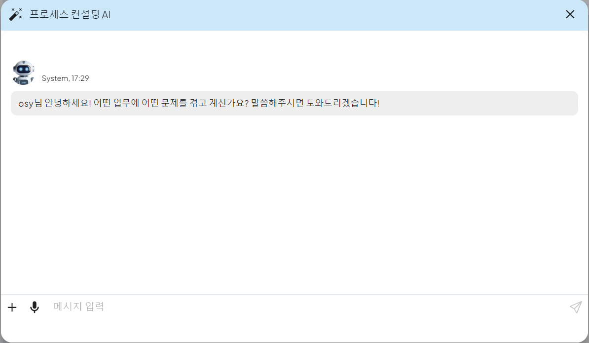

 

2. **Process-GPT Consulting AI Creation**  
   - Enter the desired business process content through the chat window.
   - If there is content to improve or add, enter more detailed content.
   - If there is no more content to reflect, the diagram is generated based on the entered chat content.

   - **[Image-13]**: Process-GPT Consulting AI Chat Screen
   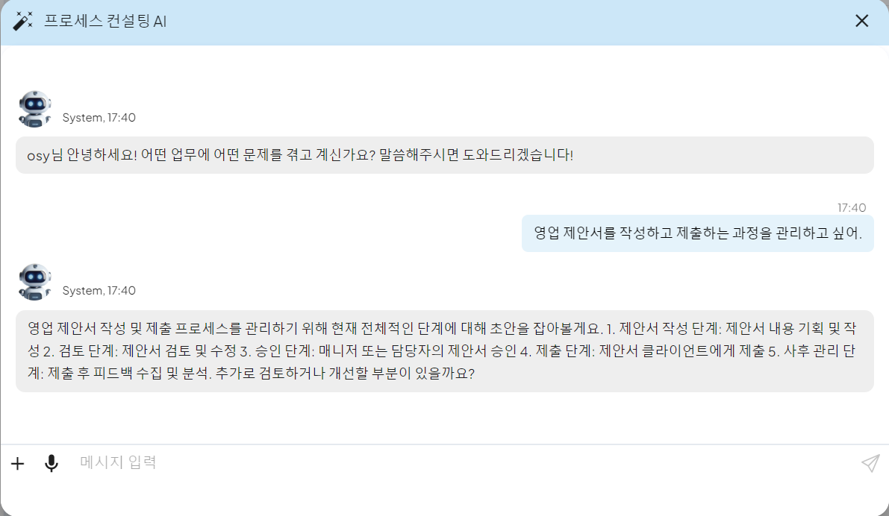

   - **[Image-14]**: Generated Business Process BPMN Diagram
   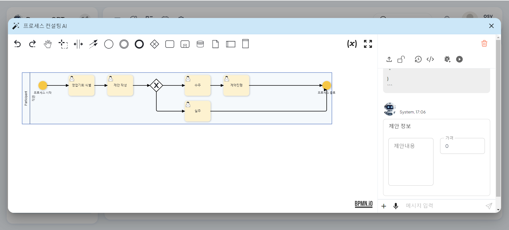

 

3. **Process-GPT Consulting AI Save**  
   - If you want to save the created diagram, click the unlocked lock button at the top of the right chat screen to save it.
   - **[Image-15]**: Unlocked Lock Button
   
      

   - **[Image-16]**: Process Save Screen
   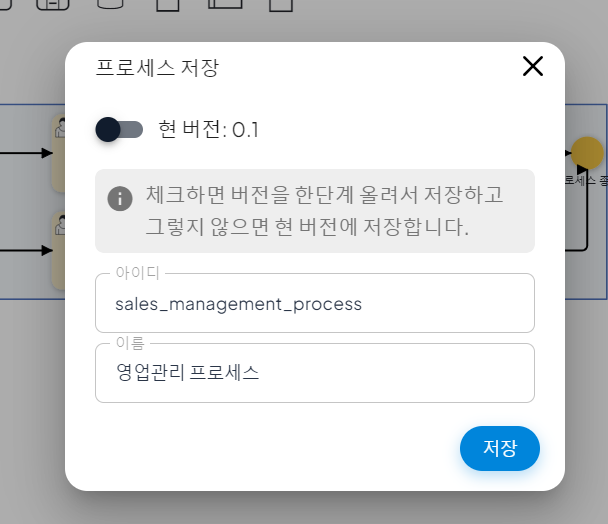

   - The saved business process definition can be checked on the Process Definition Map.
   - **[Image-17]**: Process Definition Map
   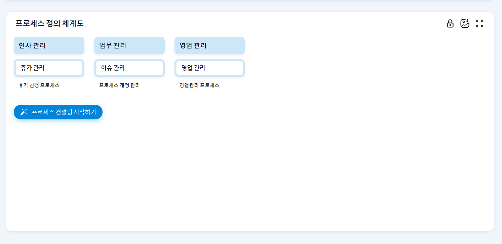
   - **[Image-18]**:    Saved Business Process Definition
   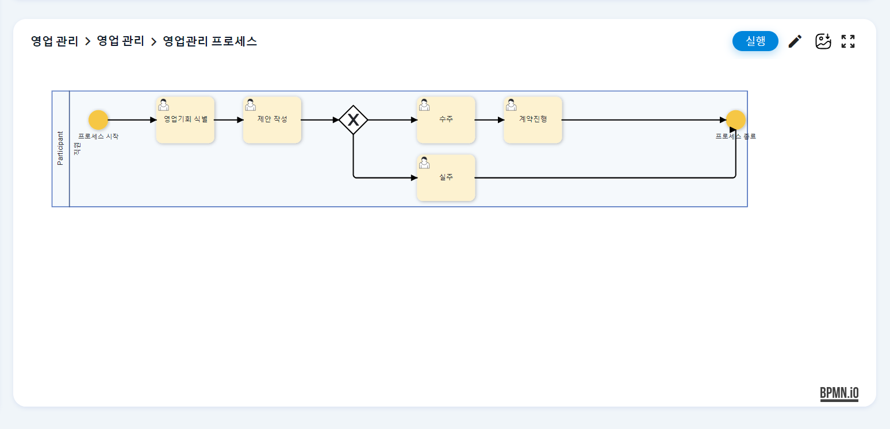

    

## Process Definition and Form Creation

1. **Process Definition Screen**  
   - The process definition is managed through the left process modeling edit screen and the right process definition chat screen.

   

 

2. **Process Definition Creation**  
   - Enter the process definition you want to create through the chat.
   - **[Image-1]**: Process Definition Chat
   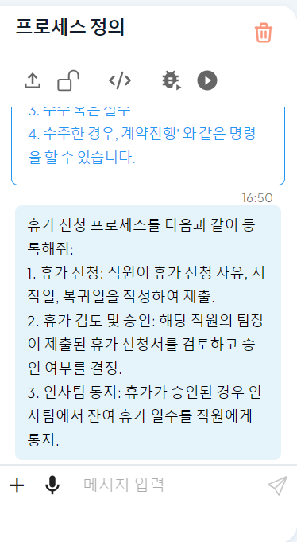

   - AI analyzes the user's input and defines the process and automatically generates a BPMN diagram.
   - **[Image-2]**: Generated Process BPMN Diagram
   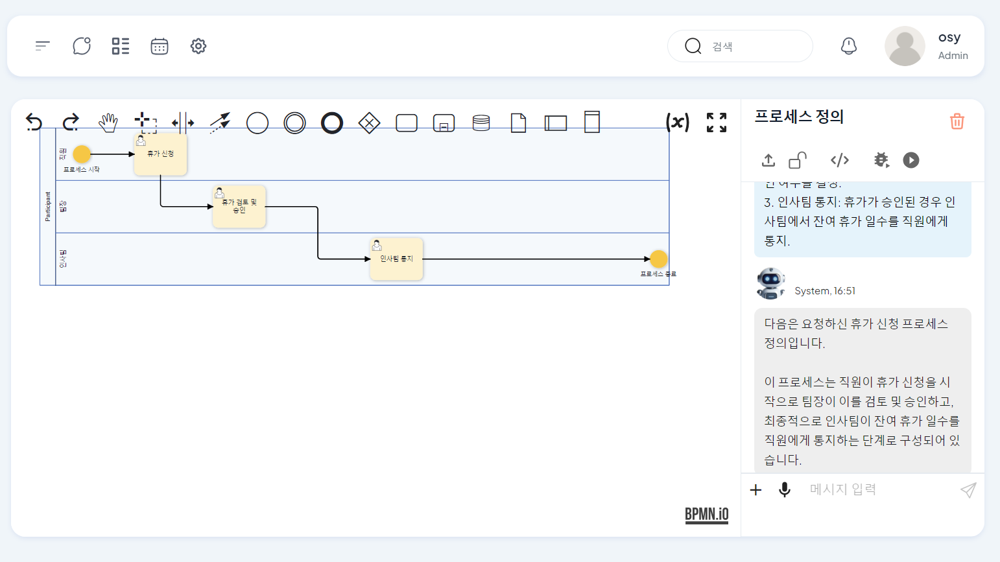

 

3. **User Business Form Creation**  
   - If there is a form needed for each step of business, AI automatically generates a form.
   - **[Image-3]**: User Business Form Creation
   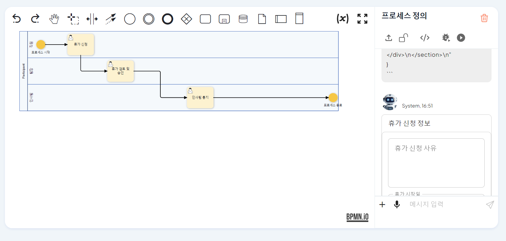

   - The created form can be checked in the business panel and modified directly or through chat.
   - **[Image-4]**: User Business Form Modification
   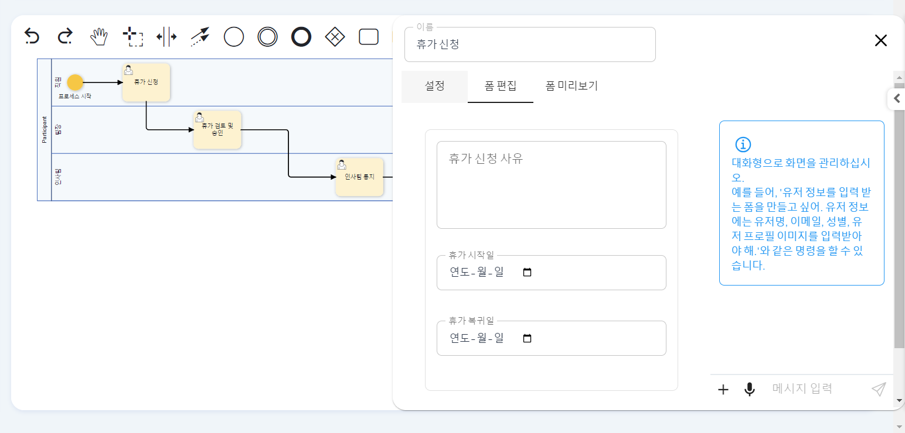

 

&nbsp;
  

4. **Script Business Code Creation**  
   - If there is a script business that needs to be executed, the script can be entered in the business panel.
   - **[Image-5]**: Script Business Panel
   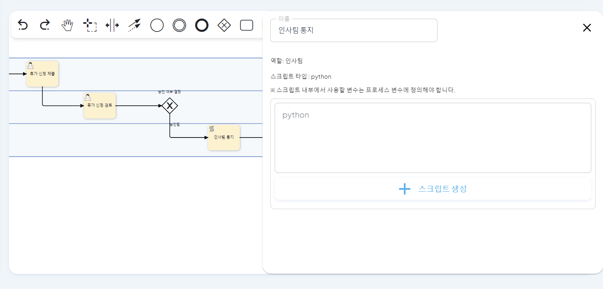

   - The user can directly enter Python code or enter a prompt and click the script creation button to automatically generate code.
   - **[Image-6]**: Script Business Code Creation
   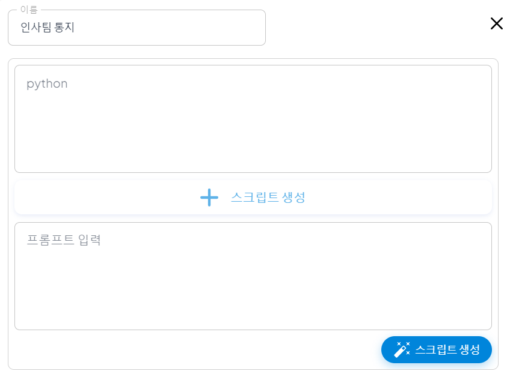

   - The created code can be checked in the script input field.
   - **[Image-7]**: Generated Script Code
   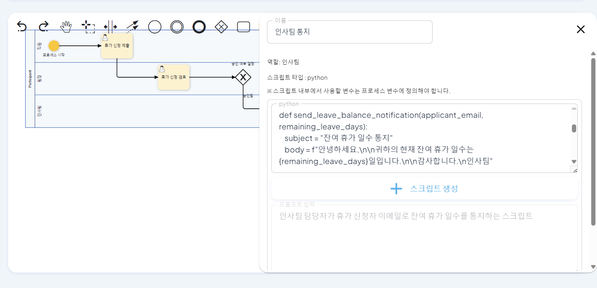

 

## Organization Chart Creation

1. **Organization Chart Definition Screen**
   - The organization chart definition is managed through the left chat screen and the right organization chart chart.

   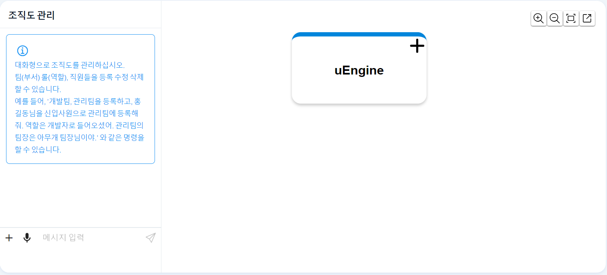

 

2. **Organization Chart Creation**  
   - Enter the team information and employee information you want to register through chat.
      - If the employee to be added is a new employee, enter the new employee information.
      - The new employee will be automatically registered through the received email address.
   - The created organization chart chart can be checked in the team information and employee information.
   - **[Image-8]**: Generated Organization Chart
   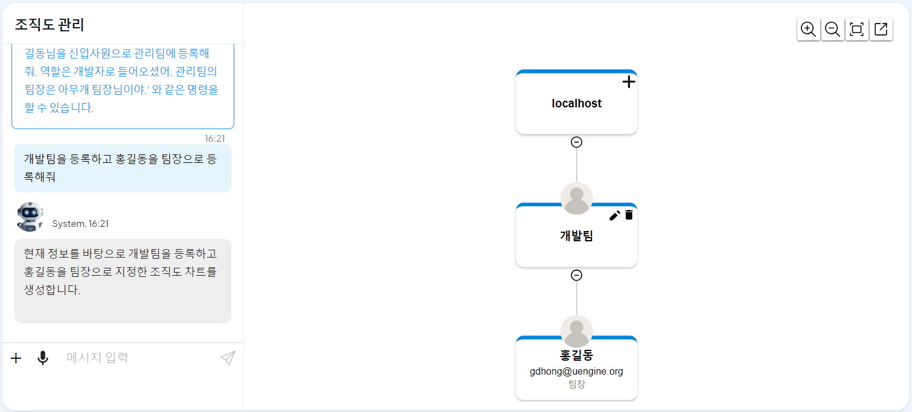

 

3. **Organization Chart Chart Modification**  
   - The user can directly modify and manage the organization chart chart.
   - If you want to add a team, click the + button next to the most upper company name element.
   - **[Image-9]**: The most upper company name element
   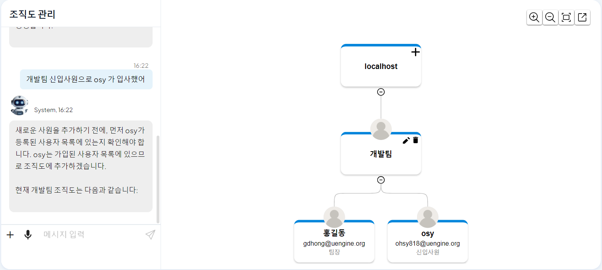

   - If you want to delete a team, click the delete button of the team you want to delete.
   - If you want to change the team name or modify the team members, click the modify button of the team you want to modify.
   - **[Image-10]**: Team Modify, Delete Button
   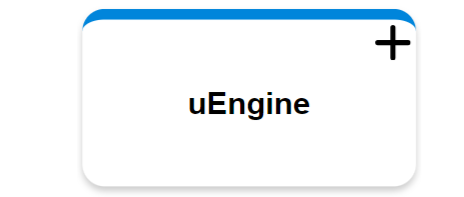

 