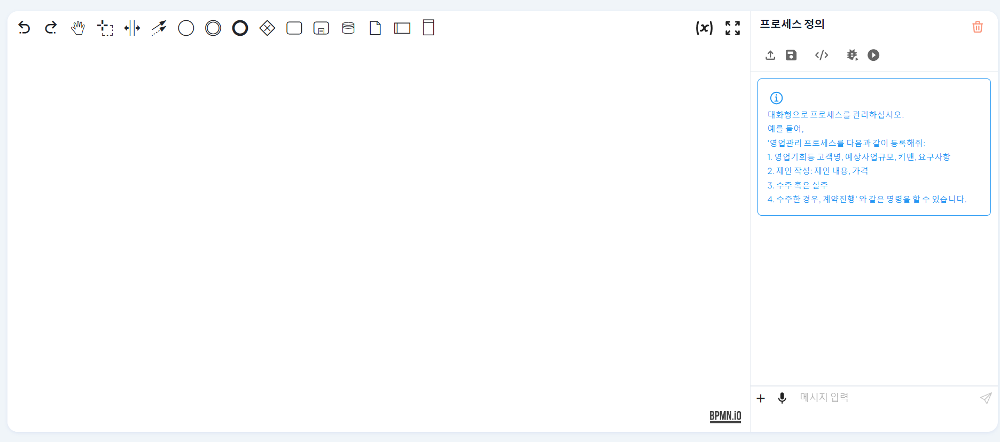

# Process Consulting AI and Management Guide

ProcessGPT's admin tools are not just a simple settings screen. It is an integrated guide that transforms documents into systems (Transformation), protects them with uncompromising security technology, and implements detailed logic (Engineering) through AI.

## 1. Document Systemization (Doc-to-System) and Security

### 1. One Document Completes the System (Instant Process Generation)

**"Text and images that were stuck on paper become a living system with just one click."**

Forget the effort of designing complex programming logic for business automation. ProcessGPT is equipped with a Doc-to-System engine that instantly converts static documents into executable systems.

#### 1.1 Process Conversion from PDF Regulations
Upload hundreds of pages of business regulations (PDF) and request "Create a process according to these regulations." AI reads the document and independently identifies the workflow, personnel, and rules.

- Uploading a PDF file and requesting process generation
 
 
 

In just a few seconds, text-based regulations are visualized and generated as standard business process (BPMN) diagrams. The generated process is not just a picture, but an actual system that can be immediately deployed for business execution.

- AI analyzing the regulations and converting them into an immediately executable BPMN process
 
 
 

#### 1.2 Systemization of Whiteboard Sketches

Even rough flowcharts drawn on a meeting room whiteboard or hand-drawn sketches (Image) are no problem. Upload the image and ProcessGPT will understand the intent and transform it into a clean digital process.

- Uploading a whiteboard sketch image and requesting conversion to a structured process
 
 
 

### 2. Compromise-free Security

**"An environment so secure that even administrators cannot access it"**

ProcessGPT's innovation is completed on top of 'uncompromising security' that perfectly protects your data.

- **Master Key Elimination:** We have boldly eliminated the 'master key' approach that existing systems kept for administrative convenience. Even system operators cannot access your internal data.

- **Token-based Integrity Verification:** Authorization is verified only through your unique authentication method (Token). Through a design that technically blocks access from unauthorized users, we provide an incredibly fast yet most secure work environment.

## 2. Basic Usage of Process Consulting AI
This is a step-by-step guide on how to use the automation features described above in the actual admin screen.

1. **Process Consulting AI Screen**
   - Process Consulting AI uses the **top AI chat window** in the Process Definition Map.

   

   - Access the Process Consulting AI chat screen.

   

 

2. **Process Consulting AI Creation**  
   - Enter the desired business process content through the chat window.
   - If there is content to improve or add, enter more detailed content.
   - If there is no more content to reflect, the diagram is generated based on the entered chat content.

   

   

 

3. **Process Consulting AI Save**  
   - If you want to save the created diagram, click the unlocked lock button at the top of the right chat screen to save it.
   
      

   

   - The saved business process definition can be checked on the Process Definition Map.
   

   

    

## 3. Detailed Process Definition and Form/Script Generation

1. **Process Definition Screen**  
   - The process definition is managed through the left process modeling edit screen and the right process definition chat screen.

   

 

2. **Process Definition Creation**  
   - Enter the process definition you want to create through the chat.
   

   - AI analyzes the user's input and defines the process and automatically generates a BPMN diagram.
   

 

3. **User Business Form Creation**  
   - If there is a form needed for each step of business, AI automatically generates a form.
   

   - The created form can be checked in the business panel and modified directly or through chat.
   

 

&nbsp;
  

4. **Script Business Code Creation**  
   - If there is a script business that needs to be executed, the script can be entered in the business panel.
   

   - The user can directly enter Python code or enter a prompt and click the script creation button to automatically generate code.
   

   - The created code can be checked in the script input field.
   

 

## 4. Organization Chart Management (Organization)

1. **Organization Chart Definition Screen**
   - The organization chart definition is managed through the left chat screen and the right organization chart.

   

 

2. **Organization Chart Creation**  
   - Enter the team information and employee information you want to register through chat.
      - If the employee to be added is a new employee, enter the new employee information.
      - The new employee will be automatically registered through the received email address.
   - The created organization chart can be checked in the team information and employee information.
   

 

3. **Organization Chart Modification**  
   - The user can directly modify and manage the organization chart.
   - If you want to add a team, click the + button next to the most upper company name element.
   

   - If you want to delete a team, click the delete button of the team you want to delete.
   - If you want to change the team name or modify the team members, click the modify button of the team you want to modify.
   

 

