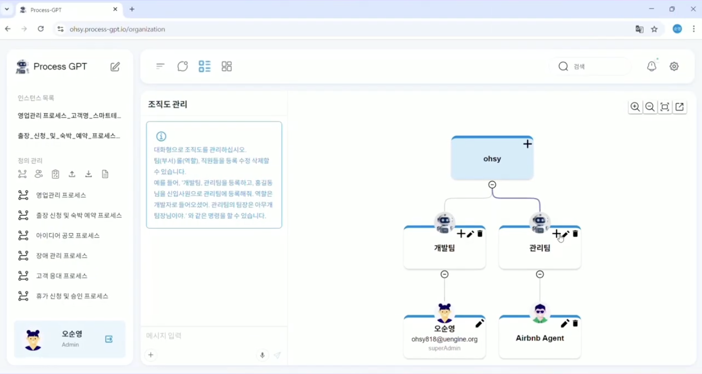
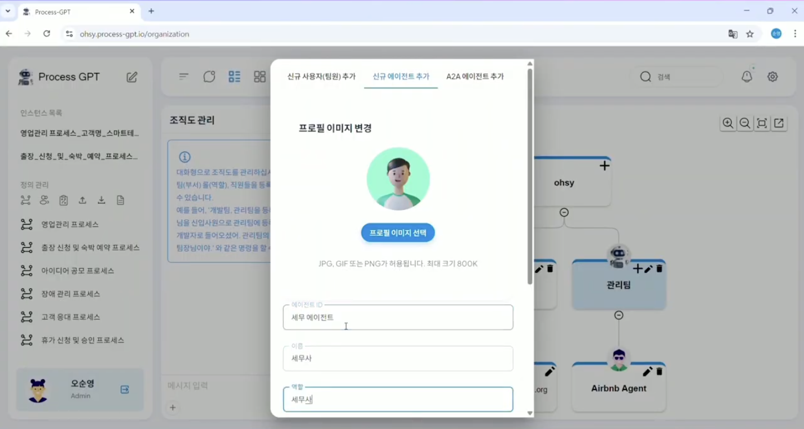
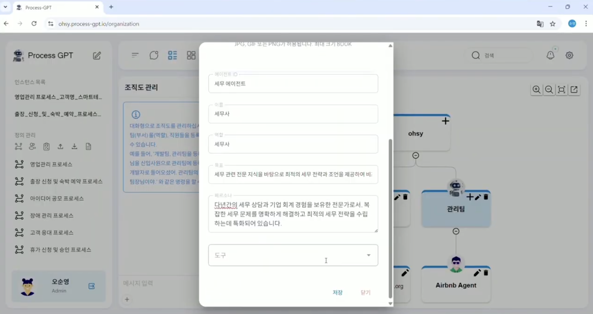
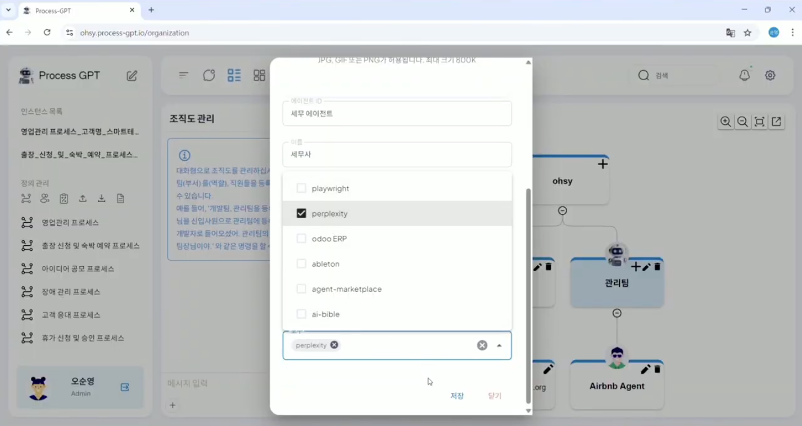
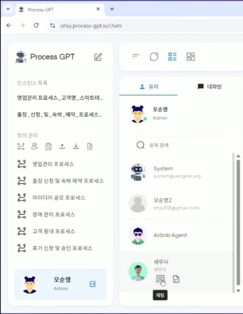
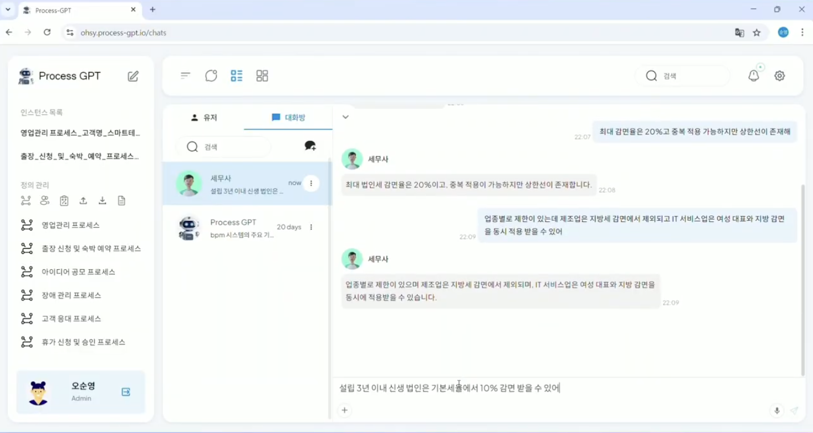
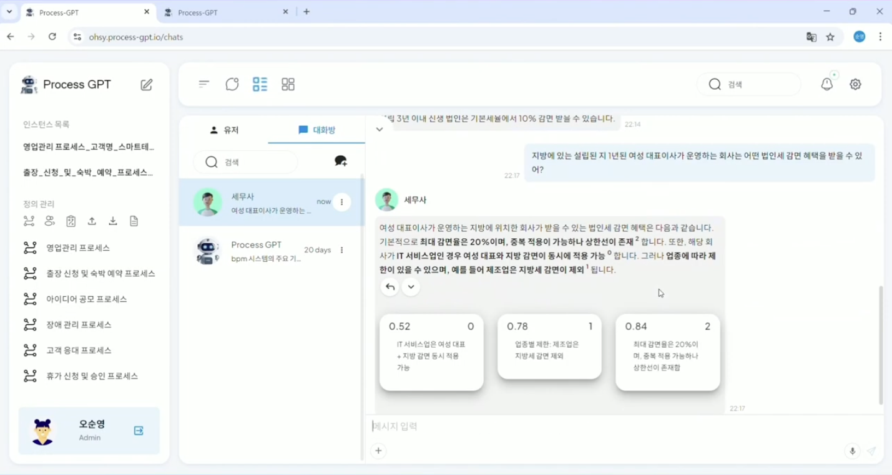

# Agent Knowledge Management

## Agent Boss-Based Agent Knowledge Training

Agent knowledge management is a **"learning and growing"** system that allows AI agents to learn the company's unique business methods and support the overall business.

Agent Boss sets the persona, skill, and tools (MCP) for each agent and systematically transfers knowledge through them, and uses the personalized memory system of Mem0 to learn the unique business styles and preferences of each user, creating optimized responses based on customized knowledge for each query.  
Furthermore, all learning contents are systematically stored in the Neo4j knowledge graph for editing, allowing agents to understand context and perform tasks, shortening the time for new agents to adapt to business and continuously improving the accuracy of business processing to produce consistent and improved quality results.

## Usage Method

The method for training the tax agent with the knowledge of the tax reduction benefits is as follows.

Click the 'Organization Chart Management' menu located at the bottom of the definition management to enter the organization chart and configure the organization chart as shown in the screen below. 

Click the '+' button in the management team to add a member, and then move to the 'New Agent Add' tab to modify the items as shown in the screen below. 

 

| Item | Content |
|------|------|
| Select Profile Image | Free |
| Agent ID | <Agent's Business Content> Agent |
| Name | <Agent's Job> |
| Role | <Agent's Job> |

 

| Item | Content |
|------|------|
| Goal | <Agent's Purpose of Use> |
| Persona | <Agent's Persona> |

 
| Item | Content |
|------|------|
| Tools | <Agent's Tools (MCP)> |

After the creation is complete, click the 'Chat' > 'User' menu at the top to view the chat list, and then click the 'Chat' to create a chat screen as shown in the screen below. 

In the chat screen, enter the knowledge related to the company into the tax agent as shown below to train the tax agent, which will learn the company's knowledge based on the user's chat content as shown below. 

After that, ask the agent related questions based on the trained content to provide the most optimal answer based on the learned content. 

Through this, you can learn the necessary pre-knowledge for a specific business to the agent and accumulate knowledge, and increase the efficiency of business by asking questions in the necessary situation.