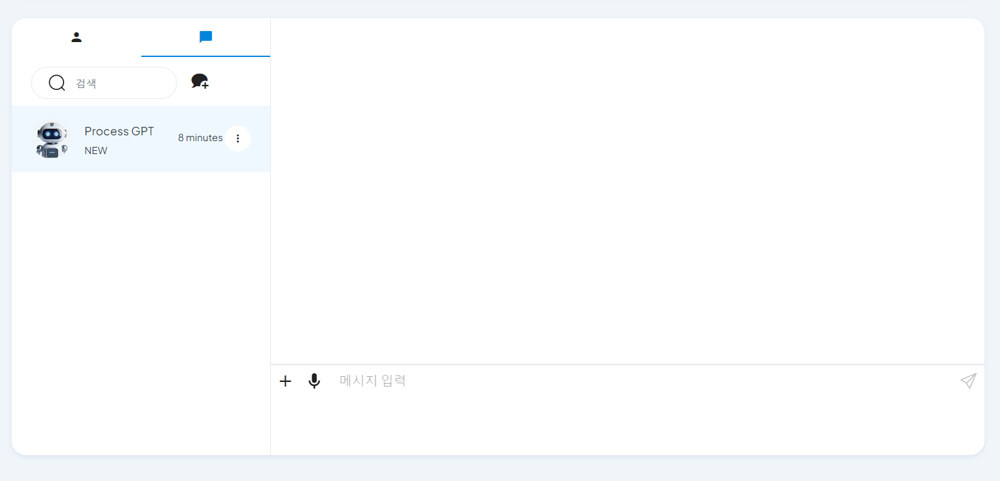
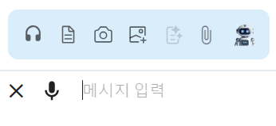
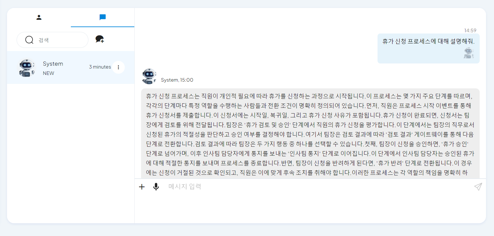

### AI-Based Voice Chat

Process-GPT allows users to ask various questions about the defined business processes and receive responses through AI-based voice chat.

#### Process-GPT Chat

1. **Using AI Voice Chat**
   - Access the chat screen through the chat icon at the top.      
   - **[Image-1]**: Overall Chat Screen

      

   - Click the + button next to the chat message input field and click the headset button in the chat function more to start voice chat.

   - **[Image-2]**: + Button

      

   - **[Image-3]**: Headset Button

      

2. **Chat Inquiry**
   - Click the audio button at the bottom of the voice chat screen to ask about the process.
   - **[Image-4]**: Voice Chat Screen

      

   - **[Image-5]**: Audio Button

      

   - When the inquiry is complete, click the stop button and wait for the response.
   - **[Image-6]**: Stop Button

      

3. **Chat Response**
   - AI provides a response to the user's inquiry.
   - **[Image-7]**: Response Screen

      

   - The received content can be checked in the chat record with the system in text format.
   - **[Image-8]**: Chat Record

      
