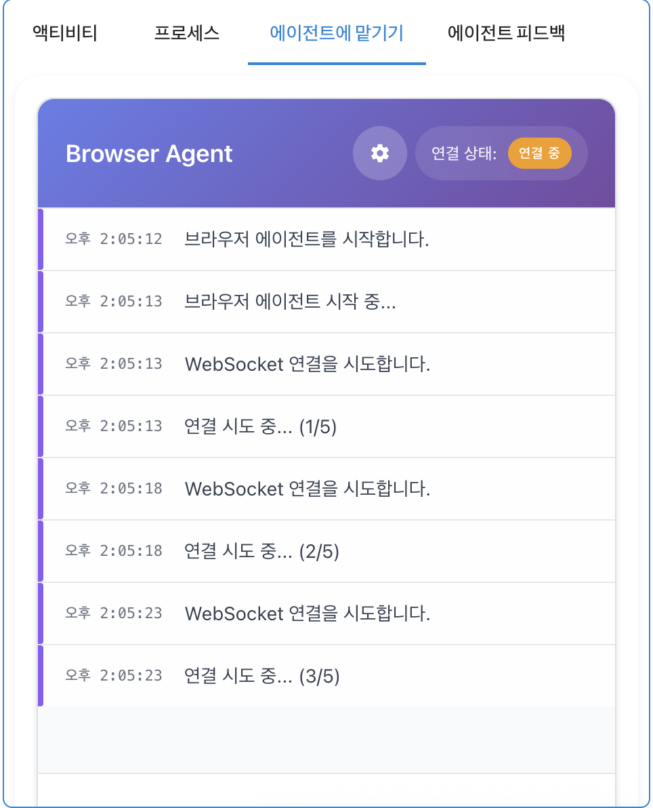
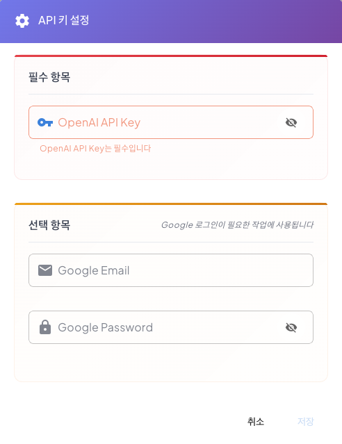
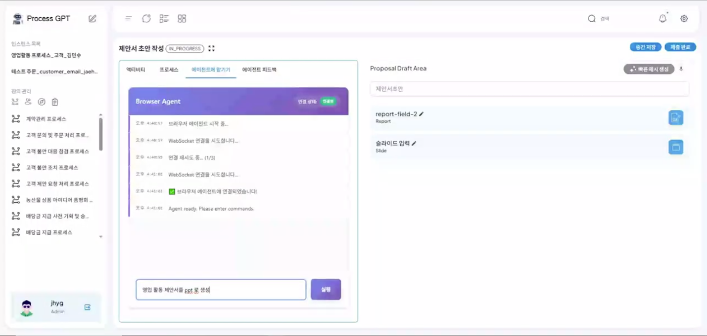

# Browser Use Agent

## Web Tool Integration Using Browser Use Agent
Browser Use Agent System is a system that automatically detects and processes web-based tasks needed to process the Task of the process.

In the PPT creation needed for the proposal work, AI-based PPT creation tools GenSpark or search sites Google can access the web-based tools through Browser Use to process tasks suitable for the process.

### Using Browser Use Agent
The method for using the Browser Use agent to create a PPT using the web-based GenSpark tool for the sales proposal process is as follows.

Execute the sales proposal process to proceed to the proposal writing step, and then click the proposal writing. 
 

After that, click the 'Delegate to Agent' and then select Browser Use in the research method. When the initial selection is made, the step of installing Browser Use on the local is performed, and the 'Download' button is clicked to install. 
 

After the installation is complete, proceed with the start. After that, the connection attempt of the installed Browser Use is performed as shown in the screen below. 
 

When the connection is attempted, click the gear icon at the top to enter the API Key setting and Google account information to proceed with the Google login used on the web site. 
 

After the connection is completed, AI automatically adds a prompt to write the sales proposal needed for the current Task as a PPT. This prompt allows users to add additional requirements, and the more specific the requirements, the more accurate the operation of Browser Use is. 
 

When a prompt-based creation is requested, you can see that the creation request is performed as shown below, and the web tool search and execution suitable for the requirements are performed. 
 

After that, access the AI-based PPT creation tool Genspark and refine the input requirements to request PPT creation, and proceed as shown below.
 

After the PPT creation is complete and the Web request requested by Browser Use is completed, you can see that the request has been completed as shown below.
 

Thus, the Browser Use agent can improve the efficiency of business processing by understanding the requirements of the process and proceeding with tasks through the connection with the web tool.