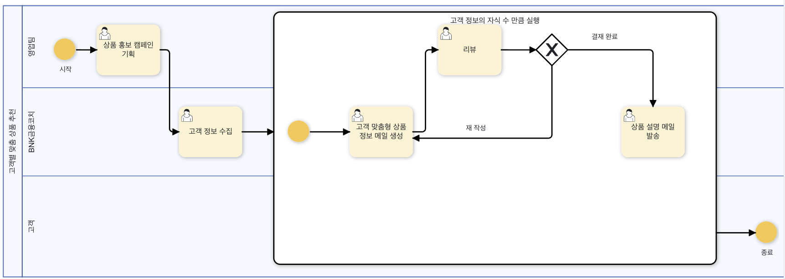
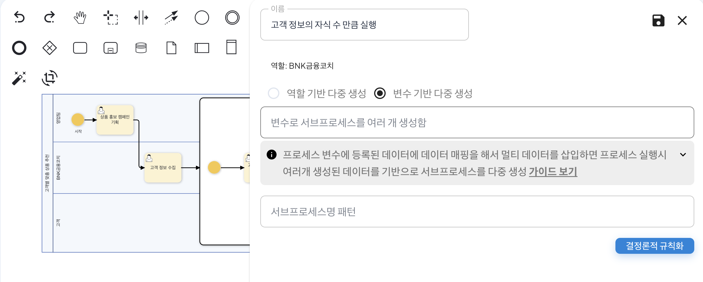
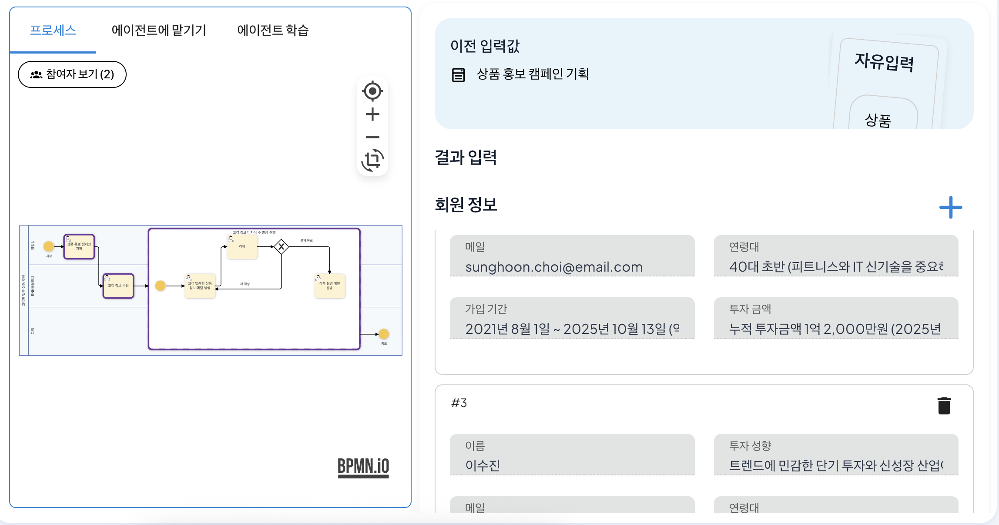
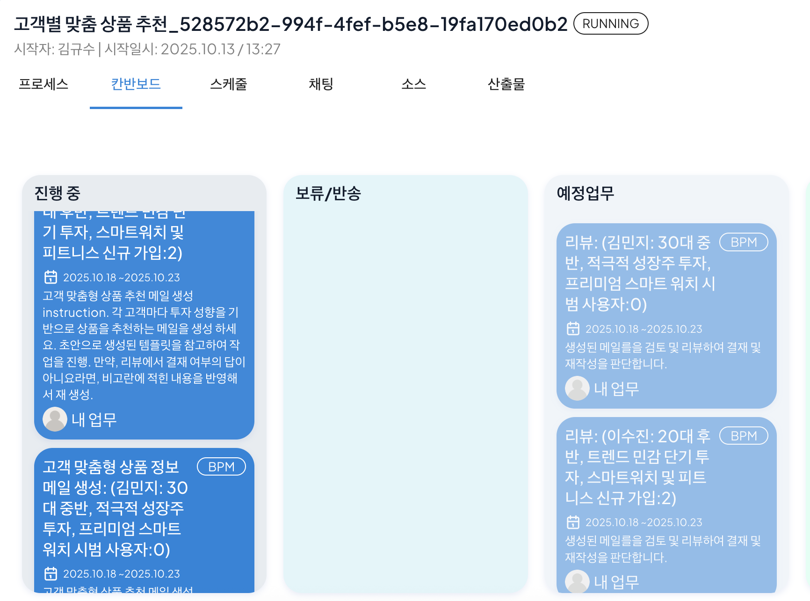

# Deterministic Regularization

Process GPT uses non-deterministic (Non-deterministic) AI inference by default to perform conditional evaluation, situation judgment, decision-making, etc. based on natural language, but the characteristic of AI that results may differ each time for the same input can disrupt consistency and reproducibility of business processes.

To address this, we have added a deterministic regularization feature that, based on the verified results from non-deterministic execution, automatically converts the results into deterministic rules that operate identically for the same input in the future.

Deterministic regularization operates as follows.

1) AI interprets the conditions or situations described in natural language and performs judgment. At this time, the judgment process is non-deterministic, so the result may differ.

2) The system accumulates input-output cases in the case bank and identifies verified cases through learning.

3) Sufficiently verified cases are automatically converted into Python code by AI, and this code is applied as a deterministic rule replacing the non-deterministic judgment.

4) After the same input is given, the system does not perform AI inference but executes the Python code, ensuring consistent results and improving processing speed.

This process realizes a hybrid intelligence structure combining the flexibility of non-deterministic AI, natural language reasoning capabilities, and the safety of deterministic systems, and transaction guarantees.

## Setting Deterministic Rules
The method for setting deterministic rules through the customer-specific product recommendation process is as follows.<bt>

First, prepare the customer-specific product recommendation process as shown below. 
 

Click the 'Process Edit' in the right menu to activate the edit state, then double-click the sub-process area to activate the panel. 
 

After that, click the 'Deterministic Regularization' button. Clicking will create a screen as shown below, and you can see the result of converting the name of the sub-process, 'Execute as many times as the number of children of customer information', into code. This allows the sub-process to be executed as many times as the number of customers collected in the previous process, the customer information collection step.
 

After setting the deterministic rule, save the panel and close it, then save the process. Then, by executing the process and creating a quick example, you can see that a customer-specific product information mail generation process has been created according to the three customers you entered previously, as shown below.
 
<Customer Information Collection Process Example>  

 
<Execution of Sub-Processes According to the Number of Collected Customer Information>  

