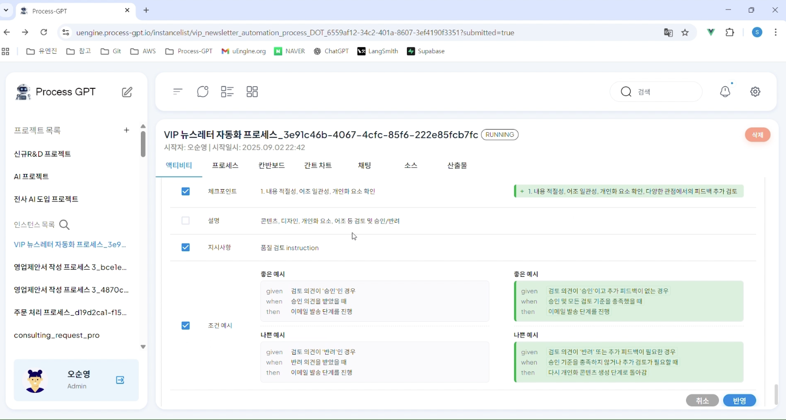

# Feedback System

## Process Improvement Using Feedback System

Feedback System is a system that improves the process by performing feedback during the process execution to solve the problem of manually editing when there is a need to improve the checklist and branch processing examples for a specific step.

During the process execution, if the result of the current step does not satisfy the checkpoint and proceeds to the next step, or if it is determined that improvement is needed, the user can provide feedback directly or select the feedback items suggested through LLM to write an improvement plan for the checklist and branch processing examples. 

By reflecting the improved content, the process is automatically edited to be applicable to the re-execution of the current process and the subsequent process execution, improving the process.

### Using Feedback System
The method for improving the quality review of the VIP newsletter sending process using the feedback system is as follows.

Go to the process definition chart to execute the VIP newsletter sending process. 
 

After that, execute the process to the quality review step. At this time, you can execute the process by entering the form through the quick example generation or manually. 
 

After completing the quality review step, move to 'Activity' to check the normal execution of the process, and if you click 'Dislike', you can check the screen below. Here, you can improve the checklist for the corresponding step, and if you need to improve through LLM or enter directly and click 'Submit', you can proceed with feedback. 
Here, you can improve the checklist for the corresponding step, and if you need to improve through LLM or enter directly and click 'Submit', you can proceed with feedback. 

 

 

After the submission is completed, changes such as the feedback-based checkpoint and condition examples for branch processing are made. 
After checking the feedback change, you can see that the feedback is reflected as shown below.

 

After clicking 'Reflect', the selected items are reflected, and you can see that the condition examples for branch processing are changed according to the condition examples by clicking the flow of the review result branch as shown below.

 

Through this, the process can be continuously improved during execution, improving business quality, and processes can be consistently processed without repetitive feedback, ensuring operational efficiency and improving the level of business automation.