# Multi Agent

## MCP-based Multi Agent Automatic Draft Creation

Multi Agent is a system that automatically analyzes and implements the optimal solution for complex tasks through MCP(Model Context Protocol) integrated multi-agent, enabling autonomous problem solving.

Specialized AI agents automatically form teams based on business requirements, perform projects in their specialized fields, and solve problems flexibly through delegation and inquiry between agents to achieve their goals independently.  
Furthermore, through MCP, hundreds of business tools such as internal document search, Office tools, databases, cloud services, etc. are connected through a single interface, allowing agents to access all company systems like actual employees, from CRM analysis to report writing, schedule management, and department collaboration, shortening the time it takes to complete tasks that previously took days and ensuring specialization through the use of various tools by agents.

## Multi Agent Draft Creation

The method for using the Multi Agent to create a proposal draft for the sales management process is as follows.

Click the process registered in the process definition chart, and then click the 'Execute' button in the screen below. 
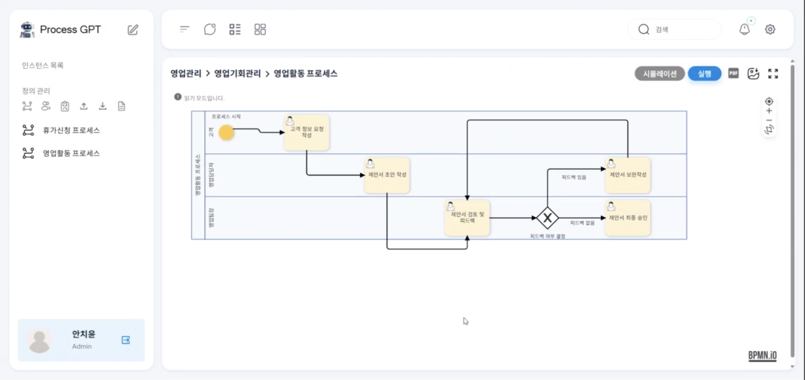

After that, click the 'Quick Draft Creation' at the top to create the customer information request writing task, and then click the 'Submit Complete'.  
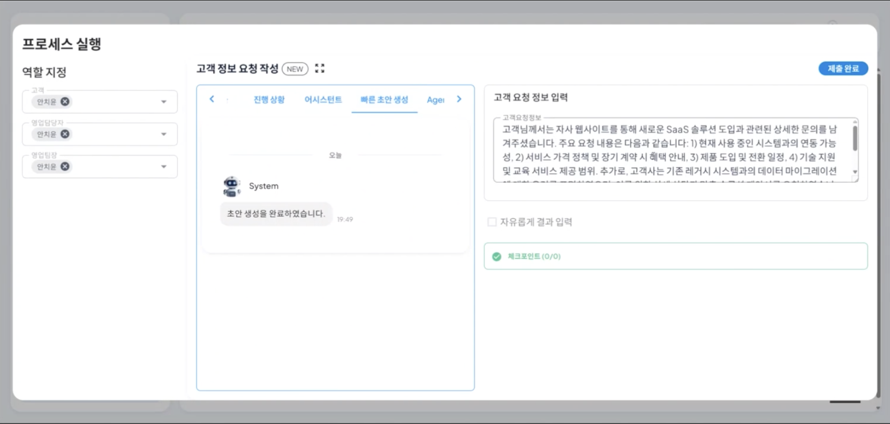

After the submission is completed, you can see that the customer information request writing task has been completed in the progress status, and the proposal draft writing task is currently in progress as shown below. 
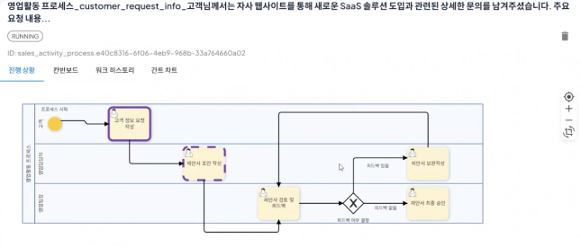

After that, click the 'Kanban Board' to click the proposal draft writing task among all tasks of the sales management process.  
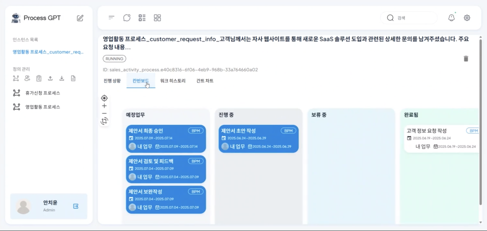

After clicking the 'Agent Monitoring' in the proposal draft writing task, the specialized AI agents for the sales management process requirements each start the proposal draft writing they need.  
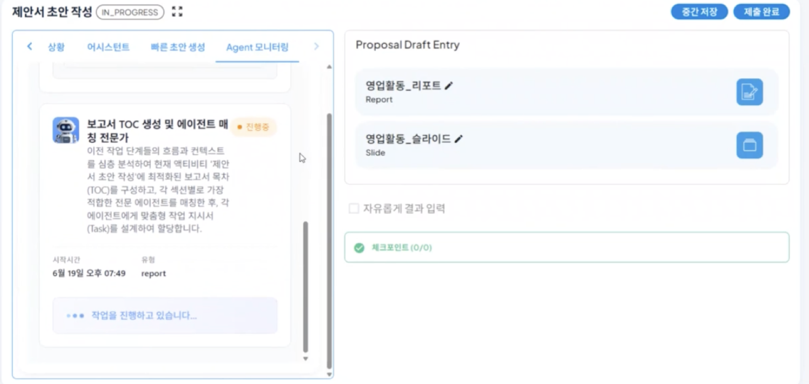

By clicking the 'Select' in one of the proposal drafts written by the agent for the sales activity report, the selected report is created in the Proposal Draft Entity as shown below.  
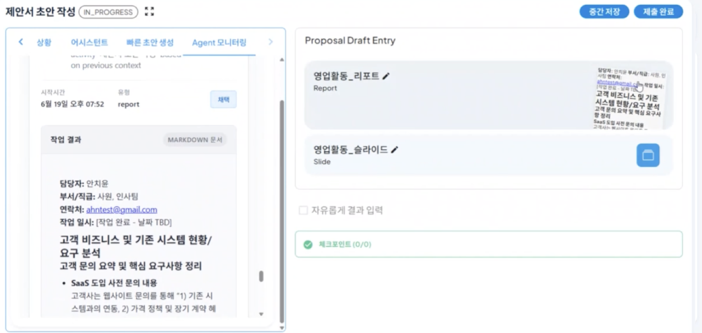

By clicking the report, you can check the detailed contents, and you can perform the work for the contents that need to be modified or added.  
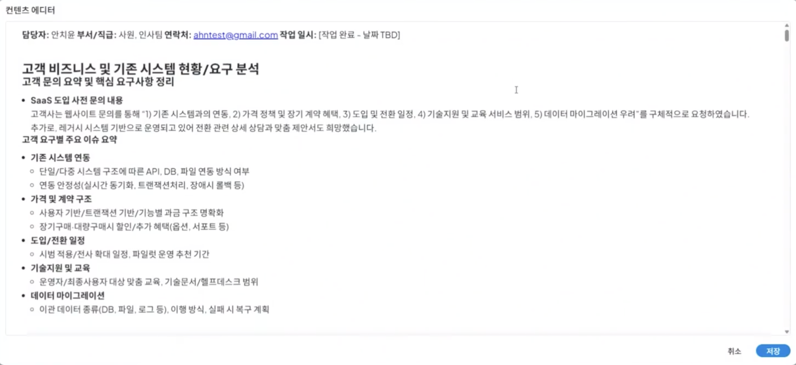

By dragging a specific content, you can input the requirements for the dragged area and perform creation and modification as shown below.  
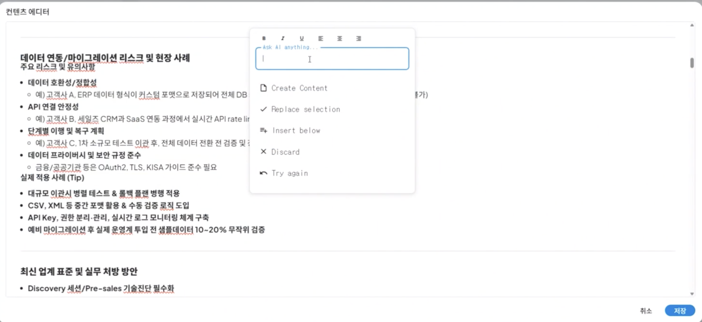

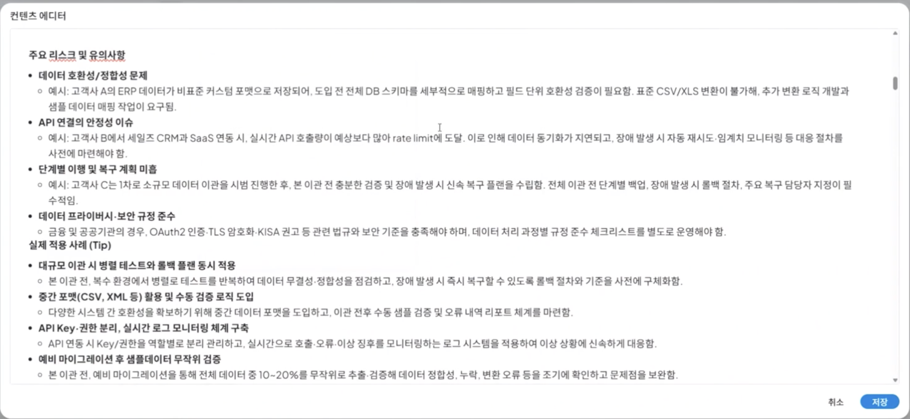  
<Report modification result based on requirements>

By selecting the 'Sales Activity_Slide' in the same way, clicking the 'Submit Complete' will complete the proposal draft writing task.
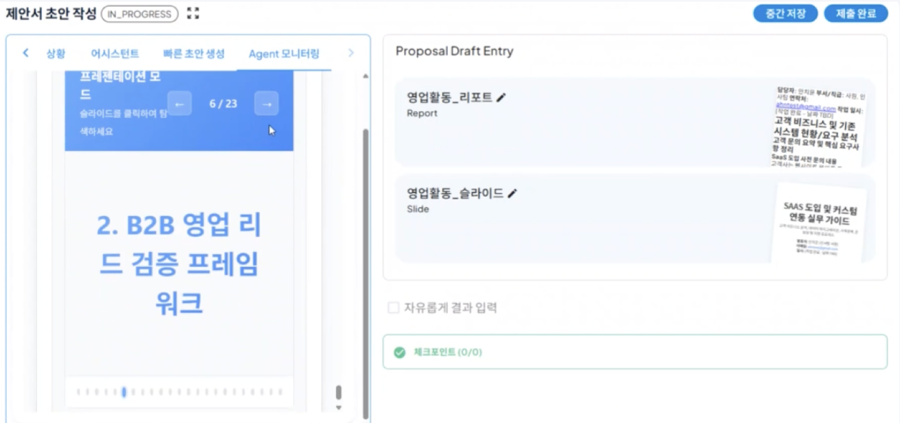

After that, by checking the progress again, you can see that the proposal draft writing task that was in progress has been completed based on the proposal created by the AI agent.
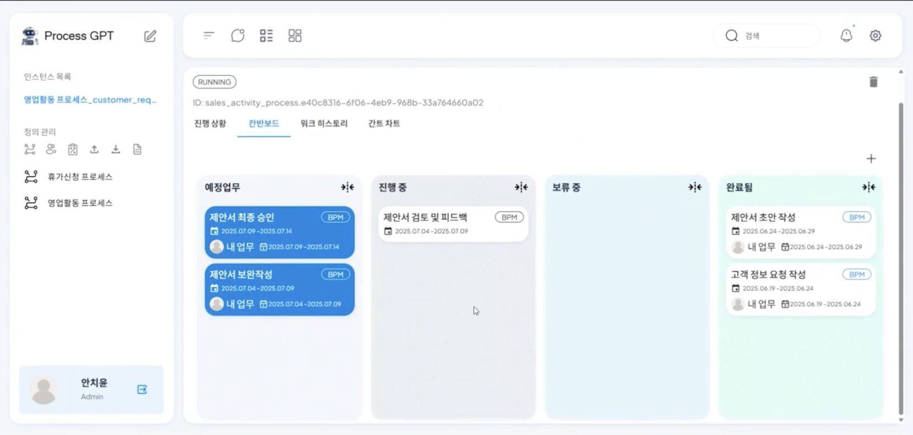