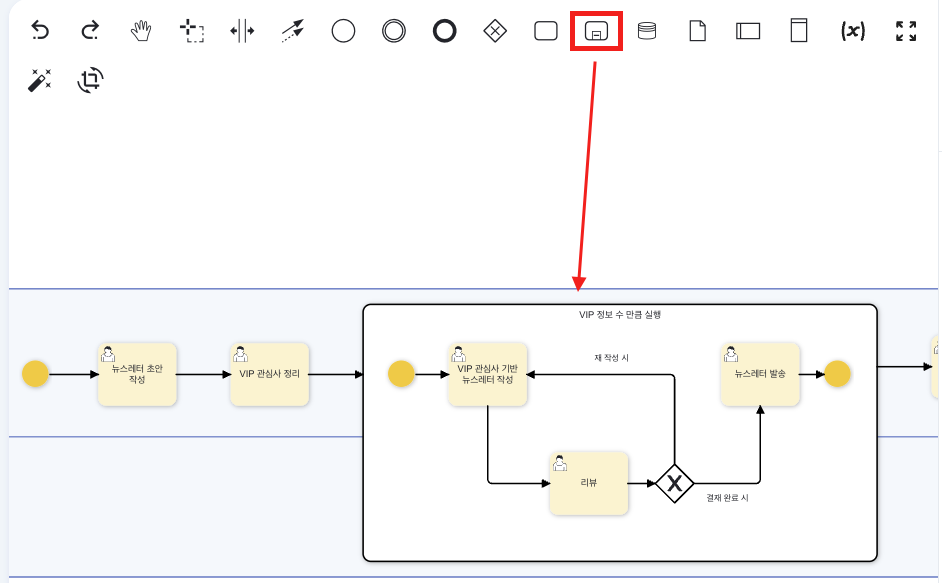
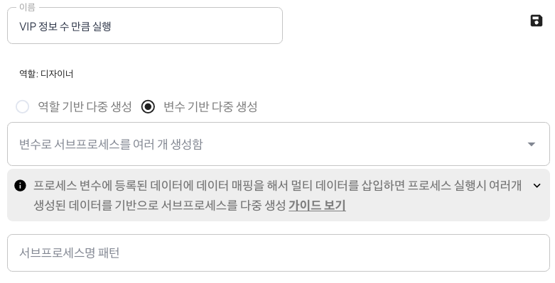
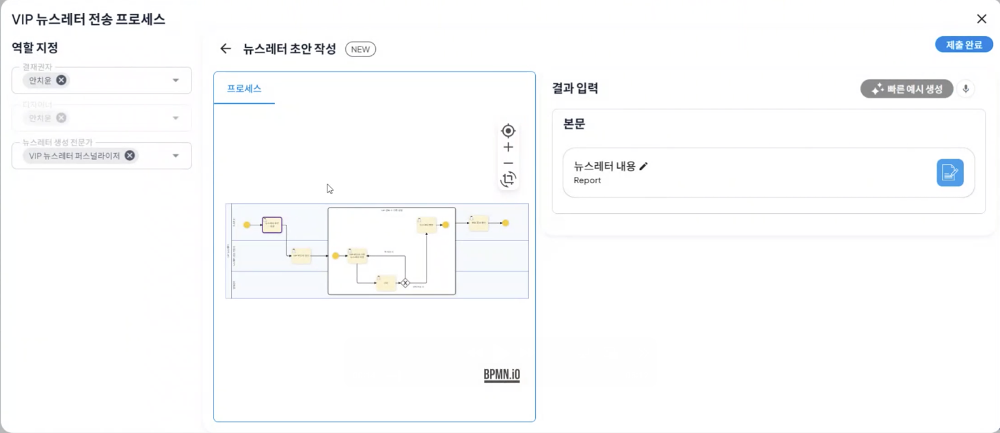
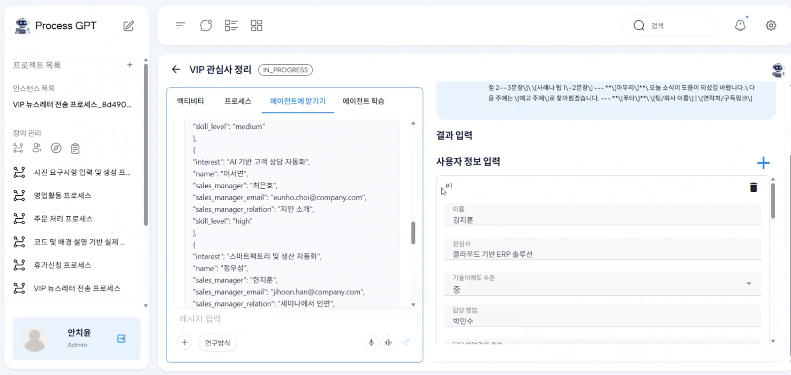
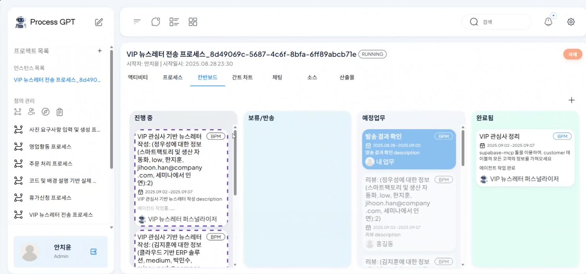
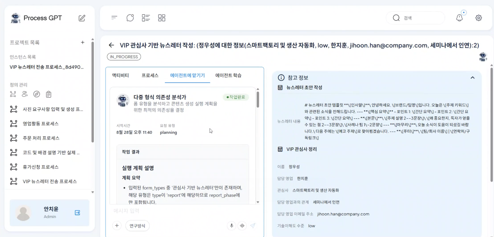
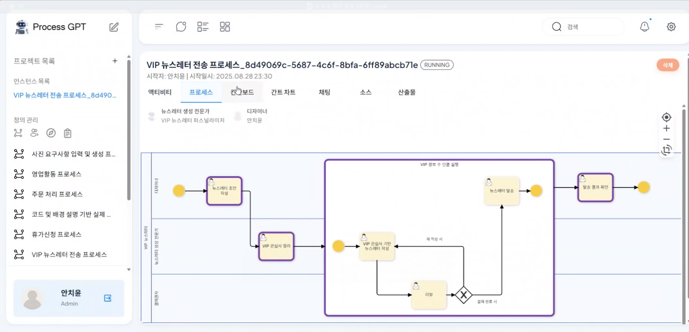

# Multi Instance Sub Process

## Multi Instance Sub Process Parallel Process Handling

Previously, when there was a repetitive task in the process, it had to be processed sequentially. 
For example, if there were 5 VIPs, 5 separate processes had to be executed in order, so the processing time was long. 

To solve this problem, a new multi-instance sub-process feature has been added.
This feature allows you to designate specific areas within a process as sub-processes, enabling simultaneous parallel execution of sub-processes in the number determined by the previous step.
Unlike the existing sequential processing method, it processes multiple tasks simultaneously, reducing overall processing time. 

### Core Features of Multi Instance Sub Process

**Parallel Processing Architecture**: The specified sub-process area within a single process is executed simultaneously as multiple instances, significantly increasing processing speed. 

**Dynamic Instance Creation**: The number of sub-process executions is automatically determined based on the data or conditions from the previous step, enabling flexible process handling. 

**Integrated Management**: Even when multiple sub-processes are executed in parallel, they are managed within a single integrated process, ensuring consistency and traceability. 

### Using Multi Instance Sub Process
The method of executing sub-processes in the number of VIP interests through the VIP newsletter sending process is as follows.

First, design the VIP newsletter sending process in the definition management or select the VIP newsletter sending process from the marketplace.

The VIP newsletter sending process can be checked as shown below, and the sub-process area can be specified through the BPMN tool. 

Next, double-click on the sub-process area to create a panel and select the options as shown below.<

Once the sub-process design is complete, move to the process definition chart to execute the VIP newsletter sending process. 

In the VIP interest summary step, click the right + button to add interests. At this time, a sub-process will be created in the subsequent step in the number of user information input through the + button. 

After submitting, check 'In Progress' on the kanban board, and you can see that a sub-process has been created in the number of VIP interests added in the previous step, creating a work item. 

In the subsequent VIP interest-based newsletter writing step, you can manually input the necessary content or assign the newsletter writing task according to the interest through the agent as shown below. 

Finally, once the review and newsletter sending tasks specified in each sub-process area are completed, you can proceed to the newsletter sending result check step as shown below, and you can check the contents of the sub-process performed in the previous step. 

Through this, the existing sequential process execution method is changed to a parallel processing method within a single integrated process, improving the task processing speed, and ensuring consistent process execution and management efficiency.