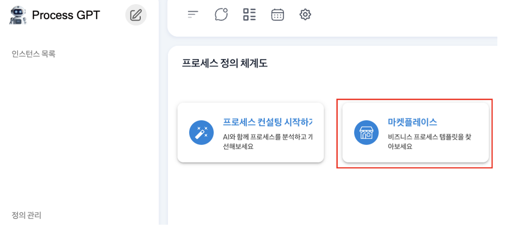
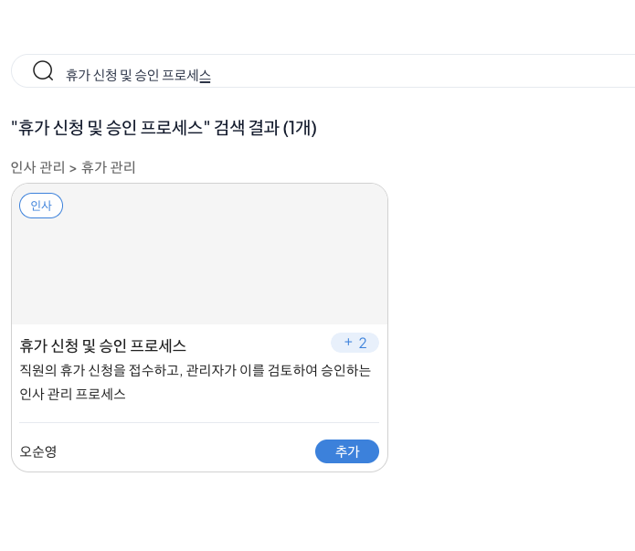
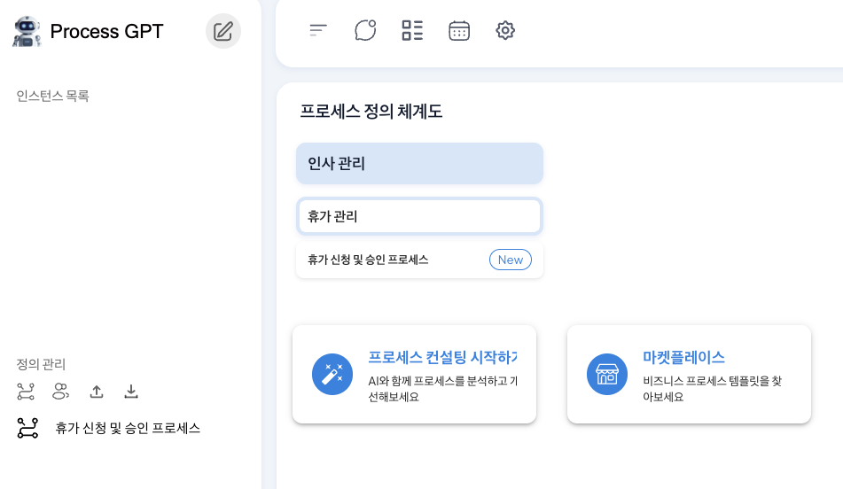
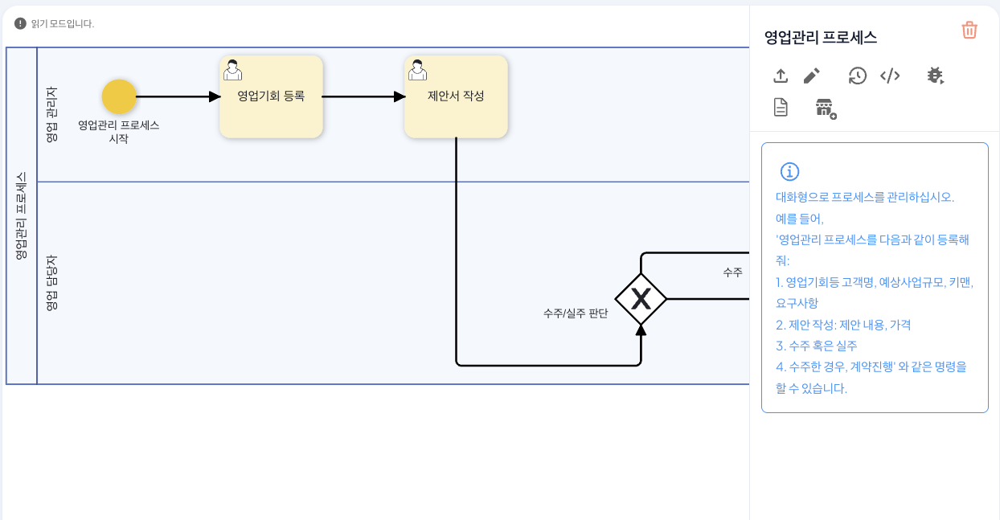
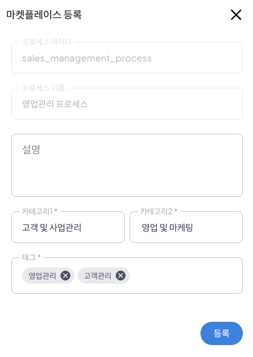
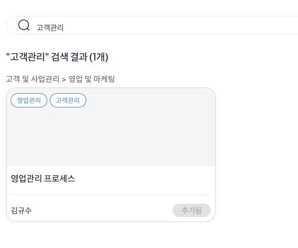

# Marketplace

## Process Marketplace

Process Marketplace is a tool to solve the problem of having to spend a lot of time designing a new business process from scratch every time a new business process is built.

Process Marketplace allows you to search and add verified process templates from various business areas and immediately use them, and you can also share the process you designed with other users.   
This allows you to **shorten the process design time** and quickly introduce and modify best practices, improving both the efficiency and quality of process construction.

## Applying Marketplace

The method of applying the vacation application and approval process through the marketplace is as follows.

Enter the process definition chart and click 'Marketplace' to execute.
 

When the marketplace is executed, enter 'Vacation Application and Approval Process' in the search window as shown below to search for processes registered in the marketplace and add them.

 

Once the addition is complete, the vacation application process is created as shown below, along with the Mega and Major processes entered when registering the process with the marketplace in the process definition chart, and can be used.
 

## Marketplace Registration
Marketplace allows you to register the process you designed to share with other users.

The method of registering the sales management process through the marketplace is as follows.

Click 'Marketplace Registration' at the bottom of the created process definition screen on the right side of the sales management process to proceed with marketplace registration.
 

When the marketplace registration window is created, information windows that must be entered when registering the sales management process in the marketplace appear, and the following information must be entered.

| Category | Item Name | Example Input Value |
|------|--------|--------|
| **Category1** | Mega Process Name | Customer and Business Management |
| **Category2** | Major Process Name | Sales and Marketing |
| **Tag** | Search chip to register in the marketplace | Sales Management, Customer Management |

Refer to the table to register the sales management process in the marketplace as shown below. At this time, the tag can be registered by entering 'enter' by keyword unit.

 

Once the registration is complete, you can see that it is registered as shown below in the marketplace.
