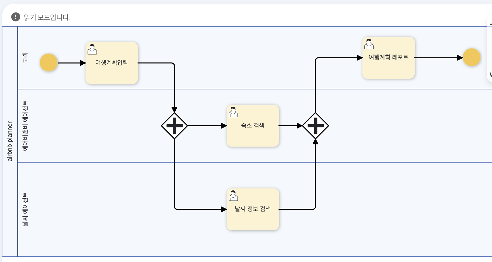
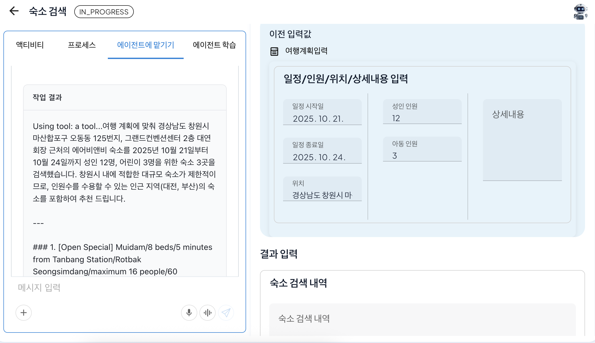

# Context Engineering Automation

## Context Engineering through Reference Information Setting

Process GPT is an agentic BPM platform with prompt chaining implemented to automatically connect each step of a business process through AI. 

There is a limit on the amount of information that a large language model can recognize at once, called the context window (Context Window), and ProcessGPT optimizes the context passed to the next step by context engineering that automatically extracts only the necessary information at each step, considering the window size. 

The user can configure the process to be connected automatically without writing code by selecting the items to be passed to the next step from the results of the previous steps in the intuitive UI based on BPMN, or by automatically optimizing the context by the LLM analyzing the business process context. 

## Setting Reference Information
The method for setting reference information through the hotel reservation process is as follows.

First, create a hotel reservation process as shown below.
 

After that, double-click the hotel search activity to create a panel, then click the reference information tab. 
 

The form to be referenced can be selected from the stages that wish to reference the previous stage based on the current stage, and the necessary information from the information registered in the form of the previous stage, the travel plan input step, can be selected when selected. 
 

After selection is completed, save and execute the process to proceed to the hotel search step, you can see the values you entered in the previous input values section when the travel plan input step is completed, as shown below. 

Based on this, by clicking the 'Hand Over to Agent' tab, the agent can identify the information needed for hotel search based on the information referenced by the user, and can see the result of the hotel search as shown below.
 

