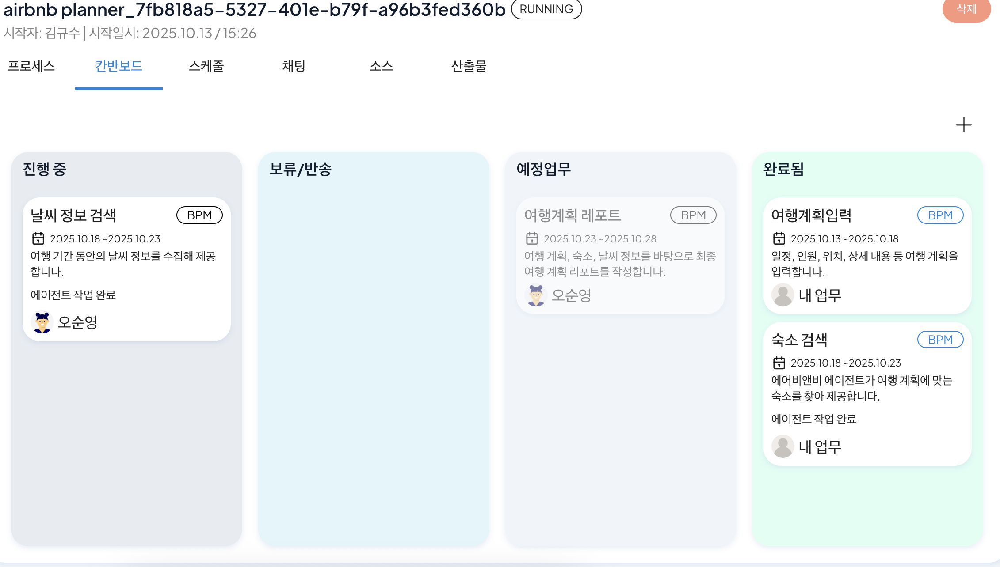
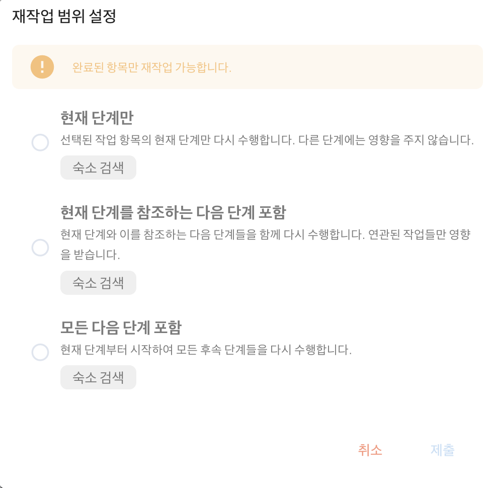

# Rework

Rework is a feature that compensates for the tasks performed in the previous step in reverse order based on the business log executed through an agent or MCP (Machine-Context Protocol).

This feature is designed as a business transaction compensation mechanism to address partial failure situations that can occur in distributed transaction environments.

Rework operates as follows in the example below.

1) Each work item logs information at the time of MCP call as a log. At this time, when rework is requested, the system searches for the execution log of the corresponding instance in reverse order to identify the target of compensation processing.

2) For the agent and MCP recorded in the log, compensation transaction operations are performed, and the reverse logic is automatically processed. This ensures business transaction guarantees and process consistency.

## Setting Rework
The method for using rework through the hotel search process is as follows.

First, create a hotel reservation process as shown below.
 

After that, execute the completed hotel search process to complete the hotel search step. Then, go to the kanban board to check if the hotel search work item has been completed, and click it.
 

By clicking the 'Re-execute' in the upper right corner of the hotel search step, you can set the rework range as shown below. 
 

 
<Rework Range Specification>  

After setting the rework range, a new work item is created, and you can see that the hotel search performed through the agent is rolled back due to compensation processing and re-executed.
 