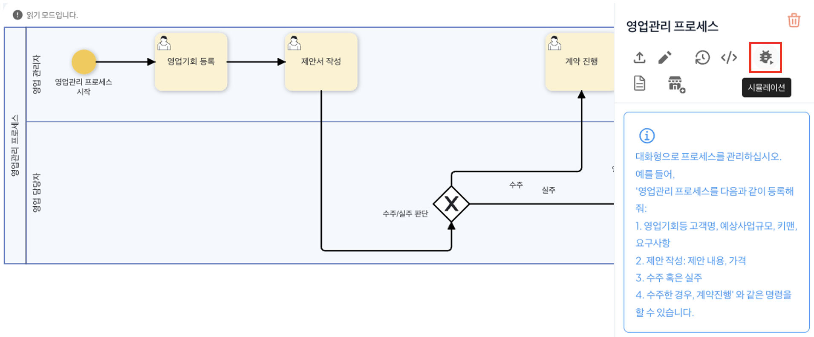
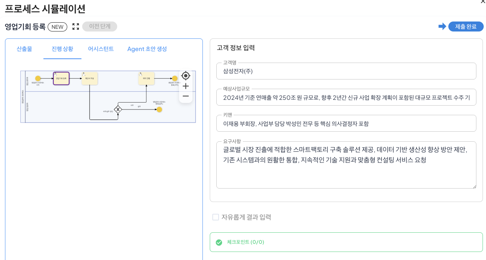
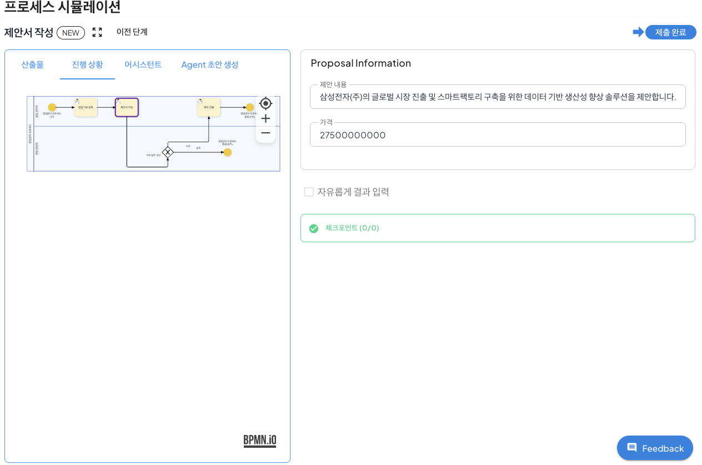
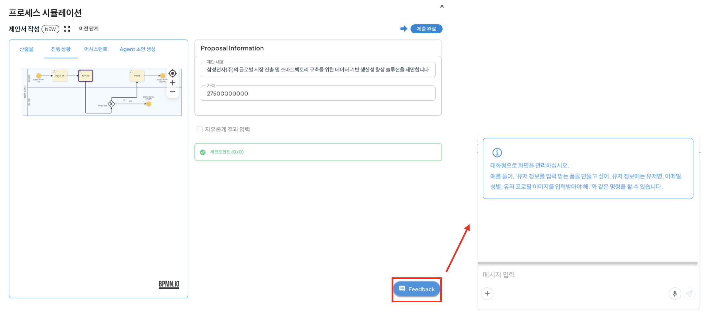
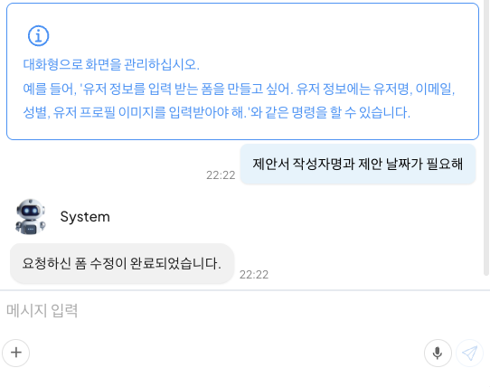
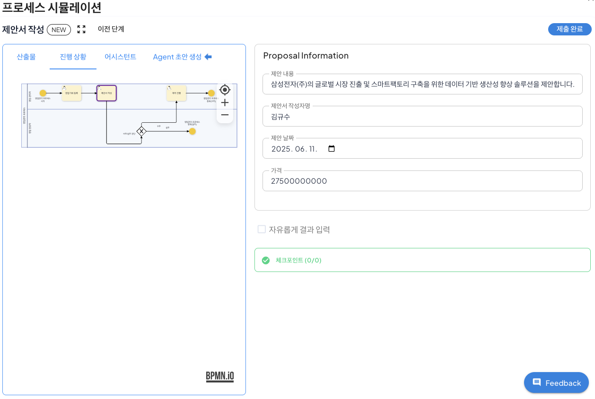

# Process Simulation & Feedback Correction

## Simulation Mode

Simulation feature is a feature that supports a test environment to identify and correct errors that occur step by step by executing a process in the same virtual environment as the execution environment of a completed business process.

In the simulation mode, the test is performed in the same environment as the actual process execution, so you can check the problems that occur step by step without executing the process.  
Furthermore, since the simulation data is managed separately from the actual business data, it can be verified safely, so the operation risk can be minimized and the quality of the designed process can be guaranteed.

### Simulation Mode Execution

The method of executing the simulation mode through the sales management process is as follows.

Click 'Simulation' in the sales management process menu at the bottom of the process definition screen to execute the simulation mode.
 

When the simulation is executed, you can see that a screen like the one below is created, and the appropriate test values are entered in the form connected to the start task by Agent.
 

After checking the values entered in the form, click the 'Submit Complete' in the upper right to execute the next step. At this time, if an error occurs in the current step, an error is output, and the user can modify it through the output error.

When the next step is executed, the same result as the current task is generated through Agent draft creation, and the user can proceed to the next step through Submit Complete or click 'Previous Step' to modify the values entered in the previous task.  

## Feedback Chat

Feedback chat is a feature that automatically adjusts the business flow by considering the current step form modification using AI when the form modification of the current step is required in the process simulation feature. 

By directly inputting feedback in the current business step, AI proposes and applies a modification plan for the form by considering the requirements and overall flow. 
Through feedback chat, the time required for process improvement is minimized, and the business efficiency of reflecting the business manager's requirements through flexible process adjustments is greatly improved.

### Form Modification via Feedback Chat

The method of editing the form of the sales management process's proposal writing task through feedback chat is as follows.

Click 'Feedback' at the bottom of the proposal writing step to activate the chat window to proceed with feedback.
 

Enter 'The proposal writer's name and proposal date are needed' as shown below in the chat window and click 'Enter' to proceed with chat.
 

When the chat is entered, AI edits the form written in the existing process based on the entered requirements as shown below.
 

Through this, the user can identify the problems that occurred during the process execution in the test environment and quickly modify the necessary modifications for each step to ensure the quality of the process.