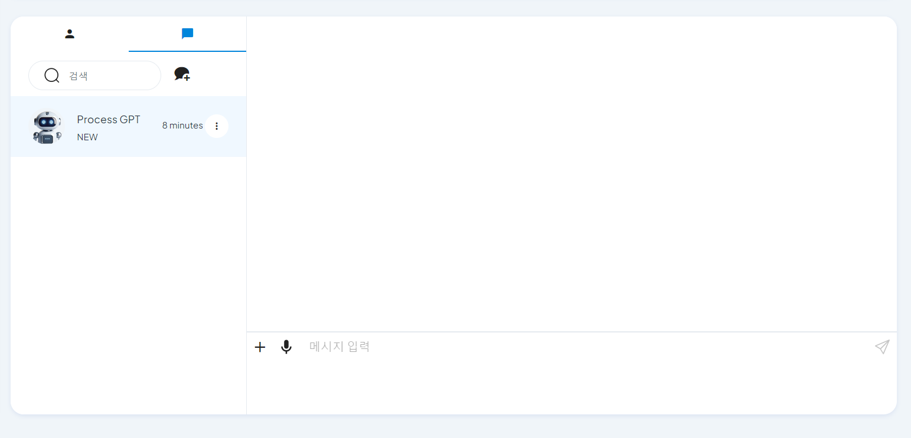
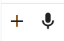
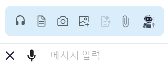
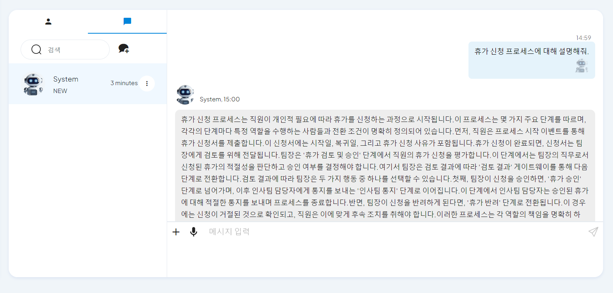

# Key Features

## AI-based Chat

Access the chat screen through the chat icon at the top.

1. **General Chat**
   - The user can receive recommendations for tasks to be performed through the GPT activation function during chat.
  

2. **AI Voice Chat**
   - Click the + button next to the chat message input field and click the headset button in the chat function more to start voice chat.
   - **[Image-1]**: + Button
   
      
   
   - **[Image-2]**: Headset Button

      

   - Click the audio button at the bottom of the voice chat screen to ask about the process.
   - **[Image-3]**: Audio Button
   
      

   - When the inquiry is complete, click the stop button and wait for the response.
   - **[Image-4]**: Stop Button

      

   - AI provides a response to the user's inquiry.
   - **[Image-5]**: Response Screen

      

   - The received content can be checked in the chat record with the system in text format.
   - **[Image-6]**: Chat Record
   
      

## Process Instance Execution

1. **Process Instance Execution**
   - The user selects the process to be executed in the process definition chart.
   - Click the execute button at the top right to execute the process instance.
      - You can specify the role to perform the instance work item.
      - You can enter the form to perform the work item.
   - **[Image-7]**: Process Instance Execution Screen

      

 

2. **Process Instance List**
   - The user can check the currently running process instance in the instance list.
   - **[Image-8]**: Running Process Instance List

      

 

3. **Process Instance - Progress**
   - Users can monitor the current process progress in the instance's progress tab.
      - Completed workitems are displayed with a solid line, and in-progress workitems are displayed with a dotted line.
   - **[Image-9]**: Process Instance Progress Screen

      

 

4. **Process Instance - Workitem**
   - The user can check the entire workitem list and progress status.
      - You can change the progress status of the workitem by drag and drop.
      - You can add a new workitem by clicking the + button at the bottom left.
   - **[Image-10]**: Process Instance Workitem Screen

      

 

5. **Process Instance - Workitem History**
   - Users can check the workitem history of the instance in a conversational history format.
   - **[Image-11]**: Process Instance Workitem History Screen

      

 

&nbsp;
  

6. **Process Instance - Gantt Chart**
   - Users can check the schedule and progress status of the workitem visually through the Gantt chart.
      - You can modify the schedule of each workitem by drag and drop.
   - **[Image-12]**: Process Instance Gantt Chart Screen

      

## Todo List

1. **Todo List View**
   - Users can check the list of tasks assigned to the user in the todo list.
      - Each task is classified into todo, in progress, pending, and completed based on the progress status.
      - The task is divided into instance task and general task with BPM display.

   - Users can change the progress status of the task by drag and drop.

   - **[Image-13]**: Total Todo List

      

 

2. **Todo List Add**
   - Users can add a new task.
      - Click the + button at the top right to call the new todo list registration screen.
      - You can enter the task name, start date, end date, and description.
      - The added task is displayed in the todo list.
   - **[Image-14]**: Todo List Add Screen

      

 

3. **Todo List Edit**
   - Users can modify the progress status or schedule of the registered task.
      - Click the task to view the details of the registered task.
   - **[Image-15]**: Todo List View Screen

      

   - Click the pencil icon at the top right of the todo list view screen to call the todo list edit screen.
      - You can modify the task name, start date, end date, and description.
   - **[Image-16]**: Todo

      

 

4. **Todo List Delete**
   - Click the more button of the task to check the delete button.
      - Click the delete button to delete the task from the todo list.
   - **[Image-17]**: Todo List Delete Screen

      