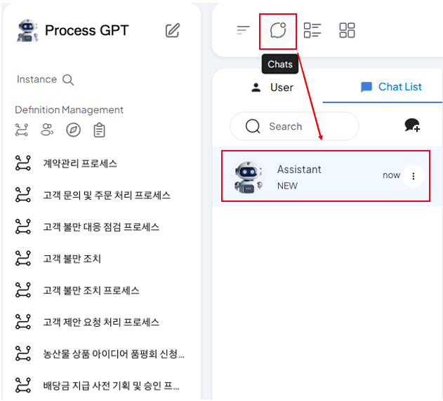
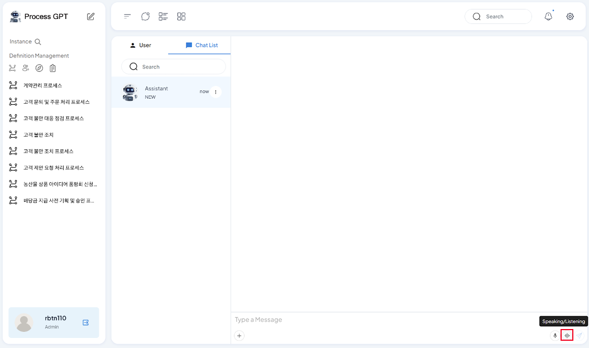
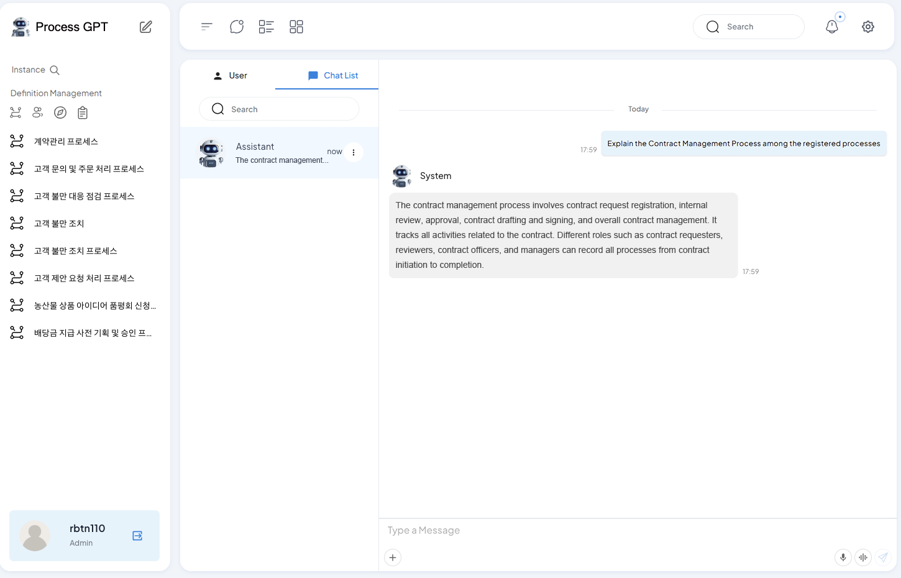

# Voice-based ProcessGPT

## Voice Chat-Based ProcessGPT

**Voice-based ProcessGPT** is a feature that provides a voice-based response to the user's request in real-time through a web socket interface with a shortened interface delay based on the information created in the tenant. 

Voice-based ProcessGPT can easily understand the complex process information accumulated by answering the user's request by identifying the process list and todo list registered in the tenant. 
Additionally, when the user requests the process and requirements in voice, it can create detailed task definitions and detailed contents based on it.

### Process List View

The method of checking the process list created by voice chat is as follows.

Click the chat icon at the top to enter the chat screen, and check if Assistant has been created. If it hasn't been created, check if the screen below appears by adding System as a participant through chat room creation. 
 

Click the 'speak/listen' icon at the bottom of the message input area to enter the voice chat screen. 
 

Click the microphone button and proceed with voice chat to ask about the process you want to check, such as 'explain the contract management process among the created processes'. 
 

After the conversation is complete, AI will provide voice answers to the information related to each task and form connected to the registered contract management process, and you can check the AI answer in the chat. 
 

### Process Planning

The method of planning the vacation application process using voice chat is as follows.

Click the 'speak/listen' icon at the bottom of the message input area to enter the voice chat screen. 
 
Click the microphone button and proceed with voice chat to ask about the process you want to plan, such as 'plan the vacation application process by planning the detailed tasks'. 

 
When requesting, the more specific requirements you add, the more detailed task planning is done, so request the requirements of the process you want to plan in detail.

After the conversation is complete, AI will provide voice answers to the information related to the detailed tasks and forms included in the vacation application process, and you can check the AI answer in the chat. 

Through this, you can improve the efficiency of your work and the quality of your process by quickly understanding the information created in the company and receiving detailed guidance on specific steps from AI in process planning.