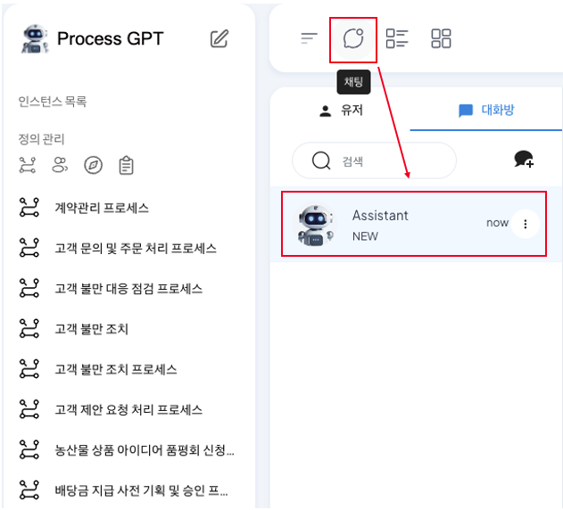

# Voice-based ProcessGPT

## Voice Chat-Based ProcessGPT

**Voice-based ProcessGPT** is a feature that provides a voice-based response to the user's request in real-time through a web socket interface with a shortened interface delay based on the information created in the tenant. 

Voice-based ProcessGPT can easily understand the complex process information accumulated by answering the user's request by identifying the process list and todo list registered in the tenant. 
Additionally, when the user requests the process and requirements in voice, it can create detailed task definitions and detailed contents based on it.

### Process List View

The method of checking the process list created by voice chat is as follows. 

Click the chat icon at the top to enter the chat screen, and check if Assistant has been created. If it hasn't been created, check if the screen below appears by adding System as a participant through chat room creation. 

 
 
 

Click the 'speak/listen' icon at the bottom of the message input area to enter the voice chat screen. 
 

Click the microphone button and proceed with voice chat to ask about the process you want to check, such as 'explain the contract management process among the created processes'. 
 

After the conversation is complete, AI will provide voice answers to the information related to each task and form connected to the registered contract management process, and you can check the AI answer in the chat. 
 

### Process Planning

The method of planning the vacation application process using voice chat is as follows.

Click the 'speak/listen' icon at the bottom of the message input area to enter the voice chat screen. 
 
Click the microphone button and proceed with voice chat to ask about the process you want to plan, such as 'plan the vacation application process by planning the detailed tasks'. 

 
When requesting, the more specific requirements you add, the more detailed task planning is done, so request the requirements of the process you want to plan in detail.

After the conversation is complete, AI will provide voice answers to the information related to the detailed tasks and forms included in the vacation application process, and you can check the AI answer in the chat. 

Through this, you can improve the efficiency of your work and the quality of your process by quickly understanding the information created in the company and receiving detailed guidance on specific steps from AI in process planning.

## 1. Use Case: Reading Conversation Context and Immediate ROI Analysis (Context Awareness)
The moment a question like "What's the ROI of this project?" or "Which is more advantageous, Plan A or Plan B?" comes up in a meeting, AI is not just a bystander. The following is the process where AI participates in the chat room, reads the context, and performs calculations on its own.

### 1.1 Agent Invitation and Listening
The user invites a specialized AI agent such as **'ROI Calculation Assistant'** to the business chat room with colleagues. The agent does not directly intervene in the conversation, but loads the incoming information (costs, conditions, etc.) into memory in real-time.

- Inviting **'ROI Calculation Assistant'** to the business chat room and starting to share conversation context
 
 
 

### 1.2 Context Understanding and Autonomous Intervention (Triggering)
During the conversation, the quote conditions of Company A and Company B are exchanged as text. The user does not need to separately tell the AI "Calculate" and re-enter the data. The moment a natural language question like "Which one is better if we use it for 3 years?" comes up, AI has already understood the context of the previous conversation (Company A/B conditions) and immediately starts calculating.

- Even when the user only asks a question without entering data, AI prepares to intervene immediately based on the previous conversation content
 
 
 

### 1.3 Immediate Calculation Result Presentation (Answer)
AI immediately performs calculations in the background and displays the calculated figures (total cost comparison) and the basis for judgment on the screen. It supports decision-making by including not only simple calculations but also qualitative context such as "Company B's features are superior."

- Comparative analysis results derived immediately from the conversation flow without separate search or calculation execution
 
 
 

## 2. Zero-Touch Execution: Process Completed by Voice
Even in situations where you cannot see the screen, such as while driving or on the move, ProcessGPT's intelligent orchestration does not stop. Beyond simple information provision, it provides an innovative experience at the execution level.

- User Command: "A company contract, review the risk and approve it"
- AI's Zero-Touch Processing: AI analyzes the user's single voice command and completes the following complex process without human touch.

**[Process Flow]**

**1. Voice Analysis:** Extract keywords "A company contract", "risk review", "approval"

**2. Report Generation:** Automatically generate risk analysis report for the contract

**3. Regulation Comparison:** Check for violations by comparing with internal regulations (PDF)

**4. Approval Submission:** Complete final approval processing through the approval line

Even in situations where you cannot touch the screen, work is processed in real-time without interruption.

