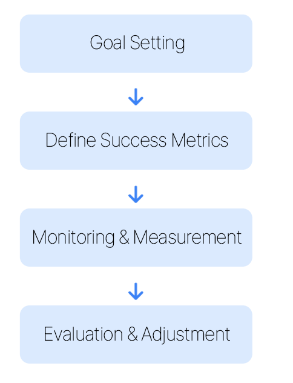

# 6. Goal Setting and Monitoring

## Definition
A pattern that sets clear and measurable goals for agents and enables them to periodically evaluate and track their own goal achievement status.  
This serves as the foundation for autonomous behavior and self-improvement.

## Key Features
| Feature | Description |
| :--- | :--- |
| **Clear Goal Definition** | Setting goals based on SMART criteria (Specific, Measurable, Achievable, Relevant, Time-bound) |
| **Measurable Success Criteria** | Clearly defining quantitative/qualitative evaluation criteria |
| **Progress Tracking** | Periodically monitoring goal achievement status |
| **Adaptive Goal Adjustment** | Adjusting goals and methodologies based on feedback and results |

## Goal Monitoring Cycle

## Use Cases
- OKR and KPI Tracking System  
- Automated Goal Management Agent  
- Performance Evaluation and Optimization System  
- AI Agent Self-Evaluation System  

---

## Implementation Cases

### Customer Support Automation
The agent's goal is **“to resolve customer fee inquiries”**  
Monitor the conversation, check database items, and adjust fees using tools.  
Success is monitored by checking for fee changes and receiving positive customer feedback.  
If the problem is not resolved, escalate to the supervisor.

### Personalized Learning System
The learning agent's goal is **“to improve students' understanding of algebra”**  
Monitor the progress of students on practice problems, adjust learning materials, track performance indicators such as accuracy and completion time, and modify the approach if the learner is struggling.
Track performance indicators such as accuracy and completion time, and modify the approach if the learner is struggling.

### Project Management Assistant
The agent is responsible for **“ensuring project milestone X is completed by the date”**  
Monitor the status of work, team communication, and resource availability, and notify the supervisor if the goal is at risk, and propose corrective actions.

### Automated Trading Bot
The trading agent's goal is **“to maximize portfolio returns within the risk tolerance range”**  
Monitor market data, current portfolio value, risk indicators, and adjust the strategy when the condition matches the goal and the risk threshold is violated.
When the condition matches the goal and the risk threshold is violated, execute the trade and adjust the strategy.

### Robotics and Autonomous Driving Car
The main goal of the autonomous driving car is **“to safely transport the vehicle from A to B”**  
Monitor the environment (other vehicles, pedestrians, traffic signals, road signals, speed, fuel, planned route, etc.), and adjust the driving behavior to efficiently achieve the goal.

### Content Moderation
The agent's goal is **“to identify and remove inappropriate content from platform X”**  
Monitor the incoming content, track indicators such as offensive speech, typos/missing letters, and adjust the filtering criteria or escalate cases to the review team.

---

