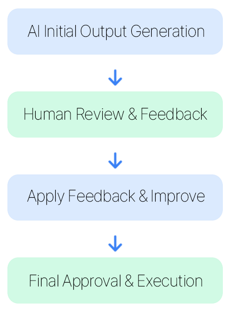
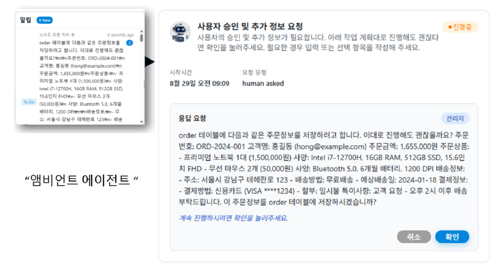

# 11. Human-in-the-Loop

## Definition
A pattern that incorporates human evaluation and feedback at decision-making, verification, and approval stages to ensure reliability and quality.  
Combines the strengths of AI and humans to create a hybrid workflow.

## Key Features
| Feature | Description |
| :--- | :--- |
| **Human-AI Collaboration** | Efficient task distribution by leveraging each other's strengths |
| **Quality Assurance** | Human review and approval of critical decisions or outputs |
| **Continuous Feedback** | System improvement through human feedback |
| **Accountability Enhancement** | Clearly defined ethical and legal responsibilities |

## Working Principle

## Use Cases
- Content Review and Approval Workflow  
- AI Application in Regulated Industries (Medicine, Finance, Law)  
- Complex Decision Support System  
- AI-Human Collaboration in Creative Projects  

## Implementation Cases
For tasks where autonomous execution lacks authority or confidence (e.g. security violations, expense-related), pause and ask for human intervention.

