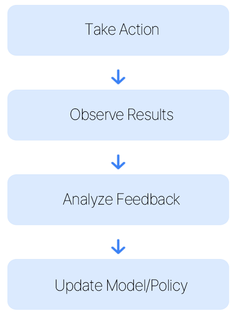
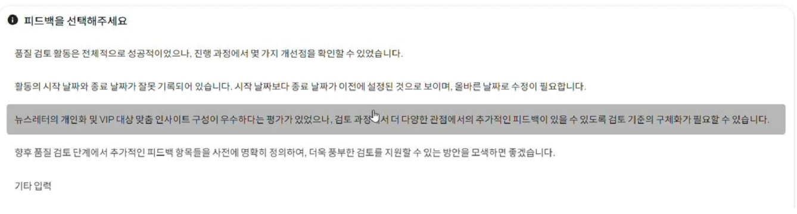
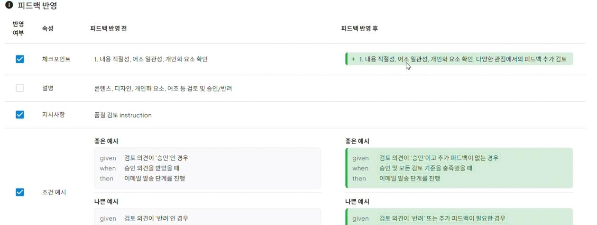

# 10. Learning and Adaptation

## Definition
A pattern that improves and optimizes its own policies and behaviors through failure/success experiences.  
Utilizes feedback loops and reinforcement learning-based structures to make more effective decisions over time.

## Key Features
| Feature | Description |
| :--- | :--- |
| **Continuous Feedback Collection** | Continuously collecting user responses and result data |
| **Model Update Mechanism** | Improve decision-making policies based on collected experience |
| **Behavior Optimization** | Learn from past successes/failures to develop more efficient approaches |
| **Environment Change Response** | Dynamically apply to new situations or requirements |

## Learning Cycle

## Use Cases
- Personalized Recommendation System  
- Automated Customer Service Optimization  
- Business Process Self-Improvement  
- Adaptive Content Creation Agent  

## Implementation Cases

