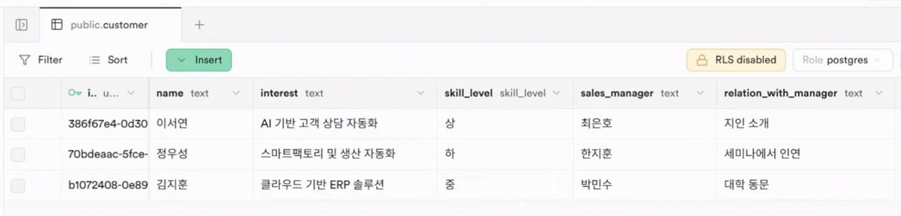

# 5. Model Context Protocol (MCP)  

## Definition
AI Agent can safely connect to external data sources or tools and access real-time information, standardizing a protocol.  
This enables secure communication between AI applications and external systems.

## Key Features
| Feature | Description |
| :--- | :--- |
| **Standardized Interface** | Provide a consistent way for integrating with various external systems |
| **Real-time Data Access** | Enable the use of up-to-date information beyond the limitations of static learning data |
| **Structured Tool Use** | AI understands and utilizes the functionality and usage of specific tools |
| **Security and Permission Management** | Secure data exchange and access permission control system |

## Working Principle

## Use Cases
- Real-time Data-based Decision-making  
- Internal Enterprise Data Access AI Solution  
- Personalized User Data Integration Service  
- Various Tool/API Integrated Agent Building  

# Tool Use & Model Context Protocol - Implementation Cases

## CRM (Supabase MCP) Extract Customer List

- Interpret the **MCP and Open API Spec** that can access internal/external systems to automatically generate how to connect to the process data values
- Automatically generate how to connect to the process data values
- Expose the Process GPT processes and agents as **A2A services**

## Example

## Implementation Cases

[Inventory Management through ERP Data Integration (link)](https://docs.process-gpt.io/tutorial/tutorial-lv4/#Execution)

