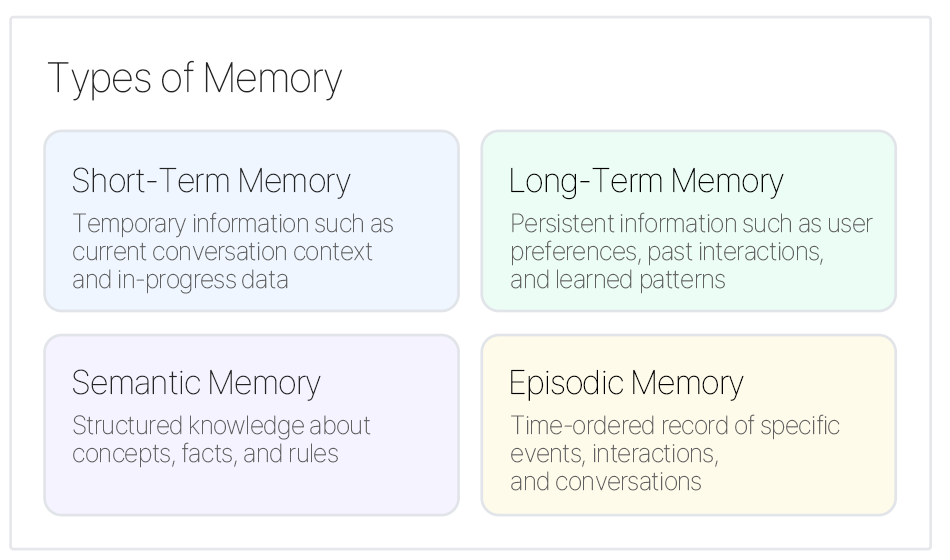

# 9. Memory Management

## Definition
A pattern that long-term remembers/manages context such as previous conversations, user information, etc.  
This is an essential technique for more personalized services and maintaining long-term conversation context.

## Key Features
| Feature | Description |
| :--- | :--- |
| **Long-term Memory Structure** | Manage immediate and long-term context separately |
| **Context Maintenance** | Maintain conversation and task context to provide consistent responses |
| **Priority-Based Storage** | Efficient memory usage by selectively storing important information |
| **Search Optimization** | Use vector storage to quickly find needed information |

## Memory Types

## Use Cases
- Long-term conversational personal assistant  
- Personalized recommendation system  
- Customer service agent  
- AI tutor for education  
- Context recognition support system  

