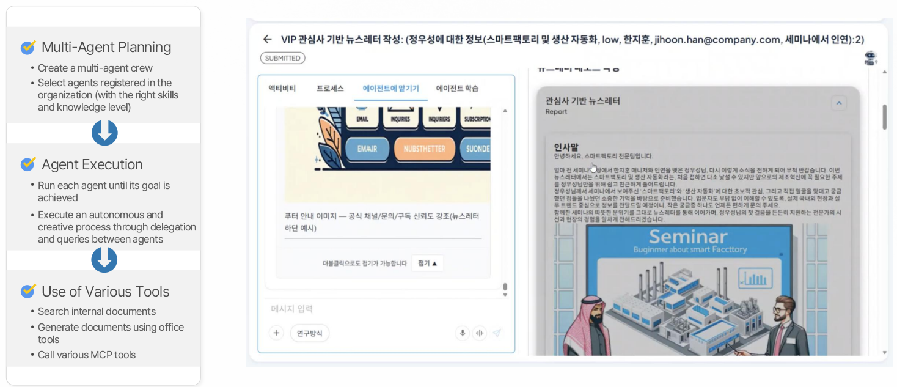

# 8. Multi Agent

## Definition
A pattern that multiple specialized AI agents collaborate to solve complex problems together.  
Each agent specializes in a specific role and collaborates with each other to handle difficult tasks that a single agent cannot handle.  

## Key Features
| Feature | Description |
| :--- | :--- |
| **Specialized Role Division** | Each agent specializes in a specific domain or function |
| **Interaction Protocol** | A clear protocol for information exchange and collaboration between agents |
| **Complex Task Decomposition** | Delegate large tasks between agents to increase efficiency |
| **Collaborative Knowledge Utilization** | Use diverse perspectives and specialized knowledge to produce better results |

## Use Cases
- Customer-specific content creation  
- Automated complex decision-making process  
- Multi-level business process execution  
- Collaborative problem solving and brainstorming  

## MCP-based Multi Agent Automatic Draft Creation

