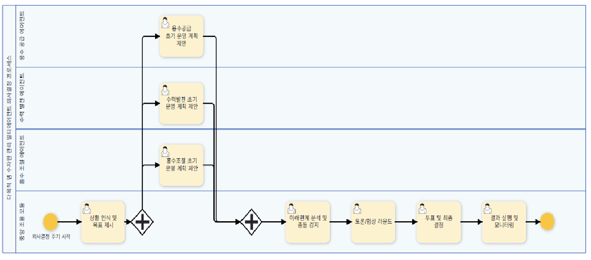

# 3. Parallelization

## Definition

A pattern that increases processing speed and efficiency by **executing multiple agents or tasks concurrently**.  
Process large workloads in a distributed manner and merge the results.

## Sequential vs Parallel Comparison

| Feature | Description |
| :--- | :--- |
| **Sequential** | Source A → Summary → Source B → Summary → Result |
| **Parallel** | Source A, B Search at the same time → Summary at the same time → Merge Result |

## Key Features

| Feature | Description |
| :--- | :--- |
| **Concurrent Execution** | Process independent tasks concurrently to shorten the total execution time. |
| **Task Allocation** | Divide large tasks into smaller units and assign them to multiple agents. |
| **Result Collection** | Collect individual results through scatter-gather method and synthesize them. |
| **Resource Optimization** | Optimize computing resources to maximize processing throughput. |

## Use Cases

* Large-scale data processing and analysis  
* Concurrent multiple query processing  
* Multi-agent collaborative system  
* Distributed web crawling  
* Customer-specific content parallel creation  

## Framework Support

* LangChain  
* LangGraph  
* Google ADK (ParallelAgent)  

## Process-GPT Parallel Processing Process

