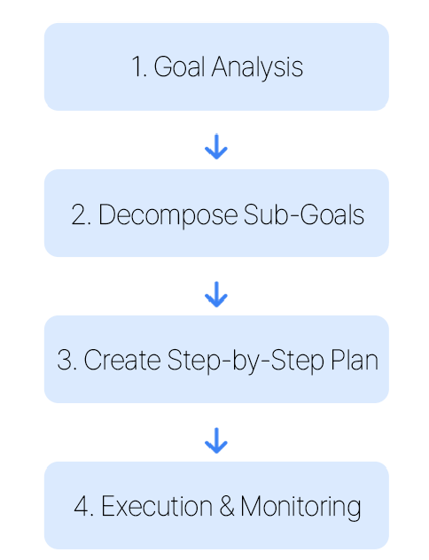
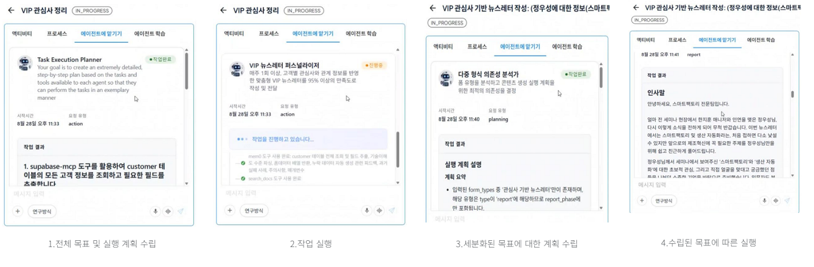

# 7. Planning

## Definition
A pattern that decomposes the final goal into multiple sub-goals (Planning), builds a step-by-step execution roadmap, and systematically solves problems.  
This serves as the foundation for agents to structure complex tasks.

## Key Features
| Feature | Description |
| :--- | :--- |
| **Goal Decomposition Ability** | Decompose complex goals into smaller sub-goals |
| **Plan before Execution** | Plan before execution instead of single-shot generation |
| **Adaptive Plan Adjustment** | Adjust plans based on feedback during execution |
| **Structured Approach** | Solve complex problems in a structured manner |

## Planning Process

## Use Cases
- Complex problem-solving agent  
- Automated project management  
- Software development planning  
- Strategic decision-making support system  

##Process GPT's CrewAI Deep Research
Through the planning phase, the agent decomposes the goal, plans the execution, and adjusts the plan, and collaborates systematically.

https://githubcom/uengine-oss/process-gpt-crewai-deep-research

