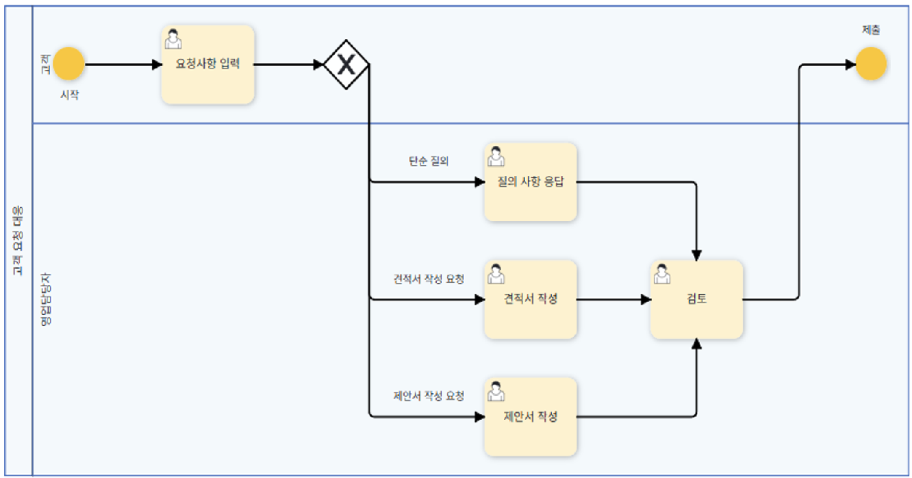

# 2. Intelligent Routing

## Definition

A pattern that branches and distributes work to the optimal path according to the request among various agents/tools.  
It plays a key role in multi-agent systems and orchestration. 

## Key Features

- **Intelligent Distribution** : Selection of the optimal agent/tool through input analysis
- **Conditional Logic** : Decision-making based on input type or content
- **Multi-stage Filtering** : Hierarchical routing structure for complex task classification
- **Efficiency Enhancement** : Optimally utilize the strengths of specialized agents/tools

## Framework Support
- **LangChain, LangGraph, Google ADK support routing.**

## Implementation Method

- **LLM-based Routing:** Category classification of natural language input (e.g. order lookup, technical support, etc.)  
- **Embedding-based Routing:** Matching to the appropriate path using semantic similarity  
- **Rule-based Routing:** Decision-making based on explicit rules/conditions  
- **Machine Learning-based Routing:** Specifying the optimal path based on a trained classifier  

## Routing Structure

## Simple Implementation Example

