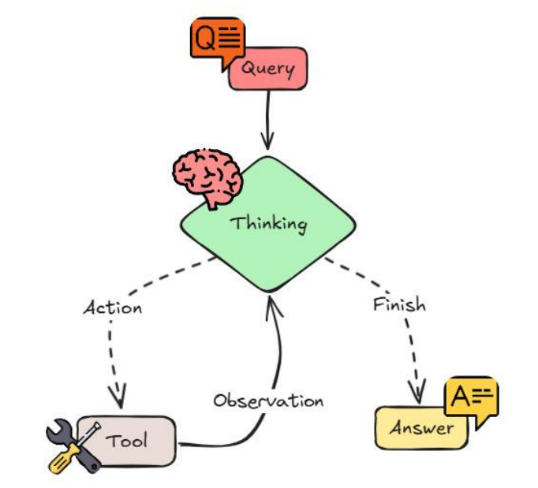

# 4. Tool Use

## Definition

Agent calls an **external API or function (tool)** to extend operations that cannot be done with language alone.  
It is an essential extension mechanism for agent capabilities through function calls and API use. 

## Key Features

| Feature | Description |
| :--- | :--- |
| **Tool Recognition** | Agent recognizes available tools and their functions. |
| **Optimal Tool Selection** | Determine and select the optimal tool for the task context. |
| **Parameter Configuration** | Ability to generate precise parameters needed for tool calls. |
| **Result Integration** | Integrate the results of external tool execution into the agent's reasoning process. |

## Use Cases

* Database query and search  
* Information collection through external API  
* Calculation-intensive task execution  
* File system manipulation and management  
* Multi-modal functionality (image creation/analysis)  

## ReAct Agent architecture
A goal-oriented architecture for tool calls.  
A chain that completes towards the goal.

