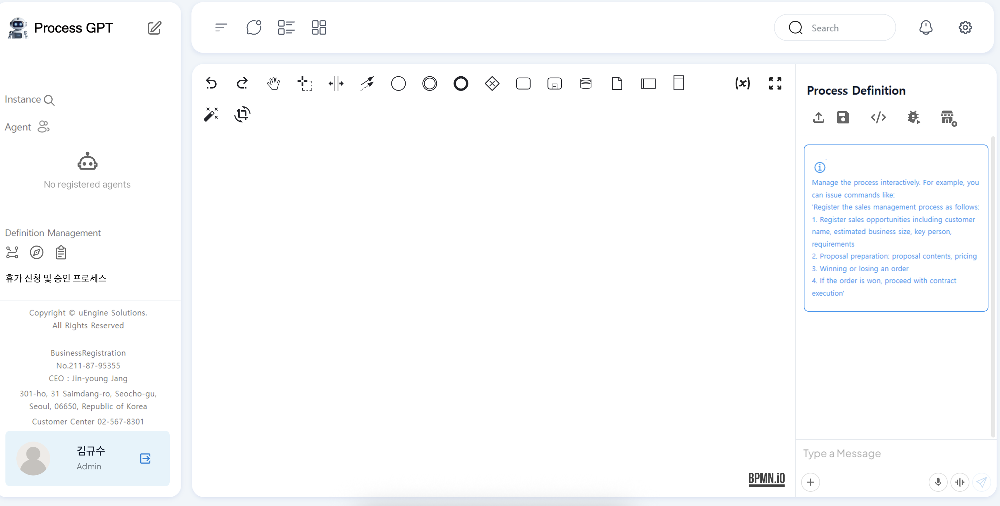
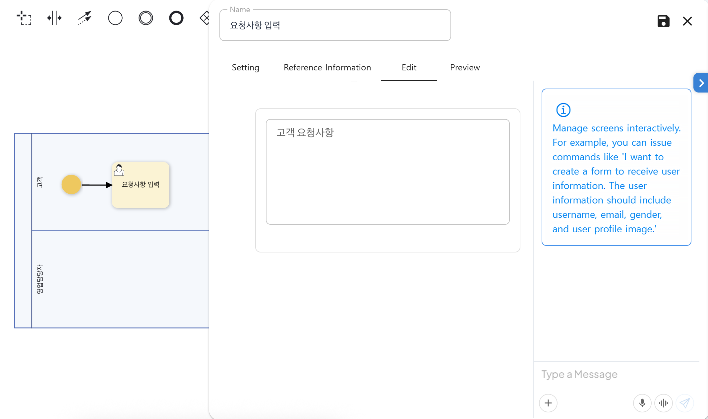
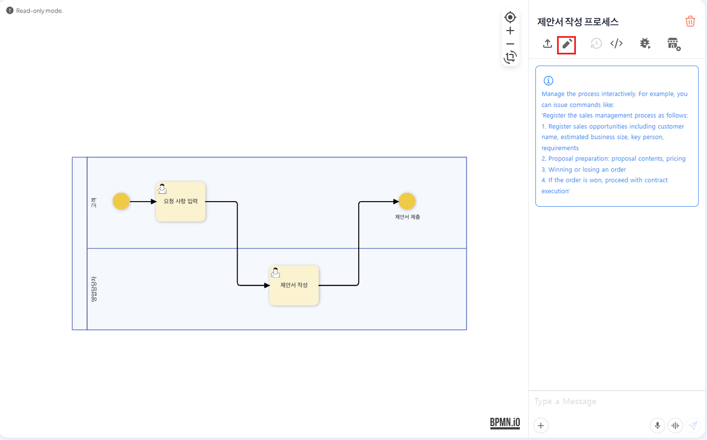
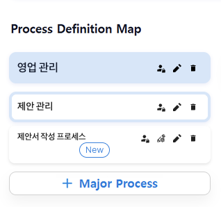
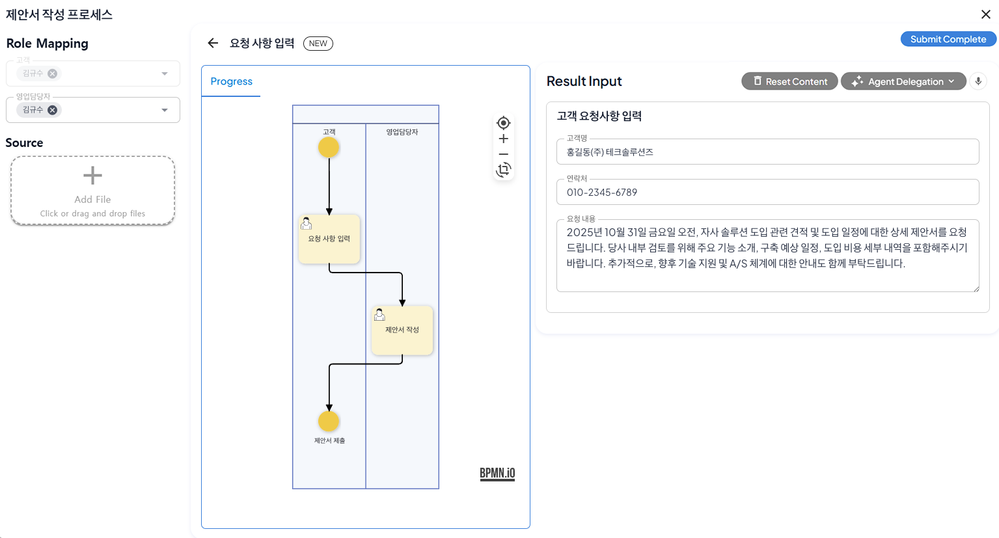
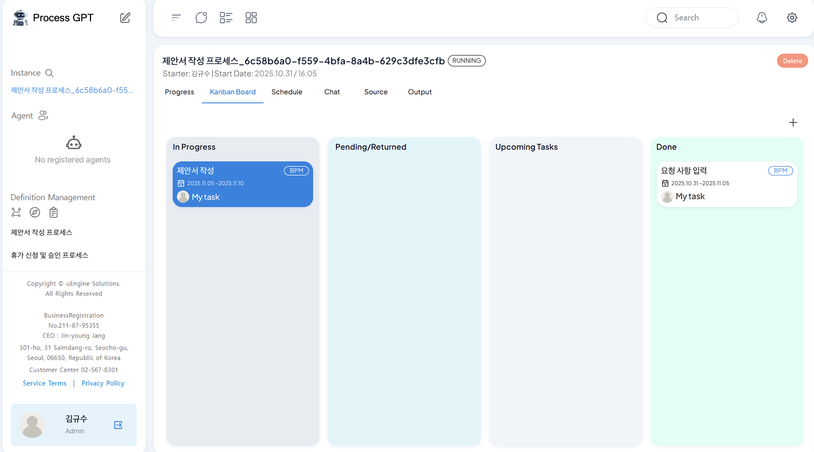
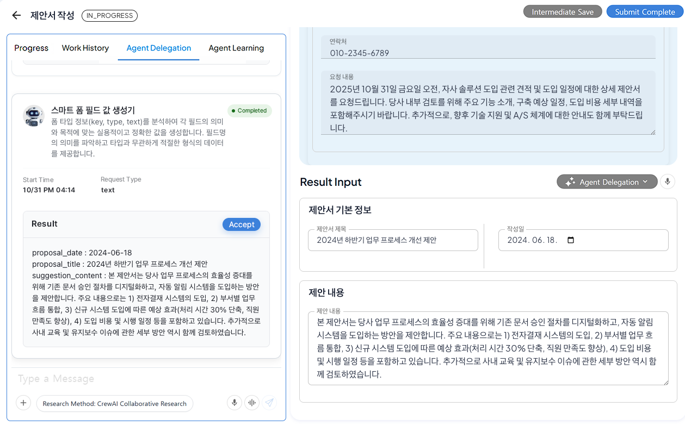

# Process Creation and Execution

## ProcessGPT Tutorial Lv.1 Followed by Sales Proposal Writing Process

This tutorial introduces **ProcessGPT usage** through the following sales proposal writing process.

Sales Proposal Writing Process: 
**Customer Request Input → Sales Representative Proposal Writing**

### Process Definition Screen Navigation

Clicking the "Definition Management" tab > "Process Definition" will navigate to the process definition screen, which supports the following features. 

1) The top of the process definition screen is equipped with a BPMN palette to allow users to manually draw processes. 
For detailed information on the BPMN palette, please refer to the reference materials.
[Process Definition Guide](https://bpm-intro.uengine.io/bpm6-started/)

2) The right side of the process definition screen allows users to create processes through AI based on their requirements.

### Process Definition
To define the sales proposal writing process, follow the steps below.

1. Create a process by dragging and dropping the "Full/Participant Creation (Horizontal)" icon from the palette, and click to define the lanes according to the number of roles needed for the process. 

    

    Example) Customer, Sales Representative

2. Place the start event on the customer lane in the palette, and then select the task icon displayed when the start event is placed to confirm that it is created on the same lane.  

3. Double-click the task to change it to 'Customer Request Input', and then move to the 'Form Editing' tab.  

    Form editing allows users to create forms based on the information to be input in the task, or to create forms automatically based on requirements by clicking the right arrow.  
    

    For detailed information on form creation, please refer to the reference materials. [Form Creation Guide](https://bpm-intro.uengine.io/bpm6-started/form-definition/) 

The final completed sales proposal writing process through 1~3 is as follows.

## Process Save and Edit

To save the completed process, click the save icon in the right area, and then enter the following information in the screen below.

After saving, it will change to 'Read Mode', and you can edit the process by clicking the pencil icon.

 

## Process Execution

To execute the created process, click the 'Process Definition Diagram' icon in the top left to navigate. 

Then, click the pencil icon to activate the edit mode for the definition diagram, and then register and save the process as shown below.

    Mega Process: 영업 관리(Sales Management)
    Major Process: 제안 관리(Proposal Management)
    Sub Process: 제안서 작성 프로세스(Proposal Writing Process)

By clicking the proposal writing process, you can view the defined process, and validate or execute the process through the simulation mode.

By clicking 'Execute', you can view the first step of the proposal writing process, and after assigning roles and entering results, you can click 'Submit Complete' to execute the process. 
At this time, role assignment can be made by a user who has joined ProcessGPT or a registered Agent.  

Result input can be manually entered or generated by AI through 'Delegate to Agent' to create appropriate input values for the process.

By clicking 'Submit Complete', the process will be executed, and the following results can be checked.  

1. Instance  
    When the process is executed, the executed process is registered in the instance, and detailed information can be checked by clicking.

2. Kanban Board  
    By clicking the 'Kanban Board' tab of the proposal writing process, you can check the status of work items registered in the process based on the Kanban board.
    For tasks in progress and expected tasks, the tasks corresponding to your lane are displayed.

After clicking the proposal writing step, it is created as shown below, and the information entered in the previous step can be checked.

By proceeding with 'Delegate to Agent', ProcessGPT automatically connects each step through AI to create a result with a connection based on the information received from the previous steps through **Prompt Chaining** and **Context Engineering** that automatically extracts the necessary information from each step and passes it to the next step.

