# Process Creation and Execution

## ProcessGPT Tutorial Lv.1 - Following a Sales Activity Process

This tutorial introduces the **ProcessGPT usage** through the sales proposal writing process. When a customer requests, the sales manager can easily prepare a proposal draft using the Quick Example Generation feature.
When a customer requests, the sales manager can easily prepare a proposal draft using the Quick Example Generation feature.

### Process Creation

Click the “Process Definition” tab on the left to directly draw a process.

1. Click the “Create Pool/Participant (Horizontal)” at the top.

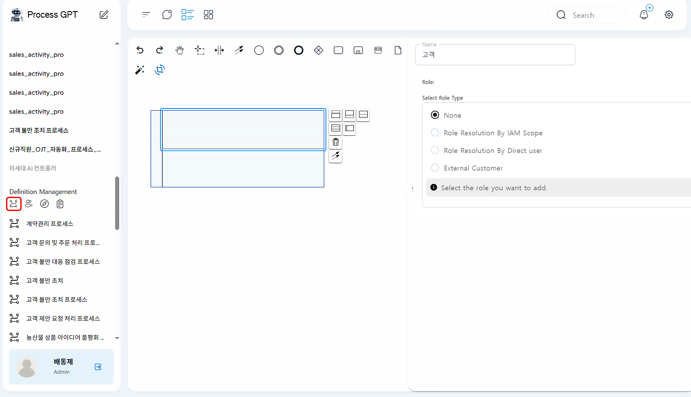

- After clicking the created pool, you can divide the lanes into the number of roles needed on the right icon. 
- After assigning roles to each lane, click the right save icon.
 

2. Click the start icon to set the process start.

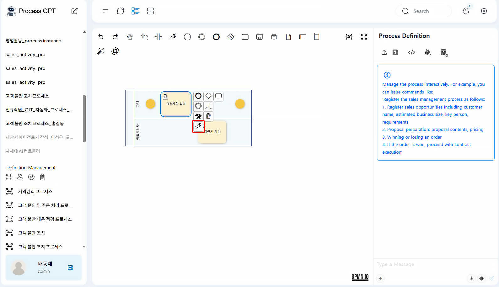

- Click the work item to place it in the corresponding lane. Click the placed work item to enter the name and characteristics of the work item.
- Click the work item to connect it to other elements. Click the “Connect to Other Elements” to specify the order between work items.
 

3. Add the end icon to complete the process and click the right save button to save the process.

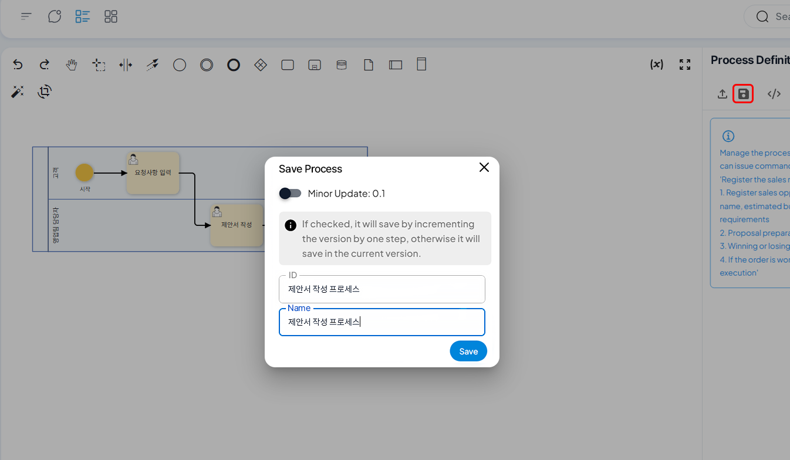

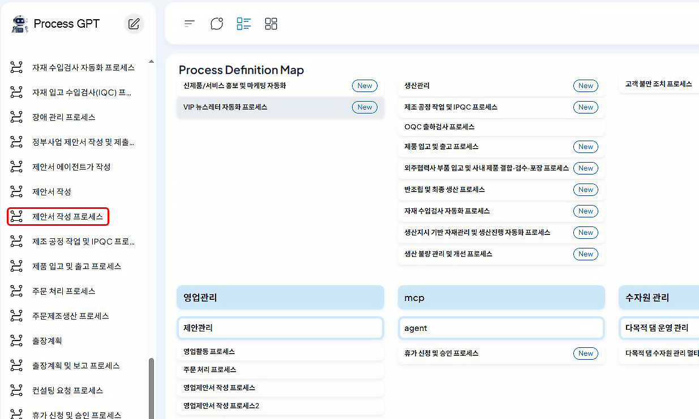

- The created process can be checked in the “Process Definition” tab on the left.
 

### Process Modification

1. Click the pencil icon on the right to modify the process.

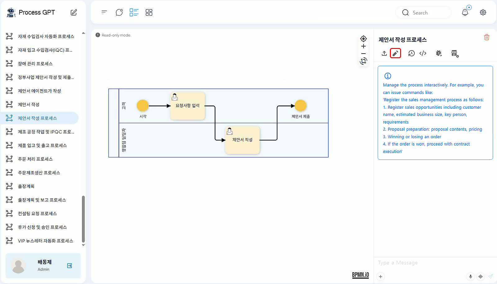
 

2. The form of the work item can be modified in natural language. After modifying, you need to click the save button at the top right to complete the save. Save the process after modification.

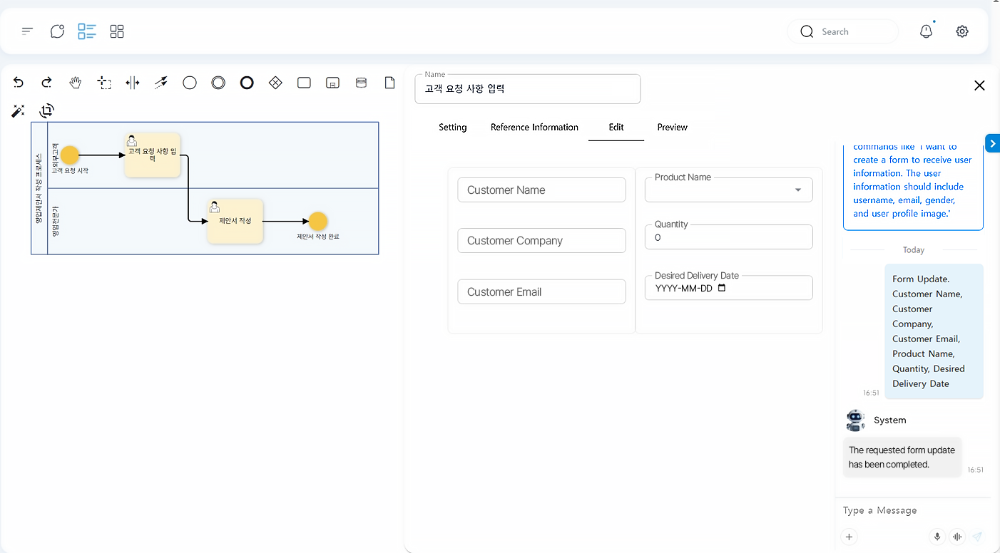
 

3. When modifying, you can manage the modified content through version management.

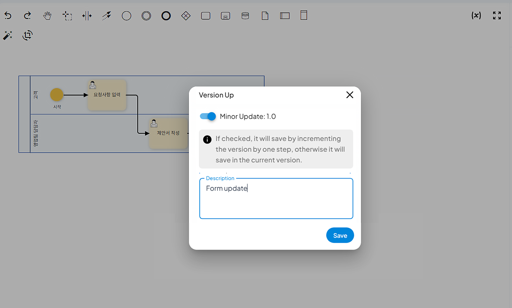
 

### Process Execution

1. Click the process you want to use in the process definition map.

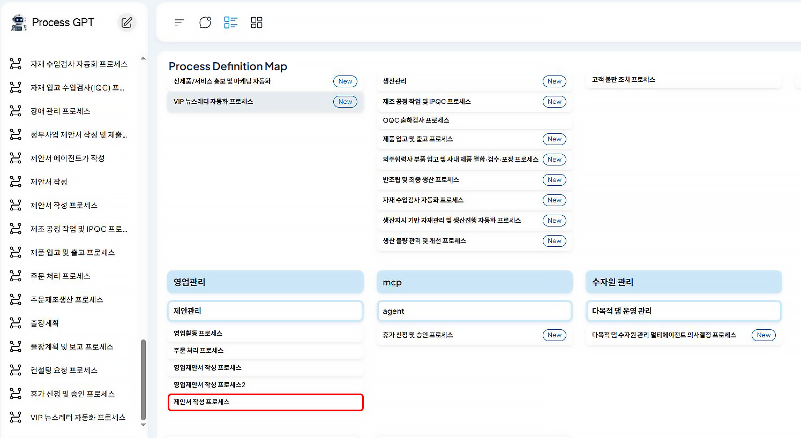
 

2. Click the execution on the right.

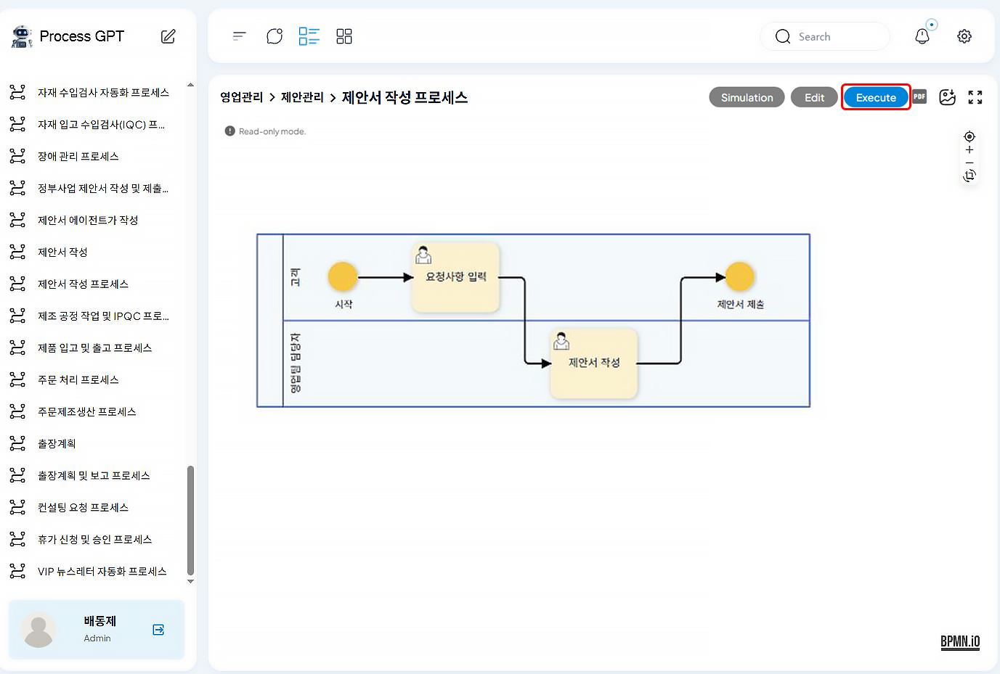
 

3. Specify the role on the left, enter the customer's request, and click the submit complete.

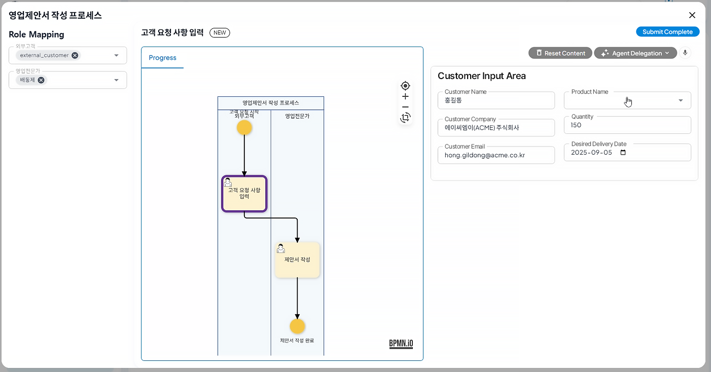
 

4. The process is executed. The running process can be checked in the left instance list.

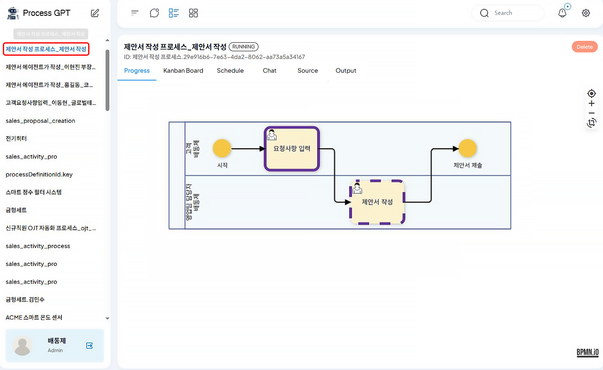
 

5. Click the kanban board to check the progress of the tasks assigned to the user.

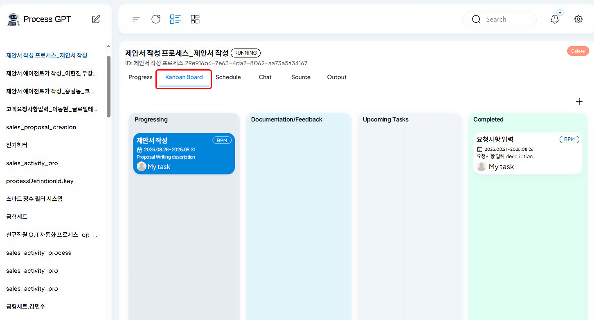
 

6. Click the quick example generation button to automatically write a draft by looking up the customer's order contents and past data using ChatGPT-based LLM. After checking the written content, click the submit complete at the top right.

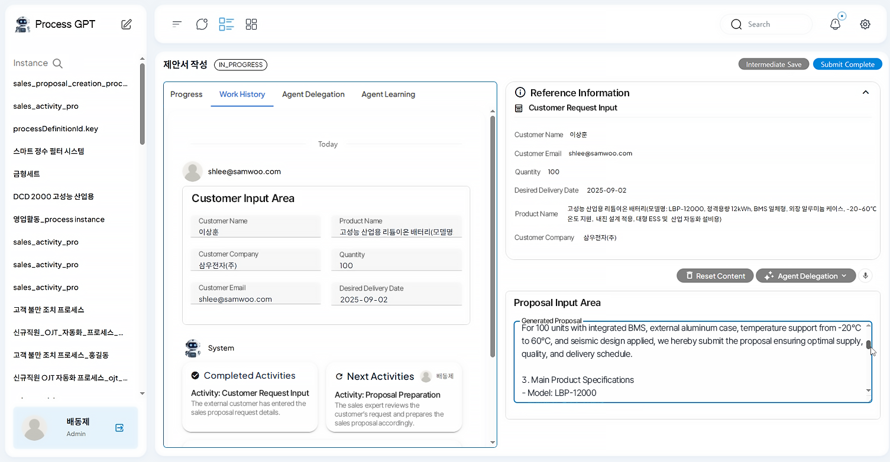
 

7. The kanban board shows that all tasks assigned to the user have been completed. When all tasks assigned to the users are completed, the process is also completed.

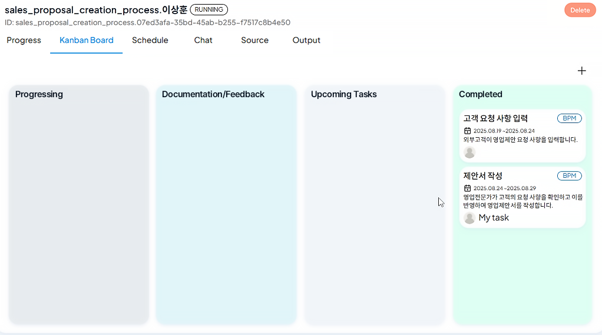

