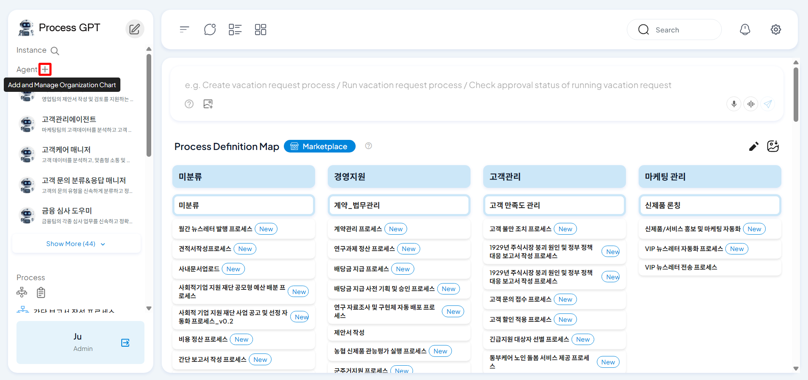
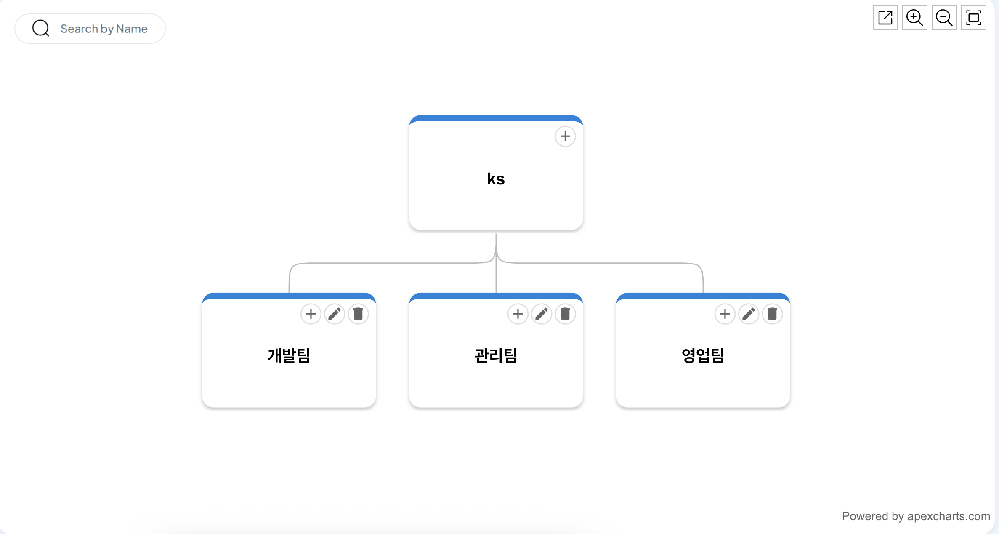
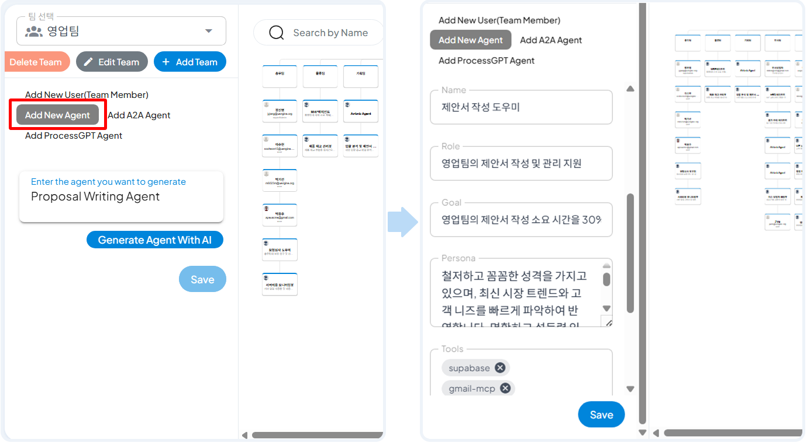
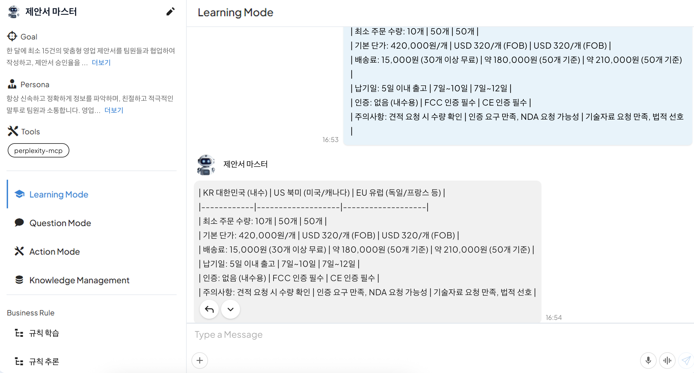
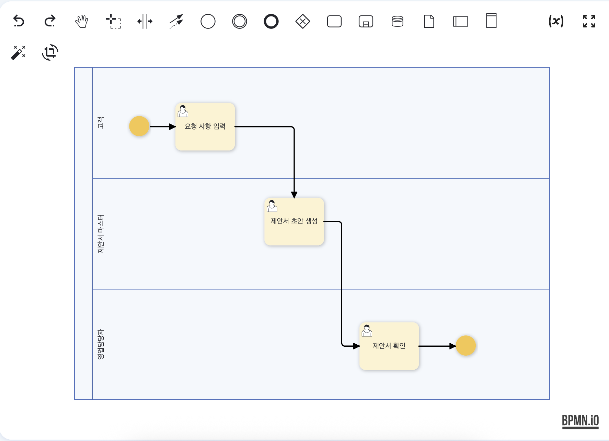
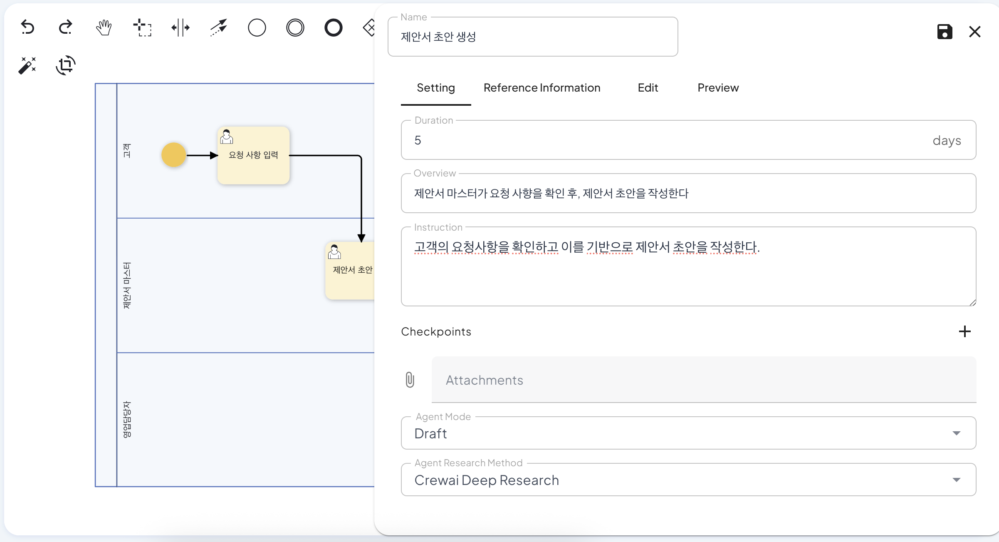
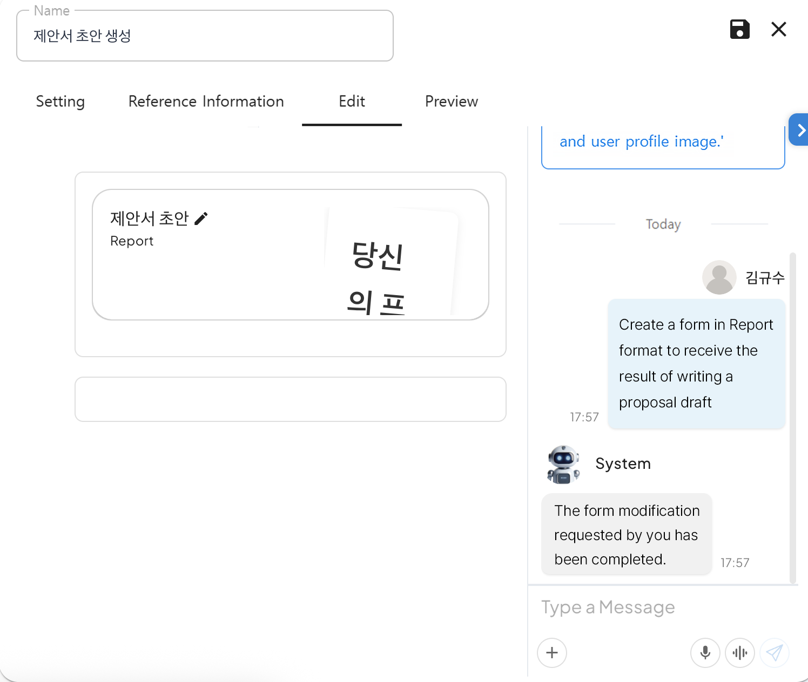
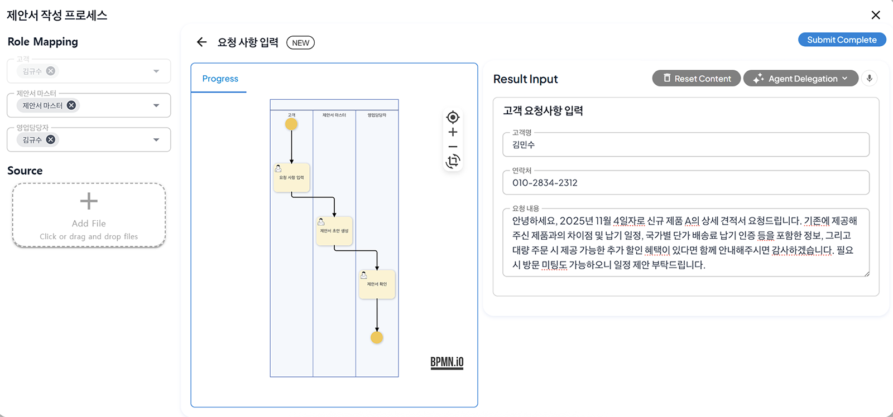
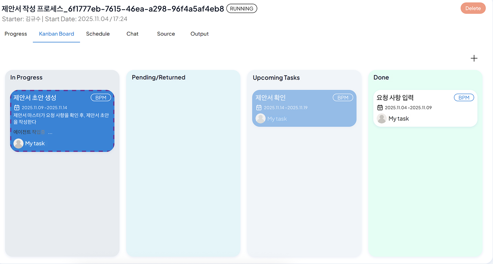
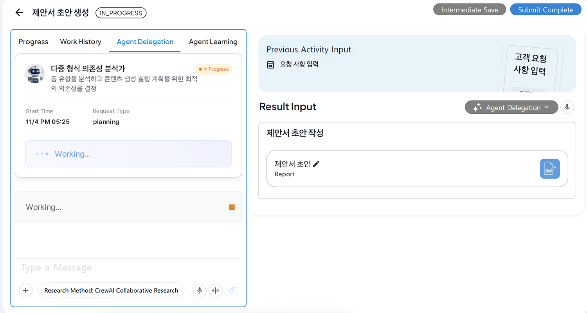

# Using AI Agents to Write a Sales Proposal

## ProcessGPT Tutorial Lv.2 Followed by Sales Proposal Writing Process

This tutorial introduces how to use AI agents to write a sales proposal through the following sales proposal writing process.

Sales Proposal Writing Process:<br>
**Customer Request Input → Proposal Draft Writing by AI Agent → Proposal Review**

### MCP Registration

Click the right-side top settings > MCP Server tab to navigate to the screen where MCP(Model Context Protocol) necessary during process execution can be registered.


<br>

Click **New MCP Server** to register Perplexity MCP by copying and pasting the following content.

```
{
    "mcpServers": {
        "perplexity": {
            "env": {
                "PERPLEXITY_MODEL": "sonar",
                "PERPLEXITY_API_KEY": "<YOUR_PERPLEXITY_API_KEY>" 
            },
            "args": [
                "perplexity-mcp"
            ],
            "command": "uvx",
            "enabled": true,
            "transport": "stdio"
        }
    }
}
```
<br>

### Agent Registration

1. Click the organization chart icon next to the agent.


<br>

To add a new sales team to the organization in the created organization chart, click the '+' at the top of the organization chart to add a sales team.



After that, click the '+' in the sales team > click the 'New Agent Add' tab > enter '**Proposal Writing Agent**' > click 'Create Agent by AI'.

Through this process, you can create a new agent related to the tasks used by the sales team.

By generating arbitrary information about the agent through AI, checking and modifying it, and clicking save, you can see that the organization chart is updated as shown below by adding the proposal master agent to the sales team.


<br>

### Agent Education

The method for creating a proposal with information learned through learning the internal business knowledge related to the created agent is as follows.

1. Click the registered proposal master agent, and then learn the internal knowledge necessary for writing a proposal in the learning mode chat window to the created proposal master agent.

After that, add the following content to the 'Message Input' area, and then enter Enter to send it to the agent to proceed with learning.
```
The following is the information necessary for writing a proposal, so please check it.

| KR 대한민국 (내수) | US 북미 (미국/캐나다) | EU 유럽 (독일/프랑스 등) |
|------------|-------------------|-------------------|
| 최소 주문 수량: 10개 | 50개 | 50개 |
| 기본 단가: 420,000원/개 | USD 320/개 (FOB) | USD 320/개 (FOB) |
| 배송료: 15,000원 (30개 이상 무료) | 약 180,000원 (50개 기준) | 약 210,000원 (50개 기준) |
| 납기일: 5일 이내 출고 | 7일~10일 | 7일~12일 |
| 인증: 없음 (내수용) | FCC 인증 필수 | CE 인증 필수 |
| 주의사항: 견적 요청 시 수량 확인 | 인증 요구 만족, NDA 요청 가능성 | 기술자료 요청 만족, 법적 선호 |
```
<br>

After learning is completed, the learned information is created as shown below, and a proposal draft can be created based on the learned information when writing a proposal.


<br>

### Process Creation and Form Editing

Create the sales proposal writing process as shown below.


<br>

To proceed with the settings for the proposal draft writing task, double-click to create a panel and then proceed with the settings.

The settings according to the agent are as shown below, and the mode and research method can be set according to the purpose and method of using the agent.


<br>

After the settings are completed, create a form to hold the proposal draft created by the agent in the form editing tab.

Copy and paste the following content into the right 'Message Input' area, and then enter Enter to create a form for the proposal draft.



```
Create a form in Report format to receive the result of writing a proposal draft
```

After the final form is created, save the process, and then execute the proposal writing process in the process definition diagram.


### Proposal Writing by Agent

When executing the proposal writing process, add the proposal master as shown below in the role assignment to specify that the proposal master will perform the task when writing the proposal draft.


<br>

After entering the request information, check the Kanban board to see that 'Agent Working' for proposal draft creation is displayed.


<br>

After clicking the work item, check the 'Delegate to Agent' tab to see the process of writing the proposal draft by the agent.



After writing is completed, the proposal draft created by the agent is displayed in the 'Result Input' area to check.

After submitting, check the proposal in the sales team, and then click 'Submit Complete' to complete the process.