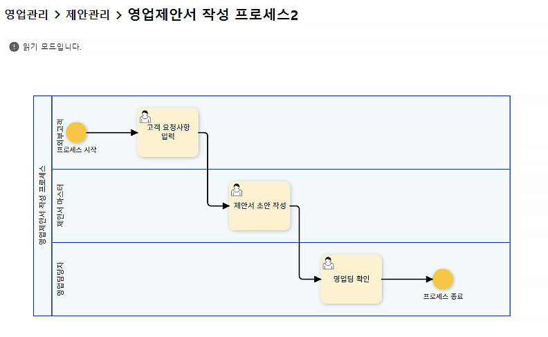
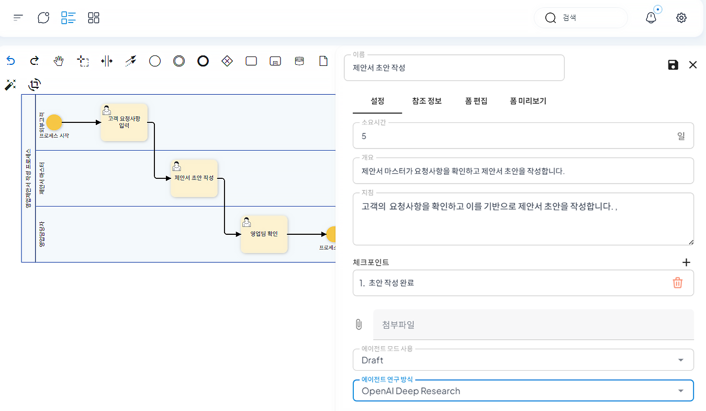
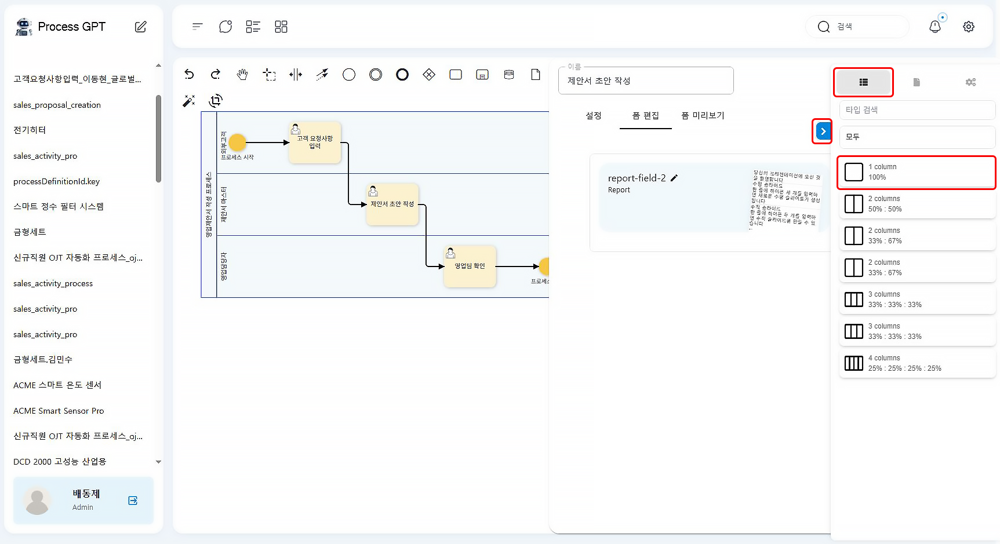
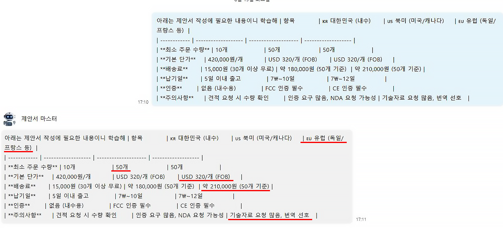

# Proposal Writing Using AI Agents

## ProcessGPT Tutorial Lv.2 - Following a Sales Activity Process

This tutorial guides you through the process of writing sales proposals using **AI agents**.
The customer's requirements are reviewed and the AI agent generates a proposal draft as a proposal master. The generated draft is then reviewed by human sales team members.

### Agent Registration

1. Click the organization chart icon in the definition management.

 

2. Register the sales team in the organization chart, and create a new AI agent specialized for proposal writing.

 

3. Describe the role, goal, and persona for the specialized agent registration for proposal writing, and grant the tools needed for proposal writing.

 

### Agent Training

1. Click the chat window at the top of the screen to activate the learning mode, and then train the created proposal master agent with the company knowledge needed for proposal writing.

 

### Process Creation and Form Modification

1. Create a process. The process uses the “proposal master” as the proposal writing agent.

 

2. Edit the form of the proposal draft writing work item. Select “Draft” for agent mode usage and “Crew ai Deep Research” for agent research method in the first setting tab, and then save.

 

3. Click the right blue box in the form editing tab to select 1 column layout and select the report form to contain the proposal. You can freely select the layout and configuration according to your purpose.

 

### Proposal Writing by Agent

1. When the customer requests, the process is executed and the agent writes a proposal draft. Click the “Assign to Agent” to have the set agent write the proposal draft.

 

2. You can see that the learned content is reflected in the proposal written by the agent.

 

3. When the written proposal draft is reviewed by the sales team members and then passed to the customer, the process is completed.

