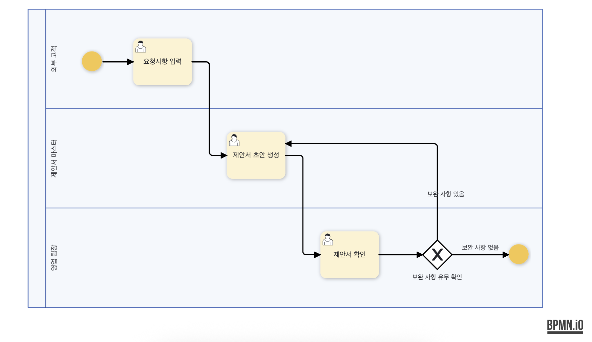
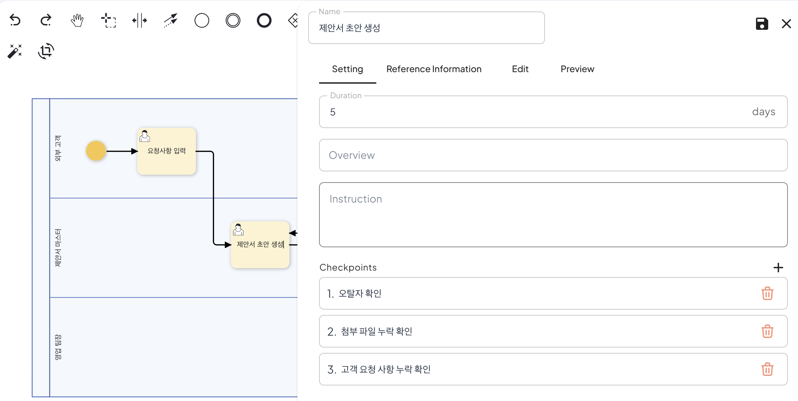
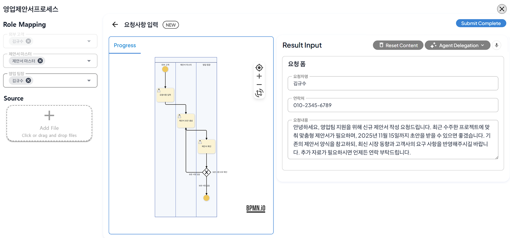
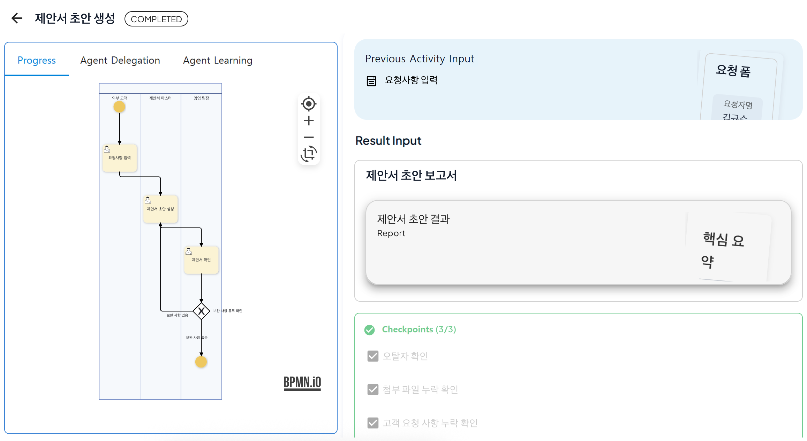
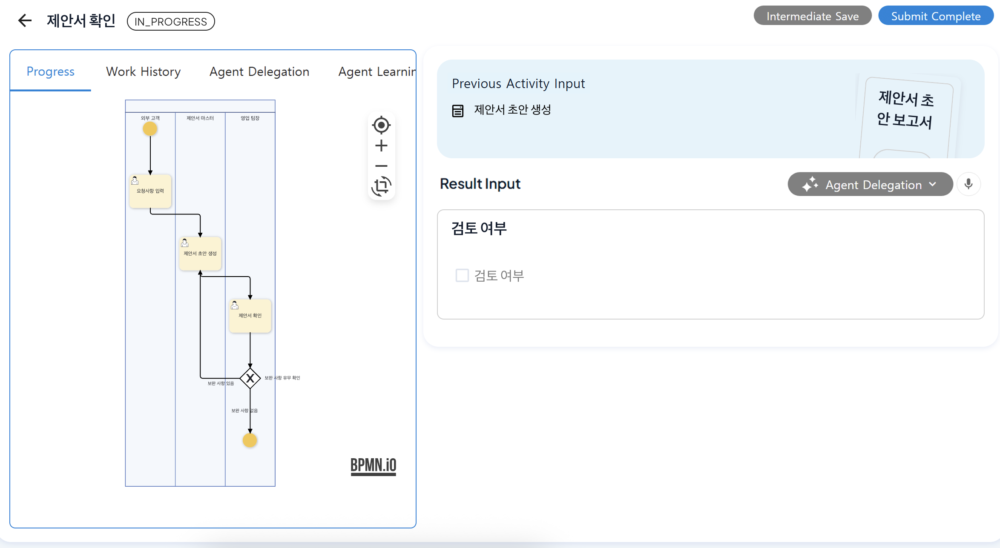
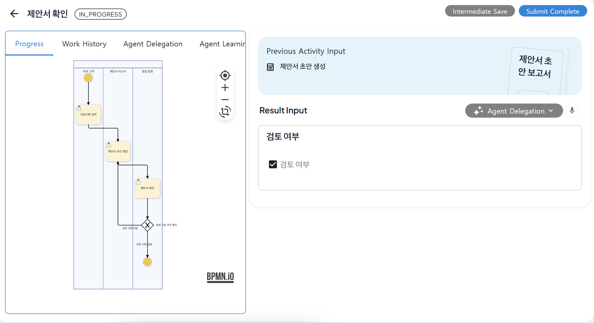

# Conditional Branching and Feedback Reflection

## ProcessGPT Tutorial Lv.3 Followed by Sales Proposal Writing Process

This tutorial introduces **conditional branching setup methods** through the following sales proposal review process.  

Sales Proposal Writing Process: 
**Customer Request Input → Proposal Draft Writing → Proposal Review** 

The review of typos, missing attachments, and customer request compliance during proposal writing is performed by the agent, and the review requiring strategic judgment is performed by the sales team manager.

### Process Modification

In this content, we will set up the conditional branching feature, which is a feature that allows the process to proceed along different paths depending on the compliance of specific conditions in the process, by adding a gateway to the existing sales proposal writing process. 

Place the gateway between the proposal review and process end, double-click the gateway, and enter **'Check for Supplement'.**   Then, connect the gateway to the process end and proposal draft writing, and proceed with the input of 'Supplement Required/Not Required' for each flow. 

After completing the conditional branching setup, set the checklist for the proposal draft writing. To check the compliance of typos, missing attachments, and customer request compliance during writing, double-click the proposal draft writing to create a panel, and then add it using the '+' in the checkpoint area as shown below. 

After saving the process, navigate to the definition diagram to execute the process. 

### Process Execution

After checking the proposal draft creation step, you can see that the checklist set previously is displayed in the checkpoint area in the lower right area. 

When it is determined that the checklist is compliant, if all the checklists are compliant, the process proceeds to the next step. 

After that, in the proposal review step, the sales team manager determines the review status, and if re-writing is needed, uncheck the review status as shown below, and proceed with submission to return to the 'Proposal Draft Creation' step and proceed with the process.

 

After the proposal draft is rewritten, the 'Proposal Review' step is repeated, and after checking the review status, if there are no supplements to be made, check the review status to end the process. 

 

Through this, you can proceed with process re-execution through conditional branching setup and feedback reflection through checklists. 