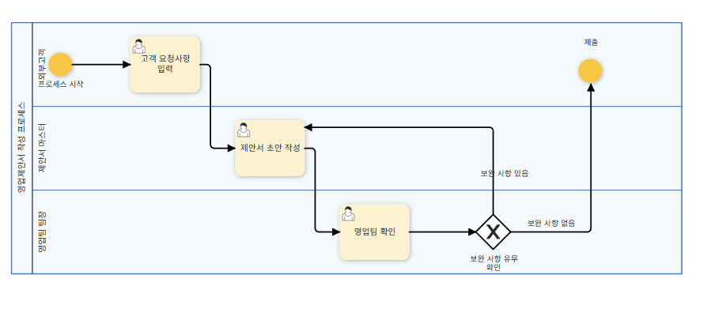
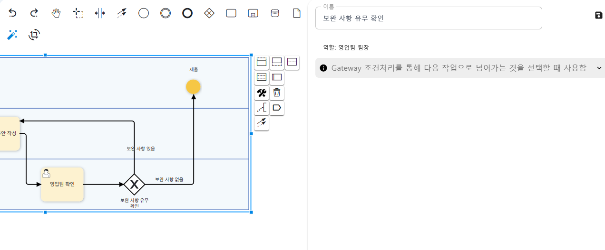
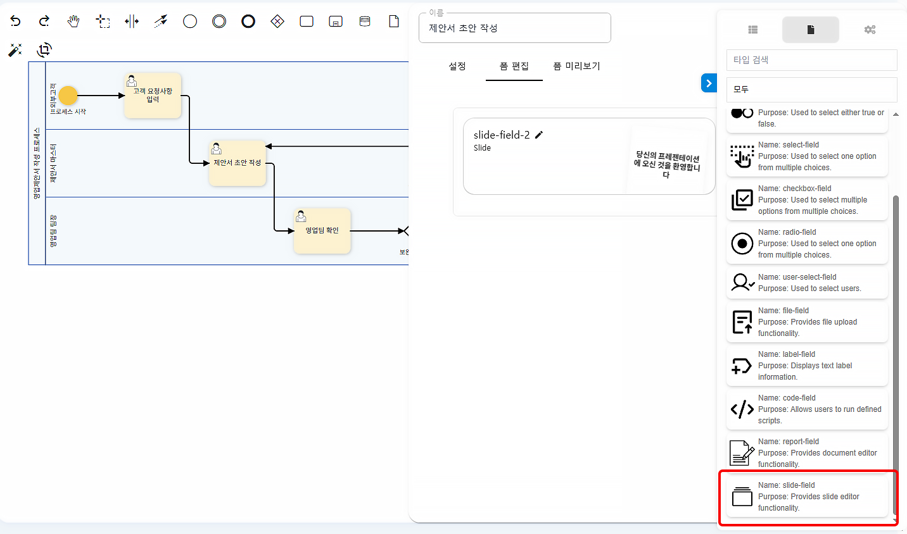
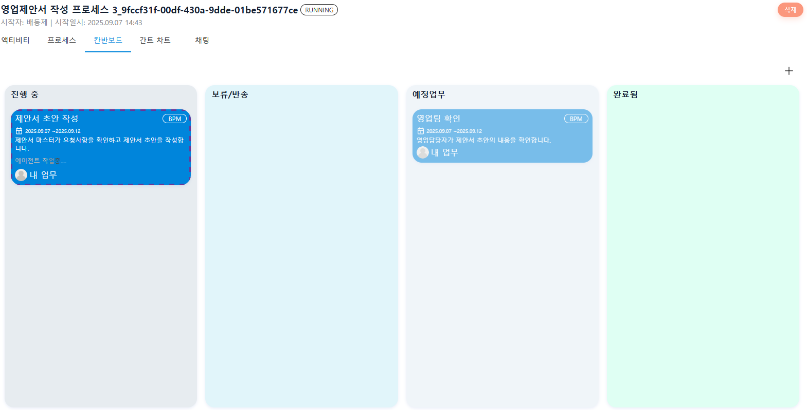
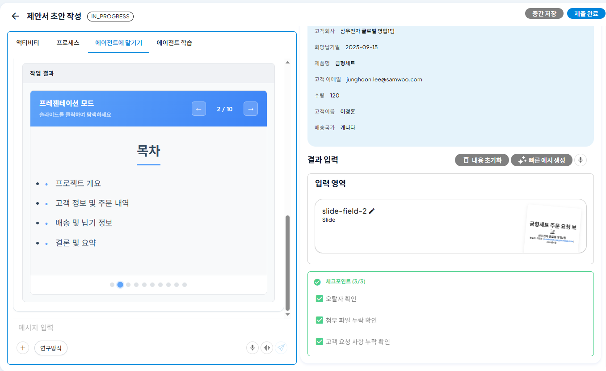
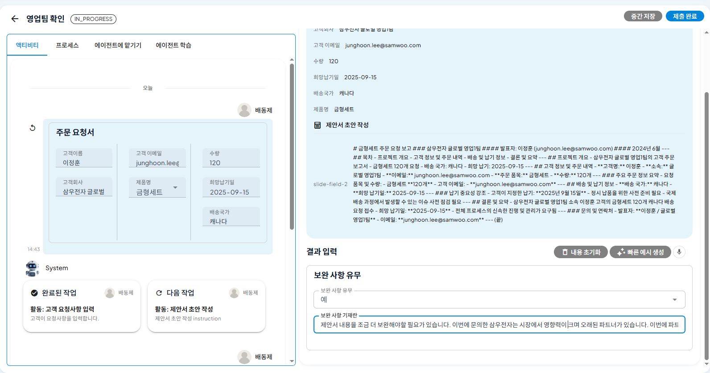

# Condition Branch Setting and Feedback Reflection

## ProcessGPT Tutorial Lv.3 Followed by Sales Activity Process

This tutorial guides you through the process of correcting and supplementing a sales proposal draft written by **AI agent** according to the feedback from the sales team manager. 
When writing a proposal, simple review such as typos, missing attachments, and customer request implementation is performed by the agent, and review requiring strategic judgment is performed by the sales team manager.

### Process Modification

In the left definition management, select the process created in Lv2 and click the right pencil icon to directly modify it.

1. Click 'Create Exclusive Gateway' on the top icon and add it to the process.

 

2. After adding, click the lane and enter a description like 'There are some supplements'. If the sales team manager reviews the draft and there are supplements, instruct the agent to rewrite, and if there are none, submit it to the customer.

### Form Modification

1. Set up a checkpoint in the proposal draft work item to allow the created agent to automatically perform simple repetitive review such as checking for typos, missing attachments, and missing customer requests.

 

2. You can write the proposal in a slide format.

 

### Execution

1. When you execute the process and enter the customer's request, the agent will start writing the proposal draft.

 

2. The proposal draft written by the agent can be checked in a slide format, and simple review such as typos, missing attachments, and missing customer requests is performed by the agent as set in the form.

 

### Feedback and Correction

1. The sales team manager instructs the agent to add content such as free shipping and one-year free A/S to the customer company.

 

2. The agent modifies the proposal slide to reflect the sales team manager's supplement.

 

3. The sales team manager reviews the supplemented proposal and, if there are no supplements, terminates the process by submitting the proposal to the customer.