# Inventory Management with ERP Data Integration

## ProcessGPT Tutorial Lv.4 Followed by Inventory Management Process

This tutorial introduces how to use AI agents to manage inventory through the following inventory management process.<br>
Using Supabase, you can integrate your data tables and have AI agents handle inventory receipt, shipment, and production request tasks.


### ERP Data Integration (Using Supabase)

#### 1. Creating Supabase Project and Table

Go to Settings > Data Sources tab to add the connection information.

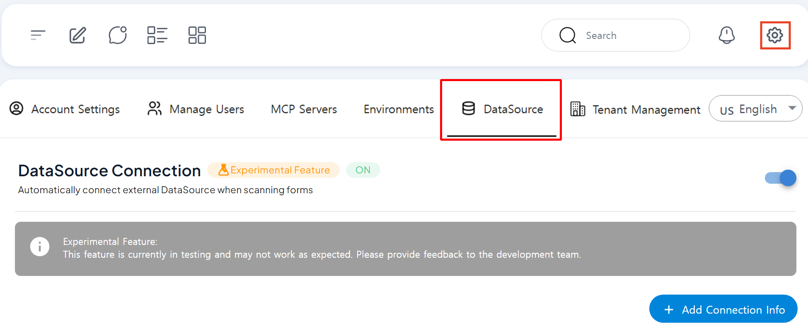

Then, you need to access Supabase to add connection information based on Supabase information. https://supabase.com/

After signing up, click 'Create organization' to create an organization by setting the Name. 


<br>

By entering Name, Region, and Password through 'New Projsct' of the created organization, you can see that the project is created as shown below.

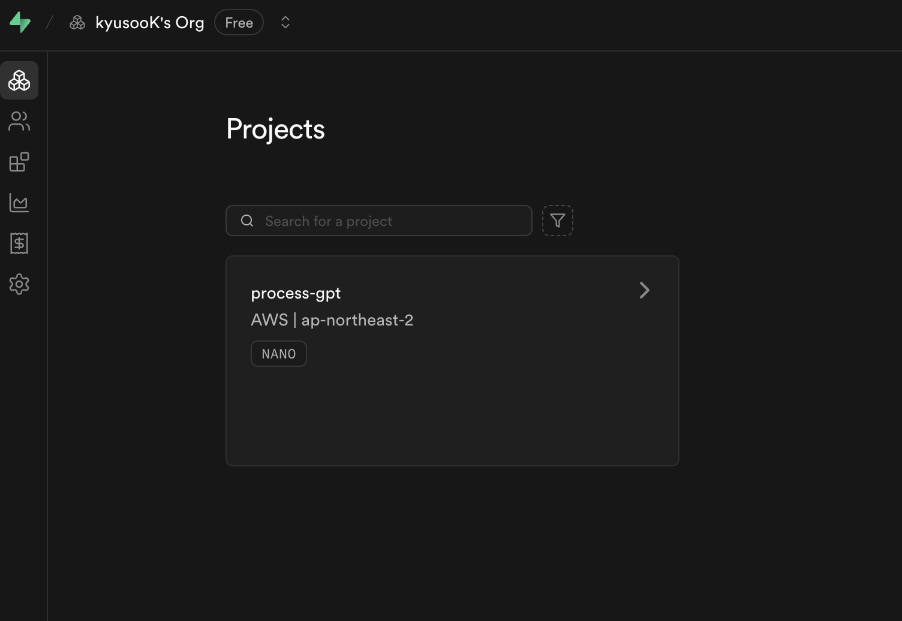
<br>

Click 'Table Editor' on the left side of the created project > 'New table' and create a Product Table based on the following contents.

| Name         | Type      |
|--------------|-----------|
| product_name   | text      |
| product_id     | text      |
| category       | text      |
| unit_price     | numeric   |
| unit           | text      |
| description    | text      |
| stock_quantity | numeric   |
| created_at   | timestamptz |

After registering the table, go to the left menu and click 'API Docs' > 'product_table' > and then click 'Bash' in the upper right. On the generated screen, copy the URL from the curl command (e.g., https://tjzssujilztwhzqbtgin.supabase.co/rest/) and add it to your connection information URL.

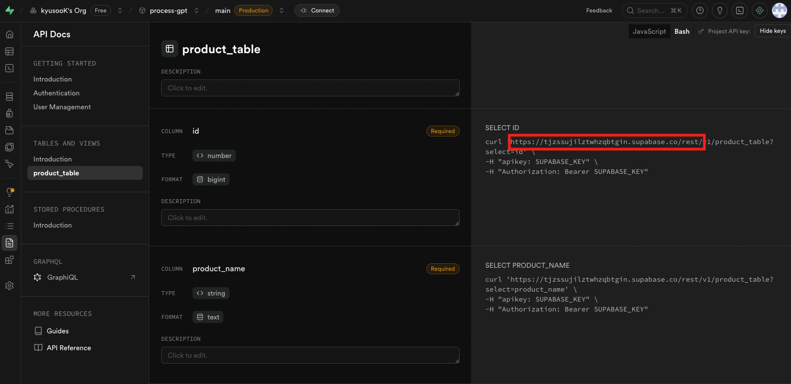

Then, copy the SUPABASE_ANON_KEY registered in Connect > App Frameworks and add it to the connection information Header Value.

The final completed connection information is as shown below, and all information is added and saved.

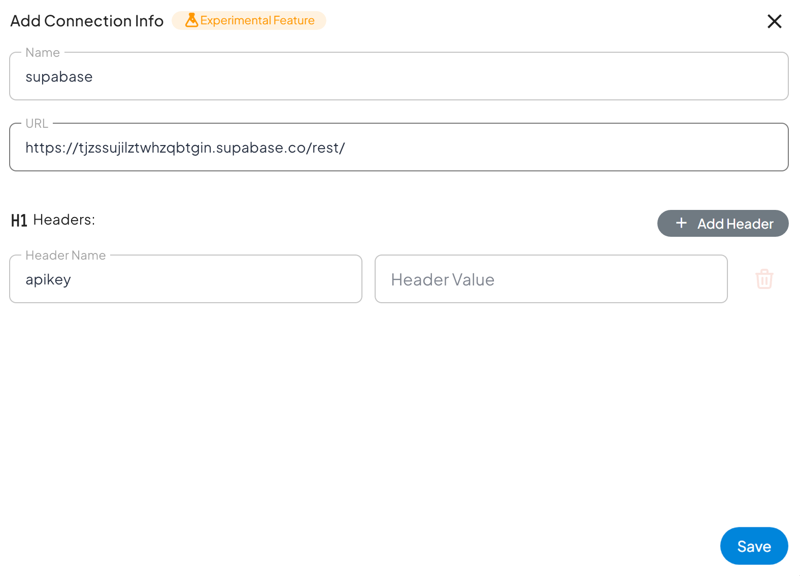
<br>

#### 2. RLS(Row Level Security) Policy Setting

When creating a table in Supabase, all external access is blocked by default for database security. This is a basic setting for database security, and you need to explicitly grant access rights through RLS (Row Level Security) policies to read or modify data.

In this tutorial, we will proceed with the following method to allow the MRP agent of ProcessGPT to read and write data through Supabase MCP.

Go to Supabase menu 'Authentication' > 'Policies'.


<br>

After clicking 'Create policy', create a policy as shown below to create a policy according to the purpose of the corresponding table.


<br>

In this screen, you can create policies for read, create, update, and delete operations for the Product table, select the purpose of the right 'Templates' area, modify the name of the corresponding policy in Policy Name, and save it to create a policy as shown below.

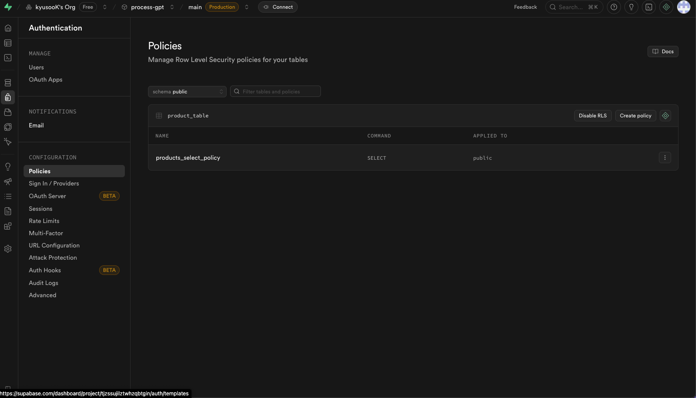
<br>

### Registering MRP Agent and Granting Tools for Inventory Management

To register the Supabase MCP to be used for the MRP agent, click 'New MCP Server' in Settings > MCP Servers > 'New MCP Server' and enter the following.<br>
At this time, Access_Token is issued by going to Supabase Profile > Account preferences > Access Tokens.
```
{
    "mcpServers": {
        "supabase": {
            "env": {
                "SUPABASE_ACCESS_TOKEN": ""
            },
            "args": [
                "-y",
                "@supabase/mcp-server-supabase@latest",
                "--project-ref",
                "vlkoplsvrpjldnpcelqb"
            ],
            "command": "npx",
            "enabled": true
        }
    }
}
```
<br>

After completing the MCP settings, register the logistics team in the organization chart.


<br>

After that, click '+' > 'New Agent' in the logistics team and enter the following to create an agent with AI.
```
The MRP (Material Requirement Planning) business of the logistics team is automated and supported.
```
<br>

After checking if the supabase MCP is registered in the tools of the created agent, add the MRP agent by saving.


<br>

### Creating and Modifying the Process and Form

1. Create the process as shown below. 


- If the inventory is sufficient, proceed with immediate shipment
- If the inventory is insufficient, request production and then ship the completed product
<br><br>

2. Modify the form of each task according to the purpose. Set the task and agent to be used, and proceed with the connection to Supabase as shown below.

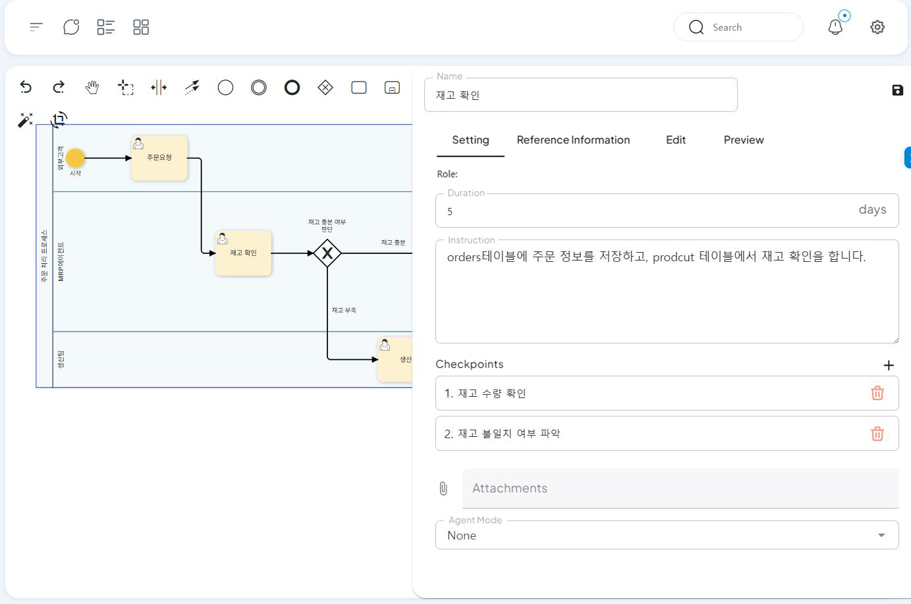

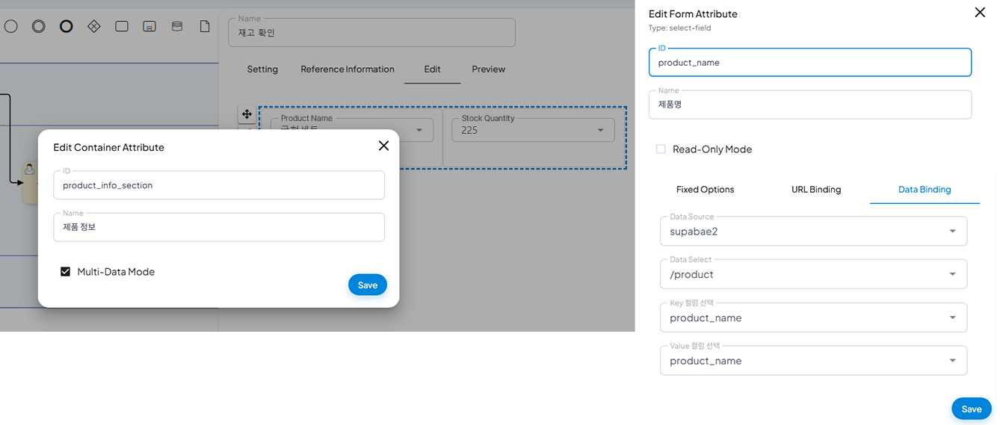
<br>

3. The form of the created process is linked to the actual ERP data, and the product name, unit price, and inventory of the process are connected to **product_name, unit_price, stock_ quantity** in Supabase.

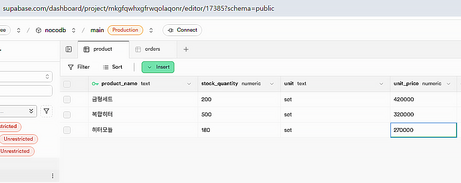
<br>

### Execution

1. When you run the process and enter the customer's request, the agent will start checking the inventory.


<br>

2. The agent will check if the inventory of the heater module ordered by the customer is greater than the order quantity of 70, and then proceed with immediate shipment.

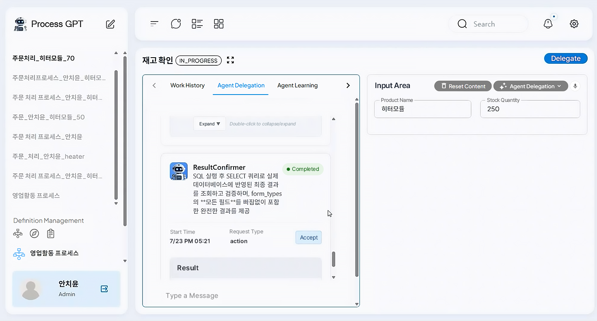


<br>

3. The agent can check the remaining inventory quantity also through the ERP data linked through Supabase mcp after shipment.


<br>

4. If the inventory quantity is less than the customer's order quantity, request production of 100 sets of molds to replenish the inventory.

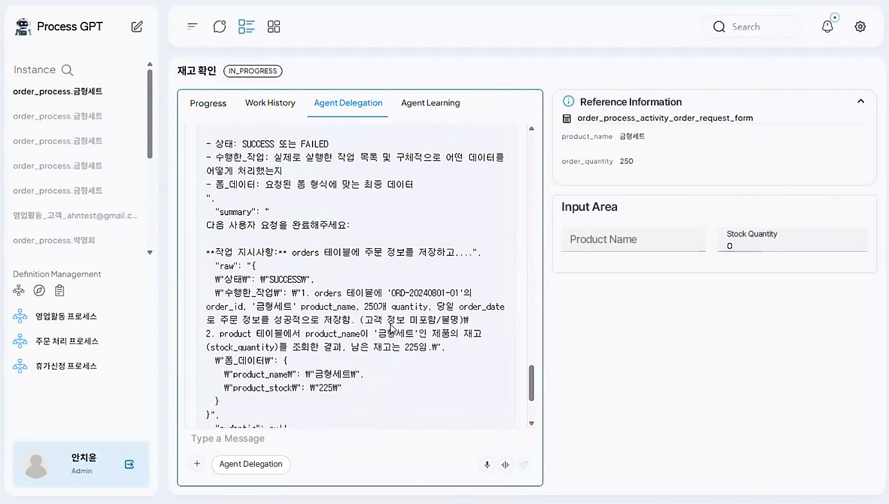


<br>

5. After production is completed, the agent will process the receipt, and the quantity will also be reflected in the ERP data.

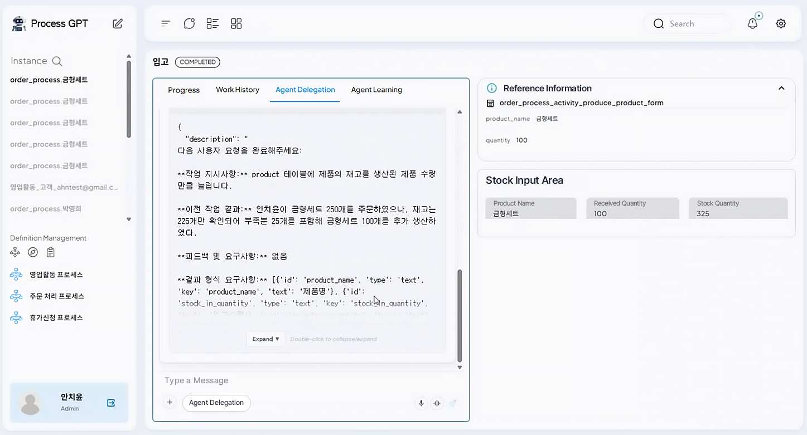

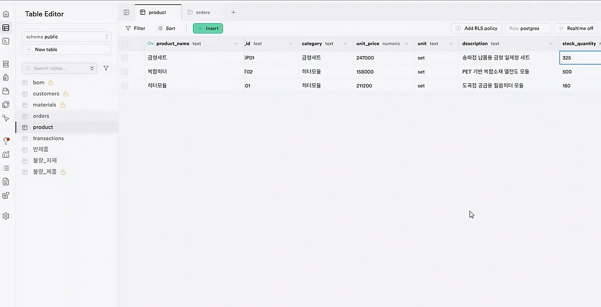
<br>

6. After the inventory is sufficient, proceed with shipment, and the remaining inventory quantity can also be checked in the ERP.


<br>

7. When shipment is completed, the process ends.