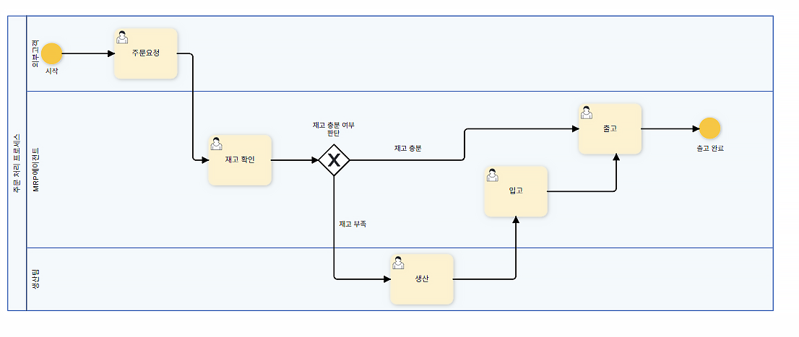
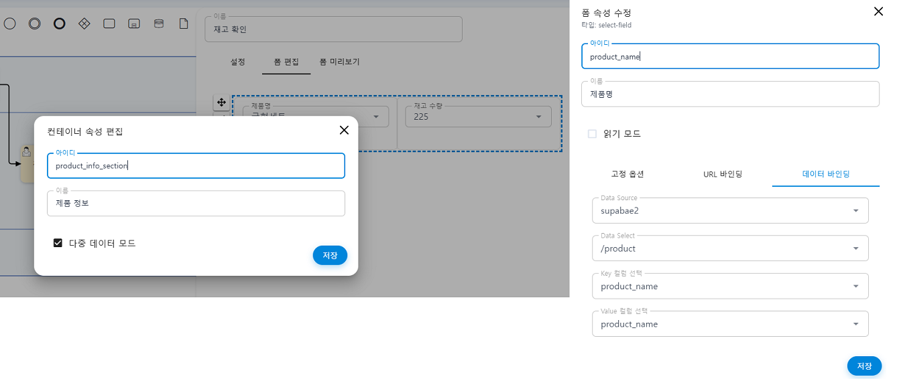
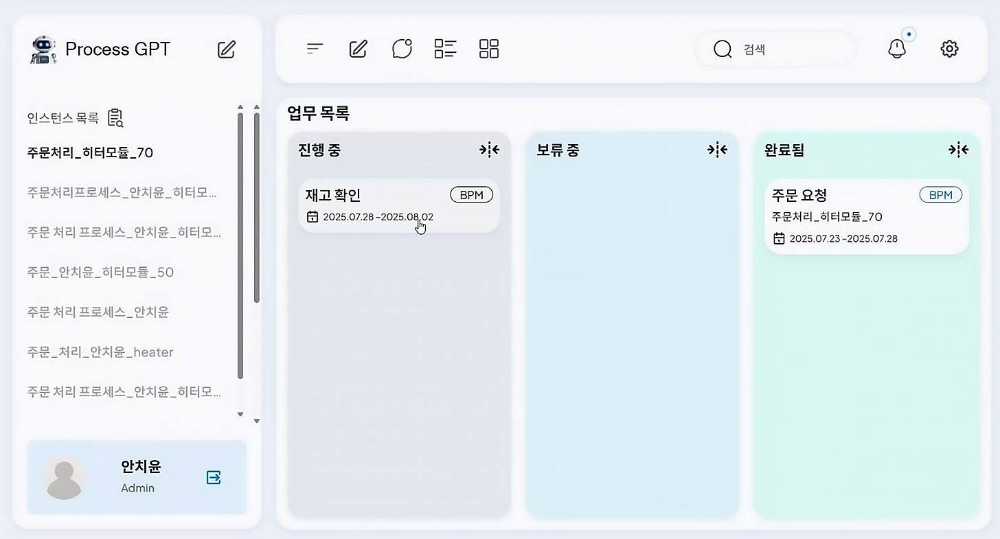
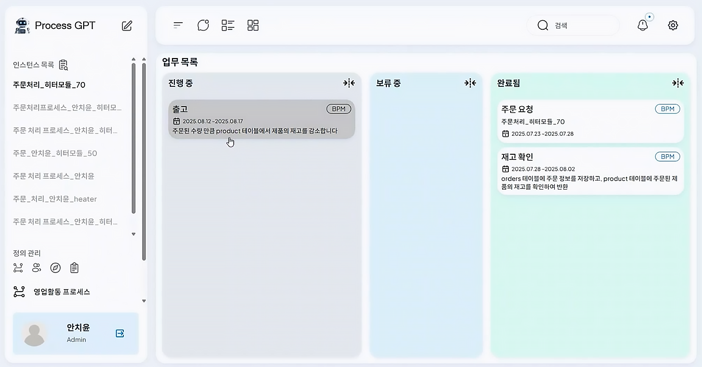
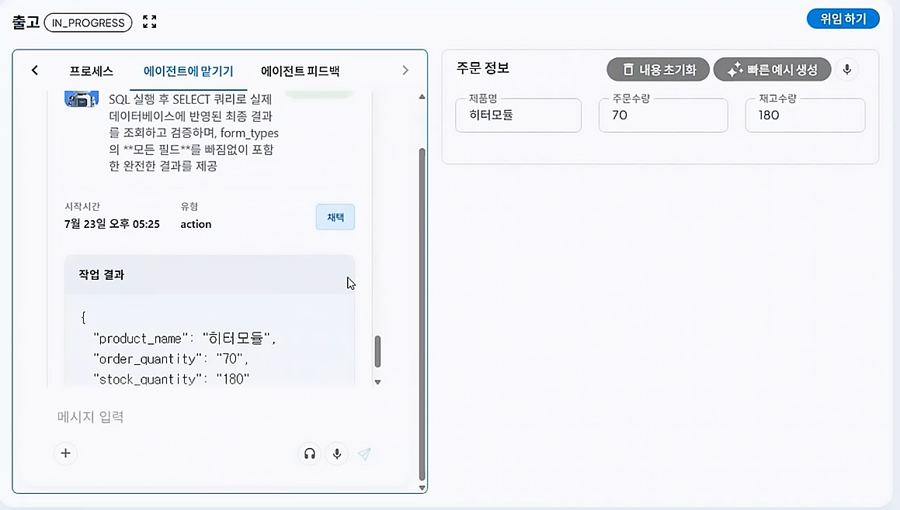
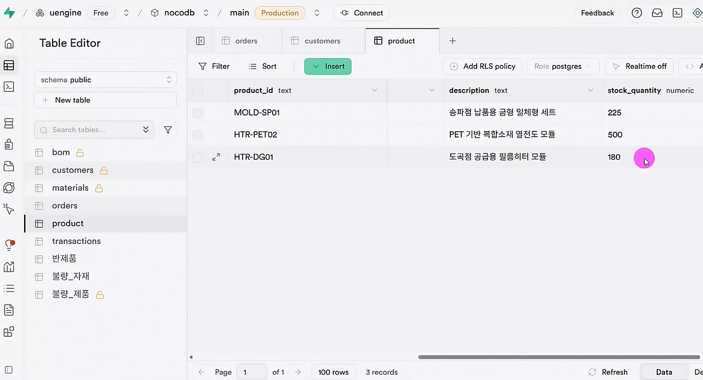
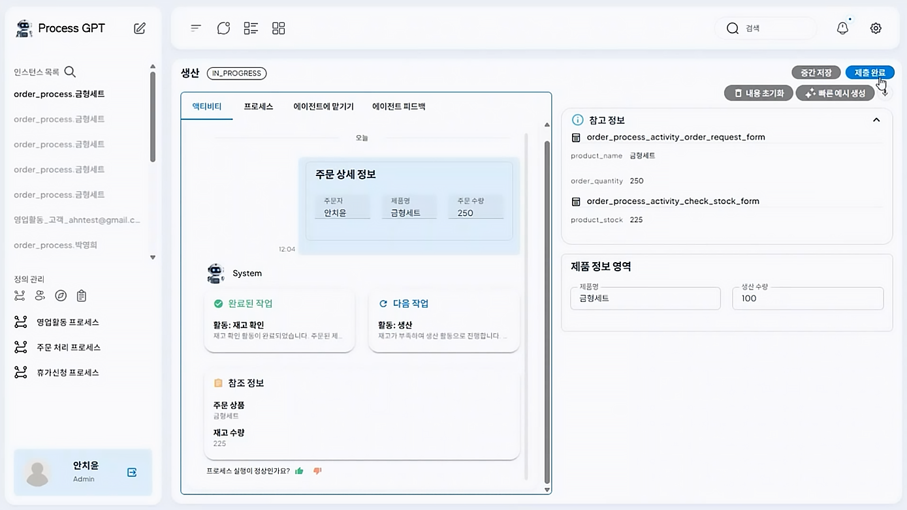
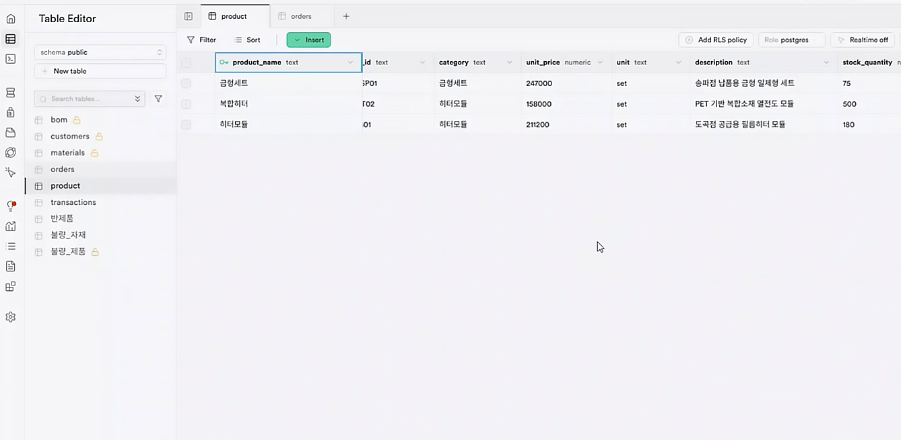

# ERP Data Connection for Inventory Management

## ProcessGPT Tutorial Lv.4 Followed by Order Processing Process

This tutorial guides you through the process of inventory management performed by **AI agent** and ERP data connection. 
The agent checks the inventory based on the external ERP data and processes the input·output. If the inventory is insufficient, it requests production to supplement the shortage and then proceeds with the output.

### MRP Agent Registration and Granting Tools for Inventory Management

1. Register the logistics team in the organization chart and register the ERP agent. Define the agent's role, goal, and grant the necessary tools.

 

### ERP Data Connection (Supabase Use)

1. Select 'Settings' > 'Data Source' > 'Add Connection Information' on the right and enter the ERP data source information.

 

2. Use the curl example and API key in Read rows of Supabase API Docs to connect.

 

 

### Process Creation and Form Modification

1. Create a process as shown below. 

- If the inventory is sufficient → immediately proceed with output
- If the inventory is insufficient → request production, then proceed with output after the product is completed.
  

2. Modify the form of each task according to the purpose. Set the task and the agent to use, and connect to Supabase as shown below.

 

 

3. The form of the created process is connected to the actual ERP data, and the product name, unit price, and inventory of the process are connected to **product name, unit price, stock quantity** of Supabase.

 

### Execution

1. When you execute the process and enter the customer's request, the agent will start checking the inventory.

 

2. The agent checks that the inventory of the heater module ordered by the customer is greater than the order quantity of 70, and immediately proceeds with the output.

 

3. The agent can check the remaining inventory quantity also connected to the ERP data via Supabase mcp after the output.

 

4. If the inventory quantity is less than the customer's order quantity, the agent requests production of 100 sets of molds to supplement the inventory.

 

5. When production is completed, the agent processes the input, and the quantity is also reflected in the ERP data.

 

6. After the inventory is sufficient, proceed with the output, and the remaining inventory quantity can also be checked in ERP.

 

7. When the output is completed, the process ends.