# Customer-Customized Newsletter Process Running with Multiple Instances

## ProcessGPT Tutorial Lv.5 Followed by VIP Newsletter Process

This tutorial guides you through the process of writing and sending customer-customized newsletters by **AI agent** and customer data connection.  
The agent creates a newsletter customized to the customer's interests and level based on the collected VIP information, and runs the same process simultaneously for each customer through the multiple instance feature.  
Therefore, each customer can automatically receive the customized newsletter optimized for themselves.  
The generated draft is automatically sent when approved through the review process, and the result can also be checked individually by customer unit.

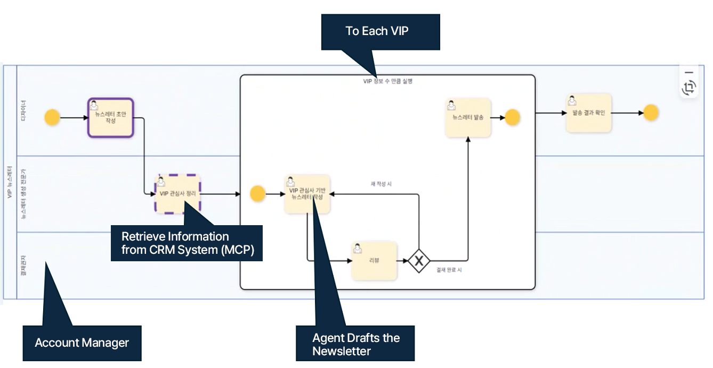
 

### Customer Management Agent Declaration and Education

1. Register the marketing team in the organization chart, and create a customer management agent.
    Define the agent's role and goal, grant the necessary tools, and train the knowledge needed for customer management.

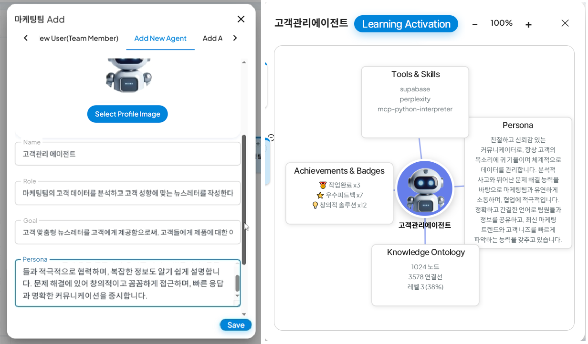
 

 

### CRM Data Connection (Supabase Use)

1. At the top right, go to Settings > Data Sources, add the connection information, and enter the CRM data source information to use.
(Data source is used as an example of Supabase, and the settings are referred to [Supabase setting method](https://docs.process-gpt.io/en/tutorial/tutorial-lv4/#erp-data-integration-using-supabase).)

### Process Creation and Form Modification

1. Create the customer-customized newsletter process as shown below in the definition management.

To set up multiple instances from the "VIP Interest-based Newsletter Writing" step to the "Newsletter Sending" step, click the "Create Expanded Sub-process" icon at the top to create a sub-process.

When the sub-process is completed, the process branches by customer unit, and the customized mail writing and sending process is executed in parallel for each customer.
  

2. After creating the process, modify the form of each task according to the purpose.
   Set the task and the agent to use, and connect to Supabase as shown below.

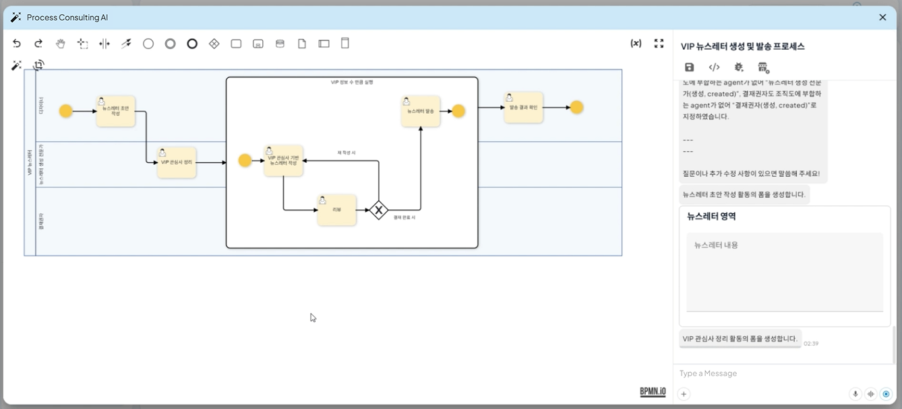

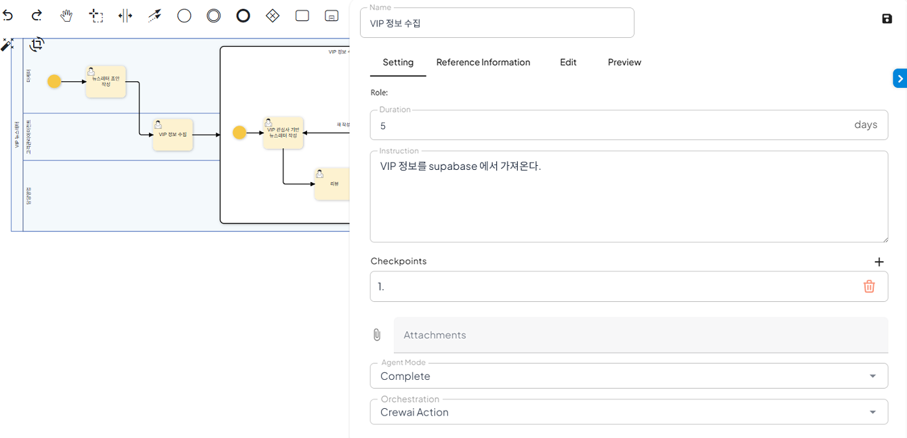

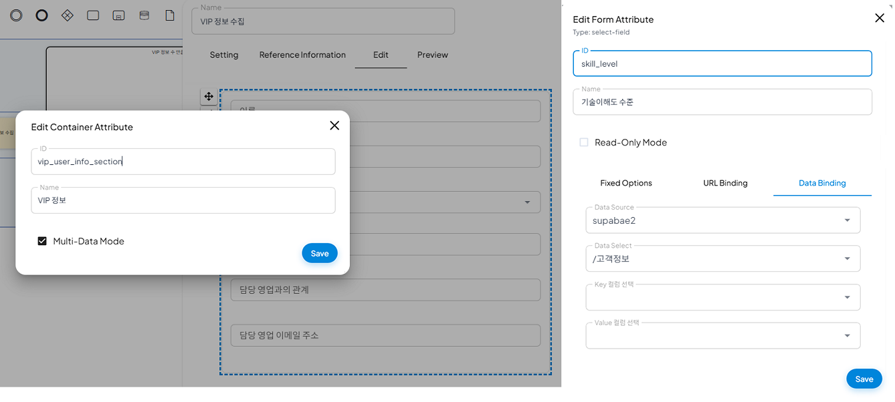
 

### Writing a Customer-Customized Newsletter by the Agent

1. Execute the process to write the newsletter draft.
   Use the source add function at the bottom left to upload a file to refer to, or click "Quick Example" to generate a draft automatically based on LLM.

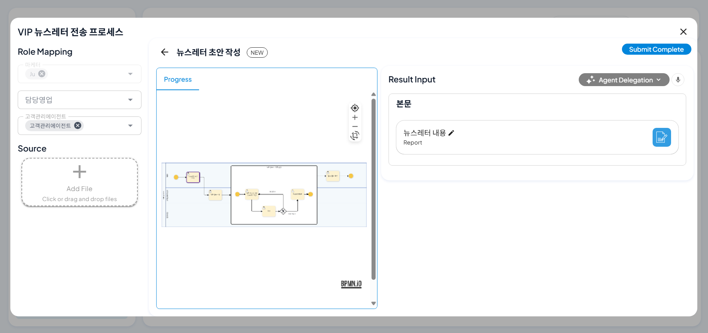
 

2. Based on the generated draft, the agent uses the granted Supabase mcp tool to check the customer information linked to the CRM data, and creates a customized newsletter for each customer based on it.

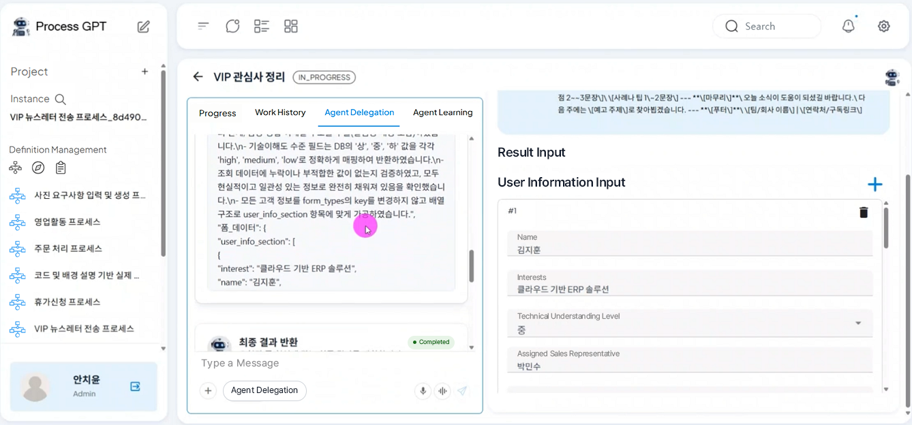
 

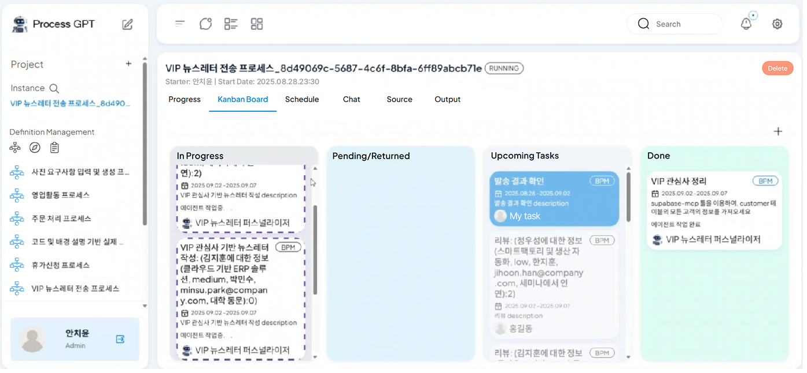
 

3. The customized newsletter created for the three customers linked to the CRM data.

Using the internal CRM data, the customized newsletter is created for each customer as shown in the image below.

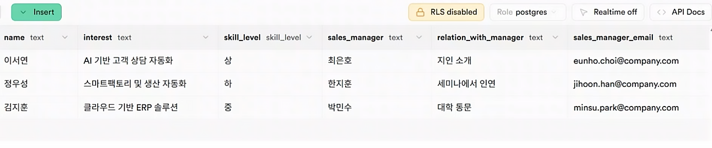
 

The newsletter written for the Lee Seoyeon customer. It is a newsletter targeting the introduction of a friend and the customer's interest in AI-based customer consultation automation.

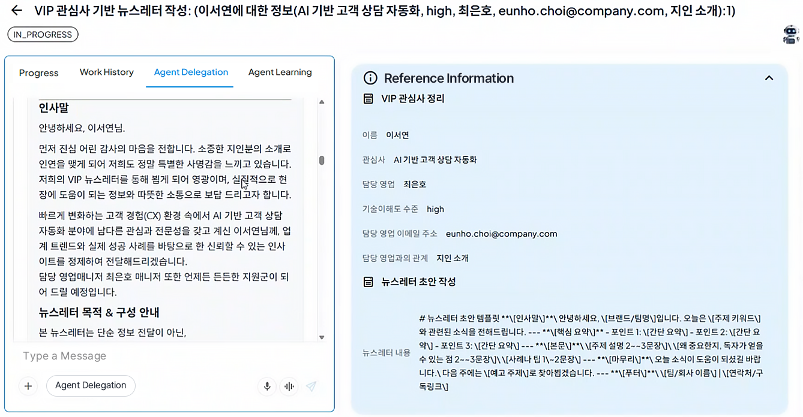
 

.png)
 

The newsletter written for the Jung Woo-seong customer. It is a newsletter targeting the customer's interest in smart factory and production automation.

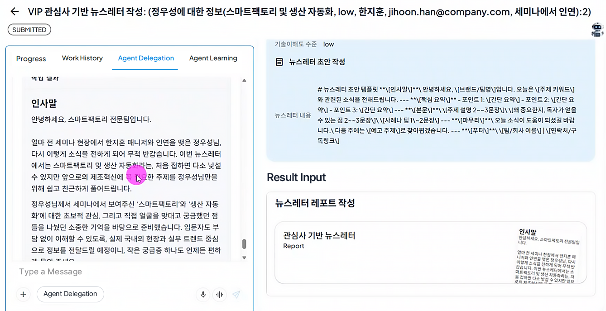
 

.png)
 

The newsletter written for the Kim Ji-hoon customer. It is a newsletter targeting the customer's interest in cloud-based ERP solution.

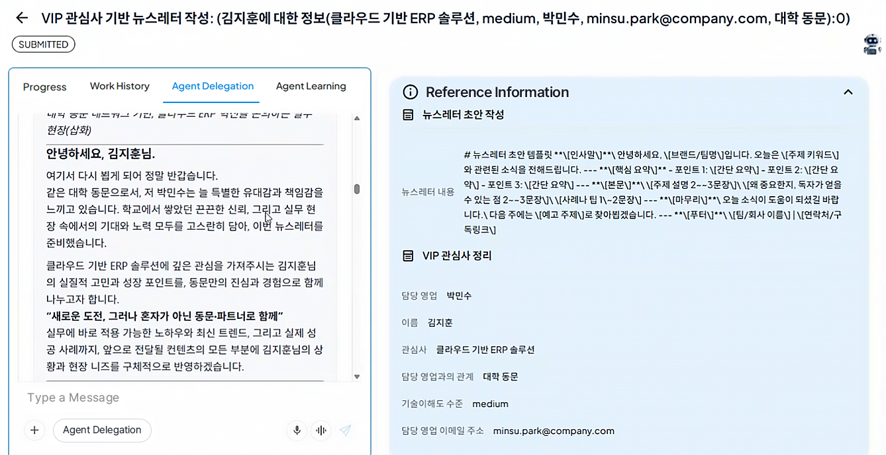
 

.png)
 

### Review

1. The user in charge of the decision approves the draft written by the agent. Based on the result, it can instruct approval (payment complete) or re-writing.

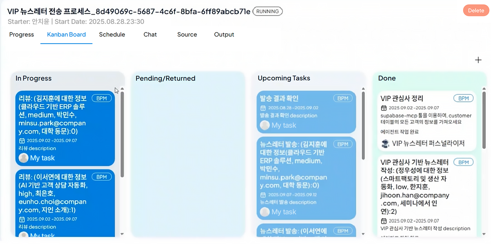
 

2. The newsletter approved is sent to the customer's email address registered in the CRM data.
   

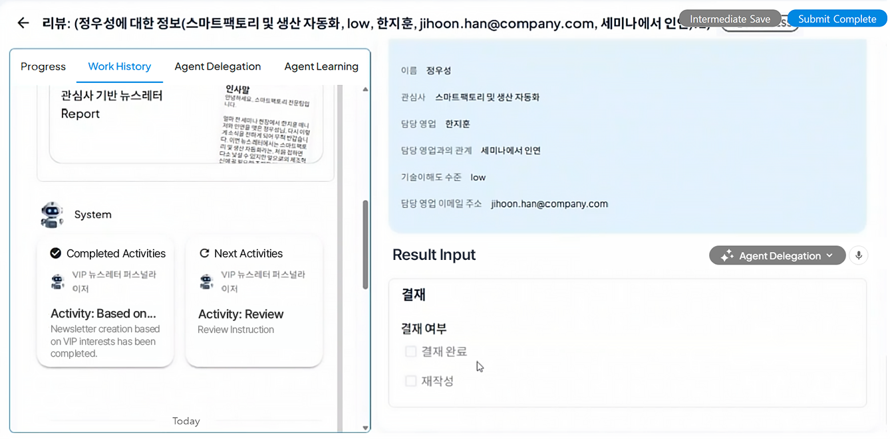
 

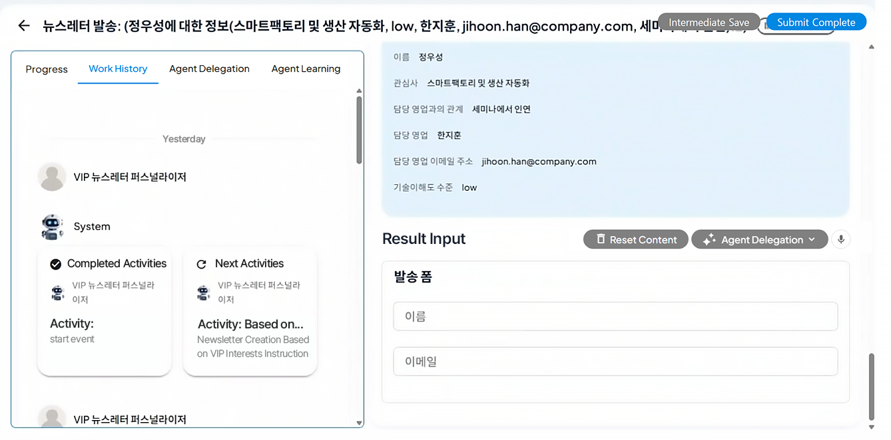
 

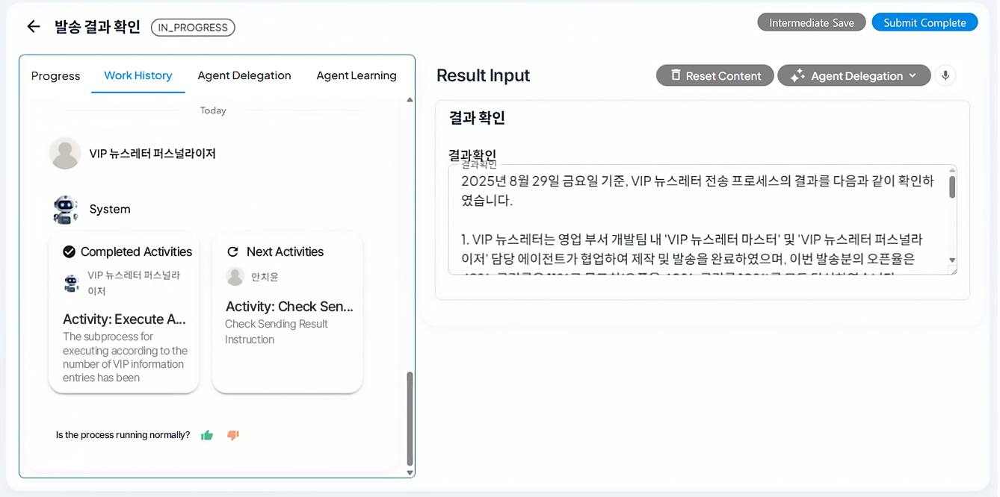
 

### Feedback Verification and Condition-Based Approval

1. The decision-maker provides the agent with a rewrite opinion and feedback on the draft written by the agent, and the agent rewrites based on the review content.

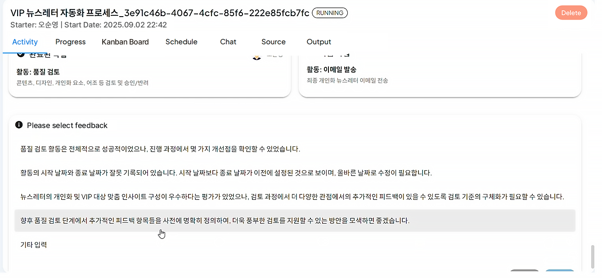
 

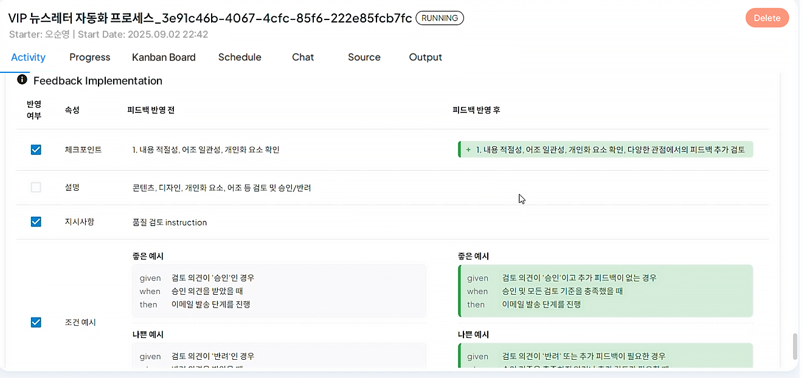
 