# 프로세스 컨설팅 AI 및 관리 가이드
ProcessGPT의 프로세스 컨설팅 AI는 사용자가 복잡한 툴을 배우지 않아도, 일상 언어(자연어)나 기존 사내 문서(PDF 등)를 통해 즉시 실행 가능한 업무 워크플로우(BPMN)를 설계하고 관리할 수 있도록 돕습니다.

## 1. 문서 기반 프로세스 자동 생성 (PDF to BPMN) 및 협업
스캔한 이미지, 복잡한 표, 사내 규정집이 담긴 PDF 문서를 보며 일일이 프로세스를 설계하고 폼(Form)을 만들 필요가 없습니다. ProcessGPT는 업로드된 비정형 데이터 속 숨은 의미와 논리를 스스로 파악해 실행 가능한 자동화 업무 흐름으로 즉시 변환합니다.

### 1.1 유니버설 프로세스 추출: 문서를 올리면 워크플로우 완성
기존의 수동 모델링 방식에서 벗어나, 채팅창에 기준이 되는 문서를 업로드하고 자연어로 지시하는 것만으로 표준 BPMN 도면이 완성됩니다.

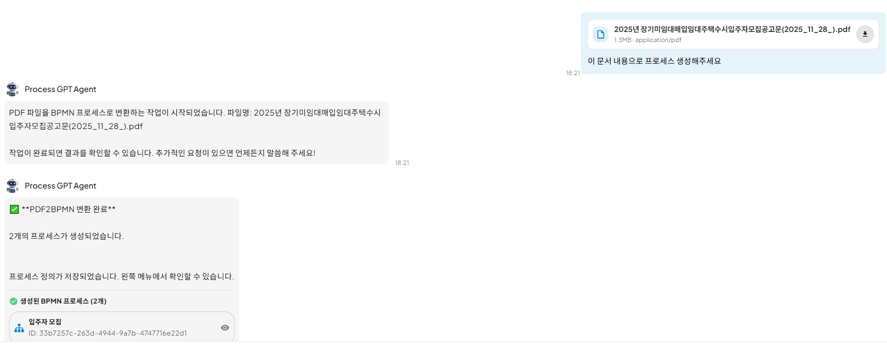
- 문서 업로드 기반 프로세스(BPMN) 자동 생성 화면
 
 
 

- 문서 업로드 및 변환 요청

수백 페이지에 달하는 업무 규정집(PDF)을 업로드하고 "이 규정대로 프로세스 만들어줘"라고 요청해 보세요. AI가 문서를 독해하여 업무의 흐름, 담당자, 규칙을 스스로 파악합니다.

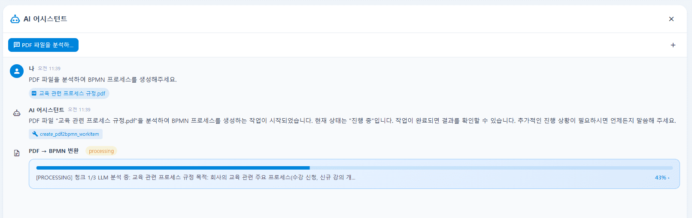
- PDF 파일을 업로드하여 프로세스 생성을 요청하는 모습
 
 
 

단 몇 초 만에 텍스트로 된 규정이 표준 업무 프로세스(BPMN) 다이어그램으로 시각화되어 생성됩니다. 이렇게 생성된 프로세스는 단순한 그림이 아니라, 즉시 업무에 투입하여 실행할 수 있는 실제 시스템입니다.

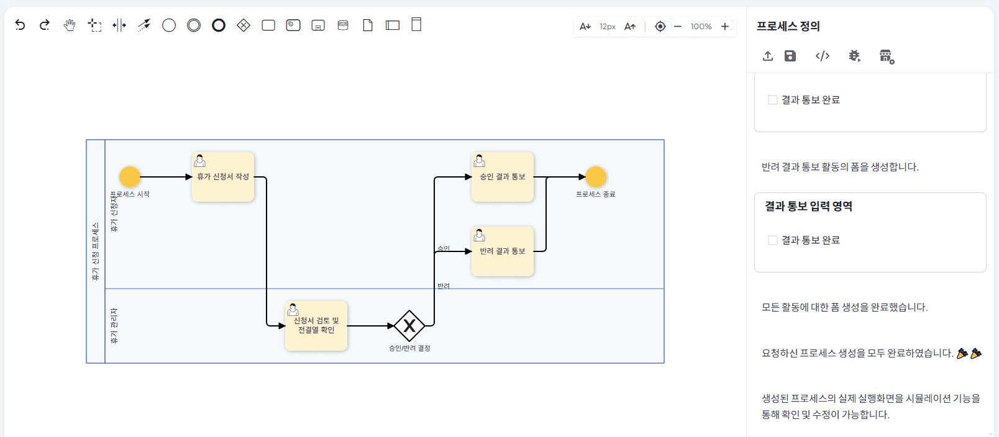
- AI가 규정집을 분석하여 즉시 실행 가능한 BPMN 프로세스로 변환한 결과
 
 
 

- 변환된 프로세스 도면 확인

회의실 화이트보드에 그린 엉성한 흐름도나 손으로 그린 스케치(Image)도 문제없습니다. 이미지를 업로드하면 ProcessGPT가 의도를 파악하여 깔끔한 디지털 프로세스로 재탄생시킵니다.

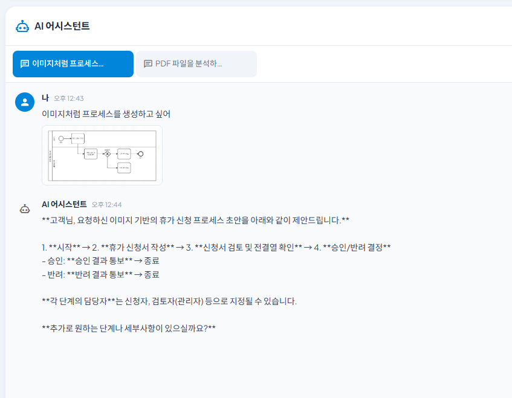
- 화이트보드 스케치 이미지를 업로드하여 구조화된 프로세스로 변환 요청
 
 
 

### 1.2 실행력(Executability)의 완성: 그림이 아닌 '실행 파일'로
단순히 눈으로 보는 다이어그램(도면)을 그리는 것에 그치지 않습니다. 변환이 완료된 프로세스는 관리자의 추가 작업 없이도 즉시 실무에 투입될 수 있도록 핵심 요소들이 함께 세팅됩니다.
- **자동 Form 생성:** 프로세스의 각 단계(액티비티)별로 실무자가 입력해야 할 데이터 양식(Form)을 문서의 맥락을 바탕으로 스스로 유추하여 자동 생성합니다. 번거로운 UI 설계 시간을 획기적으로 줄여줍니다.
- **참조 데이터 자동 매핑:** 이전 작업 단계에서 입력된 결과물이나 승인 내역이 다음 단계의 기초 자료로 누락 없이 이어지도록 데이터 링크(Data Link)를 알아서 연결하여, 업무의 단절을 완벽하게 방지합니다.

### 1.3 스마트 인비테이션: 대화 맥락에 맞는 AI 전문가 자동 할당
프로세스 도면 생성 후 실무를 진행하거나 궁금한 점이 생겼을 때, 어떤 담당자나 봇을 호출해야 할지 고민할 필요가 없습니다. 시스템이 스스로 판단하여 든든한 협업 파트너를 모셔옵니다.
- **능동적 협업 제안 (에이전트 라우팅):** 채팅창에서 질문이나 지시를 입력하면, 백그라운드에서 작동하는 '에이전트 라우터'가 대화의 의도를 분석하여 해당 업무에 가장 적합한 전문 에이전트(예: 업무 지원 에이전트)를 찾아내어 초대를 제안합니다.
- **단일 소통 공간에서의 협업:** 사용자가 초대를 승인하면 툴을 이탈할 필요 없이 즉시 에이전트가 합류합니다. 하나의 채팅 워크스페이스 안에서 사람과 AI가 유기적으로 대화하며 연속성 있게 업무를 처리합니다.

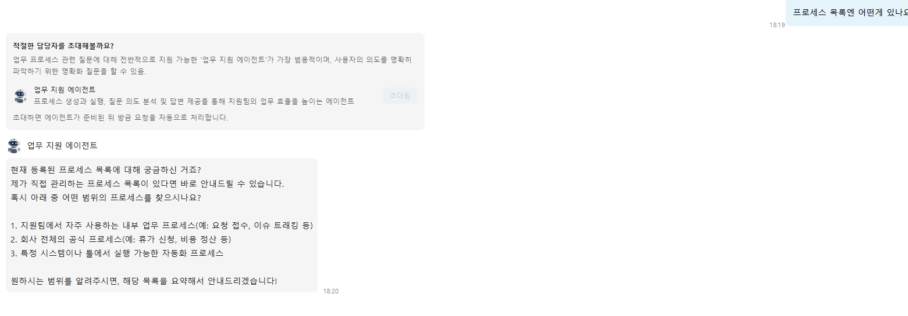
- 대화 맥락 분석 및 맞춤형 전문 에이전트 자동 초대 화면
 
 
 

## 2. 프로세스 컨설팅AI 기본 사용법
위에서 설명한 자동화 기능을 실제 관리자 화면에서 사용하는 단계별 방법입니다.

1. **프로세스 컨설팅 AI 화면**
   - 프로세스 컨설팅 AI 는 프로세스 정의 체계도에서 **상단 AI 채팅창**을 활용합니다.

   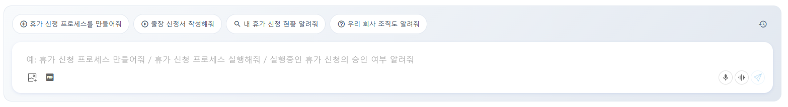

   - 프로세스 컨설팅 AI 채팅 화면에 접속합니다.

   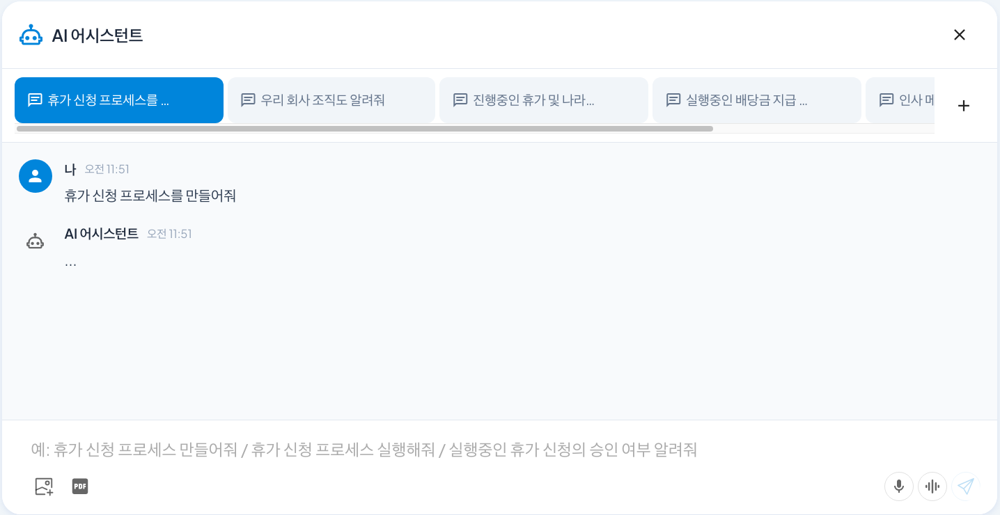

 

2. **프로세스 컨설팅 AI 생성**  
   - 채팅창을 통해 원하는 비지니스 프로세스 내용을 입력합니다.
   - 개선하거나 추가하고 싶은 내용이 있는 경우 더 자세한 내용을 입력합니다.
   - 더 이상 반영할 내용이 없는 경우 입력한 채팅 내용을 바탕으로 비지니스 프로세스 정의에 따라 다이어그램이 생성됩니다.

   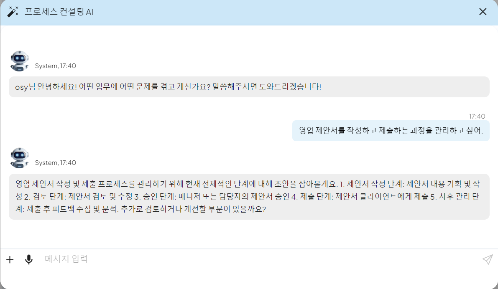

   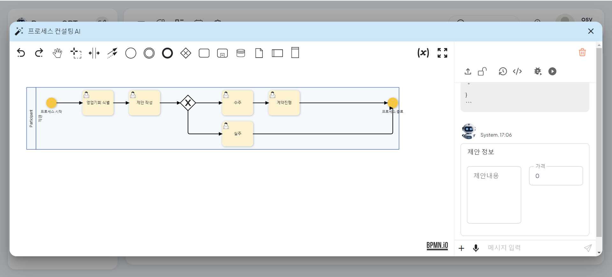

 

3. **프로세스 컨설팅 AI 저장**  
   - 생성된 다이어그램을 저장하고 싶은 경우 우측 채팅 화면 상단의 해제된 자물쇠 버튼을 클릭하여 저장합니다.
   
      

   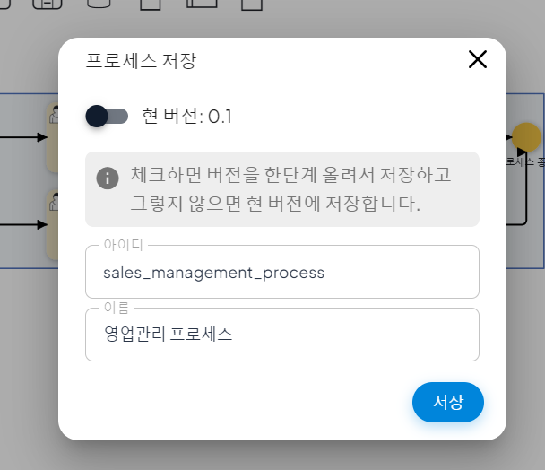

   - 저장된 비지니스 프로세스 정의는 프로세스 정의 체계도에서 확인할 수 있습니다.
   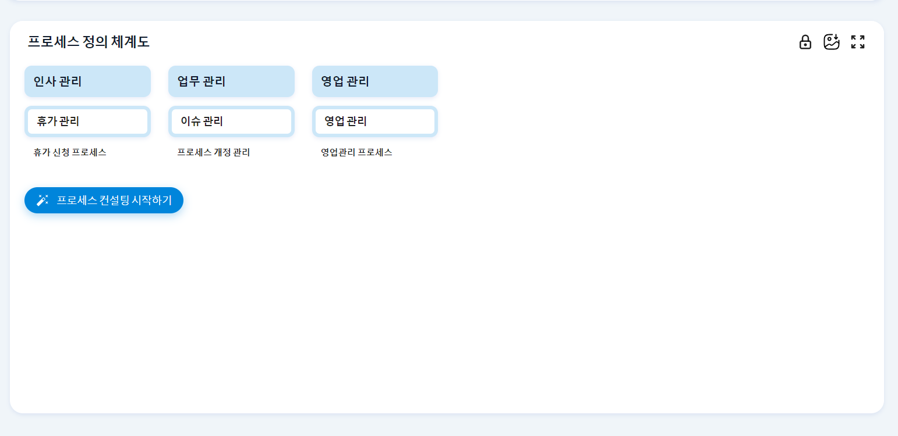

   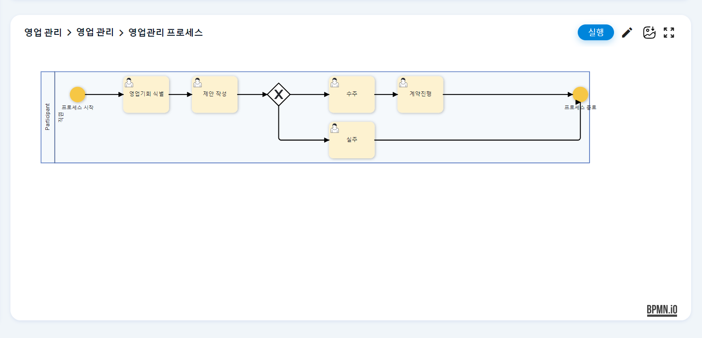

    

## 3. 상세 프로세스 정의 및 폼/스크립트 생성

1. **프로세스 정의 화면**  
   - 프로세스 정의는 좌측 프로세스 모델링 편집 화면과 우측 프로세스 정의 채팅 화면을 통해 관리합니다.

   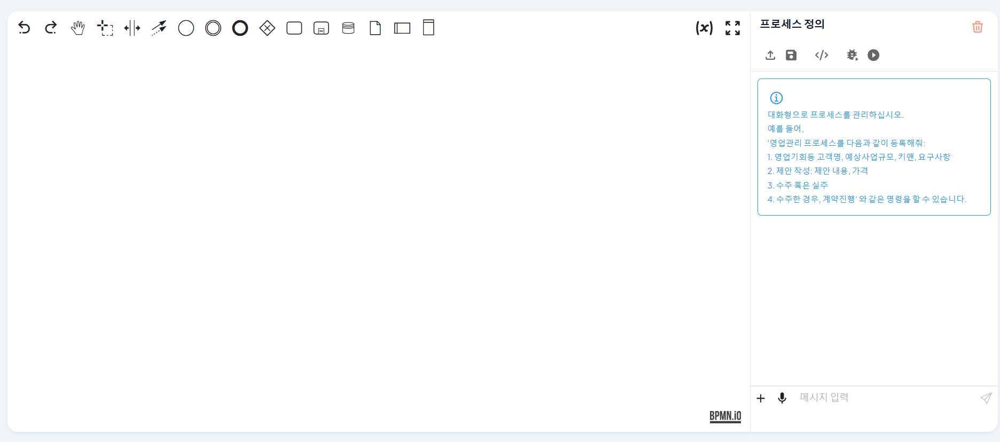

 

2. **프로세스 정의 생성**  
   - 채팅에 생성하고자 하는 프로세스 정의를 입력합니다.
   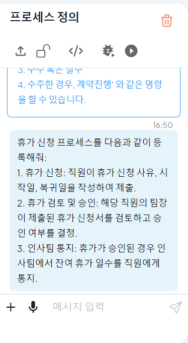

   - 사용자의 입력을 분석한 AI 가 프로세스를 정의하고 BPMN 다이어그램으로 자동 생성합니다.
   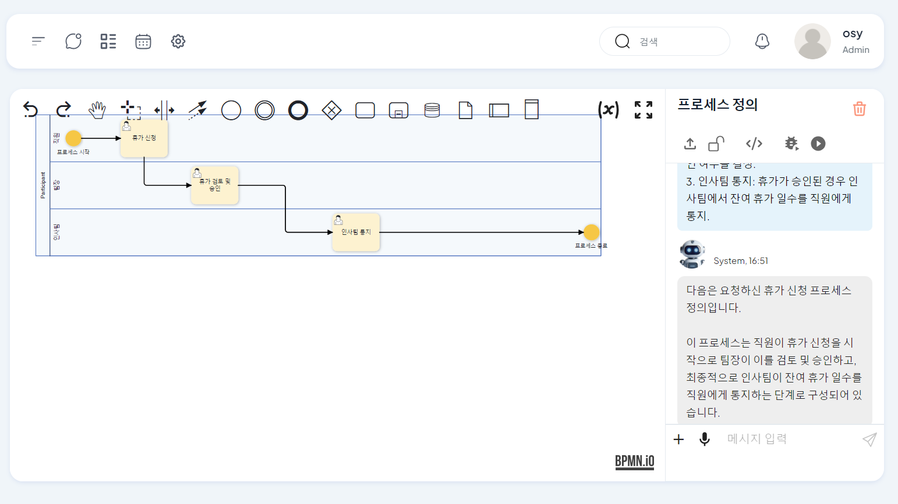

 

3. **사용자 업무 폼 생성**  
   - 각 단계별 업무에 따라 폼이 필요한 경우 AI 가 폼을 자동 생성합니다.
   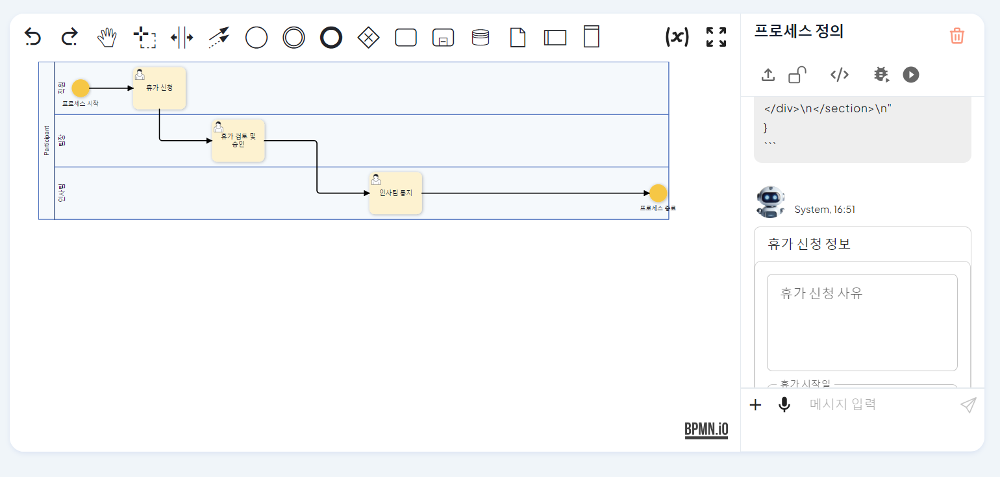

   - 생성된 폼은 업무 패널에서 확인 가능하고 직접 폼을 수정하거나 채팅을 통해 수정할 수 있습니다.
   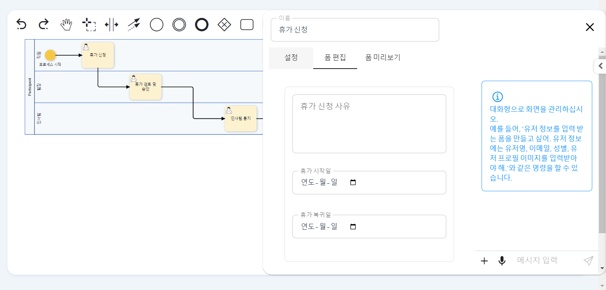

 

&nbsp;
  

4. **스크립트 업무 코드 생성**  
   - 코드 실행이 필요한 스크립트 업무가 있는 경우 업무 패널에서 실행할 스크립트 입력이 가능합니다.
   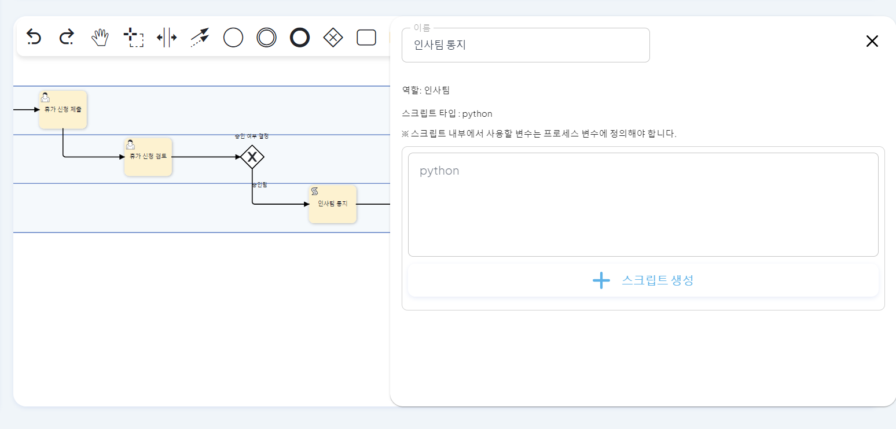

   - 사용자는 파이썬 코드를 직접 입력할 수도 있고 프롬프트를 입력하고 스크립트 생성 버튼을 클릭하여 코드를 자동 생성할 수 있습니다.
   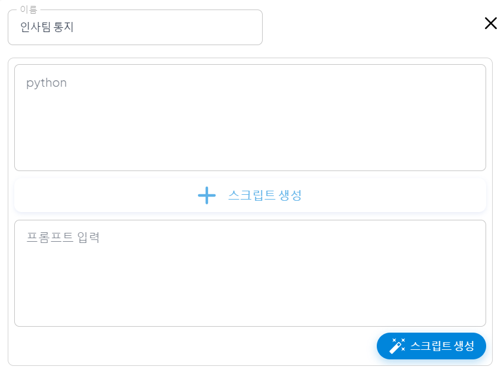

   - 생성된 코드는 스크립트 입력란에서 확인할 수 있습니다.
   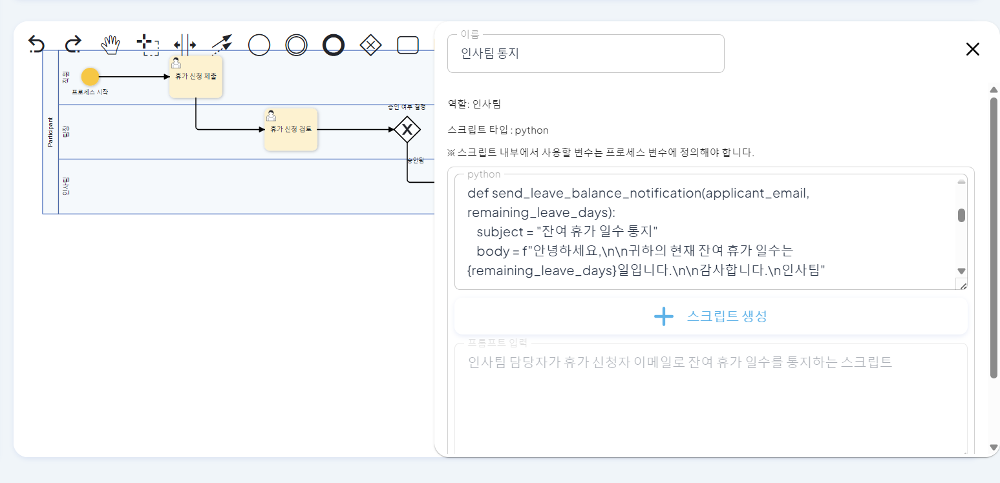

 

## 4. 조직도 관리 (Organization)

1. **조직도 정의 화면**
   - 조직도 정의는 좌측 채팅 화면과 우측 조직도 차트를 통해 관리합니다.

   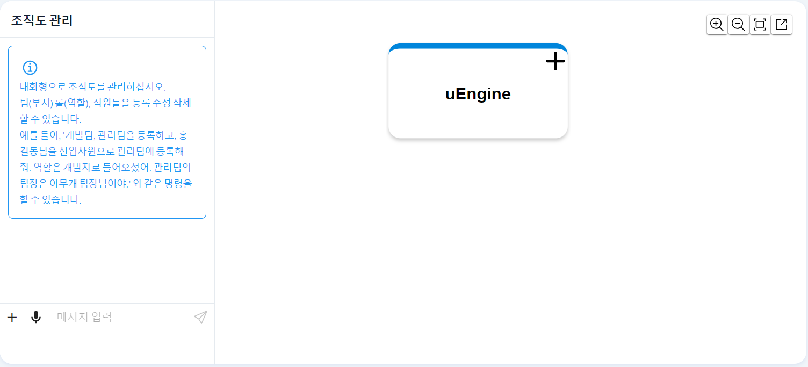

 

2. **조직도 생성**  
   - 채팅을 통해 조직도로 등록하고자 하는 팀 정보와 직원 정보를 입력합니다.
      - 추가하려는 직원이 신규 입사자인 경우 입사자 정보를 입력합니다.
      - 입력받은 이메일 주소를 통해 신규 입사자는 자동 회원가입 처리됩니다.
   - 생성된 조직도 차트에서 팀 정보와 직원 정보를 확인할 수 있습니다.
   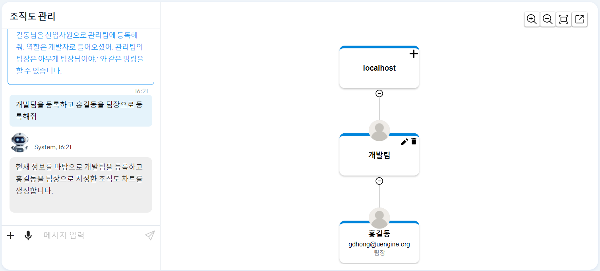

 

3. **조직도 차트 수정**  
   - 사용자는 직접 조직도 차트를 수정하고 관리할 수 있습니다.
   - 팀을 추가하고 싶은 경우 가장 상위의 회사명 요소 옆 + 버튼을 클릭합니다.
   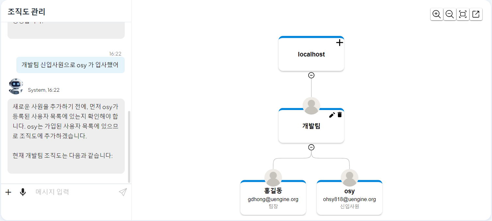

   - 팀을 삭제하고 싶은 경우 삭제하고자 하는 팀의 삭제 버튼을 클릭합니다.
   - 팀명을 변경하거나 팀원을 수정하고자 하는 경우 수정하고자 하는 팀의 수정 버튼을 클릭합니다.
   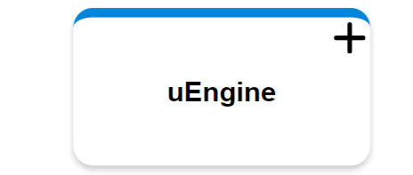

 

