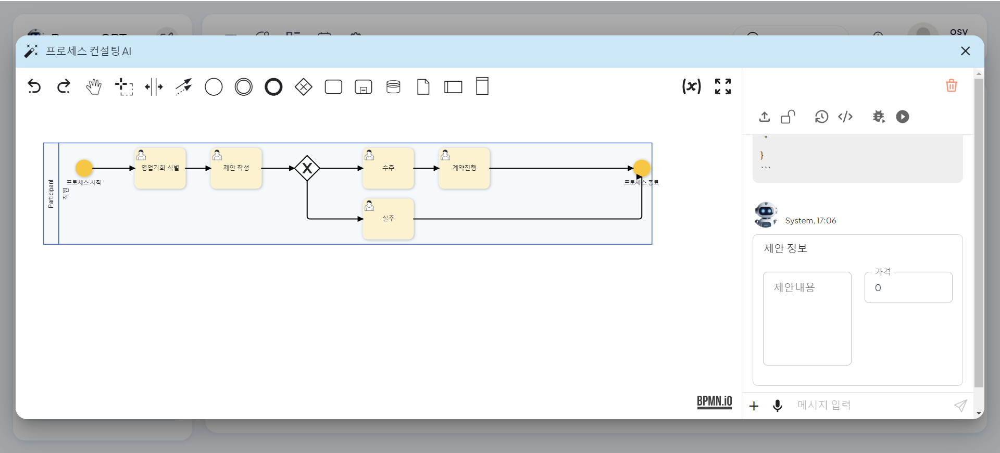
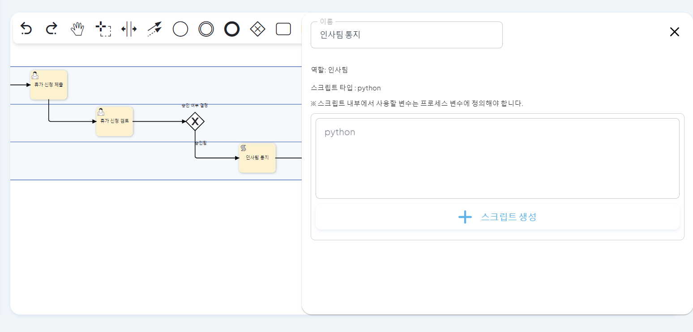
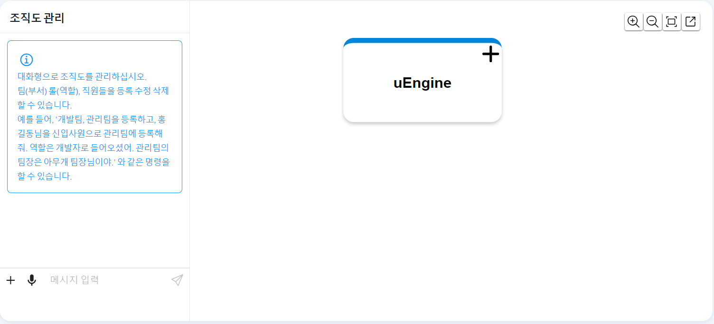
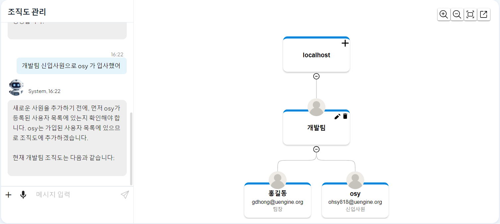

# 프로세스 컨설팅 AI 및 관리 가이드

ProcessGPT의 관리자 도구는 단순한 설정 화면이 아닙니다. 문서를 시스템으로 변환(Transformation)하고, 타협 없는 보안(Security) 기술로 보호하며, AI를 통해 상세 로직(Engineering)을 구현하는 통합 가이드입니다.

## 1. 문서의 시스템화 (Doc-to-System) 및 보안

### 1. 문서 한 장이면 시스템 완성 (Instant Process Generation)

**"종이 속에 멈춰있던 텍스트와 이미지가, 클릭 한 번으로 살아있는 시스템이 됩니다."**

업무 자동화를 위해 복잡한 프로그래밍 로직을 설계하던 수고는 이제 잊으십시오. ProcessGPT는 정적인 문서를 실행 가능한 시스템으로 즉시 변환하는 Doc-to-System 엔진을 탑재하고 있습니다.

#### 1.1 PDF 규정집의 프로세스 변환
수백 페이지에 달하는 업무 규정집(PDF)을 업로드하고 "이 규정대로 프로세스 만들어줘"라고 요청해 보세요. AI가 문서를 독해하여 업무의 흐름, 담당자, 규칙을 스스로 파악합니다.

- PDF 파일을 업로드하여 프로세스 생성을 요청하는 모습
 
 
 

단 몇 초 만에 텍스트로 된 규정이 표준 업무 프로세스(BPMN) 다이어그램으로 시각화되어 생성됩니다. 이렇게 생성된 프로세스는 단순한 그림이 아니라, 즉시 업무에 투입하여 실행할 수 있는 실제 시스템입니다.

- AI가 규정집을 분석하여 즉시 실행 가능한 BPMN 프로세스로 변환한 결과
 
 
 

#### 1.2 화이트보드 스케치의 시스템화

회의실 화이트보드에 그린 엉성한 흐름도나 손으로 그린 스케치(Image)도 문제없습니다. 이미지를 업로드하면 ProcessGPT가 의도를 파악하여 깔끔한 디지털 프로세스로 재탄생시킵니다.

- 화이트보드 스케치 이미지를 업로드하여 구조화된 프로세스로 변환 요청
 
 
 

### 2. 타협 없는 보안 (Compromise-free Security)

**"관리자조차 열어볼 수 없는, 기술적으로 가장 안전한 환경"**

ProcessGPT의 혁신은 고객님의 데이터를 완벽히 지키는 '타협 없는 보안' 위에서 완성됩니다.

- **Master Key 폐기:** 기존 시스템들이 관리 편의를 위해 남겨두었던 시스템 관리자의 '만능 열쇠(Master Key)' 방식을 과감히 폐기했습니다. 시스템 운영자라도 고객님의 내부 데이터에는 절대 접근할 수 없습니다.

- **토큰 기반의 무결성 검증:** 오직 고객님 본인의 고유한 인증 방식(Token)으로만 권한이 확인됩니다. 기술적으로 권한이 없는 사용자의 접근을 원천 차단하는 설계를 통해, 놀라울 정도로 빠르지만 가장 안전한 업무 환경을 제공합니다.

## 2. 프로세스 컨설팅AI 기본 사용법
위에서 설명한 자동화 기능을 실제 관리자 화면에서 사용하는 단계별 방법입니다.

1. **프로세스 컨설팅 AI 화면**
   - 프로세스 컨설팅 AI 는 프로세스 정의 체계도에서 **상단 AI 채팅창**을 활용합니다.

   

   - 프로세스 컨설팅 AI 채팅 화면에 접속합니다.

   

 

2. **프로세스 컨설팅 AI 생성**  
   - 채팅창을 통해 원하는 비지니스 프로세스 내용을 입력합니다.
   - 개선하거나 추가하고 싶은 내용이 있는 경우 더 자세한 내용을 입력합니다.
   - 더 이상 반영할 내용이 없는 경우 입력한 채팅 내용을 바탕으로 비지니스 프로세스 정의에 따라 다이어그램이 생성됩니다.

   

   

 

3. **프로세스 컨설팅 AI 저장**  
   - 생성된 다이어그램을 저장하고 싶은 경우 우측 채팅 화면 상단의 해제된 자물쇠 버튼을 클릭하여 저장합니다.
   
      

   

   - 저장된 비지니스 프로세스 정의는 프로세스 정의 체계도에서 확인할 수 있습니다.
   

   

    

## 3. 상세 프로세스 정의 및 폼/스크립트 생성

1. **프로세스 정의 화면**  
   - 프로세스 정의는 좌측 프로세스 모델링 편집 화면과 우측 프로세스 정의 채팅 화면을 통해 관리합니다.

   

 

2. **프로세스 정의 생성**  
   - 채팅에 생성하고자 하는 프로세스 정의를 입력합니다.
   

   - 사용자의 입력을 분석한 AI 가 프로세스를 정의하고 BPMN 다이어그램으로 자동 생성합니다.
   

 

3. **사용자 업무 폼 생성**  
   - 각 단계별 업무에 따라 폼이 필요한 경우 AI 가 폼을 자동 생성합니다.
   

   - 생성된 폼은 업무 패널에서 확인 가능하고 직접 폼을 수정하거나 채팅을 통해 수정할 수 있습니다.
   

 

&nbsp;
  

4. **스크립트 업무 코드 생성**  
   - 코드 실행이 필요한 스크립트 업무가 있는 경우 업무 패널에서 실행할 스크립트 입력이 가능합니다.
   

   - 사용자는 파이썬 코드를 직접 입력할 수도 있고 프롬프트를 입력하고 스크립트 생성 버튼을 클릭하여 코드를 자동 생성할 수 있습니다.
   

   - 생성된 코드는 스크립트 입력란에서 확인할 수 있습니다.
   

 

## 4. 조직도 관리 (Organization)

1. **조직도 정의 화면**
   - 조직도 정의는 좌측 채팅 화면과 우측 조직도 차트를 통해 관리합니다.

   

 

2. **조직도 생성**  
   - 채팅을 통해 조직도로 등록하고자 하는 팀 정보와 직원 정보를 입력합니다.
      - 추가하려는 직원이 신규 입사자인 경우 입사자 정보를 입력합니다.
      - 입력받은 이메일 주소를 통해 신규 입사자는 자동 회원가입 처리됩니다.
   - 생성된 조직도 차트에서 팀 정보와 직원 정보를 확인할 수 있습니다.
   

 

3. **조직도 차트 수정**  
   - 사용자는 직접 조직도 차트를 수정하고 관리할 수 있습니다.
   - 팀을 추가하고 싶은 경우 가장 상위의 회사명 요소 옆 + 버튼을 클릭합니다.
   

   - 팀을 삭제하고 싶은 경우 삭제하고자 하는 팀의 삭제 버튼을 클릭합니다.
   - 팀명을 변경하거나 팀원을 수정하고자 하는 경우 수정하고자 하는 팀의 수정 버튼을 클릭합니다.
   

 

