# Browser Use 에이전트

## Browser Use 에이전트를 활용한 웹 도구 연동
Browser Use 에이전트 시스템은 프로세스의 Task를 처리하는데 있어 필요한 웹 기반 업무를 자동으로 감지하고 처리하는 기응입니다.

제안서 작업에 필요한 PPT제작에 있어 AI 기반 PPT 제작 도구 GenSpark나 검색 사이트 Google 등 Browser Use를 통해 웹 기반 도구에 접근하여 프로세스에 적합한 업무를 처리할 수 있습니다.

### Browser Use 에이전트 사용하기
Browser Use 에이전트를 활용하여 영업제안 프로세스를 웹기반 젠스파크 도구를 활용하여 PPT 생성하는 방법은 다음과 같습니다.

영업제안 프로세스를 실행하여 제안서 작성단계까지 프로세스를 진행한 후, 제안서 작성을 클릭합니다 
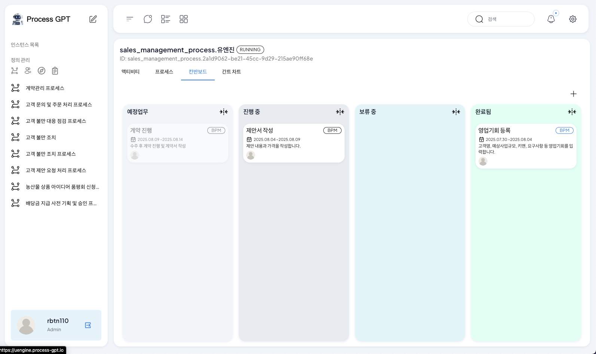 

이후, '에이전트에 맡기기'를 클릭한 다음 연구방식에서 Browser Use를 선택합니다. 최초 선택시 로컬에 Browser Use를 설치하는 단계가 진행되며 '다운로드'를 클릭하여 설치를 진행합니다. 
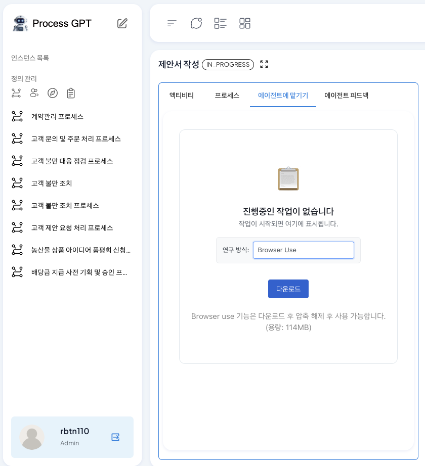 

설치가 완료되면 시작하기를 진행합니다. 이후 아래 화면과 같이 설치된 Browser Use 연결 시도가 진행됩니다. 
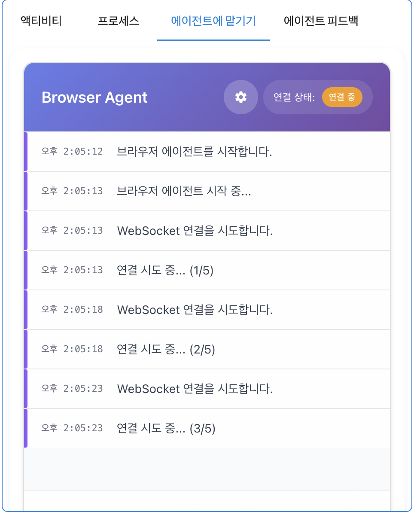 

연결이 시도될 때, 상단 톱니바퀴 아이콘을 클릭하여 API Key설정과 웹사이트에 사용되는 Google 로그인을 진행하기 위한 Google 계정 정보를 입력합니다. 
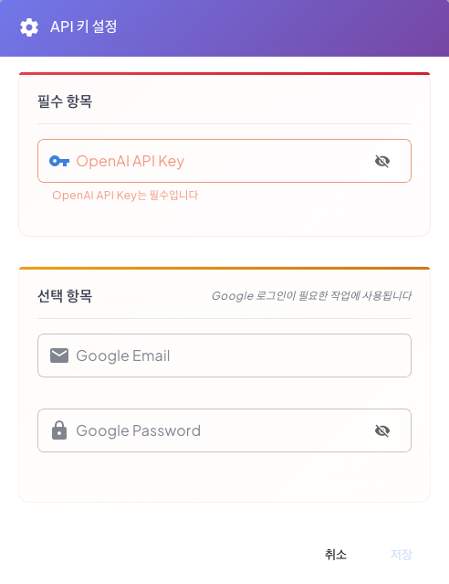 

연결이 완료되면 현재 Task에서 필요한 영업활동 제안서를 PPT로 작성하기 위해 AI가 자동으로 프롬프트를 추가합니다. 이 프롬프트에는 사용자가 추가적인 요구사항을 추가할 수 있으며 요구 사항이 구체화될수록 Browser Use의 동작이 정확하게 이루어집니다. 
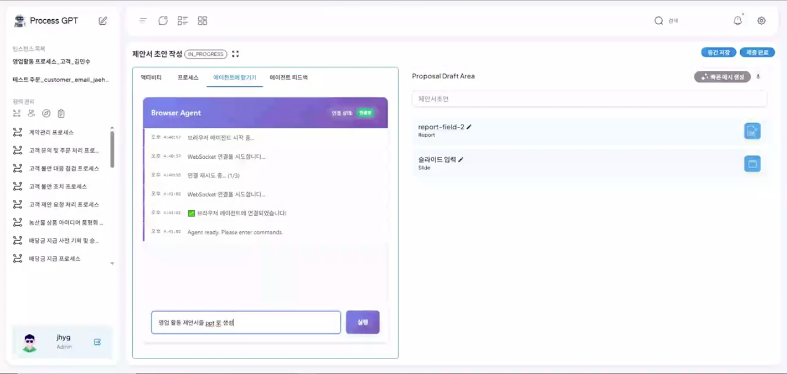 

프롬프트 기반 생성을 요청하면 아래와 같이 생성 요청에 대한 진행이 이루어지는 것을 확인할 수 있으며, 요구사항에 적합한 웹 도구 탐색 및 실행이 진행됩니다. 
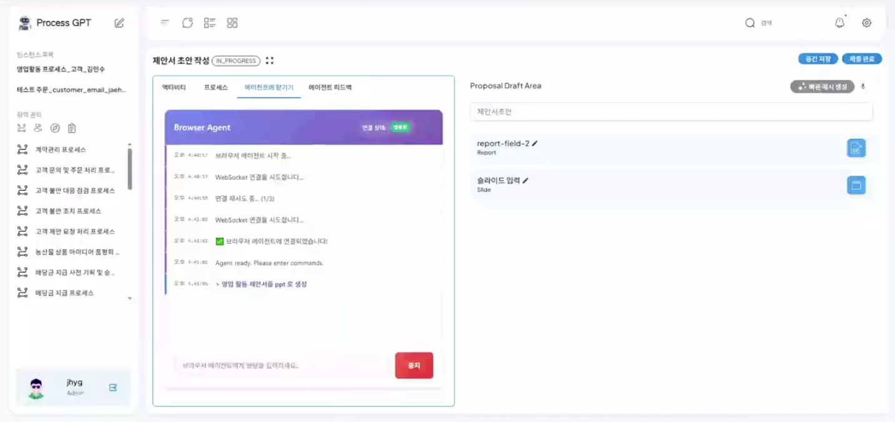 

이후 AI기반 PPT 생성 도구인 Genspark에 접속하여 입력한 요구사항을 정제하여 PPT 생성을 요청하며, 아래와 같이 생성을 진행합니다.
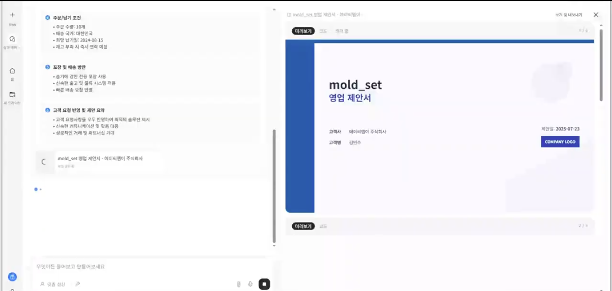 

PPT 생성 완료와 같이 Browser Use가 요청한 Web 요청이 완료되면 아래와 같이 요청에 대한 진행이 완료되었음을 확인할 수 있습니다.
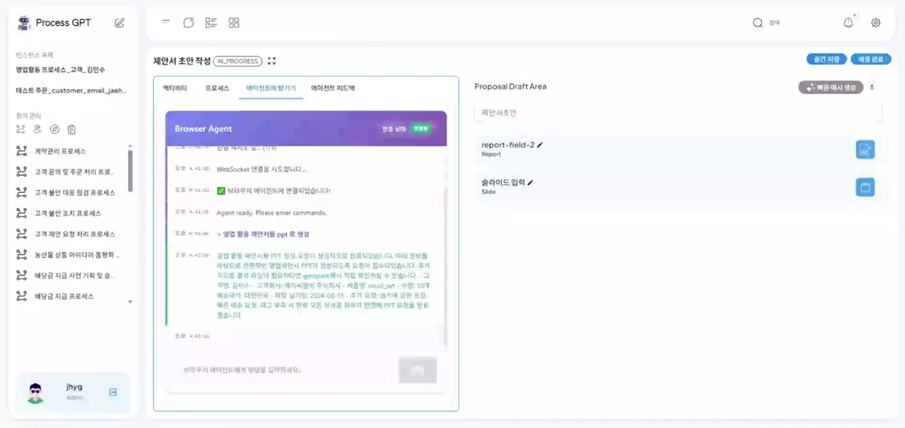 

이처럼 Browser Use 에이전트는 프로세스의 요구사항을 파악하여 웹 도구와의 연결을 통해 업무를 진행함으로써 업무 처리의 효율을 향상시킬 수 있습니다.

## Complete Mode: 완전 자동화의 시작
기존의 에이전트가 웹에서 정보를 '조회'하는 수준에 머물렀다면, 새로운 Complete Mode는 조회된 정보를 바탕으로 파일을 생성하고, 이를 시스템에 '제출' 및 '등록'하는 단계까지 수행합니다. 이를 통해 사람의 개입이 전혀 없는 진정한 의미의 End-to-End 자동화를 구현할 수 있습니다.

### 실제 활용 사례: 나라장터 입찰 공고 분석 및 제안서 자동화
다음은 에이전트가 나라장터에서 공고를 찾고, RFP(제안요청서)를 다운로드하여 분석한 뒤, 보고서와 슬라이드 형태의 제안서를 작성하는 전체 프로세스입니다.

### 1. 프로세스 정의 (Process Definition)
사용자는 에이전트가 수행할 업무 흐름을 시각적으로 정의합니다. 나라장터 검색부터 공고 분석, 제안서 작성까지의 흐름을 BPMN으로 설계하여 에이전트에게 업무를 부여합니다.

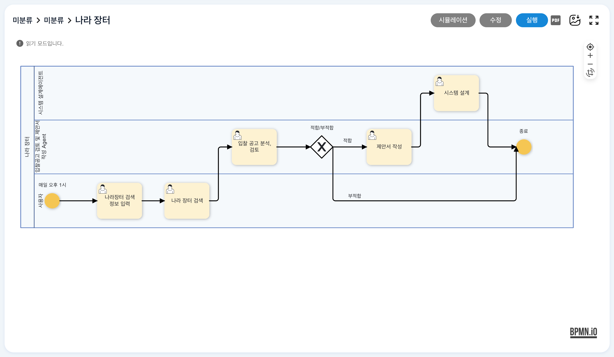
- 나라장터 공고 검색부터 제안서 작성까지의 전체 자동화 프로세스 설계도
 
 
 

### 2. 에이전트 실행 및 웹 탐색 (Autonomous Navigation)
프로세스가 시작되면 에이전트는 사용자가 자연어로 입력한 검색 조건(예: "AI 관련 공고 검색")을 이해하고, 실제 브라우저를 제어하여 나라장터에 접속합니다.

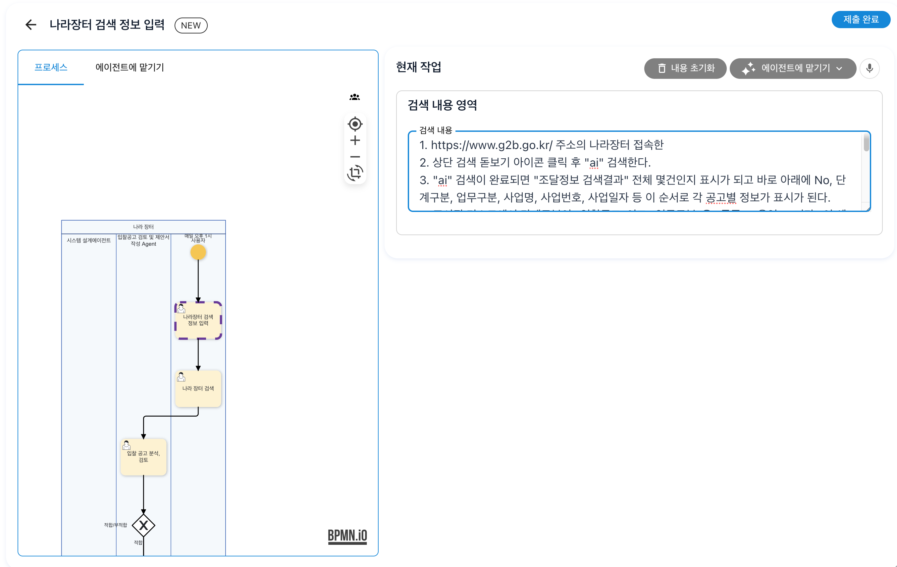
- 사용자의 자연어 요청을 해석하여 브라우저 탐색을 준비하는 에이전트
 
 
 

에이전트는 검색 결과 목록을 스크롤하며 확인하고(좌), 조건에 맞는 공고를 식별하여 상세 페이지로 진입합니다(우).

| 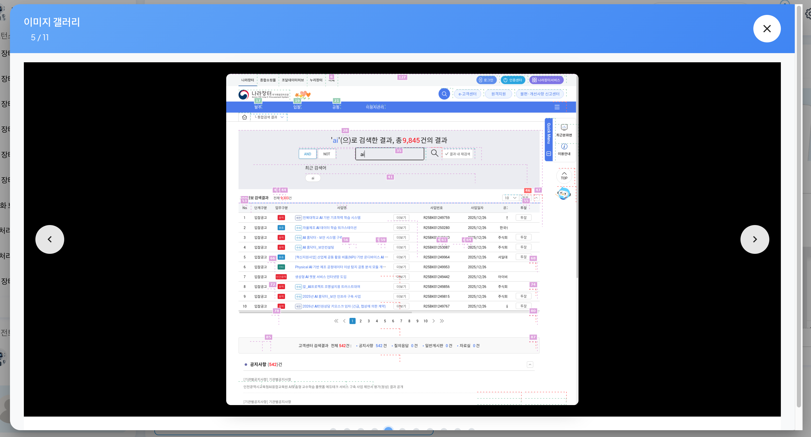 |  |
| :---: | :---: |

- 실제 브라우저 화면: 검색 결과 목록(좌)과 공고 상세 화면(우)을 탐색 중인 에이전트
 
 
 

### 3. 데이터 추출 및 시스템 연동 (Data Bridge)
**Complete Mode의 핵심 기능입니다.** 에이전트는 상세 페이지에 첨부된 제안요청서(RFP) 파일(.hwp)을 스스로 식별하여 다운로드합니다. 단순히 다운로드에 그치지 않고, 외부 웹의 파일을 시스템 내부의 워크플로우 데이터로 자동 변환하여 등록합니다.

- 브라우저 내에서 첨부파일 다운로드 버튼을 식별하고 클릭하는 과정
 
 
 

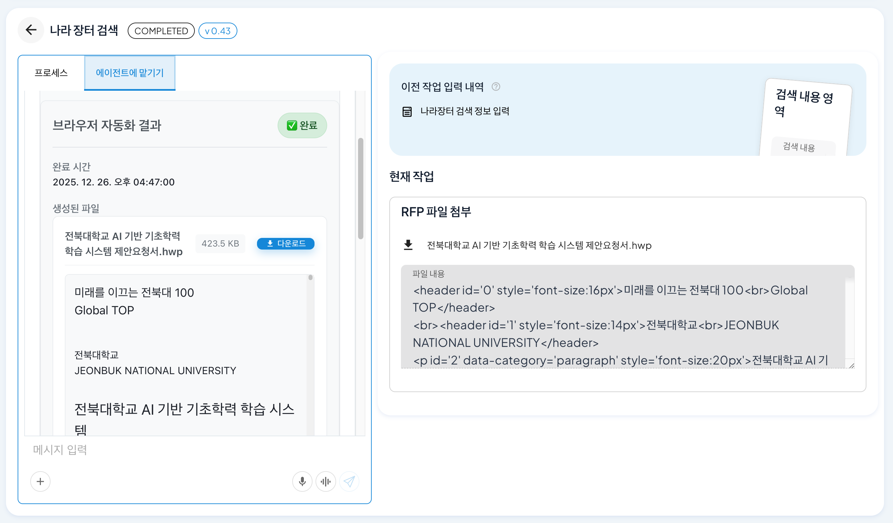
- 자동화 결과: 에이전트가 다운로드한 RFP 파일이 시스템 산출물로 자동 등록됨
 
 
 

### 4. 실시간 진행 상황 모니터링 (Monitoring)
복잡한 자동화 과정은 칸반 보드(Kanban Board)를 통해 실시간으로 시각화됩니다. 사용자는 에이전트가 현재 '검색' 중인지, '제안서 작성' 중인지 투명하게 확인할 수 있습니다.

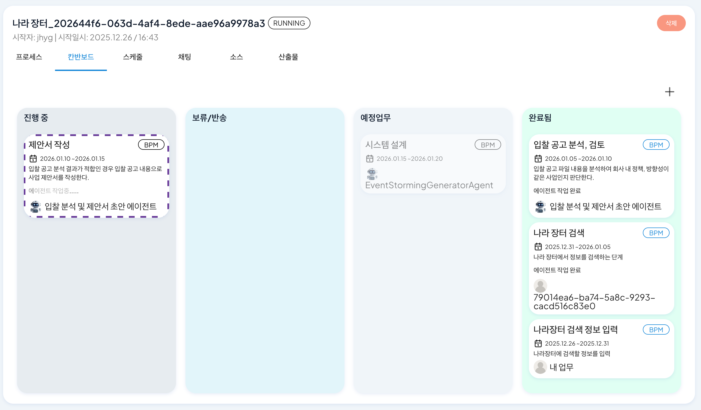
- 칸반 보드를 통해 에이전트의 작업 진행 상황(검색 완료 → 제안서 작성 중)을 확인하는 화면
 
 
 

### 5. 최종 결과물 생성 (Final Outcome: Report & Slide)
시스템에 등록된 RFP 내용을 바탕으로, '제안서 작성 에이전트'가 내용을 분석하여 최종 결과물을 생성합니다. 단순한 텍스트 나열이 아닌, 서식이 갖춰진 보고서와 발표용 슬라이드까지 생성합니다.

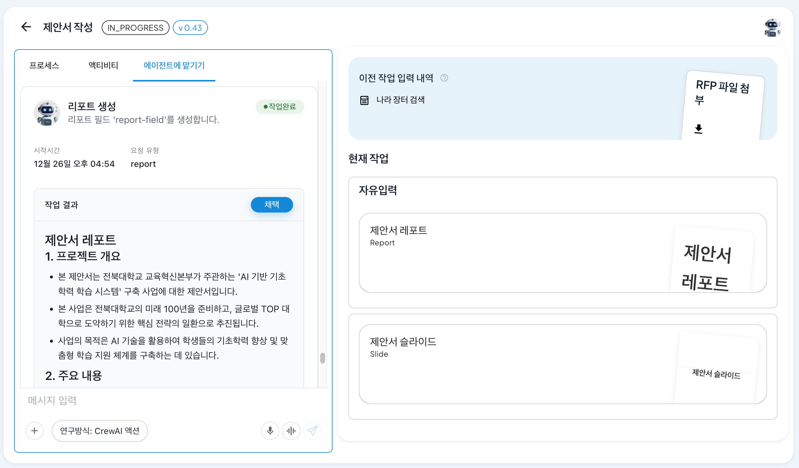
- 생성된 제안서 리포트 초안을 채팅 인터페이스에서 확인
 
 
 

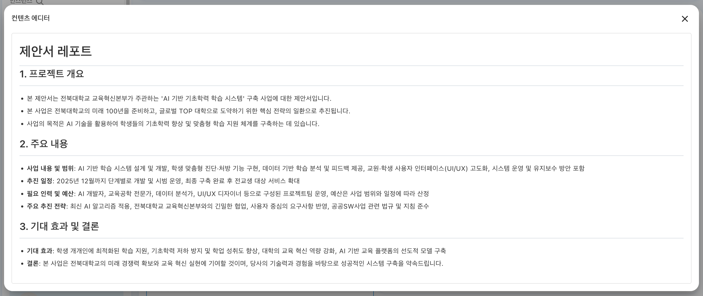
- 콘텐츠 에디터 뷰: 에이전트가 작성한 구조화된 제안서 보고서 상세
 
 
 

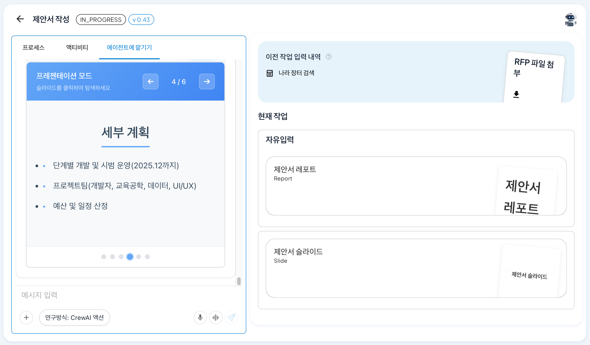
- 프레젠테이션 모드: 제안 내용을 바탕으로 자동 생성된 발표용 슬라이드 덱

