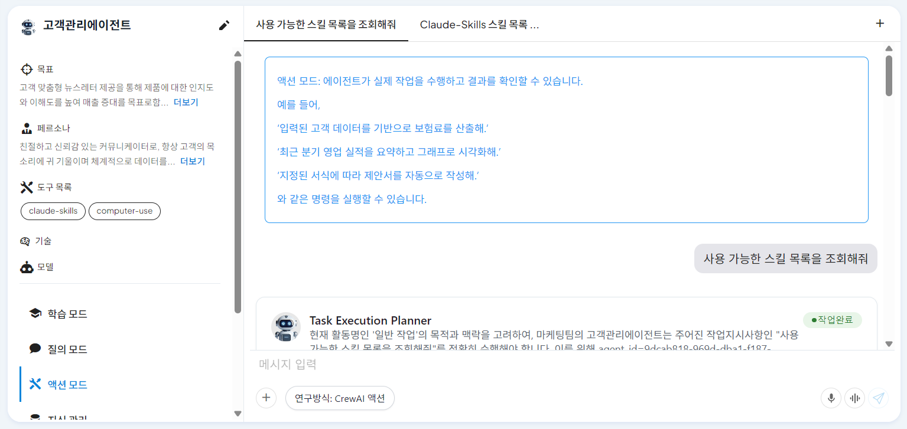
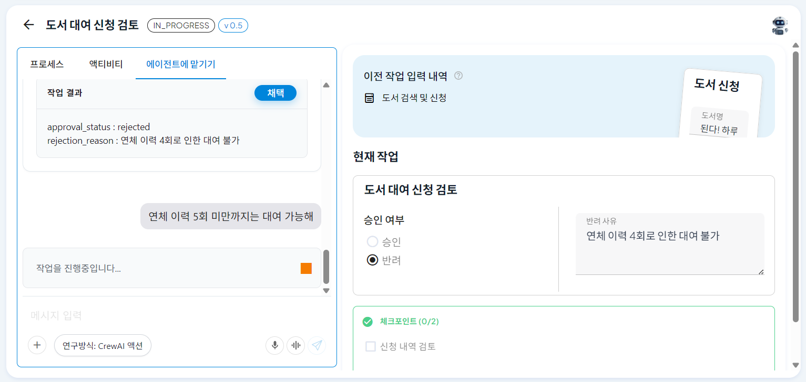
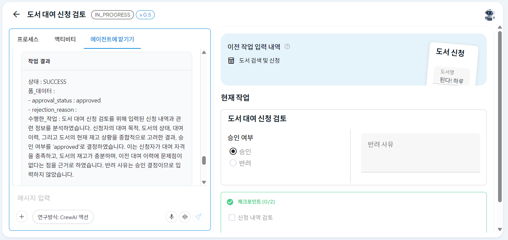
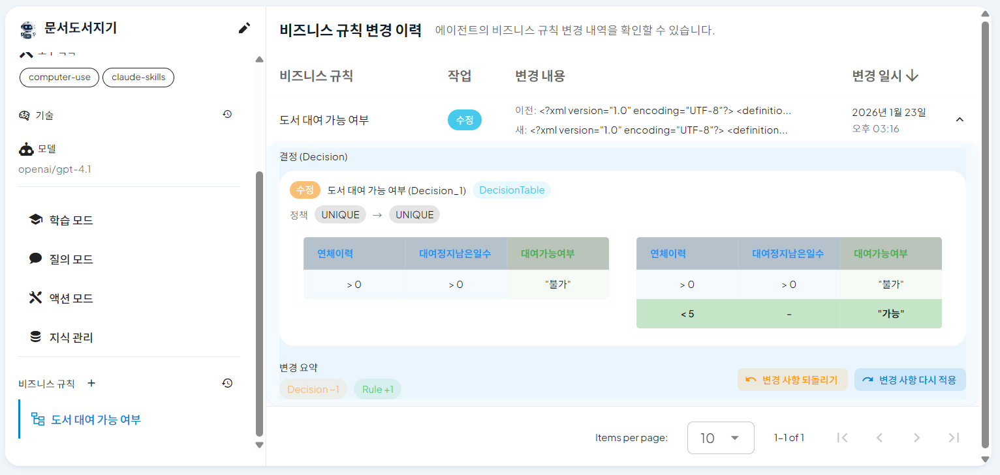
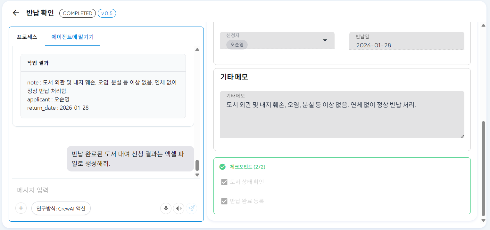
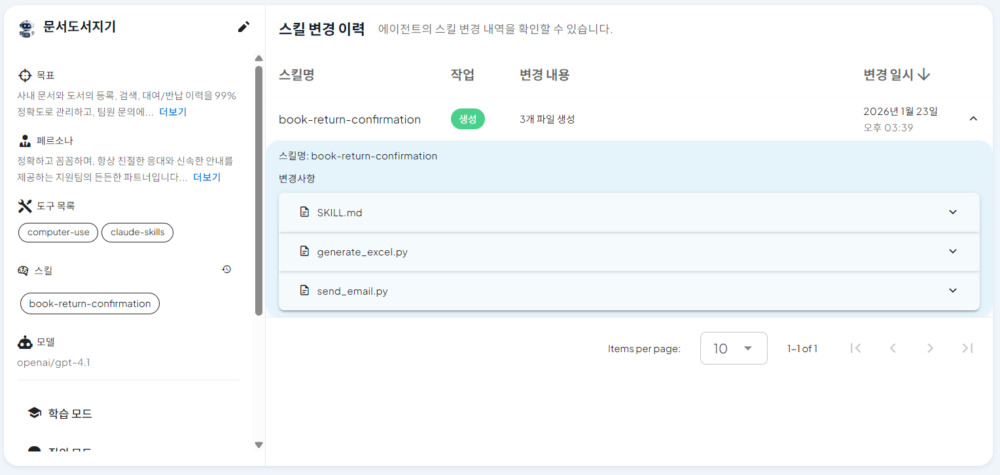
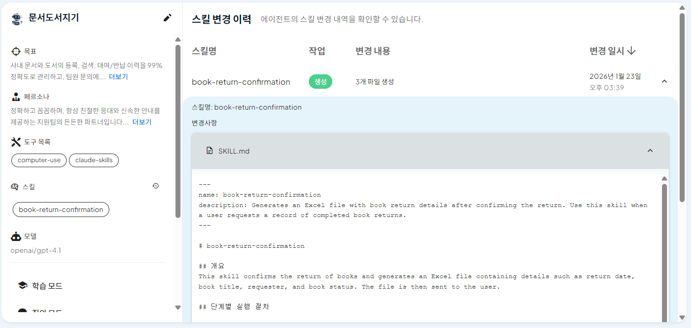
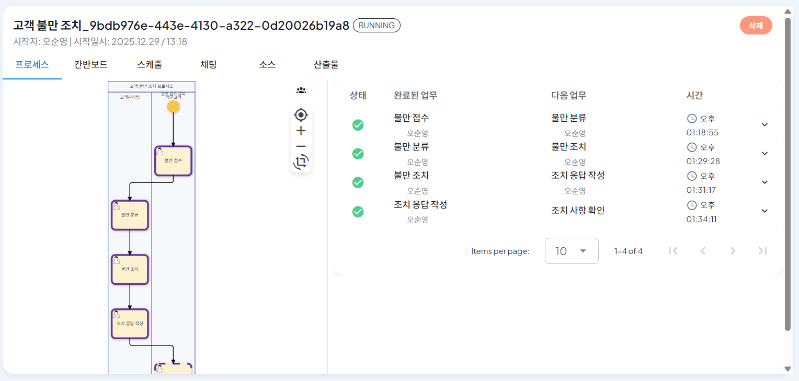
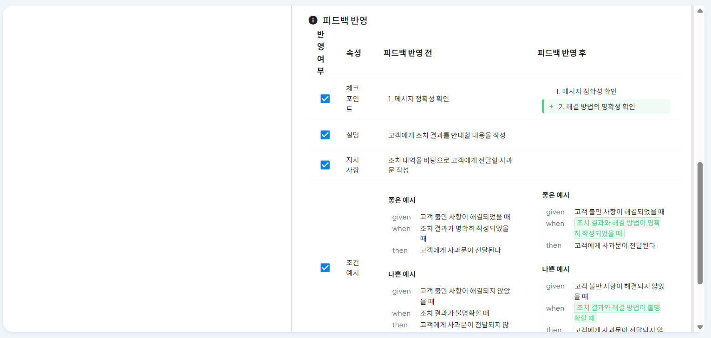
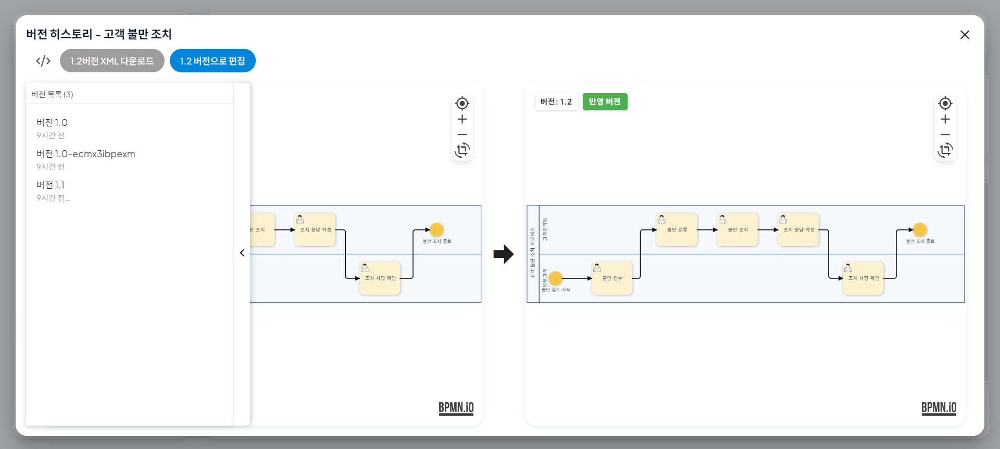

# Claude Skills 기반 추론 에이전트

ProcessGPT는 단순 답변형 AI를 넘어, **Claude Skills**와의 연동을 통해 상황을 분석하고 스스로 도구를 사용하여 과업을 완수하는 **자율형 에이전트(Autonomous Agent)** 기능을 제공합니다.

## 자가 발전형 에이전트란?

### 1. ProcessGPT x Claude Skills: 쓸수록 정교해지는 동적 파트너
"단순 수행을 넘어, 조직의 비즈니스 로직을 스스로 학습하고 최적화합니다."
기존의 AI 에이전트가 사전 정의된 스크립트만 반복하는 **'정적 도구(Static Tool)**'였다면, ProcessGPT는 피드백을 통해 성장하는 '**자가 발전형(Self-Evolving) 파트너**'입니다. 별도의 개발자 투입이나 복잡한 데이터 튜닝(Zero-Effort Training) 없이도, 에이전트는 매일 반복되는 업무 속에서 조직의 특성에 딱 맞는 형태로 진화합니다.

## 1. 3단계 추론 엔진 (Reasoning Engine)

에이전트는 사용자의 요청을 처리하기 위해 상황 분석(Thought) → 도구 실행(Action) → 결과 검증(Observation)의 3단계 추론 과정을 거칩니다. 사용자는 이 모든 과정을 '액션 모드'에서 투명하게 확인하고 에이전트의 행동 이유를 파악할 수 있습니다.

- **계획 수립**: 에이전트가 목표 달성을 위해 find_helpful_skills 등을 호출하여 필요한 스킬을 스스로 탐색합니다.
- **스킬 실행**: 데이터 분석, 문서 변환 등 복잡한 작업을 위한 스킬을 직접 실행하고 결과를 도출합니다.

- 에이전트가 작업을 수행하기 위해 스킬 목록을 조회하고 실행 계획을 수립하는 모습
 
 
 

- 스킬(Seaborn 등)을 활용하여 데이터 시각화 차트를 생성하고 최종 답변을 반환하는 화면
 
 
 

## 2. 주요 활용 시나리오
### 2. 활용 사례 1 :피드백 기반 비즈니스 규칙 재설계 (Rule Refactoring)
업무 처리 결과에 대해 사용자가 자연어로 피드백을 주면, AI는 이를 단순 메모로 남기지 않습니다. 피드백을 분석하여 시스템의 **비즈니스 규칙(Business Rule)**을 즉시 수정(Re-programming)합니다.

#### 2.1. 문제 상황 및 피드백 제공
에이전트가 기존 규칙(연체 이력 존재 시 대여 불가)에 따라 도서 대여 신청을 반려했습니다. 관리자는 채팅창을 통해 **"연체 이력 5회 미만까지는 대여 가능해"** 라고 새로운 정책을 자연어로 지시합니다.

- 에이전트의 반려 처리에 대해 관리자가 자연어로 정책 변경을 지시하는 모습
 
 
 

#### 2.2. 규칙 자동 변환 및 적용
AI는 즉시 이 피드백을 분석하여 내부의 결정 테이블(Decision Table)을 수정합니다. 복잡한 코딩 없이도 **'대여 가능 여부'** 판단 로직이 실시간으로 업데이트됩니다.

- 사용자의 피드백이 반영되어 DMN(Decision Model and Notation) 규칙이 **'연체 5회 미만 허용'**으로 변경된 이력
 
 
 

#### 2.3. 변경된 규칙으로 재처리 (Success)
규칙이 변경된 후, 동일한 조건의 대여 신청에 대해 에이전트는 승인 처리를 완료합니다. 이처럼 에이전트는 고정된 프로그램이 아니라, 상황에 맞춰 유연하게 대처하는 동료처럼 행동합니다.

- 변경된 규칙에 따라 도서 대여 신청이 정상적으로 승인된 결과 화면
 
 
 

### 3. 활용 사례 2: 실시간 코딩을 통한 스킬 생성 (Custom Skill Generation)
조직에 없던 새로운 기능이 필요할 때, AI는 실시간 코딩을 통해 **'새로운 스킬(Custom Skill)'**을 스스로 생성하여 대응합니다.

#### 3.1. 새로운 기능 요청
사용자가 **"반납 완료된 도서 대여 신청 결과는 엑셀 파일로 생성해줘"** 라고 요청합니다. 기존 시스템에는 엑셀 생성 기능이 없는 상태입니다.

- 기존에 없던 **'엑셀 파일 생성'** 기능을 자연어로 요청하는 사용자
 
 
 

#### 3.2. 스킬 생성 및 코드 작성
AI는 요청을 수행하기 위해 필요한 코드를 스스로 작성합니다. generate_excel.py와 같은 실행 코드를 생성하고, 이를 자신의 **스킬셋(Skillset)**에 등록합니다.

- AI가 book-return-confirmation이라는 새로운 스킬을 정의하고, 파이썬 코드를 자동 생성한 모습
 
 
 

#### 3.3. 스킬 등록 완료
이제 이 에이전트는 **'엑셀 생성'** 능력을 영구적으로 획득했습니다. 이후 유사한 요청이 들어오면 별도의 학습 없이도 해당 스킬을 사용하여 업무를 처리합니다.

- 생성된 스킬이 에이전트의 도구 목록에 정식으로 등록되어 언제든 재사용 가능한 상태
 
 
 

## 3. 통합 탭 및 프로세스 인스턴스 뷰

복잡한 업무 흐름을 파편화된 대화창이 아닌, 한눈에 파악할 수 있는 **'통합 탭'**과 **'테이블 UI'**로 제공합니다.

- **BPMN 시각화**: 좌측 프로세스 맵을 통해 현재 에이전트의 작업 단계(Task)를 실시간으로 추적합니다.
- **실행 로그 테이블**: 각 단계별 처리 시간, 담당자, 입출력 데이터를 리스트 형태로 관리하여 업무 효율을 높입니다.

- 프로세스 맵과 실행 로그를 하나의 화면에서 모니터링하는 통합 대시보드
 
 
 

## 4. 안전한 최적화: 임시 버전 (Ephemeral Versions)

운영 중인 전체 시스템을 중단하지 않고도, 특정 에이전트의 행동을 안전하게 수정하고 테스트할 수 있는 **'임시 버전(Ephemeral)'** 기능을 지원합니다.

- **피드백 루프**: 실행 결과가 의도와 다를 경우, 자연어로 피드백을 입력하면 AI가 이를 반영하여 조건을 즉시 수정합니다.
- **버전 관리**: 수정된 내용은 임시 버전으로 저장되어 라이브 환경에 영향을 주지 않으며, 충분한 검증 후 정식 버전으로 배포할 수 있습니다.

- 사용자의 피드백을 반영하여 에이전트가 판단 **기준(Given/When/Then)**을 스스로 교정하는 모습
 
 
 

- 수정된 내용을 임시 버전으로 저장하고, 이력을 관리하여 안전한 배포를 돕는 버전 히스토리

