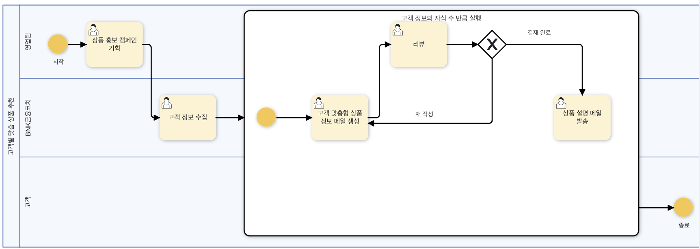
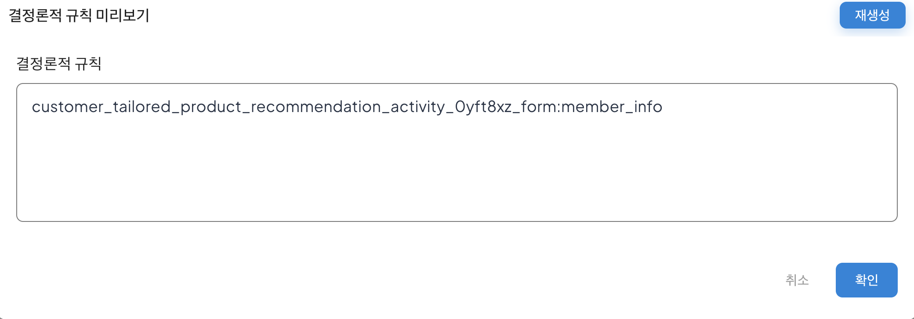

# 결정론적 규칙화

Process GPT는 기본적으로 비결정론적(Non-deterministic) AI 추론을 활용하여 자연어 기반의 조건 평가, 상황 판단, 의사결정 등을 수행하지만, 동일한 입력에 대해 매번 결과가 다르게 나오는 AI의 특성은 비즈니스 프로세스의 일관성과 재현성을 저해할 수 있습니다.

이를 위해 비결정론적으로 수행된 결과중 검증된 결과를 기반으로 이후 동일한 입력에 동일하게 동작하도록 하는 결정론적 규칙화 기능을 추가하였습니다.

결정론적 규칙화는 다음과 같은 흐름으로 동작합니다.

1) AI가 자연어로 기술된 조건이나 상황을 해석하여 판단을 수행합니다. 이때, 판단 과정은 비결정론적이기에 결과가 다를 수 있습니다.

2) 시스템은 입력-출력 사례를 케이스 뱅크에 누적하고, 학습을 통해 검증된 사례를 식별합니다.

3) 충분히 검증된 케이스는 AI에 의해 자동으로 Python 코드로 변환되며, 이 코드가 비결정론적 판단을 대체하는 결정론적 규칙으로 적용됩니다.

4) 이후 동일한 입력이 주어질 경우, 시스템은 AI 추론을 수행하지 않고 Python 코드를 실행합니다. 이를 통해 일관된 결과를 보장하며 처리 속도도 향상됩니다.

이 과정으로 ProcessGPT는 비결정론적 AI의 유연한 판단, 자연어 추론 능력과 결정론적 시스템의 안전성, 트랙잭션 보장이 결합된 하이브리드 인텔리전스 구조를 실현합니다.

## 결정론적 규칙 설정하기
고객별 맞춤 상품 추천 프로세스를 통해 결정론적 규칙을 설정하는 방법은 다음과 같습니다.<bt>

먼저, 아래과 같이 고객별 맞춤 상품 추천 프로세스를 준비합니다. 
 

우측 메뉴의 '프로세스 편집'을 클릭하여 편집 상태를 활성화 한 후, 서브 프로세스 영역을 더블 클릭하여 패널을 활성화합니다. 
 

이후, '결정론적 규칙화' 버튼을 클릭합니다. 클릭하면 아래와 같은 화면이 생성되며 서브 프로세스의 이름인 '고객 정보의 자식 수 만큼 실행'을 코드로 변환한 결과가 나타나는 것을 확인할 수 있습니다. 이를 통해 이전 프로세스인 고객 정보 수집 단계에서 수집된 고객의 수 만큼 서브프로세스가 실행되도록 처리됩니다.
 

결정론적 규칙이 설정된 후, 저장하여 패널을 닫고 프로세스를 저장합니다. 이후, 프로세스를 실행 및 빠른 예시 생성을 통해 고객 정보 수집 프로세스 단계를 완료하면 아래와 같이 기존에 입력한 3명의 고객에 따른 고객 맞춤형 상품 정보 메일 생성 프로세스가 생성된 것을 확인할 수 있습니다. 
 
<고객 정보 수집 프로세스 예시>  

 
<수집된 고객 정보 수에 따른 서브프로세스 실행>  

