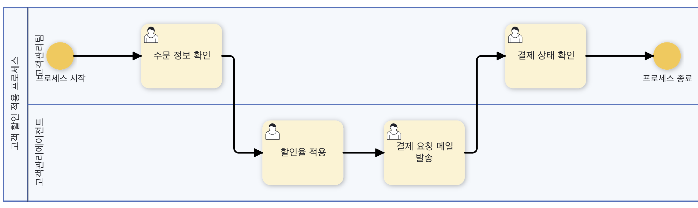
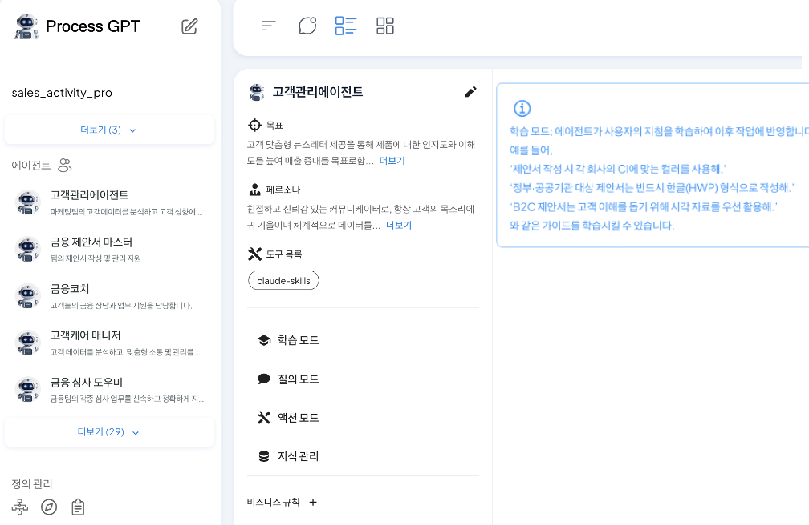
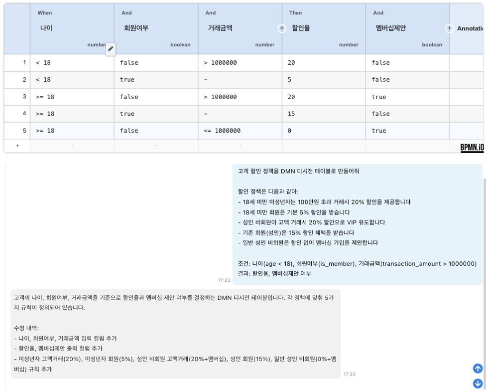
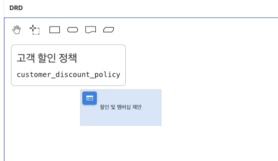
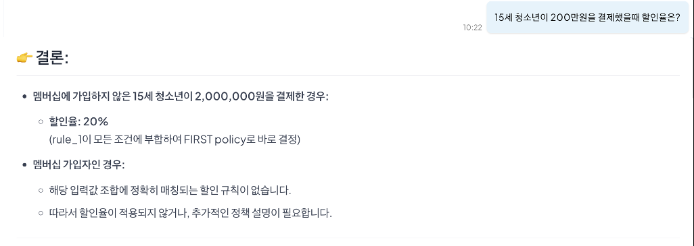
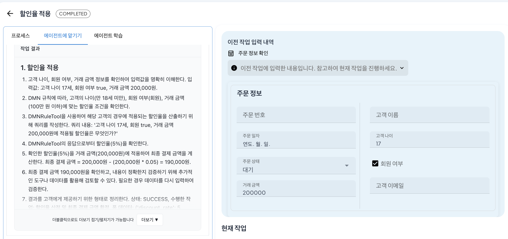
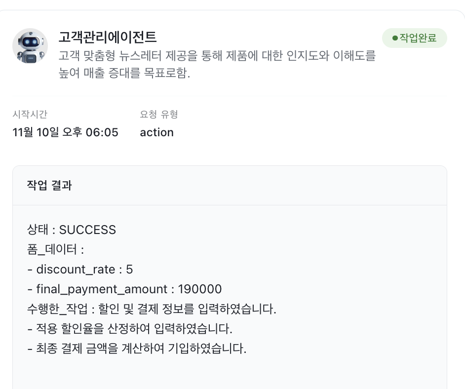

# DMN(Decision Model and Notation)

## 에이전트의 DMN 규칙 학습 및 추론

에이전트 학습 기능은 사내 업무 정보를 학습하여 AI가 유연하게 판단할 수 있도록 지원하지만, AI 특성상 동일한 상황에서도 다른 결과가 나올 수 있는 불확실성이 존재합니다.

이를 보완하는 **DMN(Decision Model and Notation)** 이라는 비즈니스 의사결정 모델링을 통해 명확한 규칙 기반으로 에이전트가 **Deterministic(결정론적)** 하게 의사결정을 수행하는 기능을 추가하였습니다.

사용자가 **자연어로 규칙을 설명하거나 DMN 이미지를 첨부**하면 디시전 테이블이 자동 생성되고, 에이전트는 이를 학습합니다. 프로세스 실행 시 에이전트는 **이전 단계의 데이터를 기반으로 자동 추론**하여 규칙에 따른 결과를 도출합니다.

이를 통해 동일한 입력에 대해 항상 일관된 결과를 보장하고, 의사결정 과정을 명확하게 추적할 수 있습니다.

## DMN 사용하기
고객 할인 적용 프로세스를 예시로 DMN 규칙을 정의하고 학습한 뒤, 이를 기반으로 프로세스를 실행하는 방법은 다음과 같습니다.

먼저, 고객 할인 적용 프로세스를 아래와 같이 생성합니다.


### 1. DMN 정의하기
프로세스를 생성한 후, 에이전트 > 고객 관리 에이전트를 클릭한 다음 비즈니스 규칙의 '+'를 클릭합니다. <br>
DMN 생성은 사용자가 직접 생성하는 방법, 자연어 기반으로 DMN을 정의하는 방법, 마지막으로 이미지, 엑셀 자료를 첨부하여 AI를 통해 DMN을 생성할 수 있습니다.


DMN을 생성하기 위해 아래의 고객 할인 정책에 대한 요구사항을 '메시지 입력'란에 복사하여 붙여넣습니다. <br>
```
고객 할인 정책을 DMN 디시전 테이블로 만들어줘

할인 정책은 다음과 같아:
- 18세 미만 미성년자는 100만원 초과 거래시 20% 할인을 제공합니다
- 18세 미만 회원은 기본 5% 할인을 받습니다
- 성인 비회원이 고액 거래시 20% 할인으로 VIP 유도합니다
- 기존 회원(성인)은 15% 할인 혜택을 받습니다
- 일반 성인 비회원은 할인 없이 멤버십 가입을 제안합니다

조건: 나이(age < 18), 회원 여부(is_member), 거래금액(transaction_amount > 1000000)
결과: 할인율, 멤버십 제안 여부
```
<br>
생성이 완료되면 아래와 같은 응답과 함께 요구사항 기반 디시전 테이블이 생성되며, 저장 시 해당 DMN 비즈니스 규칙이 에이전트의 의사결정 규칙으로 등록되어 프로세스 실행 시 자동 적용됩니다. <br>

 <br>
<디시전 테이블 생성 예시> <br><br>
 <br>
<DMN 생성 예시>

또한 메시지 입력 하단의 '추론'을 선택하여 자연어 기반 조건에 대한 질문을 통해 생성한 디시전 테이블 규칙에 대한 검증을 진행할 수 있습니다.<br>



### 2. DMN 기반 프로세스 실행하기

'프로세스 정의 체계도'로 이동하여 고객 할인 적용 프로세스를 실행합니다.

'할인율 적용' 단계에서 '에이전트에 맡기기' 탭을 클릭하면 아래와 같이 에이전트가 이전 단계에 입력된 주문 정보에서 고객 나이, 거래 금액, 회원 여부를 확인하여 디시전 테이블에 정의한 규칙을 기반으로 할인율을 계산합니다. 


이후 최종적으로 고객 관리 에이전트에 의해 할인된 금액을 결과로 반환하는 것을 확인할 수 있습니다.
