# 완전자율주행 딥에이전트, Plan & Solve

## 1. MCP를 탑재한 멀티 에이전트 자동 초안 생성

멀티 에이전트는 MCP(Model Context Protocol) 통합 멀티에이전트를 통한 프로세스 자동화로, 복잡한 업무를 단계별로 분석하고 최적의 솔루션을 자율적으로 구현하는 시스템입니다.

업무 요구사항에 따라 전문화된 AI 에이전트들이 자동으로 팀을 구성하여 각자의 전문 분야에서 프로젝트를 수행하며, 각 에이전트가 독립적으로 목표를 달성하기 위해, 에이전트 간 위임과 질의를 통해 유연한 프로세스를 수행을 통한 자율적으로 문제를 해결합니다.  
또한, MCP를 통해 내부 문서 검색, Office 도구, 데이터베이스, 클라우드 서비스 등 수백 가지 업무 도구가 하나의 인터페이스로 연결되어 에이전트들이 실제 직원처럼 회사의 모든 시스템에 접근하여 CRM 분석부터 보고서 작성, 일정 관리, 부서 협업까지 자동으로 처리하여 기존 수주일 걸리던 업무를 수시간 내로 단축하고 에이전트들의 다양한 도구활용을 통해 전문성을 보장합니다.

### 1.1멀티 에이전트 초안 생성하기

멀티 에이전트를 활용하여 영업관리 프로세스의 제안서 초안을 생성하는 방법은 다음과 같습니다.

프로세스 정의 체계도에 등록된 프로세스를 클릭한 후, 아래와 같은 화면에서 '실행'을 클릭합니다.  
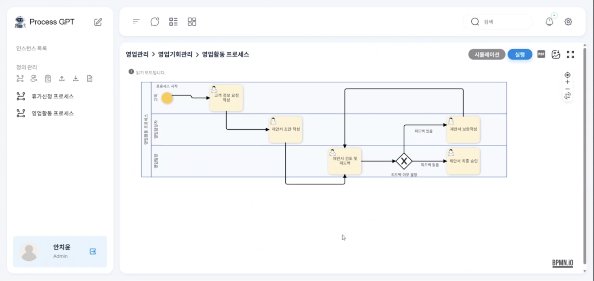
 
 
 

이후, 상단 항목에서 '빠른 초안 생성'을 클릭하여 고객 정보 요청 작성 task를 생성 후, '제출 완료'를 클릭합니다.  
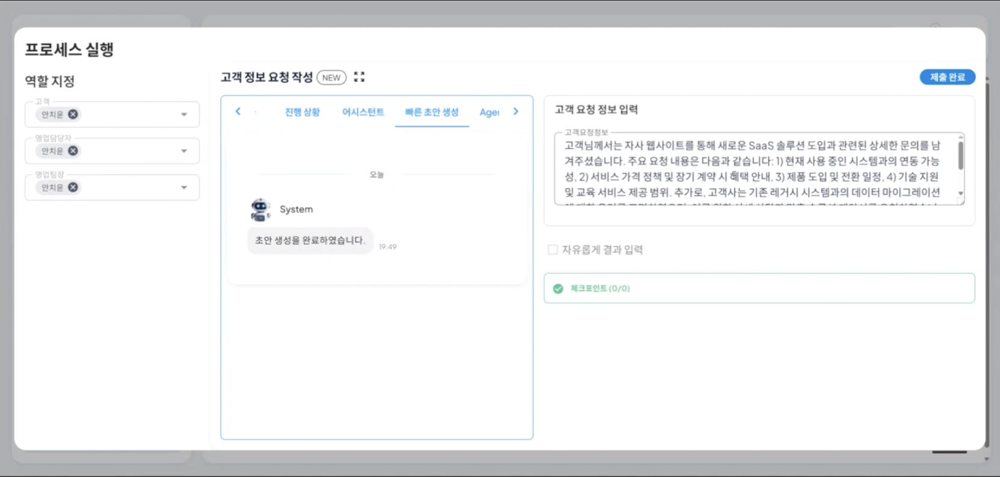
 
 
 

제출이 완료되면 진행상황에서 고객 정보 요청 작성 task가 완료된 것을 확인함과 동시에 제안서 초안 작성 task가 현재 진행상태로 표시된 것을 확인할 수 있습니다.  
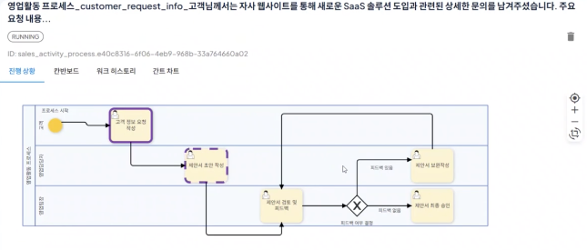
 
 
 

이후 '칸반보드'를 클릭하여 영업관리 프로세스의 전체 task중 진행 중인 task 제안서 초안 작성을 클릭합니다.  
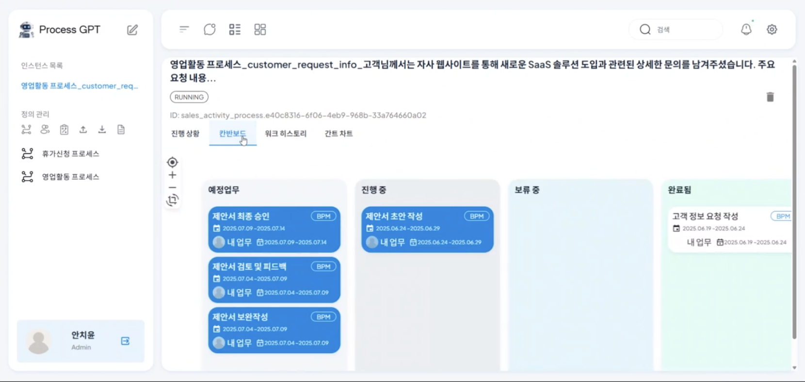
 
 
 

제안서 초안 작성 task 에서 Agent 모니터링을 클릭하면 영업관리 프로세스의 요구사항에 따른 전문화된 AI 에이전트들이 각자 필요한 제안서 초안 작성을 시작합니다.  
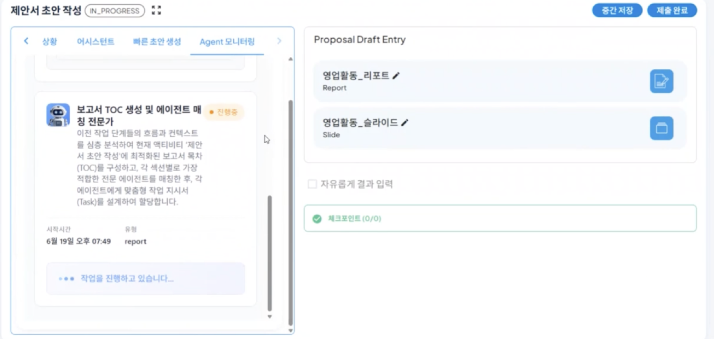
 
 
 

에이전트에 의해 작성된 영업활동 리포트에 대한 초안중 하나를 '채택'을 클릭하여 등록하면 아래와 같이 Proposal Draft Entity 항목에 채택한 리포트가 생성됩니다.  
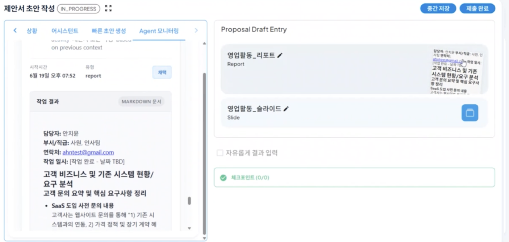
 
 
 

해당 리포트를 클릭하면 세부적인 내용을 확인할 수 있으며, 일부 내용중 수정이 필요한 사항이나 추가해야될 사항에 대하여 작업을 진행할 수 있습니다.  
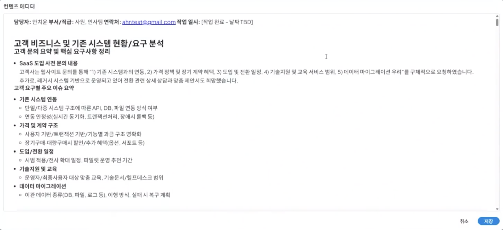
 
 
 

특정 내용에 대하여 Drag를 진행하면 아래와 같이 Drag한 영역에 대하여 요구사항을 입력하고 생성 및 수정을 진행할 수 있습니다.  
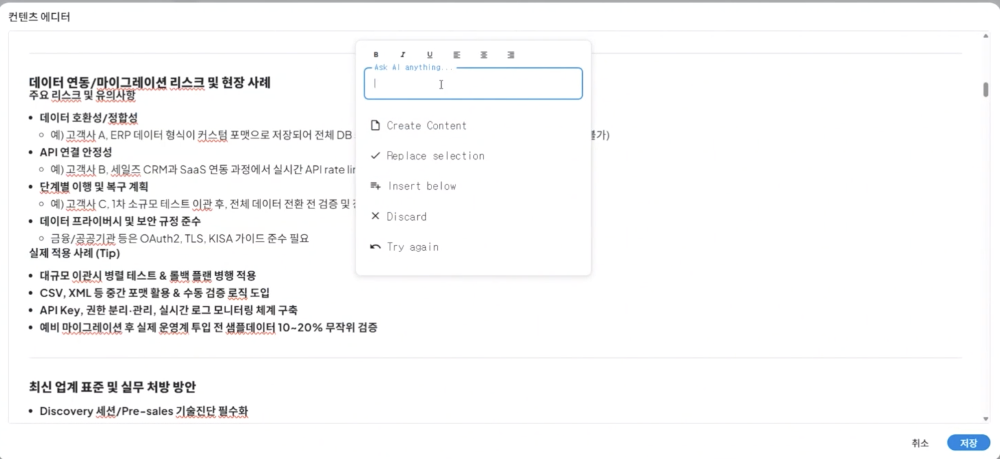
 
 
 

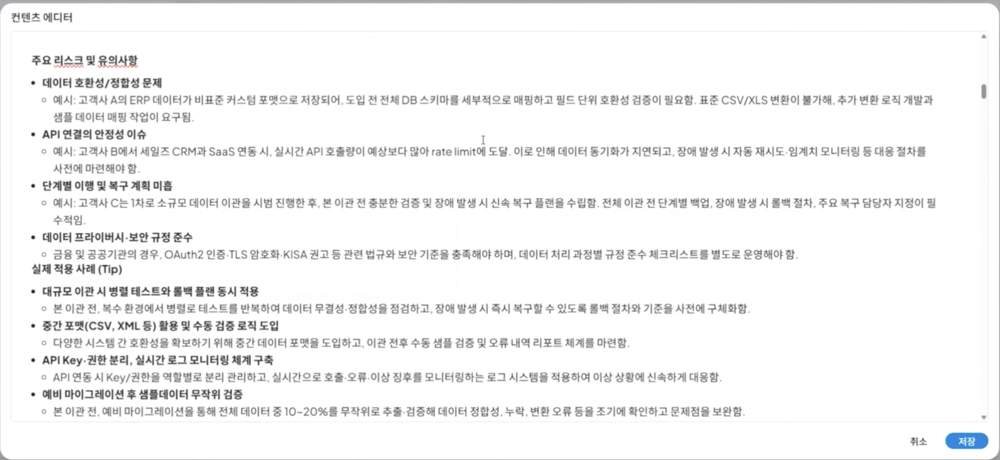
<요구사항에 따른 리포트 수정 결과>
 
 
 

동일한 방식으로 아래와 같이 '영업활동_슬라이드'에 대하여 선택한 후, '제출완료'를 클릭하여 제안서 초안 작성 task를 마무리합니다.
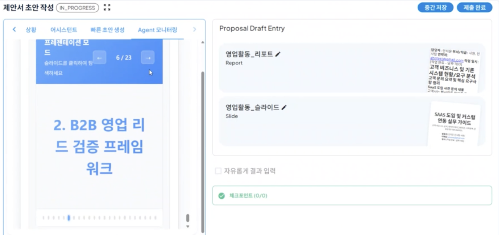
 
 
 

이후, 다시 진행 상황을 확인하면 진행 중이던 제안서 초안 작성 task가 AI 에이전트가 생성해준 제안서를 기반으로 완료된 것을 확인할 수 있습니다.
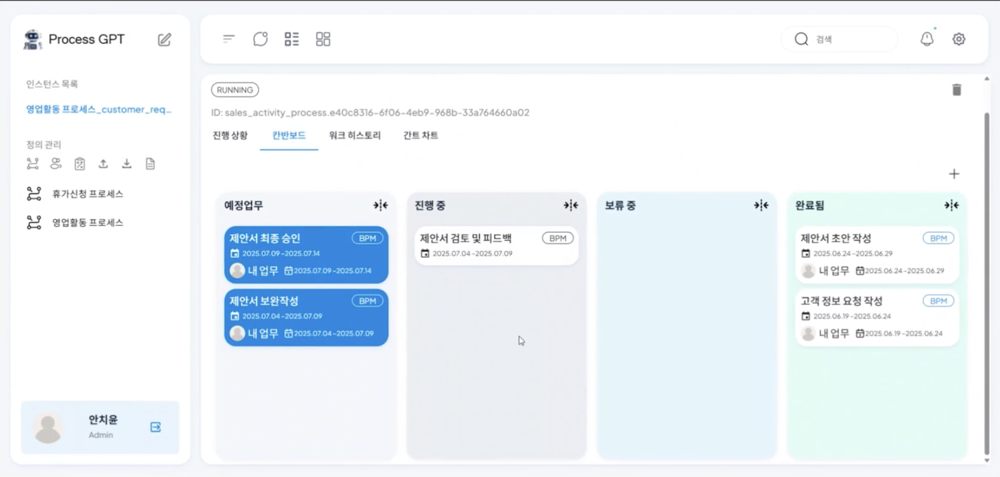
 
 
 

## 2. 지능형 다중 에이전트 (Multi-Agent) 시스템

ProcessGPT의 멀티 에이전트는 사용자의 질문에 단순히 대답만 하는 챗봇이 아닙니다. 당신의 비즈니스 규칙을 이해하고, 목표 달성을 위해 여러 AI가 유기적으로 협력하여 움직이는 '디지털 팀(Digital Team)'입니다.

### 2.1 알아서 척척, 맞춤형 비서 세팅 및 역할 분담

사용자가 복잡한 워크플로우를 일일이 설계할 필요가 없습니다. 에이전트에게 '목표(Goal)'와 '역할(Persona)'만 부여하세요.
시스템이 스스로 업무 규칙과 난이도를 이해하고, 작업을 여러 단계로 쪼개어 하위 에이전트(Sub-Agent)들에게 역할을 분담시킵니다. Main Agent의 지휘 아래 각 분야에 특화된 Sub-Agent들이 협력하여 복잡한 프로젝트를 성공적으로 수행합니다.

### 2.2 끊기지 않는 기억력: VFS (Virtual File System) 아키텍처

여러 에이전트가 협업할 때 가장 큰 문제는 '맥락(Context)의 단절'입니다. ProcessGPT는 이를 해결하기 위해 대용량 가상 파일 시스템(VFS) 아키텍처를 적용했습니다.
아무리 복잡하고 긴 프로세스라도, 모든 에이전트가 VFS를 통해 작업 내역과 산출물을 실시간으로 공유하므로 처음부터 끝까지 맥락의 유실 없이 완벽하게 기억하고 업무를 이어갑니다.

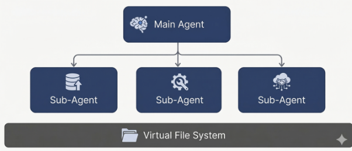
[Main Agent가 Sub-Agent를 지휘하고 VFS가 전체 맥락을 공유하는 구조]
 
 
 

### 2.3 완벽한 통제: Critical Pause를 통한 안전한 의사결정

AI에게 업무를 완전히 맡기는 것에 대한 불안감을 해소합니다. 에이전트가 스스로 판단하기에 리스크가 있거나, 관리자의 승인이 반드시 필요한 중요한 분기점(결제, 최종 발송, 중요 데이터 삭제 등)에 도달하면 시스템은 **스스로 대기 상태(Critical Pause)**에 돌입합니다.

관리자가 내용을 최종 확인하고 승인(Approve)한 후에만 다음 작업을 재개하므로, 100% 예측 가능하고 안전한 결과를 보장합니다.

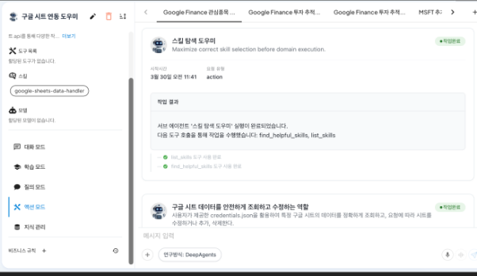
[Google Sheets 데이터를 다중 에이전트가 실시간으로 수집·처리하는 화면]
 
 
 

## 3. 명령형 AI에서 위임형 AI로

기존의 AI는 운전자가 매 순간 페달과 핸들을 조작해야 하는 자동차와 같았습니다. 사용자가 단계마다 다음 행동을 지시해야 했고, 도구 사용 순서·데이터 출처·예외 처리까지 일일이 관여해야 했습니다. 결과적으로 AI에게 일을 맡기는 것이 오히려 더 번거로운 경우도 많았습니다.

**ProcessGPT의 딥에이전트(Deep Agent)는 다릅니다.** 자동차의 완전자율주행처럼, **목적지(요청)만 알려주면 경로 설계부터 운행 완료까지 스스로 해냅니다.** 이를 가능하게 하는 것이 **Plan & Solve 패러다임**입니다.

> **📌 Plan & Solve란?**
> 메인 에이전트가 사용자 요청을 받아 ① 작업을 분해하고 계획을 수립(**Plan**)한 뒤, ② 적절한 서브 에이전트와 도구를 동원해 끝까지 실행(**Solve**)하는 자율 실행 모델입니다. 사용자는 결과만 받아보면 됩니다.

---

## 4. Plan 단계 — 스스로 분해하고, 스스로 구성합니다

사용자 요청이 들어오면 **메인 에이전트(Main Agent)**가 가장 먼저 수행하는 일은 응답을 만드는 것이 아닙니다. **"이 요청을 어떻게 풀 것인가"를 먼저 설계**합니다.

### 4.1 동적 플랜 생성 (Dynamic Plan Generation)

메인 에이전트는 요청의 복잡도를 스스로 판단해 다음 두 가지 경로 중 하나를 선택합니다.

- **단순 요청** → 메인 에이전트가 직접 처리해 응답 시간을 최소화합니다.
- **복잡한 요청** → 작업을 여러 하위 작업으로 분해하고, 각 하위 작업에 특화된 **서브 에이전트(Sub-Agent)**를 동적으로 구성합니다.

여기서 중요한 점은, 서브 에이전트가 사전에 등록된 고정 워크플로우가 아니라 **요청에 맞춰 그때그때 생성되는 일회성 에이전트**라는 것입니다. 동일한 사용자라도 요청 내용에 따라 매번 다른 조합으로 작업이 분해됩니다.

### 4.2 자동 스킬 매핑 (Automatic Skill Mapping)

각 서브 에이전트는 자신의 역할을 수행하기 위해 어떤 **스킬(Skill)**과 **도구(Tool)**가 필요한지 별도 지정 없이 자동으로 매핑받습니다. 사용자가 "어떤 API를 써라", "어떤 데이터 소스를 봐라"를 일일이 알려주지 않아도 됩니다.

**예시:** "휴가 신청은 어떻게 하는지 알려주고, 내 휴가 신청 현황도 알려줘"

| 단계 | 자동 매핑된 도구 |
|------|----------------|
| 사용자 식별 | `get_current_user` |
| 프로세스 정의 조회 | `프로세스 목록 조회`, `프로세스 상세 조회` |
| 신청 양식 파악 | `폼 필드 조회` |
| 본인 진행 현황 조회 | `인스턴스 목록 조회`, `할일 목록 조회` |

→ **사용자는 한 문장만 입력했지만, 메인 에이전트는 6개 도구를 동시에 호출**합니다.

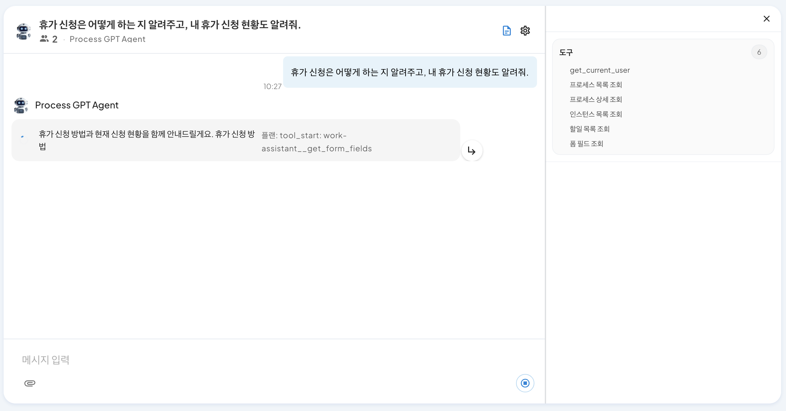
[Plan — 요청을 분해하고 필요한 도구를 자동으로 선택합니다. 우측 패널에 6개 도구가 자동 호출되는 모습이 실시간으로 노출됩니다.]
 
 
 

---

## 5. Solve 단계 — 끝까지 실행하고, 통합된 결과를 돌려드립니다

계획이 수립되면 서브 에이전트들이 병렬 또는 순차로 작업을 실행하고, 메인 에이전트는 그 결과를 하나로 묶어 최종 답변을 만듭니다.

### 5.1 자율 실행 (Autonomous Execution)

- 사용자에게 추가 질문 없이 등록된 데이터·시스템 호출로 답을 찾아냅니다.
- 실패한 도구 호출은 재시도하거나 대체 경로를 탐색합니다.
- 여러 서브 에이전트의 결과를 메인 에이전트가 **하나의 일관된 답변으로 통합**해 응답합니다.

### 5.2 백그라운드 지속 실행 (Background Persistence)

긴 작업의 경우 사용자가 채팅창을 닫거나 다른 업무를 보고 있어도 **에이전트는 백그라운드에서 작업을 끝까지 마무리**합니다. 생성된 파일·산출물은 별도 다운로드 목록으로 관리되어 언제든 다시 확인할 수 있습니다.

이는 LangGraph 기반 체크포인팅 구조 위에 구현되어 있으며, 컨테이너가 재기동되거나 다른 노드로 이동하더라도 작업이 중단되지 않고 이어집니다.

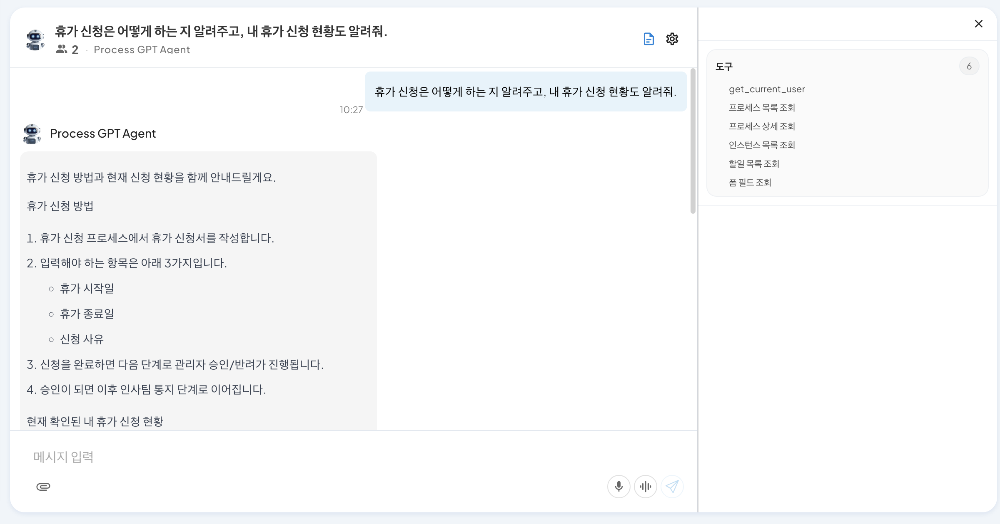
[Solve — 6개 도구를 조합해 완성된 답변을 돌려드립니다. 신청 절차 안내(프로세스 정의) + 본인 신청 현황(인스턴스)을 한 화면에 통합 응답.]
 
 
 

---

## 6. 안전장치 — Human-in-the-Loop

자율의 속도가 곧 위험의 속도가 되어서는 안 됩니다. ProcessGPT의 딥에이전트는 다음과 같은 작업에 대해 **반드시 사용자의 명시적 승인**을 거칩니다.

- DB 데이터 삭제·변경 등 되돌릴 수 없는 작업
- 외부 시스템에 대한 쓰기 행위 (메일 발송, 결재 상신, 결제 등)
- 사전에 관리자가 지정한 민감 작업

자동화의 속도와 사람의 판단력이 균형 있게 결합된 구조입니다. 자율주행 차에 비상 정지 버튼이 있는 것과 같습니다.

### 6.1 생성 전 검토 — 스킬·에이전트·DMN 룰 선택

프로세스를 곧바로 생성하지 않고, AI가 필요하다고 판단한 스킬·에이전트·DMN 룰 후보를 먼저 제시합니다. 사용자는 이 중 원하는 항목만 선택해 승인하며, 직접 입력란을 통해 추가 요청도 할 수 있습니다. 승인된 항목만 생성에 반영되므로, 원치 않는 요소가 결과물에 섞이는 것을 사전에 차단합니다.

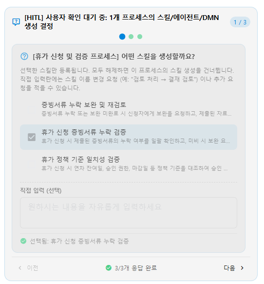
[HITL 단계에서 생성할 스킬·에이전트를 사용자가 직접 선택하는 화면 (휴가 신청 프로세스 예시)]
 
 
 

### 6.2 생성 해상도 선택

같은 문서로도 업무 목적에 따라 결과물의 상세도를 직접 지정할 수 있습니다. 간소화(concise)·표준(standard)·상세(detailed) 중 하나를 선택하면, 그에 맞춰 노드 정규화 및 중복 제거 강도가 조정됩니다. 보고용은 간소화, 교육·매뉴얼용은 상세하게 등 한 번의 생성으로 여러 용도에 대응합니다.

### 6.3 생성 후 자동 검증·보완

승인된 대로 프로세스를 생성한 직후, 시스템이 결과물의 결함을 스스로 점검하고 누락된 부분을 자동으로 교정합니다. 사용자가 일일이 검수하지 않아도 완성 시점에는 이미 한 차례 검증을 거친 결과물이 제공됩니다. 이는 원칙 3(자동 보상과 복구 책임 분리)에 따라, 시스템이 스스로 무결성을 책임지는 방식입니다.

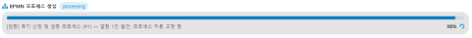
[생성된 프로세스의 결함을 시스템이 자동 탐지·교정하는 화면]
 
 
 

---

## 7. 동작 예시 — 휴가 신청 시나리오

### 사용자 요청
> "휴가 신청은 어떻게 하는지 알려주고, 내 휴가 신청 현황도 알려줘."

### 에이전트 동작

**Plan 단계 (즉시):**
- 메인 에이전트가 요청을 두 개의 하위 목적으로 분해
  - ① 휴가 신청 절차 안내 (정의 영역)
  - ② 본인의 휴가 신청 현황 조회 (인스턴스 영역)
- 각 목적에 필요한 도구 6개를 자동 식별
- `tool_start: work-assistant__get_form_fields` 부터 순차 호출 시작

**Solve 단계 (수 초 내):**
- 신청 방법 단계별 안내 (프로세스 정의 + 폼 필드 기반)
  1. 휴가 신청 프로세스에서 신청서를 작성
  2. 입력 항목: 휴가 시작일 / 휴가 종료일 / 신청 사유
  3. 신청 완료 시 관리자 승인/반려 단계 진행
  4. 승인 후 인사팀 통지 단계로 이어짐
- 본인 신청 현황 통합 표시 (인스턴스 + 할일 기반)

### 사용자 관점 차이
- **기존 방식:** "프로세스 정의를 보여줘" → 확인 → "내 신청 현황을 보여줘" → 확인 → 두 정보를 머릿속에서 결합
- **Plan & Solve:** **한 문장 → 통합된 한 답변**

---

## 8. 기존 방식과의 비교

| 구분 | 기존 단편적 AI | Plan & Solve 딥에이전트 |
|------|--------------|----------------------|
| **사용자 부담** | 단계별 지시 필요 | 한 번의 요청으로 위임 |
| **작업 분해** | 사용자가 직접 분해·지시 | 메인 에이전트가 자동 분해 |
| **서브 에이전트** | 없음 또는 고정 | 요청별 동적 생성 |
| **도구 매핑** | 사용자가 명시적 지정 | 역할 기반 자동 매핑 |
| **실행 지속성** | 화면 이탈 시 중단 | 백그라운드 자율 완료 |
| **결과 형태** | 도구 호출별 분리된 응답 | 통합된 단일 답변 |
| **안전 제어** | 없음 또는 일괄 차단 | 치명적 작업만 HITL 승인 |

---

## 9. 적용에 적합한 업무

Plan & Solve 딥에이전트는 **여러 시스템·데이터·규칙을 가로지르는 업무**에서 가장 큰 효용을 발휘합니다.

- **사내 행정** — 휴가·출장·구매 신청 절차 안내 + 본인 현황 조회
- **데이터 분석** — 여러 DB·파일에서 데이터 수집 → 가공 → 시각화
- **문서 처리** — PDF·BPMN·엑셀 등 이종 양식 파싱 → 통합 보고서 생성
- **프로세스 운영** — 인스턴스 모니터링 + 이상 감지 + 담당자 알림 자동화
- **고객 응대** — 정책 안내 + 고객별 이력 조회 + 응대 가이드 생성

반대로 **단일 정보 조회**나 **명확한 단일 도구 호출**처럼 분해가 필요 없는 작업에서는 메인 에이전트가 직접 처리하므로, 시스템이 항상 무겁게 동작하지 않습니다.

---

## 10. 핵심 메시지

> **단순한 대화형 봇을 넘어, 비즈니스 맥락을 이해하고 주도적으로 워크플로우를 오케스트레이션합니다.**
> **이제 투명하고 통제 가능한, 진짜 AI 자동화를 경험하십시오.**

---

*ProcessGPT는 LangChain Deep Agents 아키텍처 기반의 엔터프라이즈 AI 워크스페이스이며, 본 문서에서 설명한 Plan & Solve 동작은 모든 표준 라이선스 환경에서 기본 제공됩니다.*

