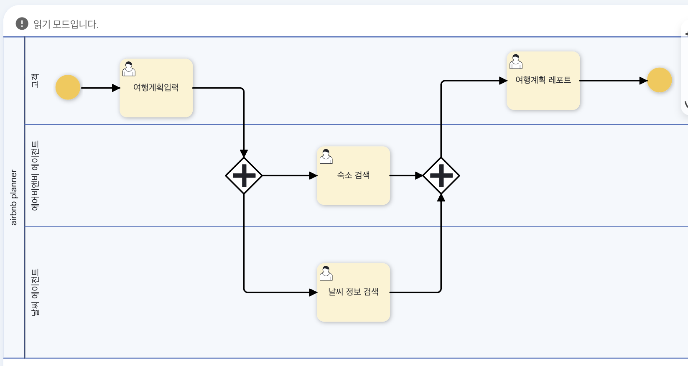
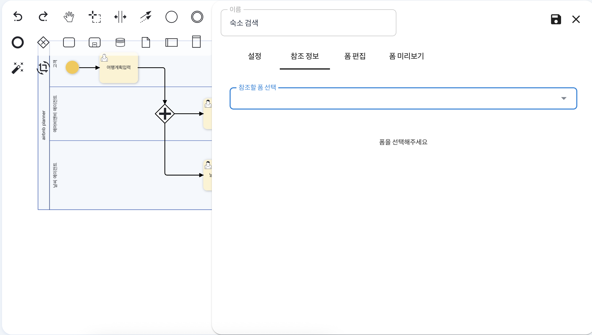
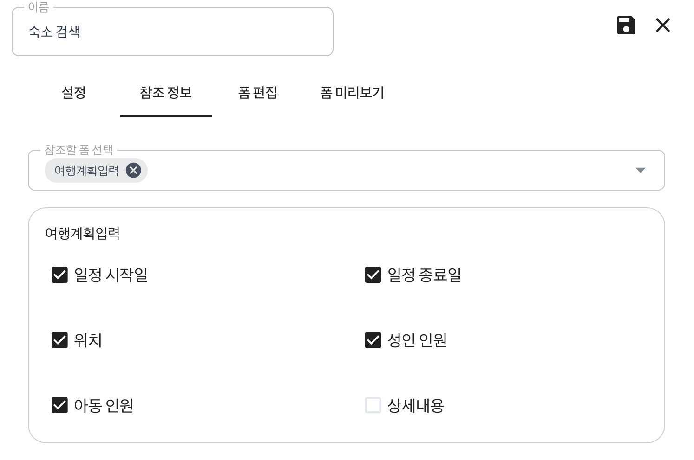

# 컨텍스트 엔지니어링 자동화

## 참조 정보 설정을 통한 컨텍스트 엔지니어링

Process GPT는 업무 프로세스의 각 단계를 AI를 통해 자동으로 연결하는 프롬프트 체이닝이 구현된 에이전틱 BPM 플랫폼입니다. 

대규모 언어 모델은 한 번에 인식할 수 있는 정보의 양이 한정되어 있는 컨텍스트 윈도우(Context Window)라는 한계가 존재하는데, ProcessGPT는 이 윈도우 크기를 고려하여 각 단계에서 반드시 필요한 정보만 자동으로 추려 전달하는 컨텍스트 엔지니어링을 통해 다음 단계로 전달되는 컨텍스트를 최적화해줍니다. 

사용자는 BPMN 기반의 직관적인 UI에서 이전 단계 결과물 중 다음 단계로 전달할 항목을 선택하거나, LLM이 업무 프로세스 맥락을 분석해 자동으로 최적화하도록 설정함으로써 코드 없이도 연결성 있는 프로세스를 구성할 수 있습니다. 

## 참조정보 설정하기
숙소 예약 프로세스에 따른 참조 정보 설정을 UI기반 수동으로 진행하는 방법은 다음과 같습니다.

먼저, 아래와 같은 숙소 예약 프로세스를 생성합니다.
 

이후 숙소 검색 액티비티를 더블 클릭하여 패널 생성 후, 참조 정보 탭을 클릭합니다. 
 

참조할 폼 선택은 해당 단계 기준 이전 단계의 참조를 희망하는 단계들을 선택할 수 있으며, 선택시 이전 단계였던 여행계획입력 단계의 폼에 등록된 정보들 중 필요한 정보들을 선별할 수 있습니다. 
 

선별이 완료되면 저장 후, 프로세스를 실행하여 숙소 검색 단계를 진행하면 아래와 같이 이전 입력값 항목에서 여행계획입력 단계를 완료하였을 때 입력한 값이 나타나는 것을 확인할 수 있습니다. 

이를 토대로 에이전트에 맡기기 탭을 클릭하면 에이전트가 사용자에 의해 참조된 정보를 토대로 숙소 검색에 필요한 정보를 파악하여 아래와 같이 숙소 검색을 진행한 결과를 확인할 수 있습니다.
 

