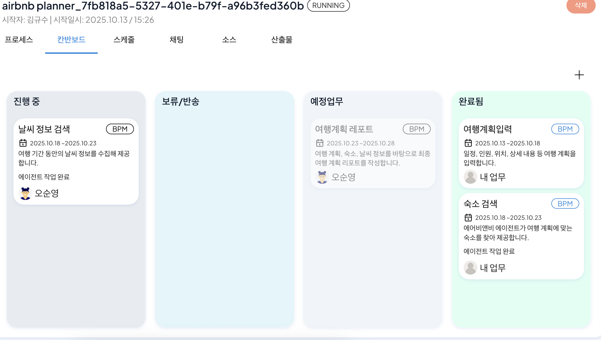
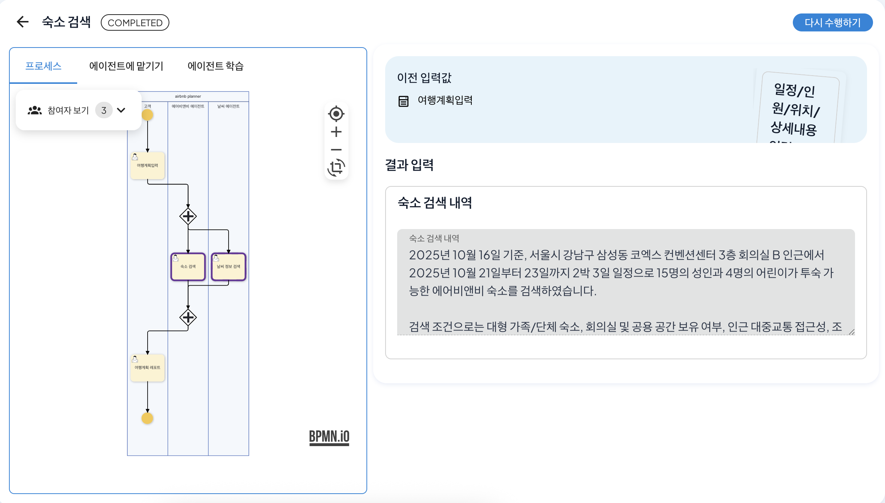
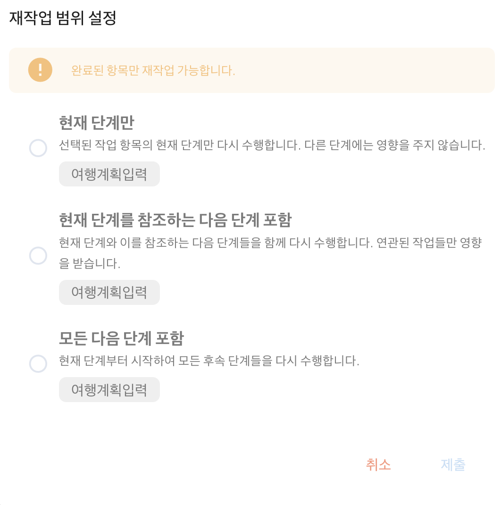
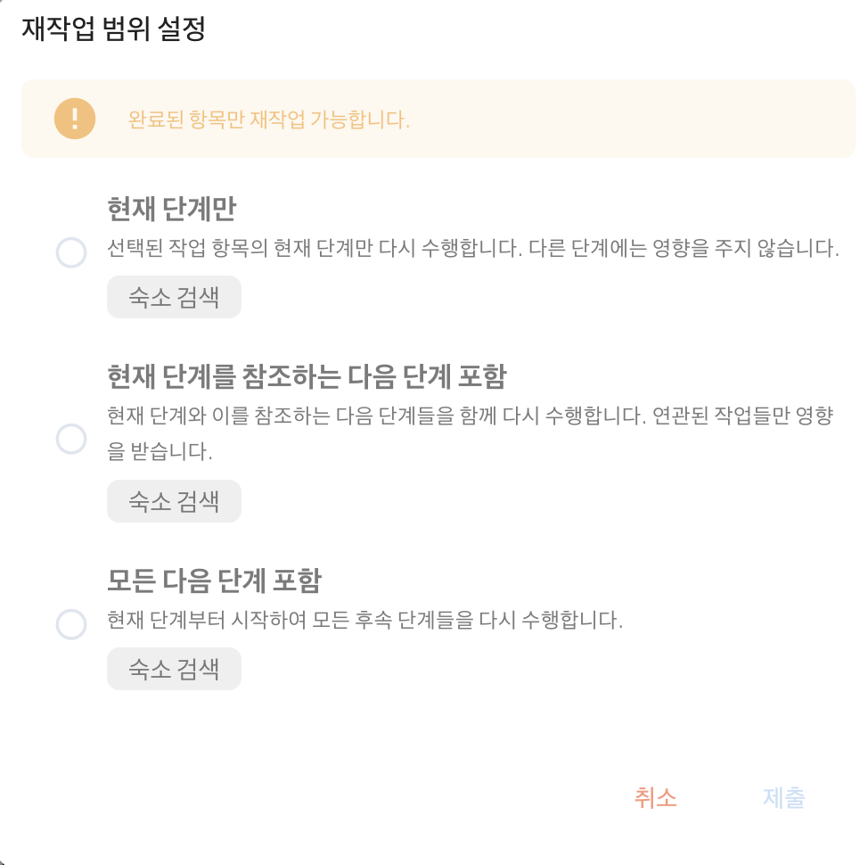
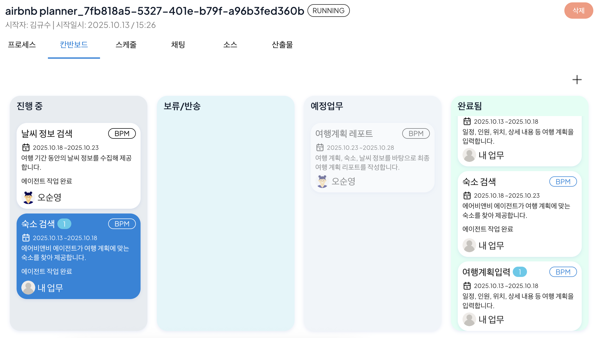
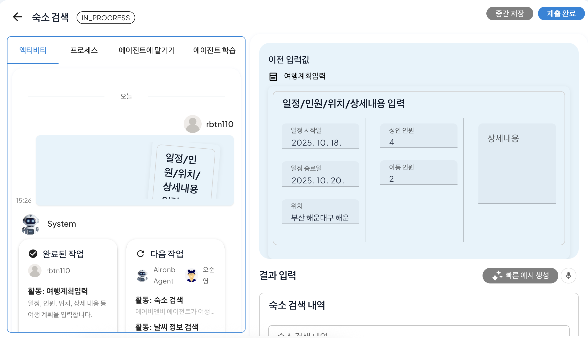

# 워크아이템 재작업

## 완료된 워크아이템에 대한 재작업 기능

재작업 기능은 이미 완료 처리된 워크아이템에 대한 수정이 필요한 경우, 재수행의 범위를 설정하여 수정을 진행할 수 있는 기능입니다. 특정 단계에서 발견된 오류나 변경 사항을 반영하기 위해 해당 워크아이템 혹은 해당 워크아이템을 참조하는 단계에 대하여 재작업 및 적용할 수 있습니다. 

기존에는 프로세스 중간 단계에서 수정이 필요한 경우 전체 프로세스를 처음부터 다시 실행해야 했습니다. 하지만 재작업 기능을 통해 워크아이템별로 재작업을 진행할 수 있어 불필요한 작업 반복을 제거할 수 있습니다. 

또한, 보상 트랜잭션(Compensation Transaction)을 적용하여 기존에 처리된 결과를 롤백 처리할 수 있습니다. 이를 통해 이전 상태로 안전하게 복구하거나, 특정 단계의 작업 결과를 취소한 후 다시 진행할 수 있습니다. 

## 재작업 설정하기
숙소 검색 프로세스를 통한 워크아이템 재작업 사용 방법은 다음과 같습니다.

먼저, 아래와 같은 숙소예약 프로세스를 생성합니다.
 

완료된 숙소 검색 프로세스를 실행하여 여행계획입력단계를 완료합니다. 이후, 칸반보드로 이동하여 여행계획입력 워크아이템이 완료되었는지 확인 후, 클릭합니다.
 

여행계획입력 단계 우측 상단에 위치한 다시 수행하기를 클릭하면 아래와 같이 재작업 범위를 설정할 수 있습니다. 
이때, 다른 단계에서 여행계획입력 단계를 참조정보로 사용하였다면 '현재 단계를 참조하는 다음 단계 포함'을 통해 연관된 작업에 대한 수정도 같이 진행할 수 있습니다.
 

 
<워크아이템 재작업 범위 지정>  

재작업 범위 설정이 완료되면 워크아이템이 새로 생성되며 여행계획입력 단계에 대한 재작업을 진행할 수 있습니다.
 

재작업 후, 제출 완료를 클릭하면 이후 단계인 숙소 검색 단계 또한 워크아이템이 아래와 같이 새로 생성되며 클릭시 재작업을 통해 변동된 사항이 적용되어 나타나는 것을 확인할 수 있습니다.
 
<재작업에 따른 워크아이템 생성 예시>  

 

재작업 기능을 통해 프로세스 전체를 재실행할 필요 없이 특정 워크아이템만 선택적으로 수정을 통해 불필요한 프로세스 실행 단계를 단축하여 시간과 리소스를 절약할 수 있습니다. 

또한, 작업 중 오류가 발생하거나 요구사항이 변경되더라도 전체 프로세스에 영향을 주지 않고 해당 부분만 유연하게 대처할 수 있습니다. 보상 트랜잭션을 통한 롤백 기능으로 안전한 상태 복구를 보장하여 프로세스의 안정성과 신뢰성을 높일 수 있습니다. 

