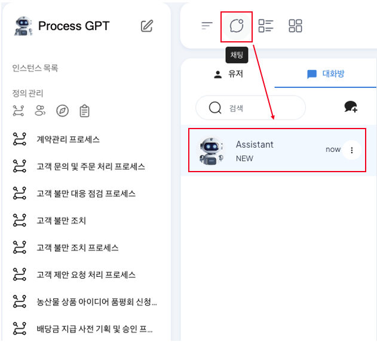
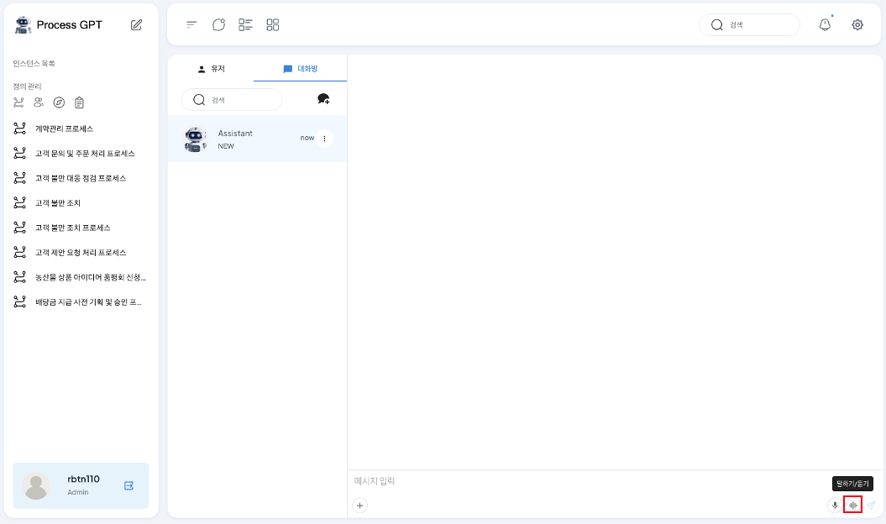
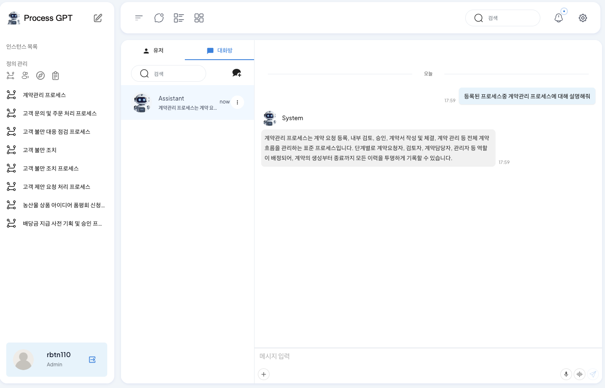
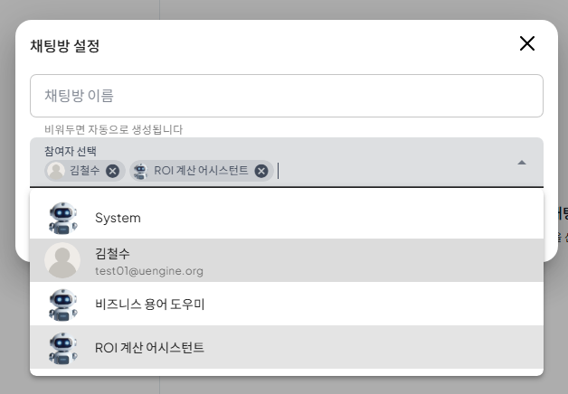
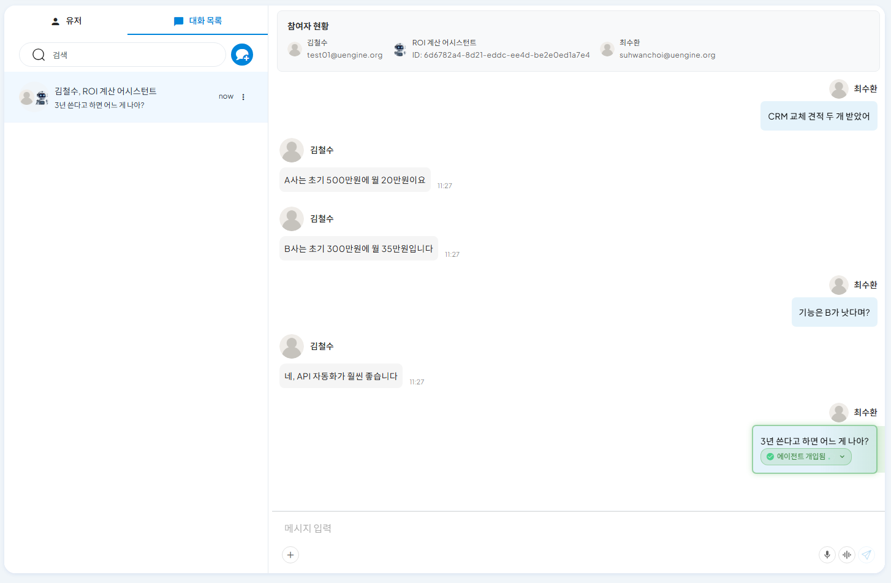

# 음성 기반 ProcessGPT

## 음성 채팅 기반 ProcessGPT

**음성 기반 ProcessGPT**는 테넌트에 생성된 정보를 기반으로 웹소켓을 활용한 인터페이스 지연 시간 단축을 통해 실제 채팅을 주고받듯이 빠른 속도로 요구사항 기반 답변을 제공하는 기능입니다. 

음성 기반 ProcessGPT는 테넌트 기반 테넌트에 등록된 프로세스 목록과 할 일 목록을 파악하여 사용자가 필요로 하는 정보를 찾아 답변하여 축적되는 복잡한 프로세스 정보를 손쉽게 파악할 수 있습니다  
또한, 사용자가 기획하고자 하는 프로세스와 요구사항을 음성으로 요청하면 그에 따른 세부 Task 정의와 세부 내용에 대해서 생성할 수 있습니다.

### 프로세스 목록 조회하기

음성 채팅을 이용하여 생성된 프로세스 목록을 확인하는 방법은 다음과 같습니다.

상단 '채팅' 아이콘을 클릭하여 채팅 화면으로 진입한 다음, Assistant가 생성되었는지 확인합니다. 만약 생성되지 않았을 경우 채팅방 생성을 통해 System을 참여자로 추가하여 아래와 같은 화면이 나오는지 확인합니다. 

 
 
 

메세지 입력 영역 하단에 '말하기/듣기' 아이콘을 클릭하여 음성 채팅 화면으로 진입합니다. 
 

마이크 버튼을 클릭 후, '생성된 프로세스중 계약관리 프로세스에 대해 설명해줘'와 같이 내용을 확인하고 싶은 프로세스에 대하여 질문하는 음성 대화를 진행합니다. 
 

대화가 완료되면 잠시 후 AI가 등록된 프로세스중 계약관리 프로세스에 대해 각 task와 연결된 폼에 대한 정보를 음성 답변으로 진행해주며, AI답변을 채팅에서 확인할 수 있습니다. 
 

### 프로세스 기획하기

음성 채팅을 이용하여 휴가 신청 프로세스를 기획하는 방법은 다음과 같습니다.

메세지 입력 영역 하단에 '말하기/듣기' 아이콘을 클릭하여 음성 채팅 화면으로 진입합니다.
 
마이크 버튼을 클릭 후, '휴가 신청 프로세스를 기획하기 위해 세부 task를 기획해줘'와 같이 기획하고 싶은 프로세스에 대한 요청을 진행합니다. 

 
이때, 요청사항에 특정 요구사항을 추가할수록 더 세부적인 task 기획하여 응답하기 때문에 기획할 프로세스의 요구사항을 자세하게 요청합니다.

대화가 완료되면 잠시 후 AI가 휴가 신청 프로세스에 대해 세부 task와 task에 포함되는 폼에 대한 내용을 기반으로 단계별로 음성 답변으로 진행해주며, AI답변을 채팅에서 확인할 수 있습니다. 

이를 통해 사내 생성된 정보에 대한 빠른 이해와 프로세스 기획에 있어 세부 단계에 대한 가이드를 AI에게 지원받아 업무의 효율성을 향상시키며 프로세스의 품질을 향상시킬 수 있습니다.

## 1. 활용 사례: 대화 맥락을 읽고 즉시 ROI 분석 (Context Awareness)
회의 중 "이번 프로젝트 ROI가 어떻게 되지?" 혹은 "A안과 B안 중 무엇이 더 유리하지?"라는 질문이 나오는 순간, AI는 단순한 방관자가 아닙니다. 다음은 AI가 대화방에 참여하여 맥락을 읽고 스스로 계산을 수행하는 과정입니다.

### 1.1 에이전트 초대 및 청취 (Listening)
사용자는 동료와의 업무 대화방에 **'ROI 계산 어시스턴트'**와 같은 특화된 AI 에이전트를 초대합니다. 에이전트는 대화에 직접 끼어들지 않고, 오가는 정보(비용, 조건 등)를 실시간으로 메모리에 적재합니다.

- 업무 대화방에 **'ROI 계산 어시스턴트'**를 초대하여 대화 맥락 공유를 시작하는 모습
 
 
 

### 1.2 맥락 파악 및 자율 개입 (Triggering)
대화 중 A사와 B사의 견적 조건이 텍스트로 오고 갑니다. 사용자가 별도로 AI에게 "계산해 줘"라고 데이터를 다시 입력할 필요가 없습니다. "3년 쓴다고 하면 어느 게 나아?"라는 자연어 질문이 나오는 순간, AI는 앞선 대화의 맥락(A사/B사 조건)을 이미 파악하고 있기에 즉시 연산을 시작합니다.

- 사용자가 데이터를 입력하지 않고 질문만 던져도, AI가 앞선 대화 내용을 근거로 즉시 개입 준비
 
 
 

### 1.3 즉시 연산 결과 제시 (Answer)
AI는 백그라운드에서 즉시 연산을 수행하여 계산된 수치(총 비용 비교)와 판단 근거를 화면에 띄웁니다. 단순 계산뿐만 아니라, "B사의 기능이 더 우수하다"는 정성적 맥락까지 포함하여 의사결정을 지원합니다.

- 별도의 검색이나 계산 실행 없이, 대화 흐름 속에서 즉시 도출된 비교 분석 결과
 
 
 

## 2. Zero-Touch 실행: 음성으로 완결되는 프로세스
화면을 볼 수 없는 운전 중이나 이동 중인 상황에서도 ProcessGPT의 지능형 오케스트레이션은 멈추지 않습니다. 단순 정보 제공을 넘어, 실행 단계에서도 혁신적인 경험을 제공합니다.

- 사용자 명령: "A사 계약 건, 리스크 검토 후 승인 처리해 줘"
- AI의 Zero-Touch 처리: AI는 사용자의 음성 명령 한 마디를 분석하여 아래의 복합 프로세스를 사람의 손길 없이 완결합니다.

**[Process Flow]**

**1. 음성 분석:** "A사 계약", "리스크 검토", "승인" 키워드 추출

**2. 보고서 생성:** 해당 계약 건의 리스크 분석 보고서 자동 생성

**3. 규정 대조:** 사내 규정집(PDF)과 대조하여 위규 사항 점검

**4. 결재 상신:** 결재 라인을 태워서 최종 승인 처리 완료

화면을 터치할 수 없는 상황에서도 업무는 중단되지 않고 실시간으로 처리됩니다.

