# 음성 에이전트 및 문서/슬라이드 생성

## 1.1 음성 채팅 기반 ProcessGPT

**음성 기반 ProcessGPT**는 테넌트에 생성된 정보를 기반으로 웹소켓을 활용한 인터페이스 지연 시간 단축을 통해 실제 채팅을 주고받듯이 빠른 속도로 요구사항 기반 답변을 제공하는 기능입니다. 

음성 기반 ProcessGPT는 테넌트 기반 테넌트에 등록된 프로세스 목록과 할 일 목록을 파악하여 사용자가 필요로 하는 정보를 찾아 답변하여 축적되는 복잡한 프로세스 정보를 손쉽게 파악할 수 있습니다  
또한, 사용자가 기획하고자 하는 프로세스와 요구사항을 음성으로 요청하면 그에 따른 세부 Task 정의와 세부 내용에 대해서 생성할 수 있습니다.

### 1.2 프로세스 목록 조회하기

음성 채팅을 이용하여 생성된 프로세스 목록을 확인하는 방법은 다음과 같습니다.

상단 '채팅' 아이콘을 클릭하여 채팅 화면으로 진입한 다음, Assistant가 생성되었는지 확인합니다. 만약 생성되지 않았을 경우 채팅방 생성을 통해 System을 참여자로 추가하여 아래와 같은 화면이 나오는지 확인합니다. 
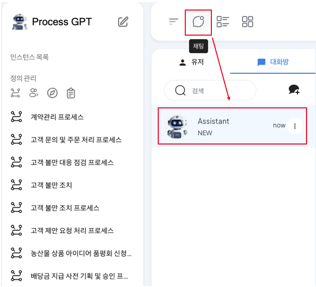
 
 
 

메세지 입력 영역 하단에 '말하기/듣기' 아이콘을 클릭하여 음성 채팅 화면으로 진입합니다. 
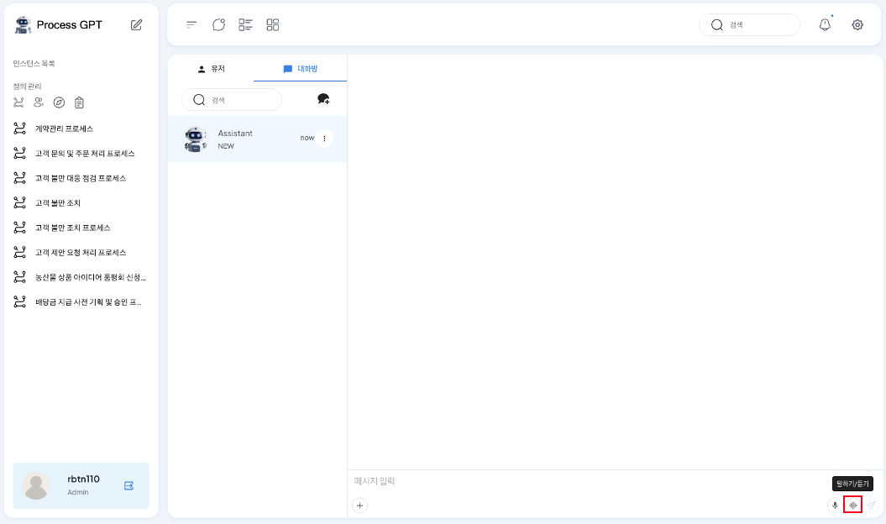 

마이크 버튼을 클릭 후, '생성된 프로세스중 계약관리 프로세스에 대해 설명해줘'와 같이 내용을 확인하고 싶은 프로세스에 대하여 질문하는 음성 대화를 진행합니다. 
 

대화가 완료되면 잠시 후 AI가 등록된 프로세스중 계약관리 프로세스에 대해 각 task와 연결된 폼에 대한 정보를 음성 답변으로 진행해주며, AI답변을 채팅에서 확인할 수 있습니다. 
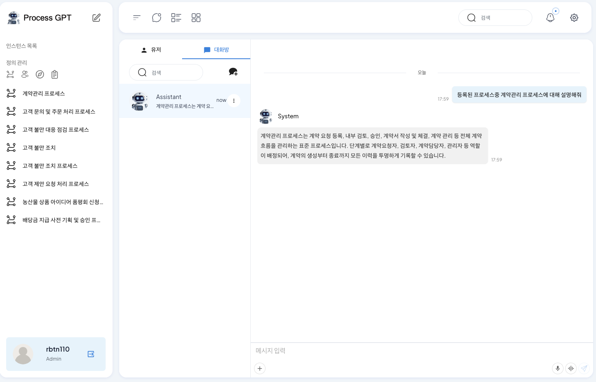 

### 1.2 프로세스 기획하기

음성 채팅을 이용하여 휴가 신청 프로세스를 기획하는 방법은 다음과 같습니다.

메세지 입력 영역 하단에 '말하기/듣기' 아이콘을 클릭하여 음성 채팅 화면으로 진입합니다.
 
마이크 버튼을 클릭 후, '휴가 신청 프로세스를 기획하기 위해 세부 task를 기획해줘'와 같이 기획하고 싶은 프로세스에 대한 요청을 진행합니다. 

 
이때, 요청사항에 특정 요구사항을 추가할수록 더 세부적인 task 기획하여 응답하기 때문에 기획할 프로세스의 요구사항을 자세하게 요청합니다.

대화가 완료되면 잠시 후 AI가 휴가 신청 프로세스에 대해 세부 task와 task에 포함되는 폼에 대한 내용을 기반으로 단계별로 음성 답변으로 진행해주며, AI답변을 채팅에서 확인할 수 있습니다. 

이를 통해 사내 생성된 정보에 대한 빠른 이해와 프로세스 기획에 있어 세부 단계에 대한 가이드를 AI에게 지원받아 업무의 효율성을 향상시키며 프로세스의 품질을 향상시킬 수 있습니다.

### 1.3 활용 사례: 대화 맥락을 읽고 즉시 ROI 분석 (Context Awareness)
회의 중 "이번 프로젝트 ROI가 어떻게 되지?" 혹은 "A안과 B안 중 무엇이 더 유리하지?"라는 질문이 나오는 순간, AI는 단순한 방관자가 아닙니다. 다음은 AI가 대화방에 참여하여 맥락을 읽고 스스로 계산을 수행하는 과정입니다.

#### 1.3.1 에이전트 초대 및 청취 (Listening)
사용자는 동료와의 업무 대화방에 **'ROI 계산 어시스턴트'**와 같은 특화된 AI 에이전트를 초대합니다. 에이전트는 대화에 직접 끼어들지 않고, 오가는 정보(비용, 조건 등)를 실시간으로 메모리에 적재합니다.

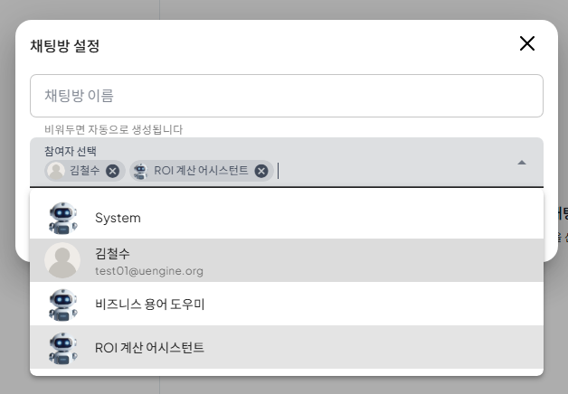
- 업무 대화방에 **'ROI 계산 어시스턴트'**를 초대하여 대화 맥락 공유를 시작하는 모습
 
 
 

#### 1.3.2 맥락 파악 및 자율 개입 (Triggering)
대화 중 A사와 B사의 견적 조건이 텍스트로 오고 갑니다. 사용자가 별도로 AI에게 "계산해 줘"라고 데이터를 다시 입력할 필요가 없습니다. "3년 쓴다고 하면 어느 게 나아?"라는 자연어 질문이 나오는 순간, AI는 앞선 대화의 맥락(A사/B사 조건)을 이미 파악하고 있기에 즉시 연산을 시작합니다.

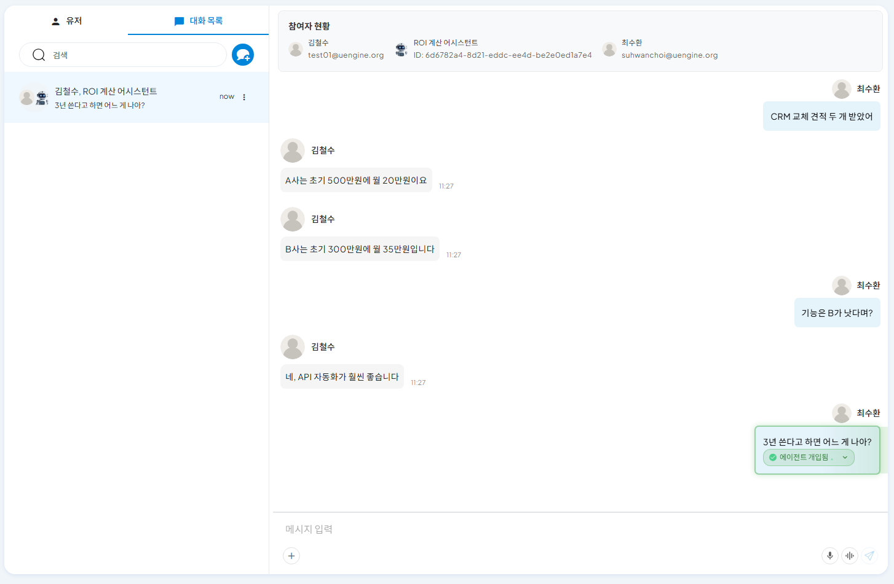
- 사용자가 데이터를 입력하지 않고 질문만 던져도, AI가 앞선 대화 내용을 근거로 즉시 개입 준비
 
 
 

#### 1.3.3 즉시 연산 결과 제시 (Answer)
AI는 백그라운드에서 즉시 연산을 수행하여 계산된 수치(총 비용 비교)와 판단 근거를 화면에 띄웁니다. 단순 계산뿐만 아니라, "B사의 기능이 더 우수하다"는 정성적 맥락까지 포함하여 의사결정을 지원합니다.

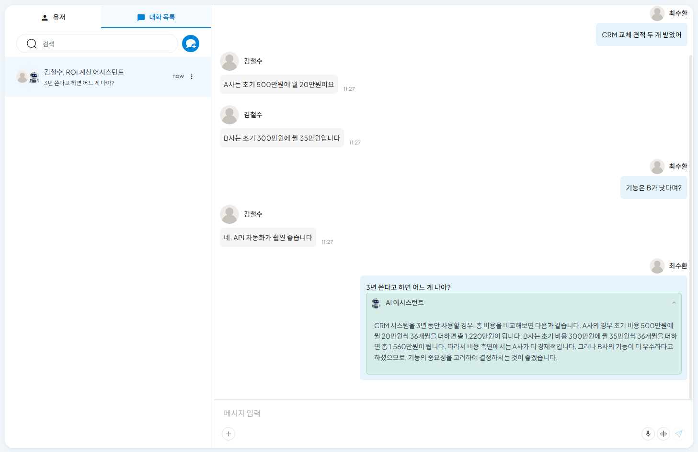
- 별도의 검색이나 계산 실행 없이, 대화 흐름 속에서 즉시 도출된 비교 분석 결과
 
 
 

## 2. 보이스 에이전트 & 콜봇: 진정한 핸즈프리 환경 구현
위와 같은 Zero-Touch 실행을 돕기 위해, 사람과 음성으로 소통하며 실무를 처리하는 **'보이스 에이전트(Voice Agent)'와 '콜봇(Call Bot)'**을 지원합니다.

사용자가 직접 화면을 보고 데이터를 입력하던 방식에서 벗어나 복잡한 입력 과정을 말로 해결하고, 에이전트가 먼저 전화를 걸어 필요한 정보를 확인하고 시스템에 자동 반영합니다.

- **맥락을 이해하는 음성 인식:** 사용자의 음성 속 의도를 정확히 파악하여 복잡한 신청서나 평가 양식을 스스로 작성하며, 말을 더듬거나 내용을 수정하더라도 맥락을 이해해 정확한 정보로 정리합니다.

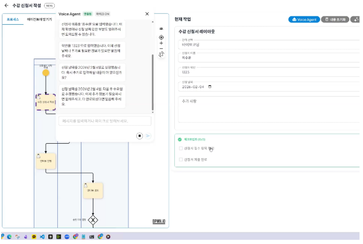
- **Voice Agent** 버튼 클릭 한 번으로, 복잡한 입력 과정을 말로 해결
 
 
 

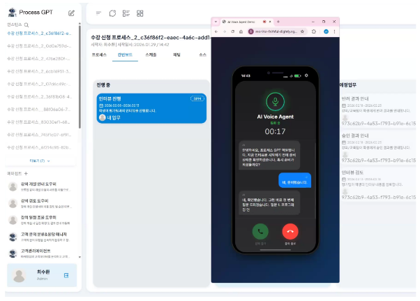
- **CAll Bot**이 먼저 전화를 걸어 진행하는 **핸즈프리 인터뷰**
 
 
 

## 3. 복잡한 사내 양식 완벽 유지 및 자동 작성
음성이나 거친 메모로 지시된 업무는 단순히 텍스트로만 남지 않습니다. ProcessGPT는 업로드된 템플릿의 구조를 파악하여, 서식 깨짐 없이 정확한 위치에 데이터와 시각화 차트를 자동으로 채워 넣습니다.

### Step 1. 템플릿 업로드 및 분석 목적 지시
사용할 사내 양식을 소스로 업로드한 후, 에이전트에게 분석 목적(예: 현대차증권 투자분석보고서)과 보고 대상을 입력합니다.

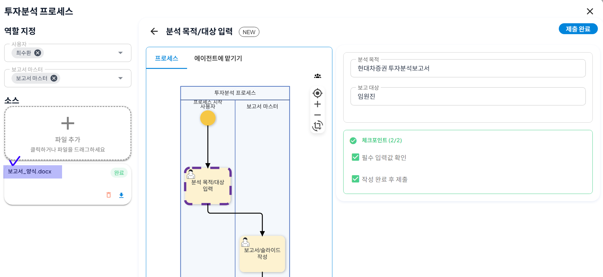
- 사내 표준 보고서 양식을 업로드하고 분석 목적을 입력
 
 
 

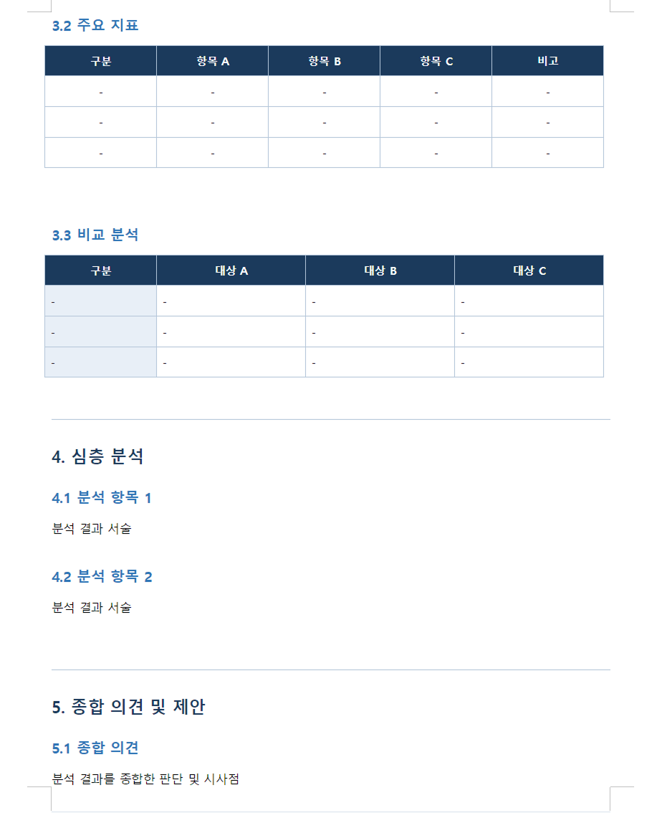
- 데이터가 채워지기 전, 원본 .docx 템플릿의 모습
 
 
 

### Step 2. 딥 리서치 및 에이전트 작업 수행
실행과 동시에 에이전트가 웹 검색, 내부 저장소 검색 등 '딥 리서치 프레임워크'를 가동하여 방대한 정보를 심층 분석하고 시각화 자료를 생성합니다.

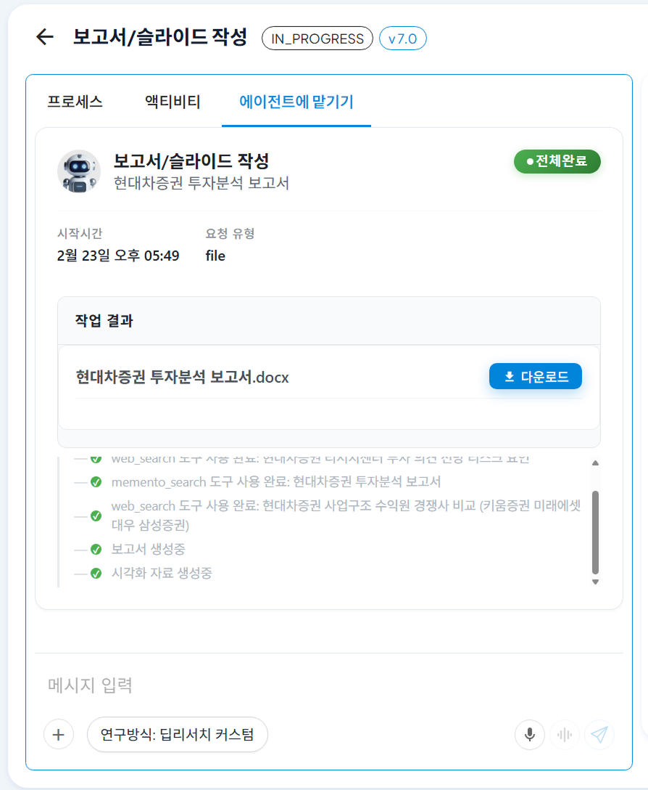
- 에이전트가 리서치 및 시각화 자료 생성을 마치고 최종 .docx 파일을 도출
 
 
 

### Step 3. 최종 결과물 확인
에이전트가 작성한 문서를 다운로드하면, 원본 양식의 표 안에 비교 데이터가 완벽하게 채워져 있고, 핵심 내용을 요약한 시각화 차트가 서식에 맞게 삽입된 것을 확인할 수 있습니다.

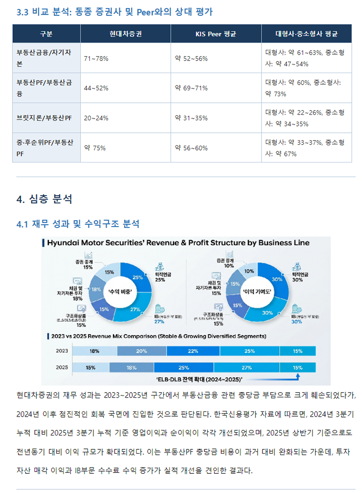
- 원본 양식을 완벽히 유지한 채 데이터와 차트가 채워진 최종 보고서 결과물
 
 
 

## 4. 프레젠테이션(Slide) 초안 생성 및 자연어 부분 편집
텍스트나 음성 메모만 입력해도 전체 스타일이 통일된 세련된 프레젠테이션 초안이 단숨에 완성됩니다. 생성된 슬라이드에서 수정이 필요한 부분은 복잡한 디자인 툴 없이 마우스 드래그와 일상 언어(자연어) 지시만으로 간편하게 편집할 수 있습니다.

### Step 1. 슬라이드 초안 자동 생성
에이전트가 리서치한 내용이나 사용자가 입력한 텍스트를 바탕으로 시각적으로 훌륭한 슬라이드 초안을 자동 생성합니다.

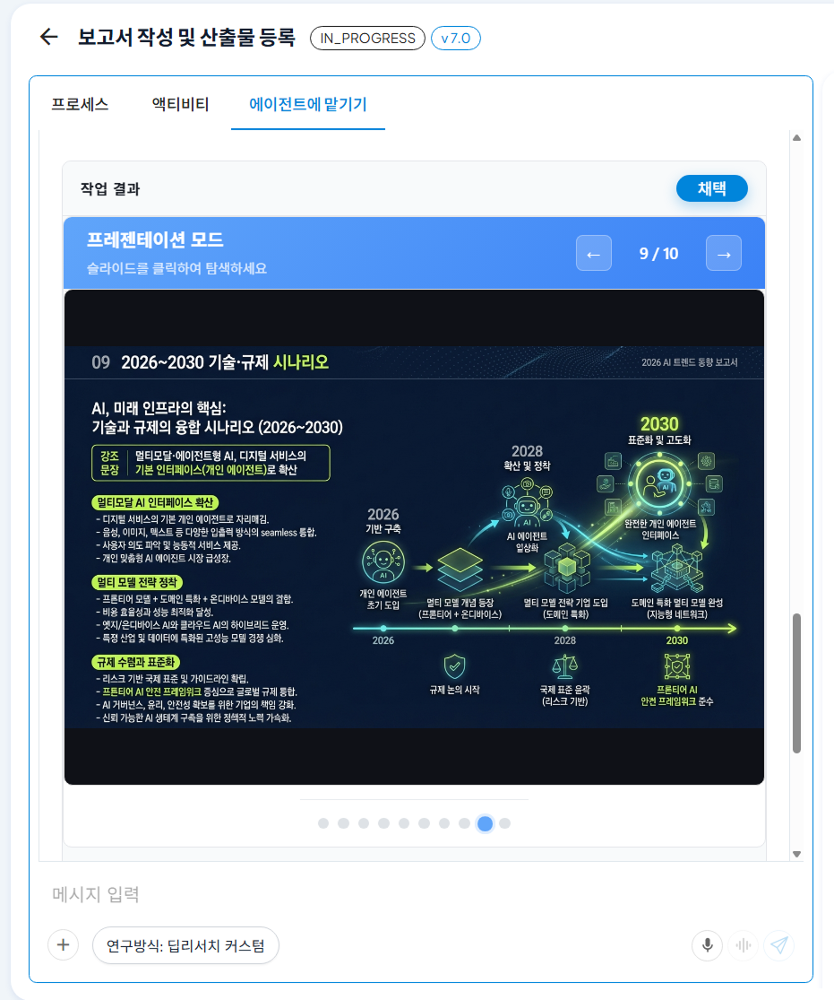
 
 
 

- 자동으로 생성한 프레젠테이션 슬라이드 초안

### Step 2. 영역 지정 및 자연어 수정 지시
슬라이드에서 수정하고 싶은 특정 영역을 마우스로 드래그하여 지정합니다. 이후 "이 부분에 글자 지우고 내가 올린 로고 넣어줘"처럼 원하는 내용을 자연어로 입력하고 참조 이미지를 첨부합니다.

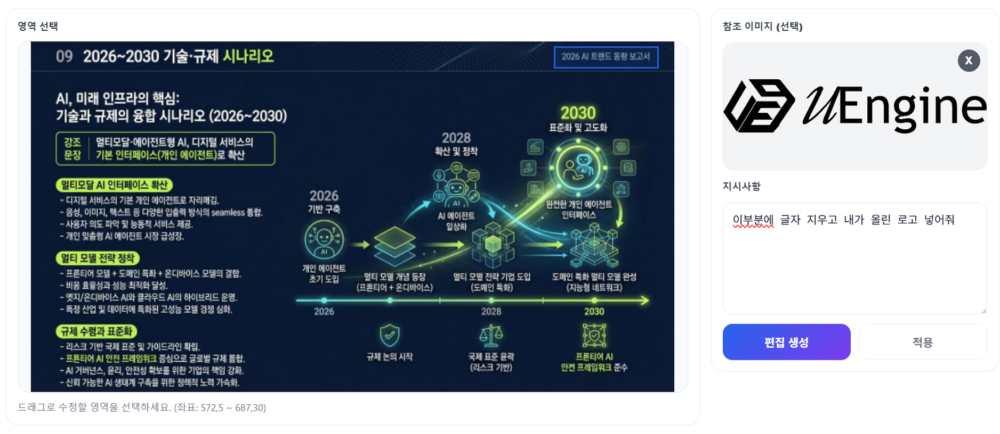
- 마우스 드래그로 영역을 선택하고, 우측 패널에서 자연어로 수정 지시를 내리는 화면
 
 
 

### Step 3. 맥락을 파악한 감쪽같은 수정 결과
ProcessGPT가 주변 슬라이드 맥락과 디자인을 파악하여, 지정된 위치의 텍스트를 지우고 요청한 로고 이미지를 자연스럽게 합성해 냅니다.

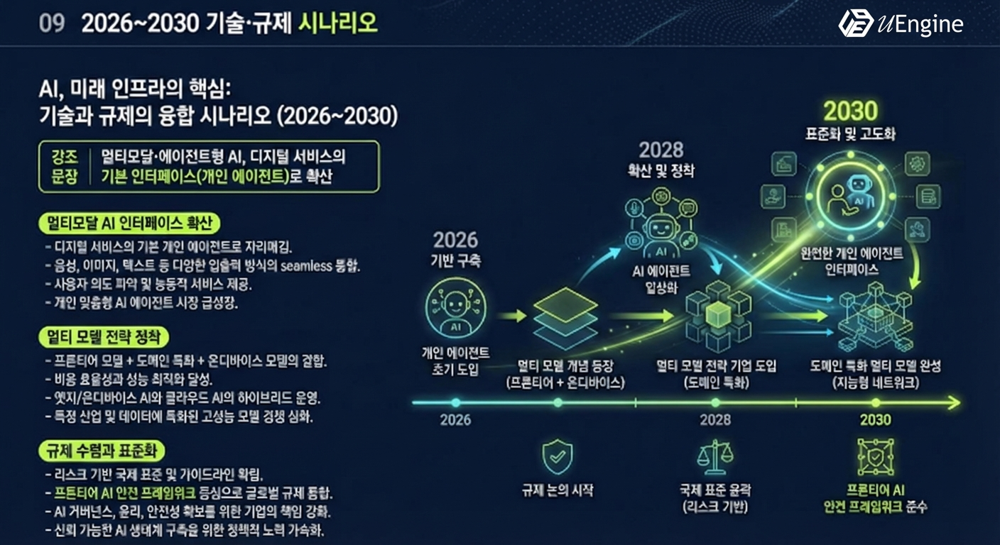
- 사용자의 자연어 지시에 따라 우측 상단 로고 교체
 
 
 

## 5. 깊이 있는 자료 조사가 담긴 마크다운(Markdown) 보고서

단순히 파일 형태가 아닌, 웹 에디터 내에서 즉시 활용하고 공유할 수 있는 마크다운 형태의 심층 보고서도 지원합니다.

트렌드나 통계 데이터는 직관적인 그래프로 즉시 시각화 되며, 개요부터 전략 제언까지 논리적인 구조를 갖춘 방대한 분량의 리서치 결과가 깔끔하게 정리됩니다.

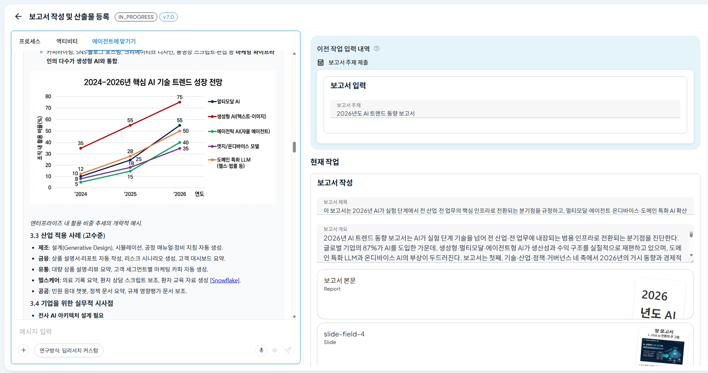
- 데이터 시각화 차트가 포함된 마크다운 기반의 트렌드 동향 보고서 생성
 
 
 

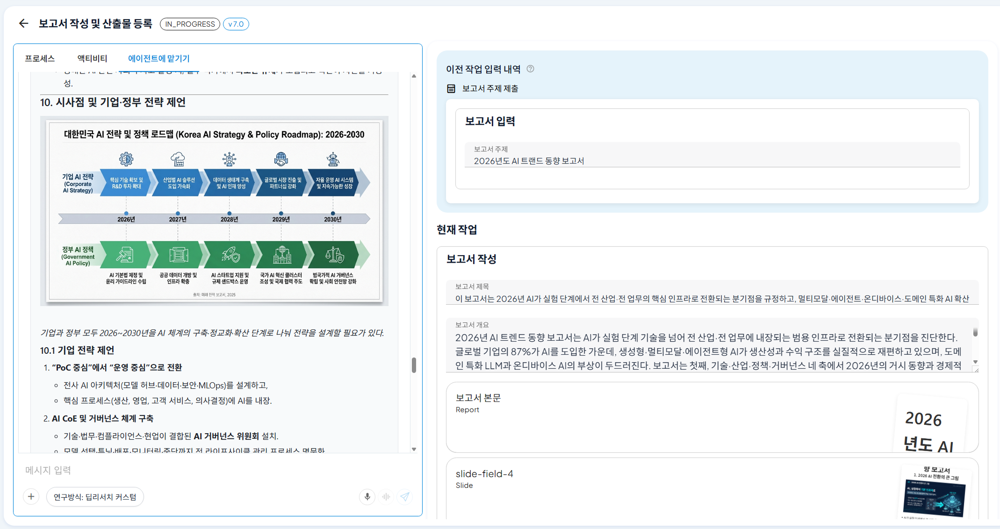
- 로드맵 이미지와 구조화된 텍스트가 조화롭게 배치된 심층 분석 리포트 결과
 
 
 

