# 음성 에이전트 및 문서/슬라이드 생성

ProcessGPT는 화면 터치나 복잡한 타이핑 없이 음성 지시만으로 실무 프로세스를 완결하고, 기업의 표준 양식에 맞춘 다양한 문서 산출물(워드, 한글, PPT 등)을 즉시 생성 및 수정하는 자율 업무 환경을 제공합니다.

## 1.1 프로세스 목록 조회하기
음성 채팅을 이용하여 생성된 프로세스 목록을 확인하는 방법은 다음과 같습니다.

1. 상단 '채팅' 아이콘을 클릭하여 채팅 화면으로 진입한 다음, Assistant가 생성되었는지 확인합니다. (만약 생성되지 않았을 경우, 채팅방 생성을 통해 System을 참여자로 추가하여 화면이 나오는지 확인합니다.)
2. 메시지 입력 영역 하단에 '말하기/듣기' 아이콘을 클릭하여 음성 채팅 화면으로 진입합니다.

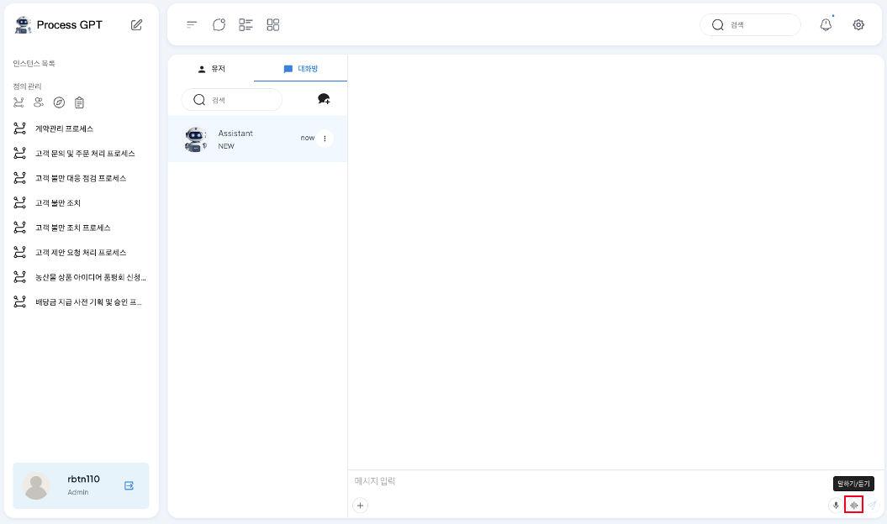

3. 마이크 버튼을 클릭 후, *"생성된 프로세스 중 계약관리 프로세스에 대해 설명해 줘"*와 같이 내용을 확인하고 싶은 프로세스에 대하여 질문하는 음성 대화를 진행합니다.
4. 대화가 완료되면 잠시 후 AI가 등록된 프로세스 중 계약관리 프로세스의 각 Task와 연결된 폼(Form)에 대한 정보를 음성으로 답변해 주며, AI 답변을 텍스트 채팅으로도 확인할 수 있습니다.

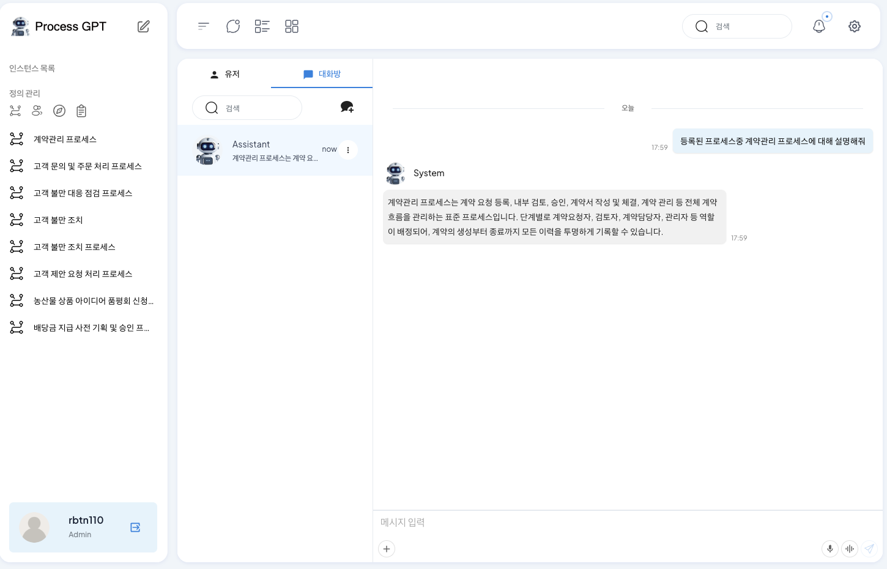   

## 1.2 프로세스 기획하기

음성 채팅을 이용하여 휴가 신청 프로세스와 같은 신규 프로세스를 기획하는 방법은 다음과 같습니다.

1. 메시지 입력 영역 하단에 '말하기/듣기' 아이콘을 클릭하여 음성 채팅 화면으로 진입합니다.
2. 마이크 버튼을 클릭 후, "휴가 신청 프로세스를 기획하기 위해 세부 Task를 기획해 줘"와 같이 기획하고 싶은 프로세스에 대한 요청을 진행합니다.
3. Tip: 특정 요구사항을 추가할수록 더 세부적인 Task를 기획하여 응답하므로, 프로세스의 요구사항을 자세하게 요청하는 것이 좋습니다.
4. 대화가 완료되면 잠시 후 AI가 휴가 신청 프로세스에 대해 세부 Task와 폼(Form)에 대한 내용을 기반으로 단계별 음성 답변을 진행하며, 채팅창에서도 확인할 수 있습니다.

이를 통해 사내 생성된 정보에 대한 빠른 이해와 프로세스 기획 시 세부 단계에 대한 가이드를 AI에게 지원받아 업무 효율성을 향상시키고 프로세스의 품질을 높일 수 있습니다.

## 1.3 활용 사례: 대화 맥락을 읽고 즉시 ROI 분석 (Context Awareness)

회의 중 "이번 프로젝트 ROI가 어떻게 되지?" 혹은 *"A안과 B안 중 무엇이 더 유리하지?"*라는 질문이 나오는 순간, AI는 단순한 방관자가 아닙니다. 다음은 AI가 대화방에 참여하여 맥락을 읽고 스스로 계산을 수행하는 과정입니다.

### 1.3.1 에이전트 초대 및 청취 (Listening)

사용자는 동료와의 업무 대화방에 'ROI 계산 어시스턴트'와 같은 특화된 AI 에이전트를 초대합니다. 에이전트는 대화에 직접 끼어들지 않고, 오가는 정보(비용, 조건 등)를 실시간으로 메모리에 적재합니다.

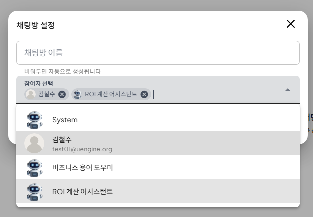   

### 1.3.2 맥락 파악 및 자율 개입 (Triggering)

대화 중 A사와 B사의 견적 조건이 텍스트로 오고 갑니다. 사용자가 별도로 AI에게 *"계산해 줘"*라고 데이터를 다시 입력할 필요가 없습니다. *"3년 쓴다고 하면 어느 게 나아?"*라는 자연어 질문이 나오는 순간, AI는 앞선 대화의 맥락(A사/B사 조건)을 이미 파악하고 있기에 즉시 연산을 시작합니다.

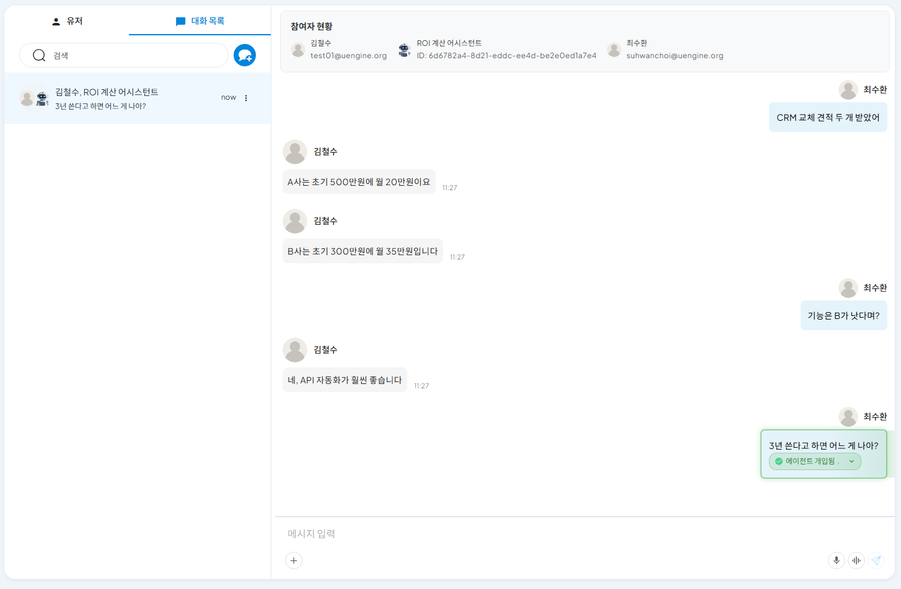   

### 1.3.3 즉시 연산 결과 제시 (Answer)
AI는 백그라운드에서 즉시 연산을 수행하여 계산된 수치(총비용 비교)와 판단 근거를 화면에 띄웁니다. 단순 계산뿐만 아니라, *"B사의 기능이 더 우수하다"*는 정성적 맥락까지 포함하여 의사결정을 지원합니다.

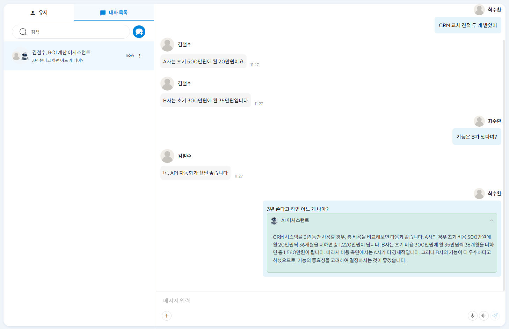   

<!-- 여기부터 추가  -->

## 1.4 지능형 산출물 완성: 'AI 티'를 지운 실무급 문서 자동 생성 (Zero-Touch Polish)

보고서 한 장을 만들기 위해 도구를 여러 번 갈아타고, AI 결과물을 일일이 다시 손보던 시간은 모두 사라졌습니다. 기존의 '문서를 만들어주는 AI'에서 한 걸음 나아가, '실무에 바로 쓰이는 문서를 채팅창 안에서 함께 완성하는 AI'로 진화했습니다.

### 1.4.1 단절 없는 흐름 (Unbroken Flow): PPTX까지 한 대화로 완결

기획에서 시각화까지, 툴의 전환 없이 하나의 대화로 완결됩니다. 기존의 HWPX, DOCX 지원에 이어 프레젠테이션(PPTX) 슬라이드 초안 생성 및 아티팩트 뷰 즉시 확인이 가능해졌습니다. 문서를 슬라이드로 변환하기 위해 다른 프로그램을 열 필요가 없습니다.

- **전체 지시 편집 (Global):** *"이 슬라이드 전체적으로 좀 더 밝은 분위기로 바꿔줘"*와 같이, 전체를 다시 만들 필요 없이 대화만으로 무중단 편집을 지원합니다.
- **영역 선택 정밀 편집 (Regional):** 화면에서 원하는 부분만 마우스로 드래그하여 해당 영역만 핀셋처럼 정교하게 고쳐 쓸 수 있습니다.
- **이미지 자동 합성 (Image):** 슬라이드 내 특정 영역을 고르고 사진을 업로드하면, 그 자리에 즉시 이미지가 자동 합성됩니다.

 

### 1.4.2 실무급 디테일 (Zero-Touch Polish): 대량의 제안서도 그대로 제출 가능

생성 직후 바로 제출 가능한, 사람 손을 거친 듯한 품질을 보장합니다. 40페이지 이상의 복잡한 제안서나 보고서 등 문서 종류에 맞춰 어투와 구성을 자동으로 적용합니다.

- **완벽한 표 이해도:** 한글 양식 스냅샷 분석을 통해 복잡한 표도 구조 붕괴 없이 정확하게 내용을 채워 넣습니다.
- **자동 들여쓰기 및 정렬:** 사람이 직접 Shift+Tab을 누른 것처럼 기호별 간격을 깔끔하게 자동 정렬합니다.
- **스마트 리사이징 & 캡션 요약:** 삽입될 공간의 가로·세로 비율에 맞춰 이미지를 자동 조정하며, 긴 이미지나 표 설명을 한 줄 이내로 깔끔하게 요약 정돈합니다.

 

### 1.4.3 살아숨쉬는 사내 자산 활용 (Living Knowledge)

방치된 사내 자료가 문서 속 핵심 시각 자료와 정확한 레퍼런스로 부활합니다.

- AI가 문서 작성 중 이미지가 필요한 부분을 스스로 판단하고 검색하여, 기존 지식 창고에 잠자던 자산을 발굴해 삽입합니다.
- 화질이 떨어지는 과거 자료는 AI 업스케일링(Upscaling Engine)을 통해 선명도를 자동 보정하여 고품질 시각 자료로 즉시 활용합니다.

 

### 1.4.4 즉시 도입 가능한 자동화 (Plug-and-Play): 개발자 없이 즉시 시작

개발자가 아니어도 좋습니다. 과거처럼 MCP 서버를 직접 구성하거나 복잡한 사전 설정 및 API 연동을 할 필요가 없습니다.

- **원클릭 스킬 배포:** 핵심 로직을 독립 라이브러리로 분리하고 Claude Skills로 래핑(Wrapping)하였습니다.
- **범용적 도입:** 복잡한 서버 구성 없이 '스킬' 하나만 에이전트에 얹으면 즉시 동작하므로, IT 부서의 도움 없이 비개발 직군도 즉각적으로 회사 전용 에이전트를 완성하고 도입할 수 있습니다.

   

## 2. 보이스 에이전트 & 콜봇: 진정한 핸즈프리 환경 구현
위와 같은 Zero-Touch 실행을 돕기 위해, 사람과 음성으로 소통하며 실무를 처리하는 **'보이스 에이전트(Voice Agent)'와 '콜봇(Call Bot)'**을 지원합니다.

사용자가 직접 화면을 보고 데이터를 입력하던 방식에서 벗어나 복잡한 입력 과정을 말로 해결하고, 에이전트가 먼저 전화를 걸어 필요한 정보를 확인하고 시스템에 자동 반영합니다.

- **맥락을 이해하는 음성 인식:** 사용자의 음성 속 의도를 정확히 파악하여 복잡한 신청서나 평가 양식을 스스로 작성하며, 말을 더듬거나 내용을 수정하더라도 맥락을 이해해 정확한 정보로 정리합니다.

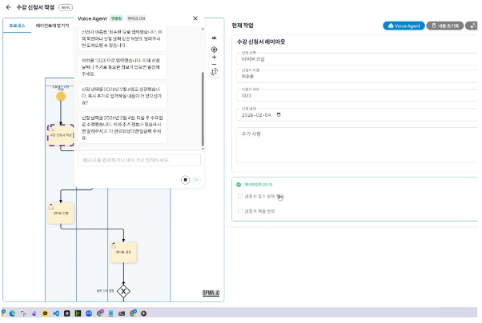
- **Voice Agent** 버튼 클릭 한 번으로, 복잡한 입력 과정을 말로 해결
 
 
 

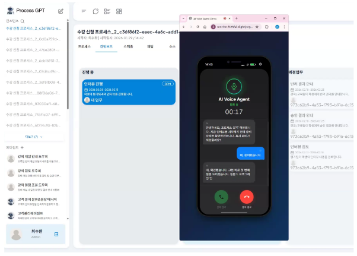
- **CAll Bot**이 먼저 전화를 걸어 진행하는 **핸즈프리 인터뷰**
 
 
 

## 3. 복잡한 사내 양식 완벽 유지 및 자동 작성
음성이나 거친 메모로 지시된 업무는 단순히 텍스트로만 남지 않습니다. ProcessGPT는 업로드된 템플릿의 구조를 파악하여, 서식 깨짐 없이 정확한 위치에 데이터와 시각화 차트를 자동으로 채워 넣습니다.

### Step 1. 템플릿 업로드 및 분석 목적 지시
사용할 사내 양식을 소스로 업로드한 후, 에이전트에게 분석 목적(예: 현대차증권 투자분석보고서)과 보고 대상을 입력합니다.

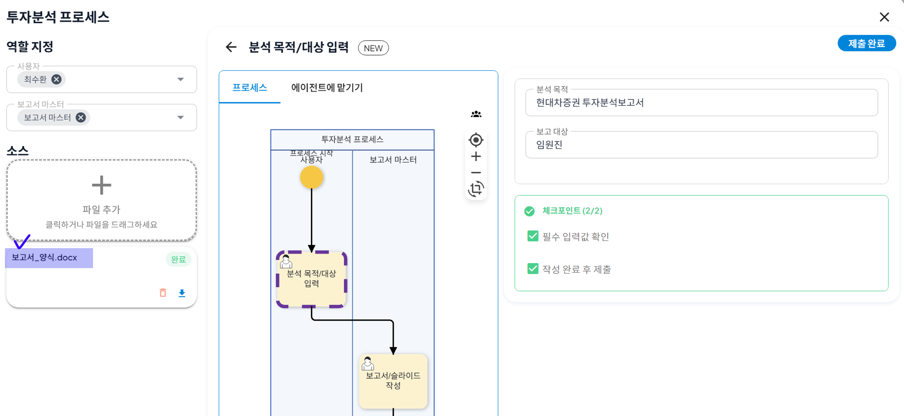
- 사내 표준 보고서 양식을 업로드하고 분석 목적을 입력
 
 
 

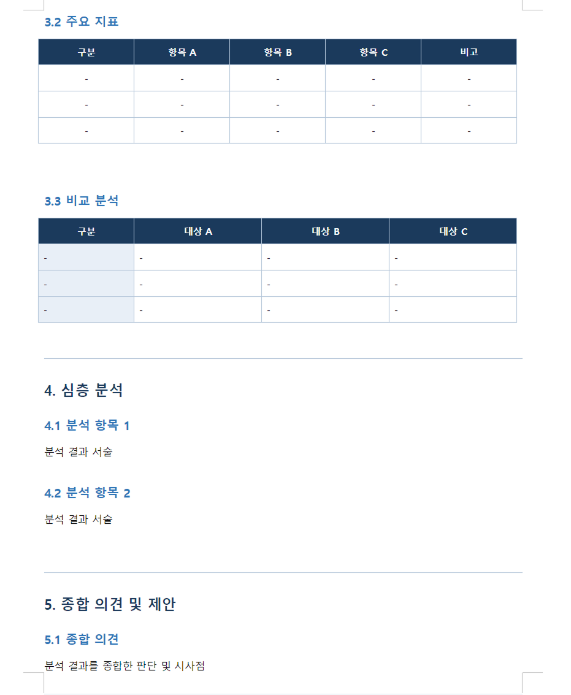
- 데이터가 채워지기 전, 원본 .docx 템플릿의 모습
 
 
 

### Step 2. 딥 리서치 및 에이전트 작업 수행
실행과 동시에 에이전트가 웹 검색, 내부 저장소 검색 등 '딥 리서치 프레임워크'를 가동하여 방대한 정보를 심층 분석하고 시각화 자료를 생성합니다.

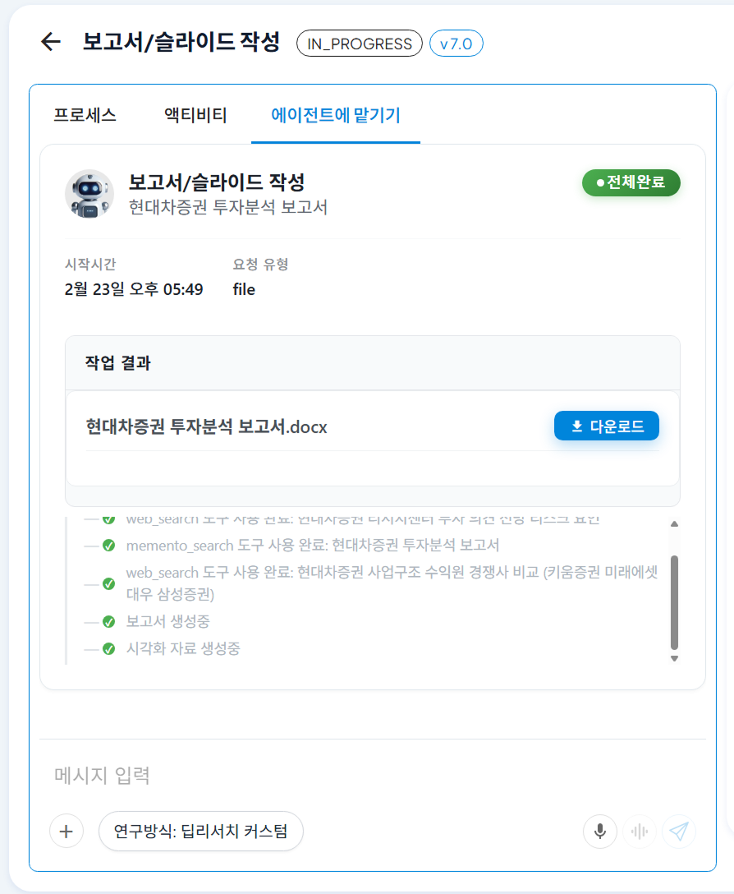
- 에이전트가 리서치 및 시각화 자료 생성을 마치고 최종 .docx 파일을 도출
 
 
 

### Step 3. 최종 결과물 확인
에이전트가 작성한 문서를 다운로드하면, 원본 양식의 표 안에 비교 데이터가 완벽하게 채워져 있고, 핵심 내용을 요약한 시각화 차트가 서식에 맞게 삽입된 것을 확인할 수 있습니다.

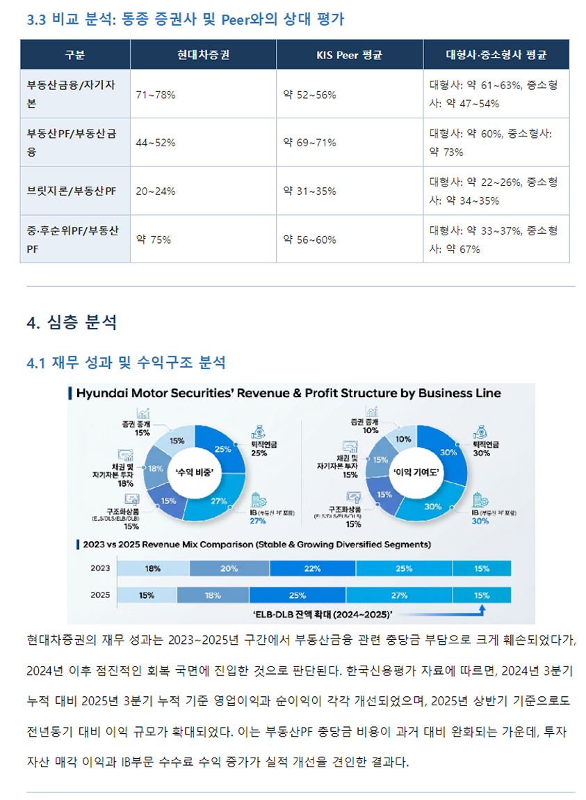
- 원본 양식을 완벽히 유지한 채 데이터와 차트가 채워진 최종 보고서 결과물
 
 
 

## 4. 대화 한번으로 문서 수정, 결과물 (hwpx·docx) 즉시 출력

수십 페이지에 달하는 복잡한 정부 사업 제안서나 사내 보고서 작성 시, 번거로운 툴 전환이나 재업로드 없이 채팅창 안에서 완벽한 결과물을 도출합니다. 특히 국내 공공기관 및 금융권에서 필수로 요구하는 한글(.hwpx) 양식을 완벽하게 지원합니다.

- hwpx·docx·pptx를 하나의 AI 엔진으로 통합 처리하는 구조
   

### 4-1. 사각지대 없는 한글(HWPX) 양식 완벽 지원

기존 AI가 다루기 어려워했던 한글 문서의 복잡한 표와 서식 구조를 완벽하게 파악합니다. 사용자가 요구사항을 지시하면, 100% 사내 표준 양식이나 공공기관 제출 양식에 맞춰 빈칸을 정확하게 채운 초안을 자동으로 완성합니다.

### 4-2. 자율적인 사내 데이터 검색 및 결합

매번 과거의 제안서나 실적 자료를 찾아 복사하고 붙여넣을 필요가 없습니다. 구글 드라이브나 사내 시스템에 흩어진 문서와 데이터를 에이전트가 스스로 검색하여, 현재 작성 중인 문서의 알맞은 위치에 정확하게 채워 넣습니다.

### 4-3. 다운로드 없는 대화형 즉시 수정

가장 혁신적인 점은 문서 수정, 저장, 재업로드의 무한 반복 프로세스가 사라졌다는 것입니다. 완성된 HWPX 문서를 우측 미리보기 창에서 바로 확인하며, 에이전트와 대화하듯 실시간으로 문서를 수정할 수 있습니다.

- 자연어 지시: 채팅창에 *"과제명을 오픈소스 기반 AI 플랫폼 구축으로 수정해 줘"*라고 입력하면 문서에 즉시 반영됩니다.
- 부분 드래그 수정: 수정이 필요한 텍스트를 마우스로 드래그한 후 즉각적으로 고쳐 쓸 수 있습니다.

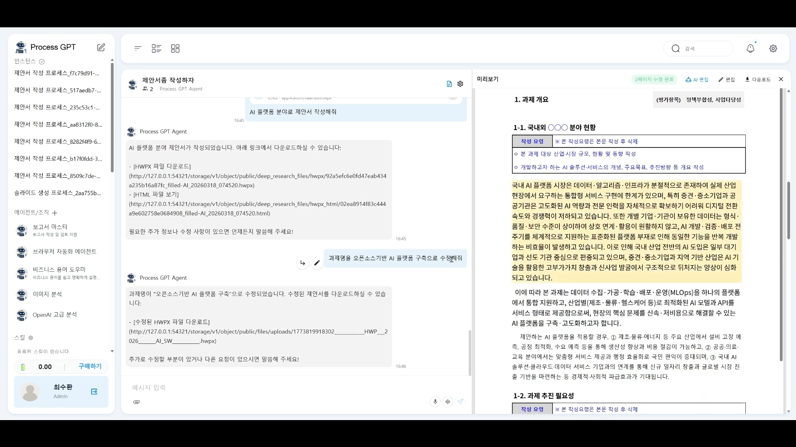   

## 5. 프레젠테이션(Slide) 초안 생성 및 자연어 부분 편집
텍스트나 음성 메모만 입력해도 전체 스타일이 통일된 세련된 프레젠테이션 초안이 단숨에 완성됩니다. 생성된 슬라이드에서 수정이 필요한 부분은 복잡한 디자인 툴 없이 마우스 드래그와 일상 언어(자연어) 지시만으로 간편하게 편집할 수 있습니다.

### Step 1. 슬라이드 초안 자동 생성
에이전트가 리서치한 내용이나 사용자가 입력한 텍스트를 바탕으로 시각적으로 훌륭한 슬라이드 초안을 자동 생성합니다.

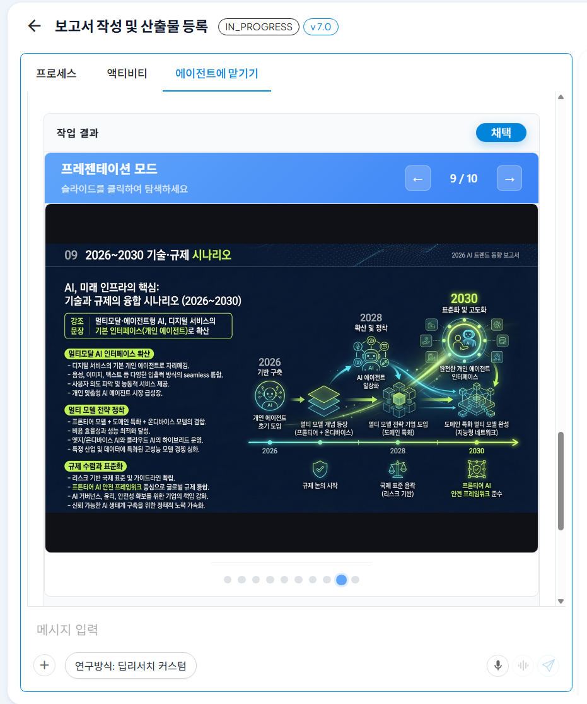
 
 
 

- 자동으로 생성한 프레젠테이션 슬라이드 초안

### Step 2. 영역 지정 및 자연어 수정 지시
슬라이드에서 수정하고 싶은 특정 영역을 마우스로 드래그하여 지정합니다. 이후 "이 부분에 글자 지우고 내가 올린 로고 넣어줘"처럼 원하는 내용을 자연어로 입력하고 참조 이미지를 첨부합니다.

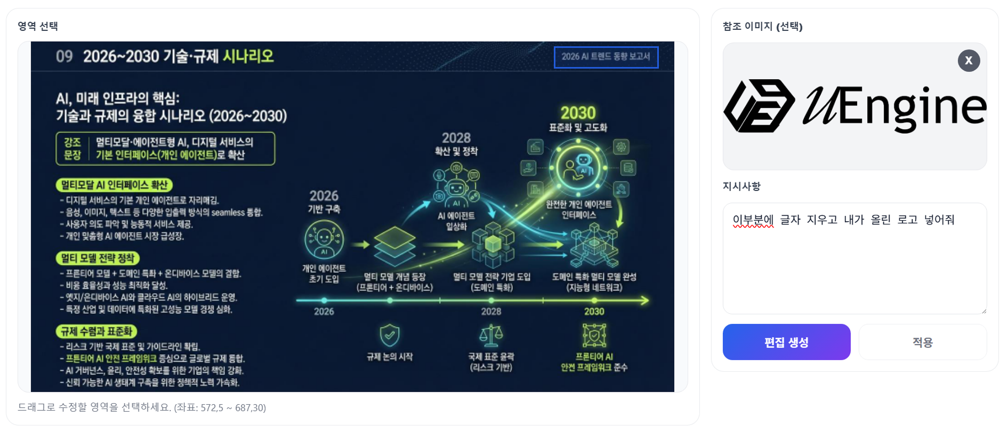
- 마우스 드래그로 영역을 선택하고, 우측 패널에서 자연어로 수정 지시를 내리는 화면
 
 
 

### Step 3. 맥락을 파악한 감쪽같은 수정 결과
ProcessGPT가 주변 슬라이드 맥락과 디자인을 파악하여, 지정된 위치의 텍스트를 지우고 요청한 로고 이미지를 자연스럽게 합성해 냅니다.

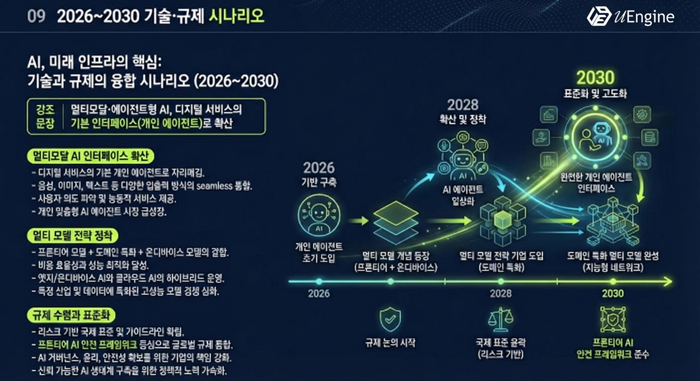
- 사용자의 자연어 지시에 따라 우측 상단 로고 교체
 
 
 

## 6. 깊이 있는 자료 조사가 담긴 마크다운(Markdown) 보고서

단순히 파일 형태가 아닌, 웹 에디터 내에서 즉시 활용하고 공유할 수 있는 마크다운 형태의 심층 보고서도 지원합니다.

트렌드나 통계 데이터는 직관적인 그래프로 즉시 시각화 되며, 개요부터 전략 제언까지 논리적인 구조를 갖춘 방대한 분량의 리서치 결과가 깔끔하게 정리됩니다.

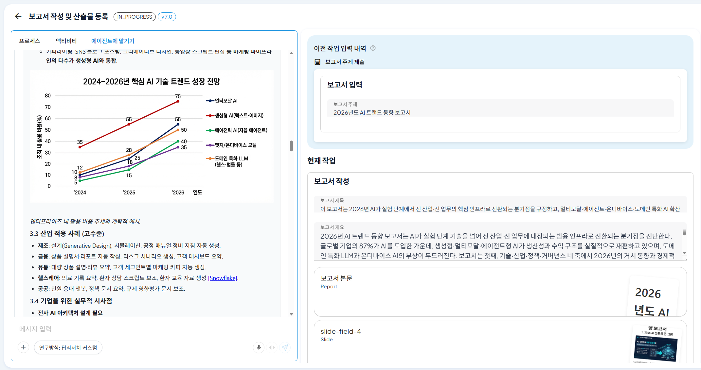
- 데이터 시각화 차트가 포함된 마크다운 기반의 트렌드 동향 보고서 생성
 
 
 

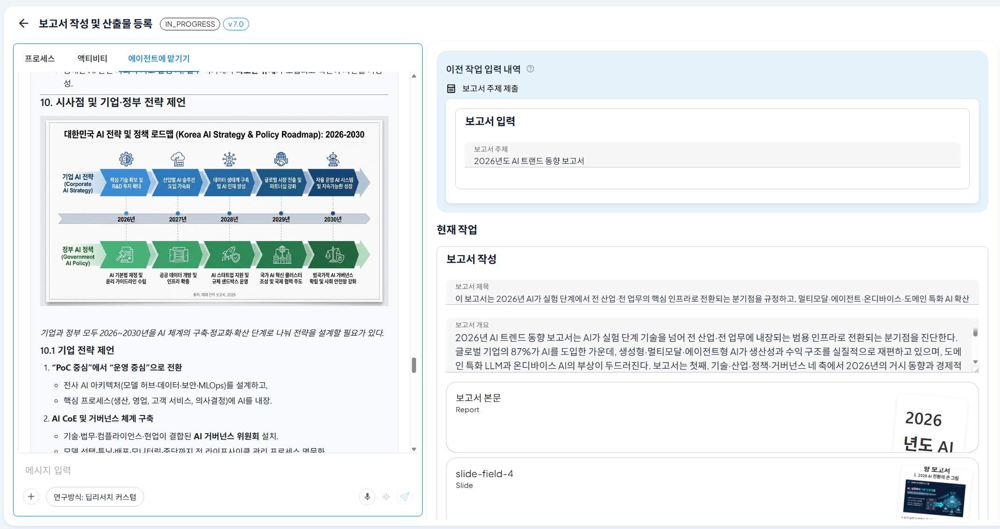
- 로드맵 이미지와 구조화된 텍스트가 조화롭게 배치된 심층 분석 리포트 결과
 
 
 